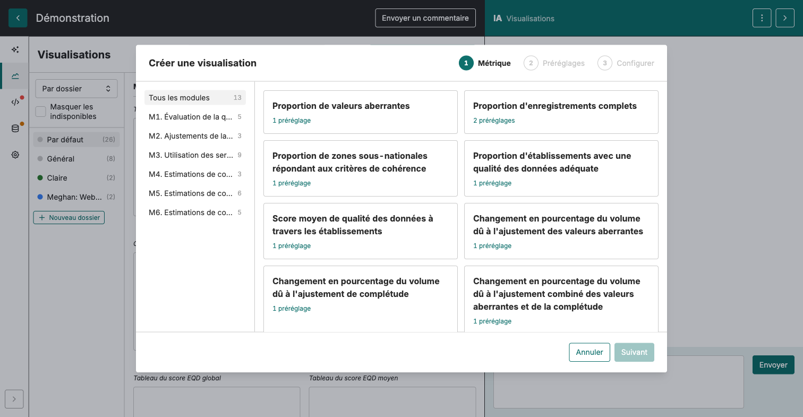
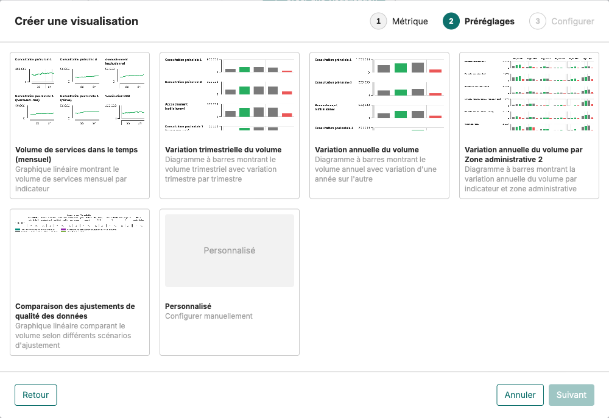
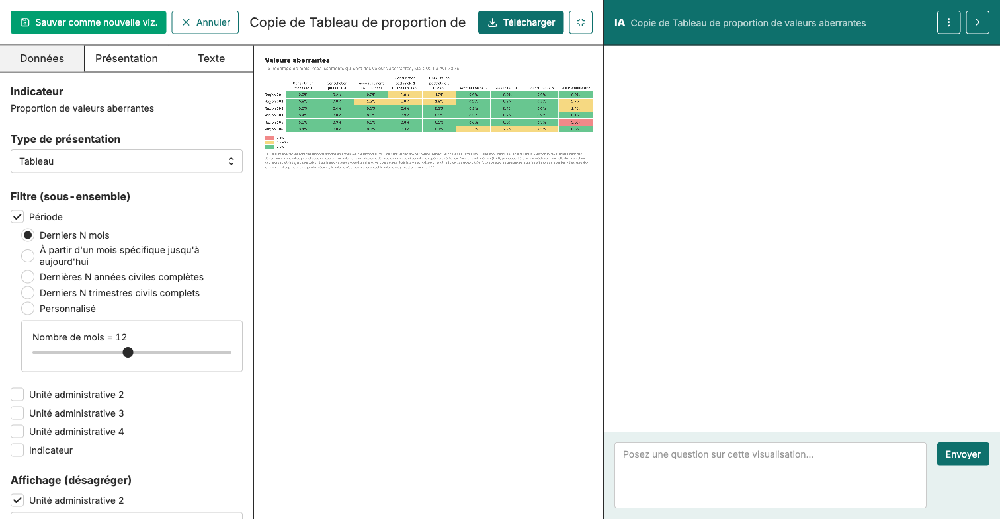

Lire une viz → Construire manuellement → Construire avec l'IA → Écrire l'interprétation → Interprétation IA → Repérer une perturbation

# Créez votre première visualisation

<strong>Activité</strong> · <strong>Visualisations et interprétation</strong> · <strong>~15 min</strong>

<aside class="p1-sidebar">

Avant de commencer

- ☐ Vous êtes connecté·e et sur le projet de votre pays
- ☐ Vous êtes dans l'onglet **Visualisations**
- ☐ Vous avez votre propre dossier (ou vous pouvez utiliser le dossier partagé)

</aside>

## Ce que vous allez faire

Construire trois graphiques temporels : d'abord **CPN1**, puis **BCG**, puis **un indicateur de votre choix**. Chaque graphique est enregistré dans votre dossier dans la liste Visualisations du projet. L'activité suivante fait la même chose avec l'Assistant IA.

<h2 class="step-h">1Ouvrez la boîte de dialogue Créer une visualisation</h2>

Dans l'onglet **Visualisations**, cliquez sur le bouton **+ Créer une visualisation** en haut à droite.

Une boîte de dialogue s'ouvre et vous guide en deux étapes — **Métrique** puis **Préréglages**. Choisir un préréglage nommé ouvre directement le graphique dans l'éditeur ; choisir **Personnalisé** ajoute une troisième étape **Configurer**.

---

<h2 class="step-h">2Choisissez une métrique</h2>

Dans le panneau de gauche de la boîte de dialogue, cliquez sur **M3. Utilisation des services**. La grille de droite ne liste plus que les métriques de M3.

Cliquez sur la tuile **Nombre de services déclarés, par type d'ajustement**, puis sur **Suivant** en bas à droite.

> Une métrique, c'est *ce qui est mesuré*. Un préréglage, c'est *une façon prête à l'emploi de la dessiner*. Chaque module regroupe les métriques qu'il produit.

<h2 class="step-h">3Choisissez un préréglage</h2>

À l'étape **Préréglages**, cliquez sur **Volume de services dans le temps (mensuel)** — un graphique linéaire du volume mensuel — puis sur **Créer**.

Le graphique s'ouvre dans l'éditeur.

---

<h2 class="step-h">4Filtrez sur CPN1, 12 derniers mois</h2>

Le graphique s'ouvre avec tous les indicateurs sur toute la période disponible. Vous allez le réduire à **CPN1, 12 derniers mois**.

Dans le **panneau de gauche** de l'éditeur, faites défiler jusqu'à **Filtre (sous-ensemble)** et faites deux choses :

- Cochez **Indicateur** — une rangée de pastilles apparaît (ANC1, ANC4, BCG, …). Les pastilles sont vides au départ ; cliquez sur **ANC1** pour l'ajouter (dans certains jeux de données l'indicateur s'appelle **CPN1**). Seules les pastilles que vous ajoutez s'affichent.
- Cochez **Période** — la valeur par défaut est *Derniers N mois* avec N = 12, donc la fenêtre est déjà correcte. Utilisez le curseur pour la changer si besoin.

Le graphique se met à jour à chaque clic.

> La métrique expose aussi quatre pastilles **Valeurs des données** (`count_final_none`, `_outliers`, `_completeness`, `_both`). La valeur par défaut `count_final_both` veut dire *ajusté pour les valeurs aberrantes et pour la complétude* — la version la plus propre des données de votre pays. Laissez-la telle quelle sauf si vous voulez explicitement un autre ajustement.

---

<h2 class="step-h">5Enregistrez-le dans votre dossier</h2>

Cliquez sur **Sauver comme nouvelle viz.** en haut de l'éditeur. Donnez-lui un nom clair (p. ex. *CPN1 — mensuel, 12 derniers mois*) et enregistrez-le dans **votre dossier**.

Il apparaît maintenant dans la liste Visualisations sous votre dossier.

## Refaites-le deux fois de plus

Refaites les cinq mêmes étapes pour **BCG** (cochez BCG à l'étape 4 au lieu de CPN1) puis pour **un indicateur de votre choix** (Penta1, CPN4, admissions hospitalières…). Vous devriez avoir trois graphiques dans votre dossier.

---

## Filtrer vs désagréger — quelle différence ?

Ces deux mots reviennent souvent. Ils ne veulent pas dire la même chose :

- **Filtrer = choisir ce qu'on affiche.** Cochez les indicateurs, les lieux ou les mois que vous voulez — seuls ceux-là apparaissent. p. ex. *afficher seulement CPN1*, ou *seulement la région Nord*. Comme un projecteur : vous le pointez sur ce que vous voulez voir.
- **Désagréger = décomposer.** Diviser un total en ses parties pour les comparer — p. ex. *une ligne par indicateur*, ou *une barre par district*. Rien n'est caché ; le total est montré en morceaux.

> **Exemple.** Partez du *total des visites CPN1, au niveau national*. **Filtrez** sur « région Nord » → vous ne voyez plus que la CPN1 du Nord. **Désagrégez** « par district » → le même total divisé en une barre (ou ligne) par district.

---

## Où le faire quand vous éditez une viz

Ouvrez une visualisation enregistrée — les contrôles sont dans le **panneau de gauche**, et il faut souvent **faire défiler** pour les trouver (c'est là que les gens se perdent). Deux sections font le travail :

- **Filtre (sous-ensemble)** — **choisir ce que vous voulez voir** : cocher **Période**, **Indicateur** et le niveau administratif voulu. Seules les valeurs sélectionnées apparaissent.
- **Affichage (désagréger)** — choisir **comment les parties s'affichent**. Le menu déroulant offre cinq options :
  - **Lignes** — une courbe par partie, toutes sur le même graphique
  - **Grille** — un petit graphique séparé pour chaque partie, côte à côte
  - **Rangées** — une rangée de tableau par partie
  - **Colonnes** — une colonne de tableau par partie
  - **Graphiques multiples (réplicants)** — un graphique en taille réelle par partie, empilés

---

> **Attention quand vous utilisez les deux ensemble.** Voici le piège, avec un exemple. Vous décomposez un graphique **par district** parce que vous voulez comparer les districts. Puis vous le **filtrez** sur un seul district — les autres disparaissent. Il ne reste qu'un seul district, tout seul, et plus rien à comparer.
>
> **La règle simple :** utilisez **filtrer** pour choisir les données que vous voulez regarder, et **désagréger** pour les diviser en parties à comparer. Ne filtrez simplement pas jusqu'à une seule des choses que vous vouliez comparer.

---

## Exercice : décomposez votre graphique CPN1 par niveau administratif

En ce moment, votre graphique CPN1 montre une seule ligne : le total national sur les 12 derniers mois. Vous allez le transformer en une ligne par **zone administrative** pour les comparer côte à côte.

<h2 class="step-h">1Ouvrez le graphique</h2>

Dans la liste **Visualisations**, ouvrez votre graphique CPN1 enregistré (celui que vous avez nommé *CPN1 — mensuel, 12 derniers mois*).

<h2 class="step-h">2Désagrégez par niveau administratif</h2>

Dans le **panneau de gauche** de l'éditeur, faites défiler jusqu'à **Affichage (désagréger)**.

- Cochez le niveau administratif à comparer. Dans FASTR les niveaux ont un nom générique — **Unité administrative 2** correspond généralement à la *région*, **Unité administrative 3** au *district*, **Unité administrative 4** à l'*établissement*. Cochez *Unité administrative 2* pour avoir une ligne par région.
- Laissez le style d'affichage sur **Lignes** pour l'instant — une ligne par région, toutes sur le même graphique.

Le graphique se redessine. Au lieu d'une seule ligne nationale, vous devriez voir **une ligne par région**.

<h2 class="step-h">3Essayez les autres styles d'affichage</h2>

Mêmes données, formes différentes :

- **Grille** — un petit graphique séparé par région, côte à côte. Utile quand il y a beaucoup de régions et que les lignes se chevauchent.
- **Rangées** — un tableau avec une rangée par région. Utile quand vous voulez les valeurs exactes plutôt que la forme.
- **Colonnes** — un tableau avec une colonne par région.
- **Graphiques multiples (réplicants)** — un graphique en taille réelle par région, empilés. Utile quand chaque région mérite une lecture complète.

Choisissez celui qui se lit le mieux pour vos données.

<h2 class="step-h">4Enregistrez-le comme nouveau graphique</h2>

Cliquez sur **Sauver comme nouvelle viz.** — nommez-le p. ex. *CPN1 — mensuel, par région* et enregistrez-le dans **votre dossier**.

> **N'écrasez pas le graphique national.** Enregistrez *comme nouveau graphique*, pas seulement *sauvegarder*, pour garder les deux : la tendance nationale et la décomposition régionale.

---

### Attention

Vous réglez à la fois **Filtre** et **Affichage** à l'étape 4 du parcours original (filtrer sur CPN1, 12 derniers mois) et à l'étape 2 de cet exercice (désagréger par région). C'est correct. Le piège, c'est de **filtrer jusqu'à l'une des choses que vous disiez vouloir comparer** — p. ex. désagréger par région *puis* filtrer sur une seule région. Il ne resterait qu'une seule ligne, plus rien à comparer.

### Refaites-le pour BCG

Refaites les mêmes trois étapes sur votre graphique BCG enregistré. Vous devriez avoir au final **deux graphiques régionaux** dans votre dossier : un pour CPN1, un pour BCG.

---

## Essayez quelques options de plus

Une fois vos trois graphiques enregistrés, essayez une autre métrique ou un autre préréglage :

- Une métrique de couverture sous **M6** (une courbe de couverture, pas une tendance de volume).
- Le préréglage de variation trimestrielle (compare des périodes au lieu de tracer une tendance continue).

> **Astuce :** Les graphiques en ligne (volume des services dans le temps) sont les meilleurs pour les tendances dans le temps. Les graphiques à barres (variation trimestrielle / annuelle) sont meilleurs pour comparer des périodes ou des lieux. Le document de référence *Comment lire une visualisation FASTR* approfondit.

## Vérification

Vous devriez maintenant avoir :

- **Trois graphiques enregistrés** dans votre dossier : CPN1, BCG, et un de votre choix.
- Le chemin mémorisé : **+ Créer une visualisation → M3 → métrique → préréglage → filtre → Sauver comme nouvelle viz.**
- Une idée de quels préréglages conviennent aux tendances vs aux comparaisons.

## Étape suivante

L'activité suivante fait la même chose avec l'Assistant IA — en tapant la demande en langage naturel au lieu de cliquer dans la boîte de dialogue. Même résultat, autre chemin.

