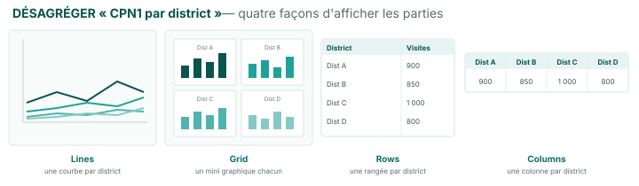

Lire une viz → Construire manuellement → Construire avec l'IA → Écrire l'interprétation → Interprétation IA → Repérer une perturbation

# Créez votre première visualisation

<strong>Activité</strong> · <strong>Visualisations et interprétation</strong> · <strong>~15 min</strong>

<aside class="p1-sidebar">

Avant de commencer

- ☐ Vous êtes connecté·e et sur le projet de votre pays
- ☐ Vous êtes dans l'onglet **Visualisations**
- ☐ Vous avez votre propre dossier (ou vous pouvez utiliser le dossier partagé)

</aside>

## Ce que vous allez faire

Créer votre premier graphique avec le constructeur intégré : choisir une **mesure**, choisir un **graphique prêt à l'emploi**, et il est enregistré dans le projet. Vous cliquerez vous-même dans le constructeur ; l'activité suivante fait la même chose avec l'Assistant IA.

<h2 class="step-h">1Ouvrez le constructeur de visualisation</h2>

Dans l'onglet Visualisations, cliquez sur **+ Créer une visualisation**. Un constructeur en trois étapes s'ouvre : **Mesure → Préréglages → Configurer**.

---

<h2 class="step-h">2Choisissez une mesure</h2>

Les mesures sont groupées par module à gauche (M1. Qualité des données, M3. Utilisation des services, M4. Couverture…). Une mesure, c'est **ce qui est mesuré** — p. ex. *Nombre de services rapportés*, *Volume de services réel vs attendu*, *Couverture*.

Pour une tendance de volume de services, ouvrez **M3. Utilisation des services** et choisissez une mesure comme **Nombre de services rapportés**. Cliquez sur **Suivant**.

<h2 class="step-h">3Choisissez un graphique prêt à l'emploi</h2>

Vous verrez une grille de **préréglages** — des graphiques prêts à l'emploi. Choisissez **Volume de services dans le temps (mensuel)** — un graphique en ligne du volume mensuel par indicateur. Cliquez sur **Créer**.

Votre graphique est créé et apparaît dans la liste **Visualisations**. Utilisez la vue **Par dossier** pour le ranger dans votre dossier.

> Les autres préréglages donnent des graphiques à **barres** trimestriels ou annuels. **Personnalisé → Configurer manuellement** permet de choisir le type de graphique (tableau, série temporelle, barres, carte) et la manière de décomposer les données — voir la section suivante.

---

## Filtrer vs désagréger — quelle différence ?

Ces deux mots reviennent souvent. Ils ne veulent pas dire la même chose :

- **Filtrer = montrer moins.** Restreindre le graphique à une tranche et cacher le reste — p. ex. *seulement CPN1*, *seulement la région Nord*, *seulement les 12 derniers mois*. Comme un projecteur : vous gardez une chose, le reste disparaît.
- **Désagréger = décomposer.** Diviser un total en ses parties pour les comparer — p. ex. *une ligne par indicateur*, ou *une barre par district*. Rien n'est caché ; le total est montré en morceaux.

> **Exemple.** Partez du *total des visites CPN1, au niveau national*. **Filtrez** sur « région Nord » → vous ne voyez plus que la CPN1 du Nord, le reste retiré. **Désagrégez** « par district » → le même total divisé en une barre (ou ligne) par district.

---

## Où le faire quand vous éditez une viz

Ouvrez une visualisation enregistrée — les contrôles sont dans le **panneau de gauche**, et il faut souvent **faire défiler** pour les trouver (c'est là que les gens se perdent). Deux sections font le travail :

- **Filter (subset)** — restreindre les données : choisir la période, ou décocher des indicateurs pour ne garder que celui(ceux) voulu(s). C'est ainsi qu'on *retire des données*.
- **Display (disaggregate)** — choisir **comment les parties s'affichent**. Le menu déroulant offre quatre options :
  - **Lines** — une courbe par partie, toutes sur le même graphique
  - **Grid** — un petit graphique séparé pour chaque partie, côte à côte
  - **Rows** — une rangée de tableau par partie
  - **Columns** — une colonne de tableau par partie

> **Attention si vous utilisez les deux.** Filtrer et désagréger fonctionnent ensemble — mais ne filtrez pas la chose même que vous décomposez. Si vous décomposez **par district** mais filtrez sur **un seul district**, vous n'en verrez qu'un, sans rien à comparer. Règle simple : **filtrez ce dont vous n'avez pas besoin ; désagrégez ce que vous voulez comparer.**

---

## Essayez quelques options

Refaites avec une autre mesure ou un autre préréglage — une mesure de couverture sous **M4**, ou le graphique à barres de variation trimestrielle — pour voir comment chacun se lit.

> **Astuce :** Les graphiques en ligne (*Volume de services dans le temps*) sont les meilleurs pour les tendances dans le temps. Les graphiques à barres (*variation trimestrielle / annuelle*) sont meilleurs pour comparer des périodes ou des lieux. Le document de référence *Comment lire une visualisation FASTR* approfondit.

## Vérification

Vous devriez maintenant avoir :

- Au moins un graphique créé et visible dans votre liste **Visualisations**
- Le chemin en mémoire : **+ Créer une visualisation → Mesure → Préréglages → Créer**
- Une idée de quels préréglages conviennent aux tendances vs aux comparaisons

## Étape suivante

L'activité suivante fait la même chose avec l'Assistant IA — en tapant une demande en langage naturel au lieu de cliquer dans le constructeur. Même résultat, autre chemin.

> 🔎 **Vérifiez dans votre interface actuelle** : les libellés (*+ Créer une visualisation*, *Créer*) peuvent différer légèrement. Le chemin **Mesure → Préréglages → Créer** est la structure clé.
