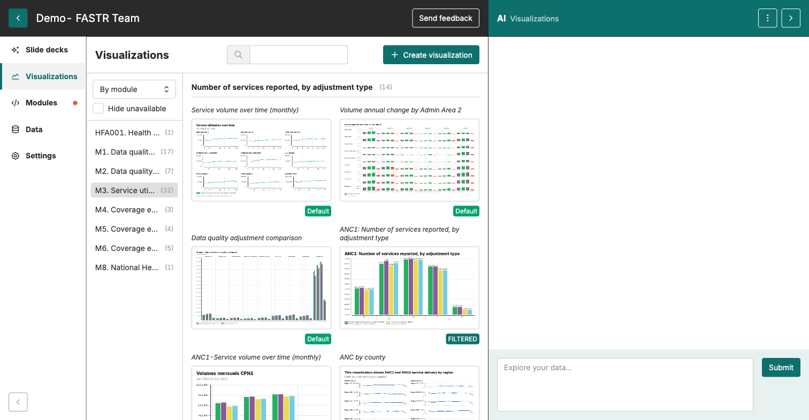
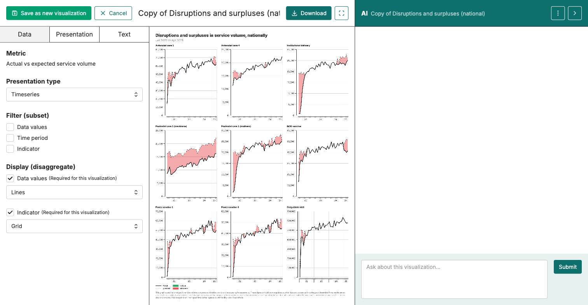
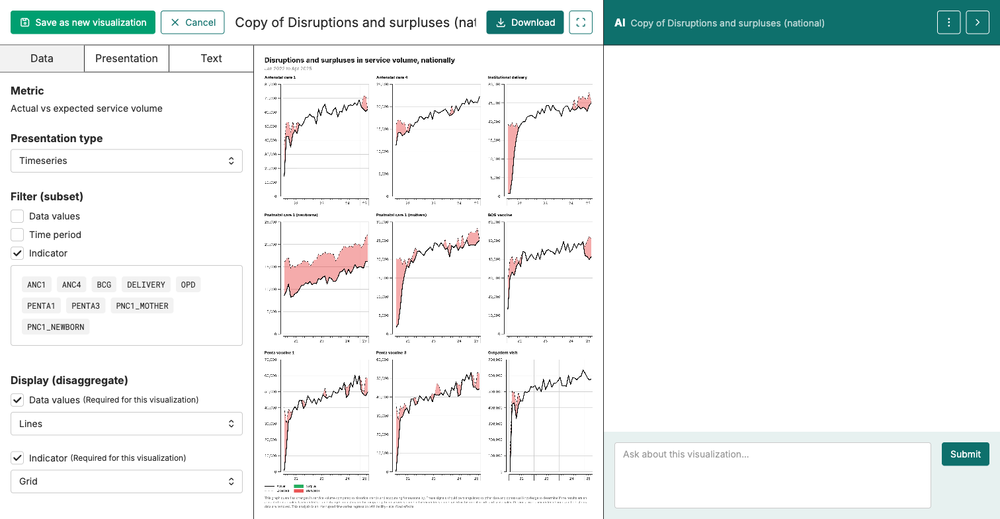
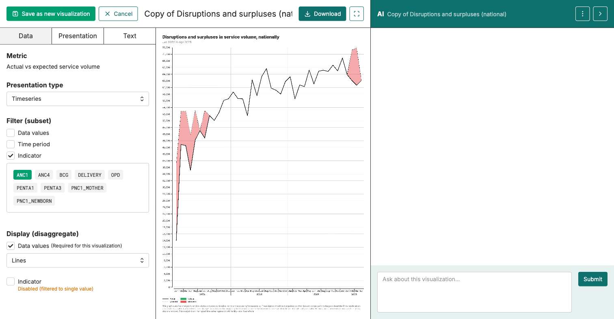

Lire une viz → Construire à la main → Construire avec l'IA → Rédiger l'interprétation → Interprétation IA → Repérer une perturbation

# Application — repérer une perturbation

<strong>Activité</strong> · <strong>Visualisations & Interprétation</strong> · <strong>~25 min</strong>

<aside class="p1-sidebar">

Avant de commencer

- ☐ Vous avez terminé les 5 documents précédents
- ☐ Vous êtes connecté à la plateforme, dans le projet de votre pays
- ☐ Vous êtes sur l'onglet **Visualisations**

Pourquoi c'est important

Les cinq premiers documents enseignaient la technique. C'est ici que vous l'utilisez : ouvrir un vrai graphique de perturbations pour votre pays, appliquer le cadre en six étapes, et produire un constat qu'un décideur pourrait réellement utiliser.

</aside>

## Ce que vous allez faire

Ouvrir le graphique Perturbations et surplus (national), le réduire à un indicateur et une période d'intérêt, parcourir le cadre en six étapes, puis rédiger un constat en trois parties à partager avec la salle.

---

<h2 class="step-h">1Trouver le graphique de perturbation</h2>

Sur l'onglet **Visualisations**, basculez l'affichage (en haut à gauche de la liste) sur **Par module**. Cela regroupe les visualisations selon le module qui les produit.

Ouvrez **M3. Utilisation des services**. Faites défiler jusqu'au groupe **Volume de services observé vs attendu — National**. La première carte du groupe est **Perturbations et surplus (national)**. Cliquez pour l'ouvrir.

<h2 class="step-h">2Lire la vue par défaut</h2>

Le graphique par défaut montre chaque indicateur principal sous forme de petit graphique dans une grille. Deux courbes noires traversent chaque graphique : une courbe **pleine** pour le **volume mensuel observé**, et une courbe **pointillée** pour le volume **attendu** prédit à partir des tendances passées. L'aire entre les deux est remplie — **rouge** là où l'observé est **en dessous** de l'attendu (une perturbation), **vert** là où l'observé est **au-dessus** de l'attendu (un surplus).

---

<h2 class="step-h">3Filtrer à un indicateur</h2>

Sur l'onglet **Data** à gauche, trouvez la section **Filter (subset)** et cochez la case **Indicator**. Une liste de pastilles d'indicateurs apparaît (ANC1, ANC4, BCG, DELIVERY, OPD, PENTA1, PENTA3, PNC1_MOTHER, PNC1_NEWBORN). Cliquez sur une pastille pour filtrer le graphique sur cet indicateur. Cliquez sur plusieurs pour en ajouter.

Quand un seul indicateur est sélectionné, la grille se réduit à un graphique plein écran. Vous pouvez aussi cocher **Time period** pour réduire la fenêtre temporelle.

---

<h2 class="step-h">4Appliquer les six étapes</h2>

Sur votre graphique filtré, parcourez le cadre en six étapes du document *Lire une viz* :

| Étape | Sur ce graphique |
|-------|------------------|
| 1. Quel indicateur ? | Celui que vous avez filtré |
| 2. Quel niveau et quelle période ? | National. La période que vous avez choisie. |
| 3. Que compare-t-on ? | Volume mensuel observé (courbe pleine noire) vs **attendu** (courbe pointillée noire, prédit à partir des tendances passées) |
| 4. Lire les valeurs | Où l'aire entre les deux courbes se remplit-elle en rouge (observé en dessous de l'attendu) ? De combien ? |
| 5. Qu'est-ce qui ressort ? | Une baisse soutenue, trois mois ou plus ? Un pic unique ? Un motif ? |
| 6. Et alors ? | Quelle action cela appelle-t-il ? |

---

<h2 class="step-h">5Ajouter le contexte que le graphique ne montre pas</h2>

Le graphique montre le *quoi*. Votre équipe pays apporte le *pourquoi*. Une fois un motif identifié, ajoutez ce que vous savez :

- Y a-t-il eu un **changement de financement ou de personnel** sur cette période ?
- Y a-t-il des **manques connus en intrants ou en ressources humaines** (médicaments, équipements, personnel) ?
- Même si les **chiffres semblent bons**, la qualité des soins a-t-elle baissé ?

<h2 class="step-h">6Rédiger votre constat</h2>

Utilisez la structure en trois parties du document *Rédiger une interprétation* :

1. **Titre** — le message en une phrase
2. **Ce que vous voyez** — les faits visibles sur le graphique
3. **Ce que cela signifie** — le « et alors », rattaché à une prochaine étape concrète

<h2 class="step-h">7Partager avec la salle</h2>

Quand chaque équipe pays a terminé, une personne partage le constat. Écoutez :

- Le constat est-il **précis** ? Un indicateur, une période, une action.
- Le « et alors » est-il **rattaché à un vrai décideur** ?
- L'équipe a-t-elle **apporté le contexte local** que le graphique seul ne pouvait pas donner ?

## À surveiller

- **Une baisse d'un seul mois est en général du bruit.** Cherchez une baisse soutenue, trois mois ou plus.
- **Vert n'est pas « bon », rouge n'est pas « mauvais ».** Ils indiquent juste le sens : vert = observé au-dessus de l'attendu, rouge = observé en dessous. Une petite zone rouge sur un seul mois, c'est du bruit normal ; une zone rouge soutenue sur plusieurs mois, c'est ce qu'il faut creuser.

## Et ensuite

Ceci clôt la série *Visualisations & Interprétation*. Le module suivant traite de la construction de rapports — assembler vos graphiques, interprétations et constats dans un document partageable.
