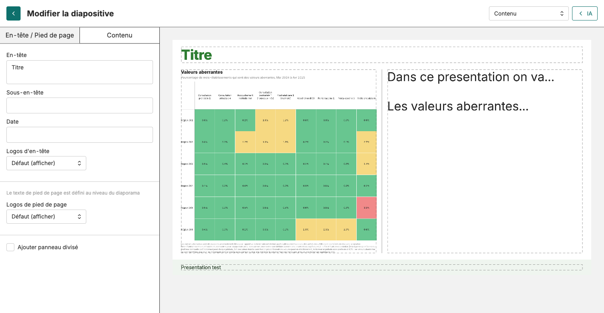
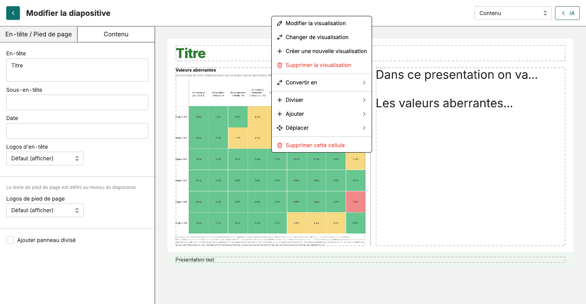
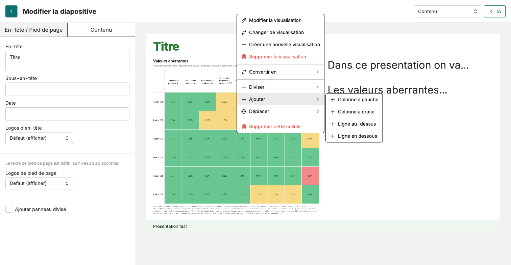

Créer présentation → Ajouter manuel → Ajouter IA → Éditer & finaliser

# Éditer et finaliser vos diapositives

<strong>Activité</strong> · <strong>Présentations</strong> · <strong>~20 min</strong>

<aside class="p1-sidebar">

Avant de commencer

- ☐ Votre présentation a au moins une diapo de contenu avec une visualisation et du texte
- ☐ La présentation est enregistrée
- ☐ Le facilitateur a fait la démo de l'éditeur à l'écran

Pourquoi c'est important

L'IA génère le contenu. La mise en page demande presque toujours un ajustement : du texte tassé, un graphique qui a besoin de plus de place, une diapo encombrée. L'éditeur de diapositives sert à corriger ça, une diapo à la fois.

</aside>

## Ouvrir l'éditeur de diapositives

Dans la vue d'ensemble, cliquez sur n'importe quelle vignette de diapo. L'éditeur s'ouvre avec l'**aperçu de la diapo** occupant la majeure partie de la page et un **panneau d'édition** à gauche.

Le panneau de gauche a deux onglets :

- **En-tête / Pied de page** — le titre de la diapo, le sous-titre, la date, et les logos / texte de pied de page affichés.
- **Contenu** — les contrôles d'édition des cellules dans le corps de la diapo. Affiche « Cliquez sur un bloc du canevas pour le modifier » jusqu'à ce que vous sélectionniez une cellule.

Le menu déroulant en haut à droite change le TYPE de diapo entre **Couverture**, **Section** et **Contenu**.

---

## Le clic droit est votre ami

Le canevas de la diapo est fait de cellules. Chaque cellule peut contenir une visualisation ou du texte. Pour modifier une cellule — son contenu, sa mise en page, sa position — **cliquez droit dessus**. Un menu contextuel s'ouvre.

Le menu a neuf entrées. Les sept premières concernent le **contenu** et la **forme** de la cellule :

| Action | Ce qu'elle fait |
|--------|----------------|
| **Modifier la visualisation** | Ouvre le graphique dans l'éditeur de viz. |
| **Changer de visualisation** | Remplace ce graphique par une autre viz enregistrée. |
| **Créer une nouvelle visualisation** | Construit un nouveau graphique et le place ici. |
| **Supprimer la visualisation** | Vide la cellule, garde la cellule. |
| **Convertir en** | Convertit la cellule en autre type (texte ↔ visualisation, etc.). |
| **Diviser ▸** | Divise CETTE cellule en sous-cellules. |
| **Ajouter ▸** | Ajoute une nouvelle cellule voisine (sous-menu détaillé page suivante). |

---

Les deux dernières concernent la **position** et la **suppression** de la cellule :

| Action | Ce qu'elle fait |
|--------|----------------|
| **Déplacer ▸** | Déplace cette cellule : **Gauche**, **Droite**, **Haut**, **Bas** (seules les directions qui ont du sens apparaissent). |
| **Supprimer cette cellule** | Retire complètement la cellule. |

---

## Les deux sous-menus les plus utiles

<h2 class="step-h">1Ajouter ▸ — diviser la diapo en colonnes ou lignes</h2>

Utilisez **Ajouter** pour créer une NOUVELLE cellule à côté d'une existante. Clic droit → **Ajouter** → choisissez :

- **+ Colonne à gauche** — nouvelle colonne à gauche de cette cellule
- **+ Colonne à droite** — nouvelle colonne à droite
- **+ Ligne au-dessus** — nouvelle ligne au-dessus
- **+ Ligne en dessous** — nouvelle ligne en dessous

C'est ainsi qu'on transforme une diapo à une seule colonne en mise en page à 2 colonnes ou graphique+texte.

---

<h2 class="step-h">2Déplacer ▸ — repositionner une cellule sans glisser-déposer</h2>

Clic droit → **Déplacer** → choisissez **Gauche**, **Droite**, **Haut**, ou **Bas**. Seules les directions qui ont du sens dans la mise en page actuelle apparaissent.

Pour un graphique qui se trouve dans la mauvaise colonne, c'est plus rapide qu'un glisser-déposer.

---

## Les quatre passes par diapositive

Parcourez chaque diapo de votre présentation et faites ces quatre passes avant de passer à la suivante.

<h2 class="step-h">1Vérifier l'exactitude</h2>

Lisez la diapo comme si vous ne l'aviez jamais vue. Le titre correspond-il à ce que montre le graphique ? Le texte d'interprétation est-il correct ? Notez tout ce qui demande une réécriture par l'IA.

<h2 class="step-h">2Redimensionner et reflouer</h2>

Quand vous cliquez dans une cellule, un séparateur vertical apparaît entre les cellules d'une même ligne (et un séparateur horizontal entre les cellules d'une colonne). Glissez le séparateur pour donner plus de place au graphique ou au texte. L'autre cellule se redimensionne automatiquement.

<h2 class="step-h">3Restructurer si besoin</h2>

Si la diapo est trop encombrée, clic droit puis **Ajouter** pour introduire une nouvelle colonne ou ligne, ou **Déplacer** pour pousser une cellule à un autre endroit. Utilisez **Supprimer cette cellule** pour retirer ce qui ne gagne pas sa place.

<h2 class="step-h">4Finaliser en-tête, pied de page, enregistrer</h2>

Passez à l'onglet **En-tête / Pied de page**. Remplissez le titre de la diapo, le sous-titre, et la date si besoin. Enregistrez la présentation (un petit bouton Enregistrer au niveau de la barre d'outils — l'enregistrement automatique attrape la plupart des modifications, mais Enregistrer est le filet de sécurité pour les grandes restructurations).

---

## Point de contrôle

Chaque diapo doit :

- Avoir un titre clair qui correspond au graphique
- Afficher les graphiques à une taille lisible, bien alignés
- Avoir un texte d'interprétation entièrement visible et édité
- Avoir titre, sous-titre et date renseignés

## Ce qui peut mal se passer

- **Le menu clic droit n'apparaît pas** — assurez-vous d'avoir cliqué dans l'éditeur de diapositives d'abord (vous devez voir « Modifier la diapositive » en haut à gauche).
- **Séparateur de redimensionnement invisible** — il n'apparaît qu'après avoir cliqué sur une cellule. Le curseur change en poignée de redimensionnement quand vous survolez la ligne entre deux cellules.
- **Graphique encore tassé après redimensionnement** — le graphique lui-même est peut-être trop chargé. Ouvrez-le via **Modifier la visualisation** dans le menu clic droit (ou depuis l'onglet Visualisations), simplifiez, enregistrez, revenez.
- **Cellule bloquée au mauvais endroit** — utilisez **Déplacer ▸ Gauche / Droite / Haut / Bas** pour repositionner, ou **Supprimer cette cellule** et recréez-la au bon endroit.

## Et ensuite

Le document suivant couvre les paramètres globaux de la présentation (style, logos, pied de page, numéros de page) avant le partage.
