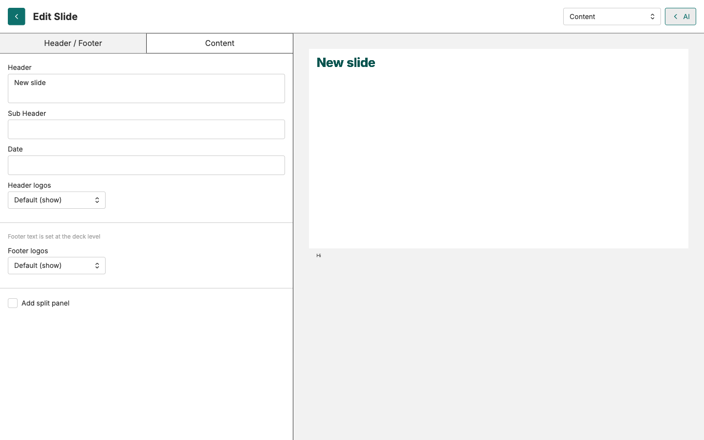

# Guide du facilitateur — Présentations

<strong>Guide du facilitateur</strong> · <strong>Présentations</strong>

## À propos de ces activités

Présentations apprend aux participants à assembler ce qu'ils ont construit — graphiques et interprétations — en une présentation. C'est un **parcours construire-puis-peaufiner** : créer le conteneur, voir la démo de l'éditeur, puis ajouter des graphiques de deux façons et finaliser.

**Quatre documents.** **~60 min** de temps participant, plus une démo facilitateur de ~5 min (visite de l'éditeur — script en annexe).

## Comment l'animer

- La séquence est **conteneur → démo → faire (manuellement) → faire (IA) → peaufiner.** Le document 1 crée la présentation et enseigne les types de diapositives ; vous animez ensuite la démo de l'éditeur (annexe) en direct avant que les participants ne touchent eux-mêmes l'éditeur.
- La **démo de visite de l'éditeur** est le moment-clé pour les activités 2 et 3 — sans elle, les participants ne sauront pas comment ajouter une viz ni diviser une diapositive en graphique + texte. Animez le script de l'annexe tel quel.
- Les activités 2 et 3 sont la même tâche de deux façons : les documents réexpliquent ce que vous avez démontré. Ce ne sont pas des scripts d'auto-apprentissage.

---

## Les activités

### 1. Créez votre première présentation

**Activité · ~10 min**

**Ce que c'est** — une courte activité pour créer le conteneur de présentation et une première diapositive de contenu. Enseigne aussi les **trois types de diapositives**.
**Ce que couvre le document** — ouvrir le dossier personnel, + Créer une présentation et la nommer, Ajouter une diapositive, choisir entre **Couverture** (page de titre), **Section** (séparateur) et **Contenu** (graphique + texte) — prendre Contenu.
**À surveiller** — les participants créent la présentation *en dehors* de leur dossier personnel, ou choisissent Couverture/Section au lieu de Contenu — ce qui les laisse sans rien à éditer pour les activités suivantes.

> **Animez la démo de l'éditeur ici** — avant l'activité 2. Utilisez le script de l'annexe.

### 2. Ajouter une visualisation (manuellement)

**Activité · ~15 min**

**Ce que c'est** — une activité pratique pour ajouter un graphique enregistré à une diapositive via les menus de l'éditeur, en reproduisant ce que vous venez de démontrer.
**Ce que couvre le document** — ouvrir la présentation, cliquer dans la diapositive de contenu, Bloc → Visualisation → Sélectionner, choisir un graphique que le participant a créé, enregistrer.
**À surveiller** — les participants tentent de reconstruire des graphiques dans l'éditeur de diapositives. Renforcez **« réutilisez, ne recréez pas »** ; un graphique manquant n'est tout simplement pas enregistré dans un dossier Visualisations visible.

---

### 3. Ajouter une visualisation (avec l'Assistant IA)

**Activité · ~15 min**

**Ce que c'est** — une activité pratique pour ajouter un graphique enregistré à une présentation via un prompt IA.
**Ce que couvre le document** — demander à l'IA de faire apparaître une visualisation enregistrée, utiliser le bouton « Ajouter à la présentation » de l'aperçu du chat, pour aboutir à une présentation de deux diapositives.
**À surveiller** — l'IA ne trouve que les graphiques déjà enregistrés dans Visualisations. Si elle renvoie le mauvais graphique ou aucun bouton « Ajouter à la présentation », les participants doivent enregistrer d'abord et nommer le graphique plus précisément.

### 4. Éditer et finaliser vos diapositives

**Activité · ~20 min**

**Ce que c'est** — une activité de peaufinage qui passe en revue et finalise chaque diapositive de la présentation.
**Ce que couvre le document** — quatre passes par diapositive (revue d'exactitude, redimensionner les zones de texte, redimensionner/repositionner les graphiques, ajuster mise en page/espacement) ; les diapositives peuvent être renvoyées à l'IA pour réécriture.
**À surveiller** — le séparateur de redimensionnement n'apparaît qu'après avoir cliqué dans une diapositive. Un graphique encore à l'étroit après redimensionnement doit être simplifié dans l'onglet **Visualisations**, pas dans l'éditeur de diapositives.

## Pour conclure

À la fin, chaque participant a une présentation de deux diapositives enregistrée et soignée. Le critère à tenir : chaque diapositive pourrait être montrée à un Directeur sans s'excuser.

---

## Annexe — Script de démo de la visite de l'éditeur

Une visite en direct de 5 minutes de l'éditeur. Les participants viennent de créer une diapositive de contenu vide ; cette démo leur montre comment y placer un graphique et du texte, avant qu'ils ne le refassent eux-mêmes à l'activité 2. Ne l'allongez pas — gardez le rythme.

### Liste de préparation

- ☐ Une présentation ouverte avec une **diapositive de contenu vide** prête
- ☐ Au moins une visualisation enregistrée dans le compte de démo
- ☐ Zoom du navigateur à ~100 % pour que les participants voient bien l'interface
- ☐ Partage d'écran fonctionnel si en distanciel

### Étape 1 — Ouvrir l'éditeur

- **Faites :** Cliquez sur la diapositive de contenu vide dans la liste.
- **Dites :** *« Cliquer sur la diapositive ouvre l'éditeur. L'aperçu est à droite ; les options d'édition à gauche. »*
- **Surveillez :** Les participants demandent « où est l'éditeur ? » — réponse : ce n'est pas une fenêtre séparée, c'est le panneau de droite qui vient d'apparaître.

---

### Étape 2 — Ajouter un bloc de visualisation

- **Faites :** **Bloc → Visualisation → Sélectionner une visualisation** → choisir un graphique enregistré → **Sélectionner**. Le graphique remplit la diapositive.
- **Dites :** *« C'est ainsi qu'on met un graphique enregistré sur une diapositive. Vous ne construisez pas un nouveau graphique ici — vous en choisissez un déjà sauvegardé dans l'onglet Visualisations. »*
- **Surveillez :** Renforcez **« réutilisez, ne recréez pas »** — le graphique doit déjà être enregistré dans Visualisations. Si le graphique d'un participant n'apparaît pas dans la sélection, il doit retourner l'enregistrer d'abord.

📷 <strong>Menu Bloc → Visualisation → Sélectionner</strong> 
<code>resources/screenshots/m9d/block_viz_select.png</code>

### Étape 3 — Diviser la diapositive en graphique + texte

- **Faites :** Clic droit dans l'aperçu de la diapositive → **Ajouter → Col à droite** → cliquer dans la nouvelle colonne de texte et taper un message d'une ligne.
- **Dites :** *« Deux colonnes est le format FASTR : le graphique d'un côté, l'idée à retenir de l'autre. S'il faut plus, divisez sur une autre diapositive. »*
- **Surveillez :** Les participants tentent d'entasser quatre colonnes. Ramenez-les à deux — le contenu en plus va sur la diapositive suivante.

📷 <strong>Menu clic droit montrant « Ajouter → Col à droite »</strong> 
<code>resources/screenshots/m9d/col_to_right_menu.png</code>

---

### Étape 4 — Redimensionner les zones graphique et texte

- **Faites :** Survolez le séparateur vertical entre les colonnes graphique et texte. Le curseur devient une poignée de redimensionnement. Glissez à gauche ou à droite.
- **Dites :** *« Tirez ceci pour donner plus d'espace au graphique ou au texte. Les deux se redimensionnent automatiquement. »*
- **Surveillez :** Les participants qui n'ont pas remarqué le changement de curseur — montrez-le explicitement.

### Étape 5 — Éditer les détails de la diapositive et enregistrer

- **Faites :** Passez à l'onglet **Diapositive** → éditez le titre et le sous-titre. Passez à **En-tête/Pied de page** → date et pied de page. Enregistrez.
- **Dites :** *« L'onglet Diapositive, c'est le titre de la diapositive. Contenu, c'est les colonnes de texte. En-tête/Pied de page, c'est le petit texte en bas. Enregistrez à la fin — il y a une sauvegarde automatique mais Enregistrer est votre filet de sécurité. »*
- **Surveillez :** Les participants demandent s'ils doivent éditer le texte directement ou retourner à l'IA — réponse : petites corrections ici, réécritures structurelles via l'IA.

### Questions fréquentes

> **Q : Puis-je annuler un redimensionnement ?**
> R : Oui — Ctrl/Cmd-Z, ou re-déplacez le séparateur. Les modifications ne sont pas destructives.

> **Q : L'éditeur enregistre-t-il automatiquement ?**
> R : Oui. Le bouton Enregistrer est un filet de sécurité manuel pour les modifications importantes.

> **Q : Puis-je changer l'ordre des diapositives dans l'éditeur ?**
> R : Non — l'ordre est dans la vue présentation. Faites glisser les diapositives dans la liste.

### Plan de secours

> Si la plateforme est indisponible : parcourez les captures de cette annexe et décrivez le schéma en trois temps (Bloc → Visualisation, puis Col à droite, puis redimensionner). L'activité 2 (Ajouter manuellement) reprend le même flux.
