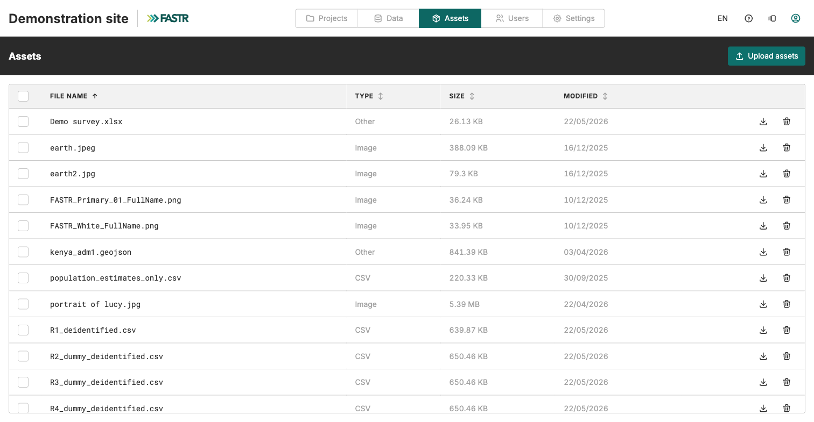
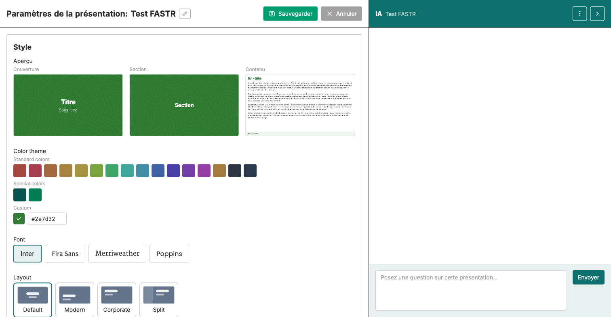

Créer présentation → Ajouter manuel → Ajouter IA → Éditer & finaliser → Formater texte → Paramètres

# Configurer les paramètres de votre présentation

<strong>Activité</strong> · <strong>Présentations</strong> · <strong>~10 min</strong>

<aside class="p1-sidebar">

Avant de commencer

- ☐ Votre présentation contient au moins une diapositive de contenu finalisée
- ☐ Les logos personnalisés à utiliser sont déjà téléversés dans **Assets** (voir Pré-étape ci-dessous)

Pourquoi c'est important

Les paramètres transforment un brouillon en quelque chose de partageable. Un nom clair, un style cohérent, les bons logos aux bons emplacements, un pied de page global et des numéros de page sur les diapositives de contenu. C'est aussi ici qu'on renomme la présentation.

</aside>

## Pré-étape — Les logos personnalisés sont dans Ressources

Les logos personnalisés ne sont pas stockés dans la présentation. Ils sont dans **Ressources** (Assets), une bibliothèque au **niveau de l'instance** que tous les projets de l'instance peuvent utiliser.

> **Le téléversement dans Ressources est réservé aux administrateurs.** Si vous n'êtes pas administrateur d'instance, demandez à votre facilitateur ou à votre admin de téléverser les fichiers de logo (PNG ou JPEG) avant que vous ouvriez les paramètres de la présentation. Une fois dans Ressources, ils apparaîtront sous **Custom logos** dans votre présentation.

Pour référence, les admins arrivent à Ressources depuis la page d'accueil principale (en haut à gauche, le logo FASTR ou le fil d'Ariane du projet) → navigation du haut → **Ressources** → **Téléverser des ressources**. Ressources sert aussi aux admins pour téléverser d'autres fichiers partagés (données CSV, GeoJSON).

---

## Ouvrir les paramètres

La présentation ouverte, cliquez le bouton **Paramètres** dans la barre d'outils en haut à droite. Un panneau intitulé **Paramètres de la présentation : <nom>** s'ouvre. **Sauvegarder** / **Annuler** en haut du panneau.

> Note : les sections principales (**Style**, **Color theme**, **Font**, **Layout**, **Background detail**, **Logos**) gardent leur libellé anglais dans la plateforme. Les sections **Couverture et section**, **Pages de contenu**, **Logos personnalisés** et **Pied de page et numéros** sont traduites, comme indiqué ci-dessous.

## Ce qu'on y trouve

<h2 class="step-h">1Renommer la présentation</h2>

Une icône crayon à côté du nom en haut du panneau permet de renommer. Suivez la convention de votre équipe (pays, période, sujet, votre nom).

<h2 class="step-h">2Style</h2>

Trois aperçus en haut montrent comment seront les diapositives **Cover**, **Section** et **Content**. Cliquez n'importe quelle option en dessous pour les mettre à jour en direct.

---

Les sections de la zone Style :

- **Color theme** — palette standard, options spéciales aux couleurs FASTR, sélecteur custom.
- **Font** — Inter, Fira Sans, Merriweather, Poppins.
- **Layout** — Default, Modern, Corporate, Split.
- **Couverture et section** — six variantes (Bold, Muted, Light, Lighter, White, Pure).
- **Pages de contenu** — plus de dix variantes (Default, Bold, Header Only, Classic, Soft, Bordered, Minimal).
- **Background detail** — None ou un motif léger (Dots, Circles, Lines, Grid, Chevrons, Waves, Noise, Maze, World).

Choisissez une combinaison et gardez-la sur toute la présentation.

---

<h2 class="step-h">3Logos</h2>

Trois emplacements de logo, indépendants :

- **Couverture** — logo sur la diapo de titre
- **En-tête de contenu** — logo en haut de chaque diapo de contenu
- **Pied de page de contenu** — logo en bas de chaque diapo de contenu

Chaque emplacement a deux options par défaut : **FASTR (couleur)** et **FASTR (blanc)**. Cliquez pour appliquer.

Pour les logos personnalisés, cliquez **Ajouter** sous **Logos personnalisés** et choisissez parmi les images téléversées dans Ressources (voir Pré-étape).

<h2 class="step-h">4Pied de page et numéros</h2>

Deux options :

- **Définir un texte de pied de page global pour toutes les diapositives de contenu** — tapez une courte ligne (nom du projet, période, auteur) dans **Texte du pied de page**. Elle apparaît sur toutes les diapos de contenu. Les diapos de couverture et de section l'ignorent.
- **Afficher les numéros de page (sauf sur les diapositives de couverture et de section)** — activez pour les présentations imprimées ou exportées en PDF.

<h2 class="step-h">5Enregistrer</h2>

Cliquez **Sauvegarder** en haut à droite du panneau. Les paramètres ne s'enregistrent pas automatiquement comme le contenu des diapos — fermer sans Sauvegarder perd vos changements. **Annuler** annule.

---

## Point de contrôle

À la fermeture du panneau, votre présentation doit :

- Avoir un nom clair que votre équipe peut retrouver
- Utiliser un thème de couleurs + une police + une mise en page cohérents sur toutes les diapos
- Afficher les logos voulus dans chaque emplacement
- Porter le pied de page global et les numéros de page si vous les avez activés

## Ce qui peut mal se passer

- **L'emplacement Logos personnalisés est vide** — le fichier n'est pas encore dans Ressources. Demandez à un admin de le téléverser, puis recommencez.
- **Le logo est trop grand ou trop petit** — ouvrez le fichier dans Assets, remplacez par une version correctement dimensionnée (les logos sont mis à l'échelle, mais les très gros fichiers ralentissent le rendu).
- **Le pied de page apparaît sur la couverture** — il ne devrait pas. Si c'est le cas, vérifiez que vous êtes sur la dernière version de la plateforme.
- **Les numéros de page manquent** — vérifiez que la bascule est activée, et que vous regardez une diapo de contenu (les diapos de couverture et de section masquent intentionnellement le numéro).

> 🔎 **À vérifier dans votre interface actuelle** : la disposition du panneau Settings peut varier légèrement selon la version. Les cinq sections ci-dessus (renommer, Style, Logos, Footer & page numbers, Save) s'appliquent dans les versions récentes.

## Et ensuite

La présentation est prête à être partagée. Le module suivant couvre l'export et la diffusion.
