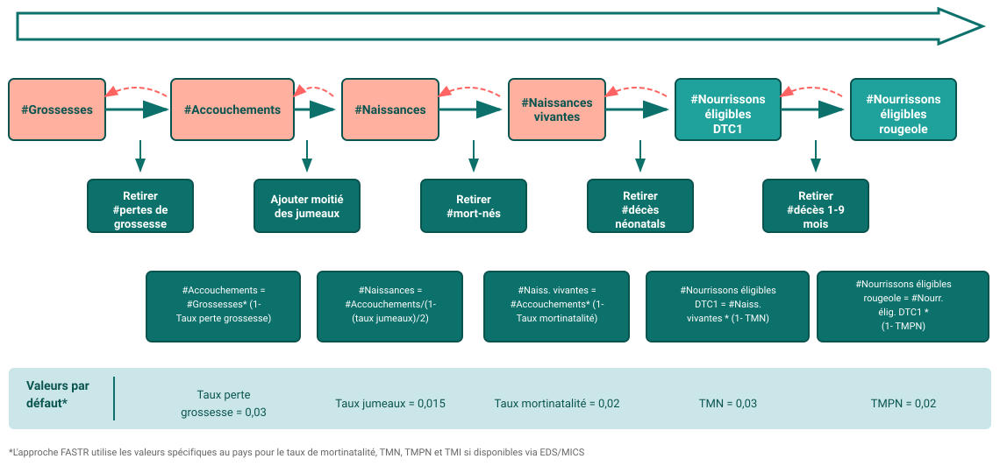

Récapitulatif méthodologique · Modules M5 + M6

# Estimations de couverture

<strong>Ce que font les modules</strong> · <strong>Comment lire le résultat</strong>

<aside class="p1-sidebar">

Ce qu'ils font

Transformer des comptages bruts en **couverture** — la part des personnes qui *avaient besoin* d'un service et l'ont effectivement reçu.

Deux parties

- **M5** détermine la **population cible** (le plus difficile)
- **M6** la transforme en couverture et comble les années entre enquêtes

À garder en tête

Ce sont des **estimations à partir de données de routine** — utiles pour les tendances et les comparaisons, pas des chiffres nationaux officiels.

</aside>

## Ce que signifie « couverture »

La couverture répond à une question simple : **parmi toutes les personnes qui avaient besoin d'un service, quelle part l'a effectivement reçu ?**

Prenons les premières visites prénatales (ANC1). Si **10 000** femmes étaient enceintes dans un district et que **8 000** ont eu une visite ANC1, la couverture est 8 000 ÷ 10 000 = **80 %**.

La couverture est donc toujours une fraction :

> **couverture = le nombre servi ÷ le nombre qui en avait besoin**

## Le hic

Le chiffre du **haut** est facile — les 8 000 visites ANC1 viennent directement du SIGS ; c'est juste le comptage de services.

Le chiffre du **bas** est le plus dur : **personne ne compte combien il y a de femmes enceintes (ou de nourrissons).** Aucune formation ne déclare « 10 000 femmes étaient enceintes ici cette année ».

Tout le travail de ces modules se ramène donc à une question — **où trouver ce chiffre du bas, la population cible ?** C'est ce que M5 cherche à estimer.

---

M5 · estimer la population

## Comment M5 trouve le chiffre du bas

**Étape 1 — l'emprunter à une enquête.** Tous les quelques ans, une enquête ménages mesure la couverture *directement*, en interrogeant les familles. Elle peut nous dire que, disons, **80 % des femmes enceintes ont eu l'ANC1**. Combinons avec le comptage que nous avons déjà : si les **8 000** visites ANC1 représentent 80 % de toutes les femmes enceintes, le total est 8 000 ÷ 0,80 = **10 000 femmes enceintes**. Nous avons retrouvé le chiffre du bas qu'on ne pouvait pas compter.

**Étape 2 — l'ajuster au bon groupe.** 10 000 femmes enceintes est le bon dénominateur pour les soins prénatals — mais le **Penta1 s'administre aux nourrissons**, un autre groupe. Pas besoin d'une seconde enquête : une grossesse *devient* une naissance *devient* un nourrisson, et on sait à peu près combien sont perdus à chaque étape. FASTR fait donc descendre le nombre — moins les fausses couches et mortinaissances, moins les décès néonatals — jusqu'à environ **9 100 nourrissons**. Une seule enquête donne alors le dénominateur de *chaque* indicateur.

**Étape 3 — recouper, et choisir le meilleur.** L'ANC1 n'est pas le seul point de départ ; les accouchements, le Penta1 et le BCG donnent chacun leur propre estimation de la population, et elles ne concordent pas toutes. Pour choisir, FASTR aligne chaque estimation sur la **projection de population de l'ONU** — un chiffre indépendant, bâti sans le SIGS — et garde celle qui s'en approche le plus.

La couverture ne vaut que son dénominateur. C'est pourquoi M5 ne se fie pas à un seul indicateur — il en triangule plusieurs et laisse la projection ONU indépendante départager.

---

M5 · la chaîne de la vie (étape 2)

## Des grossesses aux nourrissons

Les **flèches turquoise** vont vers l'*avant* — chacune applique un taux démographique standard (en retranchant les pertes de cette étape). Les **flèches rouges vont en arrière** : les mêmes taux permettent de **recalculer en sens inverse** la chaîne depuis n'importe quel point, donc FASTR peut partir de l'indicateur qui dispose d'une enquête (ANC1, accouchement, Penta1…) et atteindre quand même toutes les autres populations cibles.

---

M6 · le résultat

## La couverture dans le temps

Maintenant le plus simple : **couverture = comptage SIGS ÷ cette population**, pour chaque indicateur, année et zone. Les enquêtes n'ont lieu que tous les quelques ans, donc entre elles FASTR conserve la dernière valeur d'enquête et la décale d'autant que la couverture SIGS a bougé — l'enquête fixe le **niveau**, le SIGS la **direction**.

- **Les lignes** — **noir** = couverture SIGS (comptage ÷ population estimée), chaque année ; **points rouges** = résultats d'enquête réels ; **gris** = l'enquête projetée selon la tendance SIGS là où aucune enquête n'existe
- **Comment le lire** — là où la ligne noire et les points rouges sont proches, le dénominateur est solide et la tendance fiable ; lisez ensuite la direction — en hausse, stable ou en baisse
- **À surveiller** — une couverture **supérieure à 100 %** est un signal d'alerte (dénominateur trop bas ou comptage gonflé), pas une vraie sur-couverture

Le même graphique est produit aux niveaux national, régional et district — lisez-les ensemble : une tendance nationale saine peut masquer un district en difficulté.

