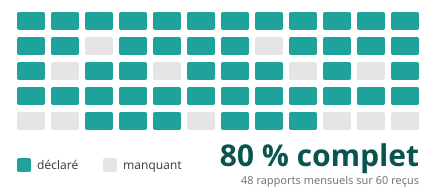
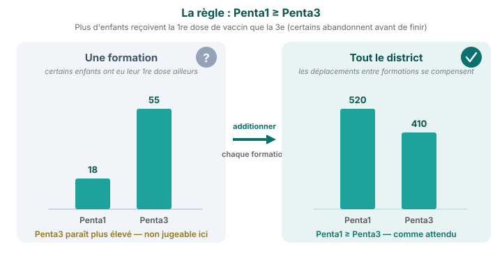

Récapitulatif méthodologique · Module M1

# Évaluation de la qualité des données

<strong>Ce que fait le module</strong> · <strong>Comment lire ses résultats</strong>

<aside class="p1-sidebar">

Ce qu'il fait

Avant que quiconque ne se fie à un chiffre, ce module vérifie les données. Il lit les rapports mensuels de chaque formation et signale là où les données semblent fragiles — pour que vous sachiez à quel point vous fier à chaque indicateur.

Ce qu'il ne fait pas

Il ne change rien. Il **mesure** seulement la qualité et montre où sont les problèmes. Les corriger est le rôle du module suivant.

Les trois vérifications

- **Valeurs aberrantes** — des valeurs trop élevées pour être réelles
- **Complétude** — les mois où une formation n'a pas déclaré
- **Cohérence** — des chiffres liés qui ne concordent pas

</aside>

## Comment lire les résultats

Chaque tableau de ce module utilise le même **code tricolore** :

- **Vert** — conforme à la norme de qualité
- **Orange** — limite ; à vérifier
- **Rouge** — insuffisant ; ces données demandent attention

**Ce qu'il y a derrière chaque case.** Chaque vérification fonctionne de la même façon. Prenez une formation, un mois, un indicateur — ce seul rapport réussit la vérification ou non. C'est **un test**. Chaque case colorée rassemble tous ces tests d'une zone et montre la **part qui réussit** (pour les valeurs aberrantes, la part qui *échoue*). Une case répond donc à : *parmi tous les rapports derrière elle, combien étaient corrects ?*

Lisez chaque tableau attentivement — les couleurs guident l'œil, mais le chiffre de chaque case compte : il indique **quel indicateur** et **quelle zone** vous pouvez utiliser, et lesquels non.

Chaque vérification examine les données sous un angle différent — les valeurs sont-elles réalistes (aberrantes), les rapports arrivent-ils (complétude), et les chiffres liés concordent-ils (cohérence). Ensemble, elles indiquent jusqu'où se fier à chaque indicateur.

L'EQD mesure la qualité — elle ne change pas les données. Lisez-la avant de vous fier à une tendance ; le module suivant corrige les problèmes qu'elle révèle.

---

Vérification 1 sur 3 · valeurs aberrantes

## Valeurs aberrantes — « un mois est-il anormalement élevé ? »

**Comment on les trouve.** Pour chaque formation, FASTR apprend à quoi ressemble un mois normal pour un indicateur, puis signale les mois qui rompent le schéma de deux façons :

- **Une valeur bien au-dessus de la normale.** Supposons qu'une formation déclare habituellement 40 à 60 premières visites prénatales par mois, puis un mois en affiche 900. C'est plus de **10×** la variation mensuelle habituelle de la formation : c'est signalé. (Cette variation est mesurée par l'*écart absolu médian* (EAM) — une moyenne robuste qu'un seul mois extrême ne peut pas fausser.)
- **Un seul mois domine l'année.** Si un seul mois représente plus de **80 %** de tout ce qu'une formation a déclaré pour un indicateur sur les 12 derniers mois, c'est signalé — le signe typique du total d'une année inscrit dans un seul mois.

Seuls les indicateurs dont la moyenne dépasse 100 par mois sont vérifiés, pour ne pas signaler les petites formations pour des variations normales.

---

Vérification 1 sur 3 · le résultat

## Valeurs aberrantes — lire le tableau

- **Ce qu'est chaque case** — choisissez une région (une ligne) et un indicateur (une colonne). Le chiffre indique à quelle fréquence les rapports mensuels de cet indicateur ont semblé **trop élevés pour être réels** dans cette région. 0,5 % signifie presque jamais ; 3 % environ 1 rapport sur 33
- **Comment le lire** — **vert = bien** (presque aucun mois suspect) ; **rouge = beaucoup**. Une **ligne rouge** entière : la région saisit des chiffres négligemment sur de nombreux indicateurs. Une **colonne rouge** entière : cet indicateur est difficile à déclarer correctement partout

Exemple — dans le tableau ci-dessus, repérez <strong>Region 005 → Outpatient visit : 3.3 %, en rouge</strong>. Cela signifie qu'environ 1 rapport mensuel de consultations externes sur 30 en Region 005 a été signalé comme trop élevé — sans doute une formation saisissant une somme cumulée plutôt qu'un seul mois. Le reste de la ligne de Region 005 est vert : c'est ce seul indicateur qui mérite un coup d'œil, pas toute la région. FASTR les corrige dans le module suivant.

---

Vérification 2 sur 3 · complétude

## Complétude — « les formations ont-elles effectivement déclaré ? »

**Comment on la mesure.** FASTR détermine d'abord la période où une formation était réellement active pour un indicateur — de son premier rapport à son dernier, en mettant de côté les longues périodes (6 mois et plus) au tout début ou à la fin, quand elle n'était manifestement pas encore ouverte ou avait cessé de déclarer. Dans cette période active, il compte combien de mois portent un chiffre. Une formation active 12 mois qui n'a déclaré que 9 est **complète à 75 %**. Une case vide compte comme manquante — FASTR ne peut pas distinguer « aucun service rendu » de « personne n'a rempli le rapport », il traite donc les deux comme une lacune.

---

Vérification 2 sur 3 · le résultat

## Complétude — lire le tableau

- **Ce qu'est chaque case** — choisissez un district (une ligne) et un indicateur (une colonne). Le chiffre indique combien des mois que ce district *aurait dû* déclarer sont effectivement arrivés. 92 % signifie 92 rapports attendus sur 100
- **Comment le lire** — **vert = bien** (presque tous les rapports sont arrivés) ; **rouge = beaucoup de manquants**. Une **colonne rouge** : un indicateur que presque personne ne déclare (peut-être nouveau, ou peu clair). Une **ligne rouge** : un district qui déclare faiblement en général

Exemple — dans le tableau ci-dessus, repérez <strong>District 005 → Antenatal care 1 : 69.7 %, en rouge</strong>. Seuls 7 rapports d'ANC1 sur 10 que ce district aurait dû envoyer sont effectivement arrivés. Une tendance ou une couverture bâtie sur cette case repose sur peu de données — à interpréter avec prudence.

---

Vérification 3 sur 3 · cohérence

## Cohérence — « les chiffres liés sont-ils plausibles ensemble ? »

**Comment on la vérifie.** Certains indicateurs doivent évoluer ensemble. On ne peut pas avoir plus de 4es visites prénatales que de 1res, ni plus de 3es doses de vaccin que de 1res ; et les accouchements et les doses de BCG (un vaccin administré à la naissance) doivent être à peu près égaux. FASTR vérifie cela au **niveau du district**, pas dans une seule formation — dans une formation les chiffres sont petits et les services se répartissent entre formations (un enfant peut recevoir une dose de vaccin en stratégie avancée et la suivante dans une formation), de sorte que les règles ne tiennent qu'une fois tout un district additionné. Le résultat de chaque district est ensuite reporté sur chaque formation qu'il contient. Quand une règle reste rompue sur tout le district — par ex. plus de 3es doses que de 1res — les deux chiffres ne peuvent pas être justes tous les deux : quelque chose a été mal enregistré.

---

Vérification 3 sur 3 · le résultat

## Cohérence — lire le tableau

- **Ce qu'est chaque case** — choisissez une région (une ligne) et une paire d'indicateurs liés (une colonne). Le chiffre est la part des **districts** de cette région où les deux chiffres respectent la règle attendue
- **Comment le lire** — **vert = bien** (la règle tient dans presque tous les districts) ; **rouge = rompue dans la plupart**. Les trois règles : plus de 1res visites prénatales que de 4es (**ANC1 ≥ ANC4**), plus de 1res que de 3es doses de vaccin (**Penta1 ≥ Penta3**), et accouchements ≈ doses de BCG

Exemple — <strong>Region 002 → « Delivery is approximately equal to BCG » : 0.0 %, en rouge</strong> : dans aucun district de Region 002 les accouchements et le BCG ne concordent. Souvent c'est parce que les deux sont enregistrés à des endroits différents, pas une vraie erreur — traitez cette paire comme un signal plus souple que les paires prénatale et vaccinale, qui doivent tenir strictement.

---

La synthèse

## Le score EQD — un chiffre par région et par an

**Comment il est construit.** Regardez une formation sur un mois donné. Elle est comptée comme **propre** seulement si toutes les vérifications passent : les indicateurs clés (consultations externes, Penta1, ANC1) n'ont aucun rapport manquant ni aberrant, et les paires liées (Penta1/Penta3, ANC1/ANC4) concordent. Le score EQD est simplement la part de ces mois-formations qui ressortent propres — donc **84 % signifie que 84 sur 100 étaient propres et fiables.**

- **Comment le lire** — **vert = bien** (la plupart des mois-formations sont propres). Lisez **de gauche à droite** pour voir si une région s'améliore d'année en année, et **de haut en bas** pour comparer les régions sur une année

Exemple — <strong>Region 001 grimpe de 60.8 % à 84.4 % entre 2022 et 2025</strong> (du rouge au vert) : ses données sont devenues de plus en plus fiables. <strong>Region 003 retombe à 47.0 %</strong> en 2025 (rouge) — c'est là que la qualité des données demande attention en priorité. Passez ensuite au module d'ajustement, qui corrige les problèmes trouvés ici.

