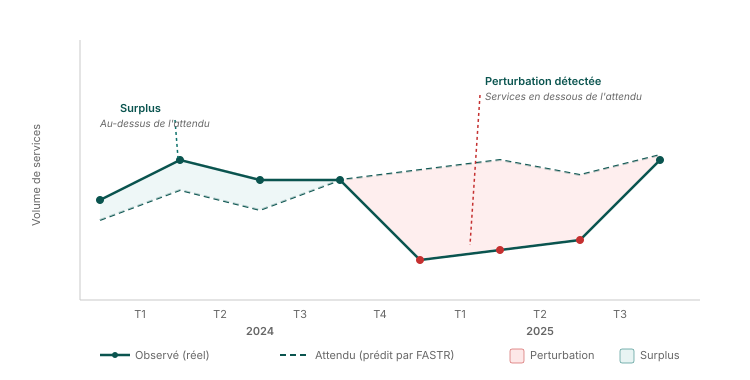

Récapitulatif méthodologique · Module M3

# Utilisation des services

<strong>Ce que fait le module</strong> · <strong>Comment lire ses résultats</strong>

<aside class="p1-sidebar">

Ce qu'il fait

Ce module regarde si les services de santé **augmentent, baissent ou se maintiennent** — et surtout, si un changement est une **vraie perturbation** ou seulement le bruit mensuel habituel.

La question à laquelle il répond

*« Quelque chose a-t-il réellement perturbé les services ici, ou est-ce juste les hauts et bas habituels ? »*

Bâti sur des données propres

Il s'appuie sur les données **ajustées** du module précédent, pour que les aberrances et les mois manquants ne créent pas de fausses alertes.

</aside>

## Comment ça marche

On ne peut pas juger une perturbation en comparant un mois au précédent — les services montent et descendent naturellement avec les saisons et dérivent au fil des ans. Donc, pour chaque formation (ou zone) et indicateur, FASTR construit d'abord un niveau **attendu** : une ligne qui tient déjà compte de la tendance de fond **et** du motif saisonnier.

Il compare ensuite la valeur **réelle** déclarée à cette ligne attendue. Un mois est signalé comme perturbation quand le réel s'écarte trop de l'attendu :

- une **chute ou un pic brusque** sur un seul mois
- un **creux ou un sursaut soutenu** sur plusieurs mois
- une **série de rapports manquants**

Enfin, une régression mesure **l'ampleur** de la perturbation — le % moyen en dessous ou au-dessus de l'attendu — et si elle est statistiquement réelle plutôt que due au hasard. C'est ce qui permet de dire *« l'ANC1 est resté environ 15 % sous l'attendu de mars à juillet. »*

L'essentiel est la comparaison : non pas « ce chiffre est-il élevé ? » mais « est-il plus haut ou plus bas que prévu pour ce lieu, ce service, cette période de l'année ? »

---

Comment ça marche · en image

## Repérer une perturbation

L'écart coloré est la distance entre ce qui s'est réellement passé et ce que FASTR attendait — vert au-dessus de la ligne, rouge en dessous.

---

Résultat 1 · la tendance

## Réel vs attendu — repérer les perturbations

- **Ce qu'il montre** — un panneau par indicateur. La **ligne noire** est le volume réellement déclaré chaque mois. Derrière, le niveau **attendu** calculé par FASTR pour cette zone — un tracé qui intègre déjà la tendance de fond *et* le motif saisonnier, donc « attendu » veut dire *normal pour ce lieu, ce service, cette période*. Là où réel et attendu s'écartent, l'écart est coloré : **vert** quand le réel dépasse l'attendu (surplus), **rouge** quand il est en dessous (perturbation)
- **Comment le lire** — en trois passes. **(1) Forme :** suivez la ligne noire pour la trajectoire générale — montante, plate, descendante. **(2) Ruptures :** repérez les zones colorées ; chacune est une période où le réel a quitté le tracé attendu, et **plus la zone est grande et longue**, plus c'est sérieux — un bloc rouge épais sur plusieurs mois est une perturbation soutenue, un fin liseré est mineur. **(3) Entre indicateurs :** si du rouge apparaît aux *mêmes* mois sur plusieurs panneaux, c'est tout le système qui a été touché (grève, rupture de stock, choc) ; du rouge sur un seul panneau pointe une cause propre à ce service

---

Résultat 1 · la tendance (suite)

- **À surveiller** — un seul mois étrange est généralement du bruit ; attendez une série soutenue avant d'agir. Le vert n'est pas automatiquement bon (campagne de rattrapage ou double comptage) et le rouge pas automatiquement mauvais — les deux méritent un « pourquoi ? ». Rapprochez les zones rouges d'événements connus (coupes de financement, élections, vagues épidémiques) pour passer de « quelque chose a changé » à « voici ce qui l'a changé »

Exemple — sur le panneau <strong>Antenatal client 4th visit</strong>, le bloc vert en 2020–2021 est une longue période où les visites ont dépassé la ligne attendue. Les petites marques rouges vers 2019 sont des creux ponctuels — pas une perturbation soutenue.

---

Résultat 2 · l'ampleur

## Variation annuelle — de combien ça a bougé

- **Ce qu'il montre** — le **volume annuel total** de chaque indicateur en barres au fil des ans, avec la variation d'une année sur l'autre indiquée. Une barre devient **verte** quand le volume a augmenté de plus de 10 % par rapport à l'année précédente, **rouge** quand il a baissé de plus de 10 %, et reste grise s'il est resté à peu près stable
- **Comment le lire** — c'est la vue d'ensemble complémentaire du graphique de tendance : celui-ci montre le calendrier *intra-annuel*, celui-là l'ampleur *interannuelle*. Lisez une ligne pour voir si un service croît, décroît ou est stable, et lisez le % indiqué sur une barre colorée pour mesurer le mouvement. Une **barre rouge sur l'année la plus récente** est celle sur laquelle agir — le service a fini la période nettement plus bas qu'il n'avait commencé
- **Pourquoi vous pouvez vous y fier** — c'est bâti sur les données ajustées, donc une barre rouge est une vraie baisse de services, pas un artefact d'un mois manquant ou d'un pic retiré

Exemple — <strong>Antenatal client 1st visit finit 2025 à −13,6 %</strong> (rouge) : il a terminé la période bien en dessous de l'année précédente. Une barre verte antérieure (+19,5 %) était un rebond ; c'est le rouge récent sur lequel agir. Ensemble, le graphique de tendance montre <em>quand et où</em> les services ont rompu avec l'attendu, et celui-ci montre <em>de combien</em> ils ont bougé.

