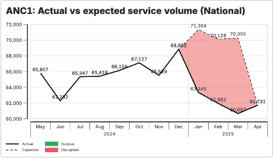

<div class="brand-line"><span class="rule"></span></div>

<div class="setup-breadcrumb"><span class="step done">Mapear utilizadores</span> <span class="arrow">→</span> <span class="step current">Declaração de conclusão</span> <span class="arrow">→</span> <span class="step">Resultados → ações</span> <span class="arrow">→</span> <span class="step">Plano de ação</span></div>

# Escrever uma declaração de conclusão

<p class="meta-line"><strong>Atividade</strong> · <strong>Comunicação de resultados</strong> · <strong>~15 min</strong></p>

<div class="p1-grid">
<aside class="p1-sidebar">

<p class="sb-label">Antes de começar</p>

- ☐ Tem à sua frente um resultado recente de análise FASTR (gráfico, tabela ou nota de interpretação)
- ☐ Identificou pelo menos uma **conclusão interessante** — uma mudança, um padrão, um valor atípico

<p class="sb-label">Porque é importante</p>

As conclusões em bruto são fáceis de *ver* mas difíceis de *comunicar*. Uma boa declaração de conclusão faz três coisas em uma ou duas frases:

1. Nomeia o **indicador**, a **direção** e a **magnitude** da mudança
2. Ancora-a em **lugar e período** para o leitor saber onde e quando
3. Acrescenta uma breve **interpretação** para o leitor saber o que poderá significar

Sem isto, uma conclusão chega como «dados interessantes» — e não como algo sobre que um decisor possa agir.

</aside>
<div class="p1-main">

## A fórmula

> **[Indicador] [tendência] de [valor] para [valor] em [lugar/período]. Isto sugere [interpretação].**

Escolha uma conclusão da sua análise FASTR e escreva-a usando a fórmula. Depois leia-a de volta — alguém que não conhece os seus dados perceberia o que aconteceu e porque importa?

</div>
</div>

---

<div class="brand-line"><span class="rule"></span></div>

Escreva aqui a sua conclusão:

```
Indicador: __________________________________________________________

Tendência: __________________________________________________________

De:        _______________   Para:   _______________

Lugar / período: _____________________________________________________

Isto sugere: _________________________________________________________

________________________________________________________________________

________________________________________________________________________
```

---

<div class="brand-line"><span class="rule"></span></div>

## Exemplos trabalhados

**Fraco (só o resultado):**
> CPN1 foi 12 400 no T1 2026.

**Melhor (usa a fórmula):**
> As visitas de CPN1 **caíram 18%** na Região Norte, **de 14 200 no T1 2025 para 11 640 no T1 2026**. Isto sugere **perturbação do serviço** e não um problema de qualidade dos dados — a completude manteve-se estável e a queda é consistente em todos os distritos da região.

Repare no que a versão melhor acrescenta:


- Uma **direção e magnitude** (caíram 18%)
- Uma **comparação temporal** (T1 2025 → T1 2026)
- Um **lugar** (Região Norte)
- Uma **interpretação** que afasta alternativas (qualidade dos dados)

---

<div class="brand-line"><span class="rule"></span></div>

## Armadilhas

> **«Isto sugere» é a parte mais difícil.** É tentador saltá-la — mas uma conclusão sem interpretação obriga o leitor a fazer o trabalho. Tome posição.

- Evite «interessante» ou «preocupante» como interpretação — são vazios. Diga *o que* é preocupante e *porquê*.
- Se realmente não sabe o que significa, diga-o explicitamente: *«Este padrão precisa de investigação adicional — não conseguimos excluir [X] sem [Y].»* Continua a ser uma posição defensável.

## Verificação por pares

Troque a sua declaração de conclusão com um colega. Pergunte-lhe:

- Consegues perceber o que aconteceu, onde, quando e em quanto?
- A interpretação é específica o suficiente para ser útil?
- Há algo que gostarias de saber e que está em falta?

## A seguir

Uma vez afiadas as conclusões, a próxima atividade é **Ligar os resultados a ações** — pegar em cada conclusão e emparelhá-la com um decisor e um próximo passo concreto.
