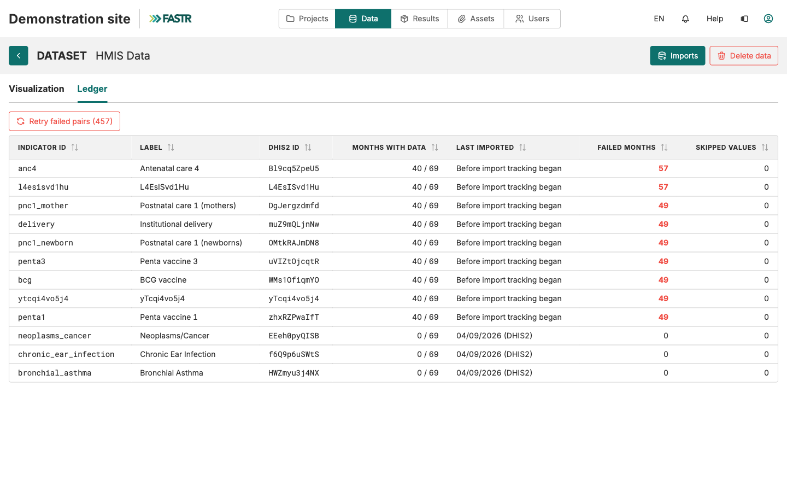

Estrutura de unidades → Indicadores → Dados → Verificar

# Importar dados do HMIS

<strong>Configuração da instância</strong> · <strong>~15 min + tempo do servidor</strong>

<aside class="p1-sidebar">

Antes de começar

- ☐ Unidades importadas (o cartão Unidades mostra as suas contagens)
- ☐ Indicadores importados e mapeados (cada indicador DHIS2 tem uma ligação a um indicador comum)
- ☐ Já decidiu o **período** a importar (p. ex., últimos 36 meses — discuta com a sua equipa)

</aside>

## O que vai fazer

Descarregar os valores reais do DHIS2 para os seus indicadores e período. É a maior operação de dados da configuração — conforme o tamanho do país, pode demorar 5 a 30 minutos. A importação corre **no servidor**: depois de lançada, pode fechar o separador e voltar mais tarde.

<h2 class="step-h">1Abrir a página Importações</h2>

Clique em **Dados** na barra superior e, na secção **HMIS**, no cartão **Dados**. Clique em **Importações**.

A página tem três separadores — **Atual**, **Futuro**, **Histórico** — e os botões **Nova importação DHIS2** e **Carregar ficheiro CSV**. A vista por indicador está um nível acima, no separador **Registo** da página de Dados HMIS.

---

<h2 class="step-h">2Iniciar o assistente</h2>

Clique em **Nova importação DHIS2**. O assistente tem quatro passos: **Indicadores**, **Hora**, **Configuração**, **Rever e lançar**. Usa a ligação DHIS2 guardada da instância; não há nada a digitar.

> Ainda sem ligação guardada? Configure-a uma vez na página **Dados**, cartão **Ligação DHIS2** — fica guardada para toda a instância, encriptada, e ninguém volta a digitar credenciais em cada importação.

<h2 class="step-h">3Indicadores</h2>

Marque todos os indicadores pretendidos — a caixa no topo seleciona tudo. Depois **Seguinte**.

---

<h2 class="step-h">4Hora</h2>

Escolha **Agora** e depois **Seguinte**.

> **Para mais tarde:** a opção **Recorrente** agenda esta importação para se repetir sozinha — por exemplo, todos os meses. Com a configuração estável, é uma tarefa de rotina a menos.

<h2 class="step-h">5Configuração — o intervalo de períodos</h2>

Defina o **intervalo de períodos** com os dois cursores. Seja deliberado: 3 anos de dados mensais ≈ 36 períodos × N unidades, e isso cresce depressa. Depois **Seguinte**.

---

<h2 class="step-h">6Rever e lançar</h2>

Confira o resumo — ligação, número de indicadores, janela e o número de pares (indicador, mês) a descarregar. Clique em **Iniciar importação**.

<h2 class="step-h">7Deixar o servidor trabalhar</h2>

A importação corre no servidor. O separador **Atuais** mostra o progresso; pode fechar o separador do navegador, trabalhar noutra coisa ou terminar sessão — a importação continua. O separador **Histórico** indica quando termina.

## Ponto de controlo

A página de Dados HMIS mostra agora os seus indicadores num gráfico, com valores ao longo do tempo. O seu separador **Registo** lista cada indicador com os meses com dados, a última importação e os meses falhados, se houver.

---

## O que pode correr mal

- **Alguns pares (indicador, mês) falharam** — a importação mantém tudo o que teve êxito; nada é anulado. Abra o separador **Registo** da página de Dados HMIS para ver os meses falhados por indicador e repetir apenas esses pares. Poucas falhas normalmente significam que não existem dados no DHIS2 para essa combinação; muitas falhas apontam para o mapeamento dos indicadores (ver *Importar indicadores*).

- **A rede cai durante a importação** — nada a proteger do seu lado: o descarregamento corre no servidor, não no navegador. Consulte o separador Histórico mais tarde.
- **A janela era demasiado estreita** — repita o assistente com um intervalo mais largo. Os meses reimportados são simplesmente atualizados com os valores atuais do DHIS2.

## O que se segue

Último passo: **Verificar e explorar** — confirmar que está tudo em ordem e aprender a navegar nos seus dados. Depois, um administrador **gera um pacote de resultados** para que os projetos usem os novos dados.
