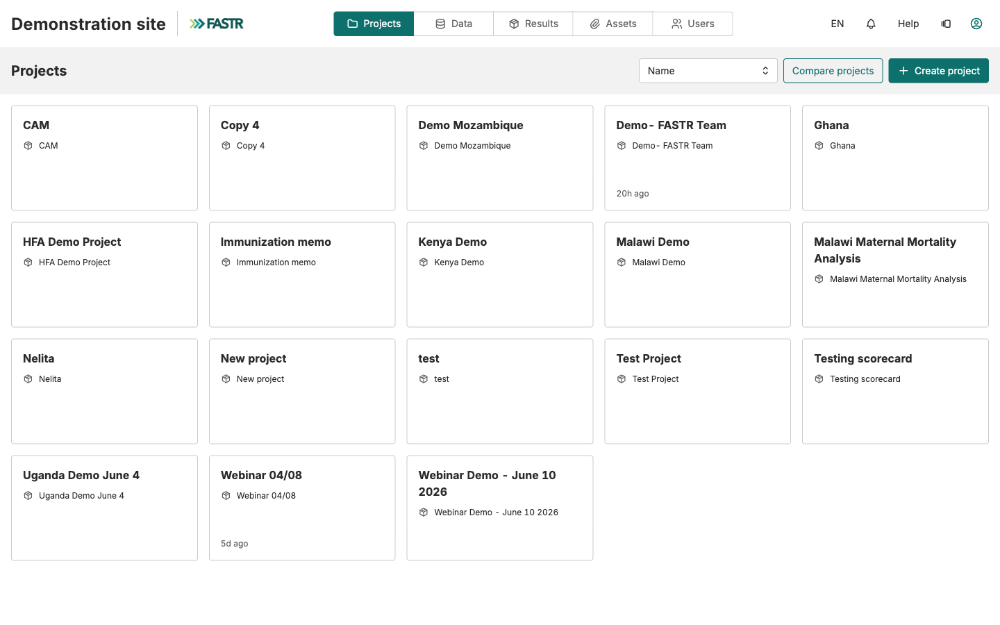
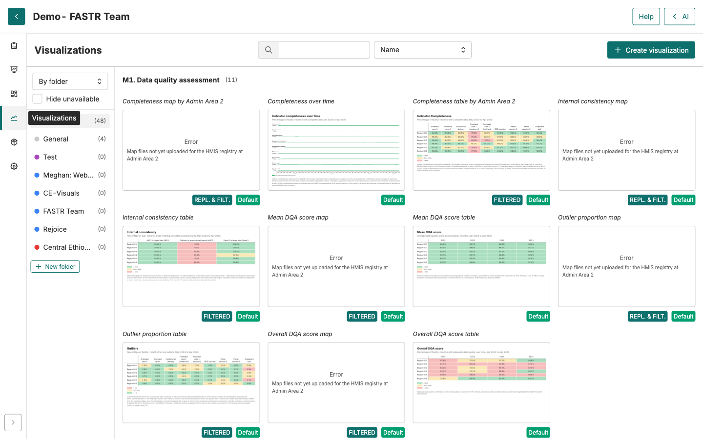
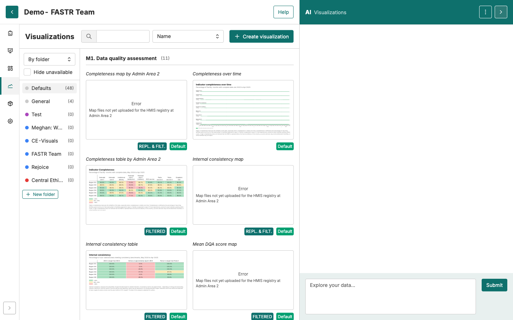

# Guia do facilitador — Primeiros passos

<strong>Guia do facilitador</strong> · <strong>Primeiros passos</strong>

## Sobre estas atividades

Os Primeiros passos põem cada participante na plataforma e configurados para manter o trabalho organizado. É **curto** — uma demonstração conduzida pelo facilitador, depois duas atividades rápidas.

**Três fichas.** **~15 min** de tempo de participante, mais uma demonstração de ~10 min. Os bloqueios aqui são contas e acessos, não competências.

## Como conduzir

- Comece pela **demonstração da plataforma** — é o apêndice no fim deste guia.
- Depois os participantes iniciam sessão e criam as suas pastas.
- **Resolva contas e acesso ao projeto antes da sessão, se puder.** O maior sorvedouro de tempo aqui são os emails de verificação e as contas por aprovar — nada que os participantes possam resolver sozinhos.

---

## As atividades

### 1. Demonstração da plataforma FASTR

**Demonstração · conduzida pelo facilitador · ~10 min**

**O que é** — uma visita guiada de orientação, conduzida pelo facilitador, aos cinco separadores principais da plataforma, antes de os participantes iniciarem sessão.
**O que a ficha cobre** — um guião do tipo fazer / dizer para os separadores Data, Visualizations, Slide Decks e AI Assistant, mais perguntas frequentes e um plano de recurso com capturas de ecrã. *Guião completo da demonstração no apêndice abaixo.*
**Atenção a** — mantenha-a curta e de alto nível; o guião avisa repetidamente para não aprofundar (sem prompt de IA ao vivo, sem detalhes de configuração). A pergunta recorrente é *«isto é o mesmo que o DHIS2?»* — tenha uma resposta pronta.

### 2. Iniciar sessão na plataforma

**Atividade · ~10 min**

**O que é** — a primeira atividade prática: os participantes criam uma conta e entram no projeto do seu país.
**O que a ficha cobre** — abrir o URL do país, registar-se ou iniciar sessão, verificar o email, iniciar sessão e clicar no projeto do país no separador Projects.
**Atenção a** — emails de verificação a cair no spam, e «conta não aprovada» / projeto em falta. Ambos precisam de **si** para conceder acesso ao projeto ou reenviar o email — antecipe-os antes de a sessão começar.

### 3. Criar a sua pasta de utilizador

**Atividade · ~5 min**

**O que é** — uma curta atividade de configuração para criar pastas pessoais e manter os resultados do workshop organizados.
**O que a ficha cobre** — criar uma pasta com o nome do participante no separador Slide Decks, e outra com o **nome idêntico** no separador Visualizations.
**Atenção a** — «+ New folder» só aparece na vista **«By folder»**; o nome tem de coincidir exatamente entre os dois separadores. Desencoraje nomes genéricos como «teste» — tornam o trabalho impossível de encontrar mais tarde.

## Para encerrar

Cada participante deve sair destas atividades com sessão iniciada, dentro do projeto do seu país, com uma pasta nomeada em ambos os separadores. Quem não estiver ficará bloqueado o resto do workshop — verifique antes de avançar.

---

## Apêndice — guião da demonstração da plataforma FASTR

Uma visita rápida de orientação à Plataforma de Análise FASTR — o suficiente para que os participantes saibam o que estão a ver quando iniciarem sessão a seguir. Isto é **antes** de tocarem nos próprios teclados. Mantenha-a curta e de alto nível; os detalhes vêm nas atividades práticas.

### Lista de preparação

- ☐ Navegador com sessão iniciada na instância do seu país, com um projeto de demonstração carregado
- ☐ Separadores principais visíveis: Data, Visualizations, Slide Decks, Reports, AI Assistant
- ☐ Pelo menos uma análise já executada, para que gráficos/resultados estejam visíveis
- ☐ Partilha de ecrã a funcionar, se à distância
- ☐ Tenha a ficha *Iniciar sessão* pronta para distribuir depois desta demonstração

### Passo 1: A plataforma num relance

- **Fazer:** Mostre o ecrã inicial com a navegação principal ao longo do topo.
- **Dizer:** *«Esta é a instância FASTR do seu país. Tudo o que verão hoje acontece aqui — não há software separado para instalar.»*

- **Atenção a:** Participantes a perguntar «isto é o mesmo que o DHIS2?» — resposta: *«Não. O FASTR lê a partir do DHIS2 mas acrescenta análise, visualização e relatórios por cima.»*

### Passo 2: Separador Data (onde vivem os dados das suas unidades)

- **Fazer:** Clique no separador **Data**. Mostre **Structure & maps** (áreas administrativas + unidades) e **HMIS Data**.
- **Dizer:** *«É aqui que os dados do seu país são guardados. Vamos preencher isto amanhã durante a atividade de configuração da instância.»*
- **Atenção a:** Não aprofunde aqui — apenas oriente. A configuração detalhada é uma sessão própria.

### Passo 3: Separador Visualizations

- **Fazer:** Abra o separador **Visualizations**. Mostre um gráfico guardado.

- **Dizer:** *«Uma vez carregados os dados, cria gráficos aqui. Também os pode guardar na sua pasta pessoal — faremos isso na próxima atividade.»*
- **Atenção a:** Passe o rato sobre um gráfico para destacar que os dados são interativos (valores ao passar o rato, filtros).

### Passo 4: Separador Slide Decks

- **Fazer:** Abra **Slide Decks**. Mostre uma apresentação existente e um diapositivo de conteúdo com um gráfico + interpretação.
- **Dizer:** *«É aqui que vai construir os resultados que partilha com os decisores. Cada diapositivo tem um gráfico e uma interpretação — ambos editáveis.»*
- **Atenção a:** Participantes perguntam se é como o PowerPoint — resposta: *«Mesma ideia, mas os gráficos mantêm-se ligados aos seus dados.»*

### Passo 5: AI Assistant

- **Fazer:** Abra o painel AI Assistant. Mostre a Prompt Library brevemente.

- **Dizer:** *«Há um assistente de IA que pode ajudar a construir gráficos, interpretar resultados e redigir diapositivos. Teremos uma sessão inteira sobre isto mais tarde na semana.»*
- **Atenção a:** Não demonstre um prompt aqui — guarde a curiosidade para a sessão dedicada de IA.

### Perguntas comuns

> **P: Preciso de uma palavra-passe do DHIS2 para iniciar sessão no FASTR?**
> R: Não. O FASTR tem o seu próprio início de sessão. As credenciais do DHIS2 só entram em jogo quando importa dados (um passo separado).

> **P: O meu trabalho é privado para mim?**
> R: Tudo o que guardar na sua pasta pessoal é seu. Tudo o que for guardado em pastas ao nível do projeto é visível para a sua equipa de país.

> **P: Posso usar isto no telemóvel?**
> R: Tecnicamente sim, mas foi concebido para um portátil — as visualizações precisam de espaço de ecrã.

### Plano de recurso

> Se a plataforma estiver indisponível durante a demonstração, recorra aos diapositivos:
> - Use as capturas de ecrã da ficha *Iniciar sessão* para percorrer o ecrã inicial.
> - Salte a demonstração ao vivo e passe diretamente à atividade do participante.
