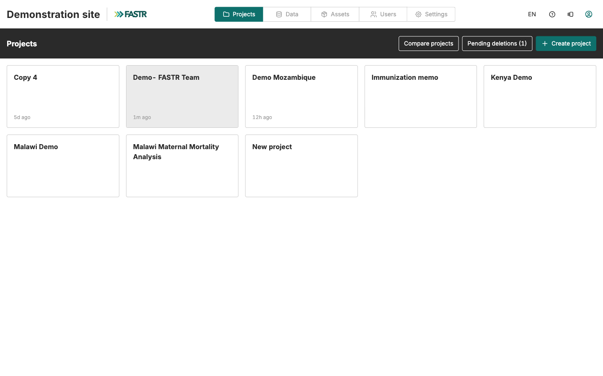

Iniciar sessão → A sua pasta

# Iniciar sessão na plataforma

<strong>Atividade</strong> · <strong>Primeiros passos</strong> · <strong>~10 min</strong>

<aside class="p1-sidebar">

Antes de começar

- ☐ Assistiu à demonstração da plataforma feita pelo facilitador
- ☐ Tem o **URL da plataforma do seu país** (o facilitador irá partilhá-lo)
- ☐ Tem um endereço de email funcional que pode consultar durante a atividade (vai precisar de o verificar)

</aside>

## O que vai fazer

Criar uma conta FASTR se for novo, iniciar sessão e confirmar que está no projeto do seu país. Esta é a sua primeira vez na plataforma — ainda sem trabalho com dados.

<h2 class="step-h">1Abrir o URL da plataforma</h2>

Vá ao URL da plataforma do seu país num navegador (o facilitador irá partilhá-lo; o formato é geralmente `https://<país>.fastr-analytics.org`).

Deverá chegar a um ecrã de início de sessão.

---

<h2 class="step-h">2Registar-se ou iniciar sessão</h2>

- Se for a sua **primeira vez**: clique em **Sign up**, introduza o seu email + uma palavra-passe, e crie a conta.
- Se já tem conta: clique em **Sign in** e introduza as suas credenciais.

<h2 class="step-h">3Verificar o seu email</h2>

Verifique a sua caixa de entrada à procura de um email de verificação do FASTR. Clique na ligação dentro dele para confirmar a sua conta.

> Se não o vir em 2 minutos, verifique a pasta de spam.

<h2 class="step-h">4Iniciar sessão</h2>

Volte à plataforma e inicie sessão com o seu email verificado + palavra-passe.

---

<h2 class="step-h">5Encontrar o seu projeto</h2>

Após iniciar sessão, chega ao separador **Projects**. Verá os projetos a que tem acesso:

- **Se for administrador da instância**, todos os projetos da instância estão listados.
- **Caso contrário**, só vê os projetos a que um administrador lhe concedeu acesso. Se o projeto do seu país estiver em falta, peça ao facilitador (ou administrador da instância) que conceda acesso.

Clique no projeto do seu país para entrar. Verá então os separadores de navegação principais no topo: Data, Visualizations, Slide Decks, Reports.

## Ponto de verificação

Depois de entrar no seu projeto, deverá ver:

- O seu nome (ou email) no canto superior direito
- Os separadores de navegação principais ao longo do topo
- O nome do projeto no cabeçalho (ex.: «País X — Projeto de workshop»)

Se sim, está dentro. Passe à atividade seguinte.

---

## O que pode correr mal

- **«Conta não aprovada»** — a sua conta precisa de ser adicionada ao projeto do país por um administrador. Peça ao facilitador para o adicionar.
- **O email de verificação nunca chega** — verifique o spam. Se ainda nada após 5 min, peça ao facilitador para o reenviar.
- **«Email ou palavra-passe inválidos»** após o registo — confira o email que introduziu. Os erros de escrita são comuns. Normalmente pode pedir uma reposição da palavra-passe.
- **Nenhum projeto visível no separador Projects (ou o projeto do seu país está em falta)** — não é administrador da instância e ainda não lhe foi concedido acesso ao projeto. Peça ao facilitador ou administrador da instância para lhe conceder acesso ao projeto do seu país.

> 🔎 **Verifique na sua interface atual**: os ecrãs de início de sessão + registo podem ter evoluído; as etiquetas dos campos podem diferir das capturas de ecrã. O fluxo é o mesmo.

## A seguir

Avance para **Criar a sua pasta de utilizador** — configure pastas pessoais nos separadores Slide Decks e Visualizations para que o seu trabalho fique organizado.
