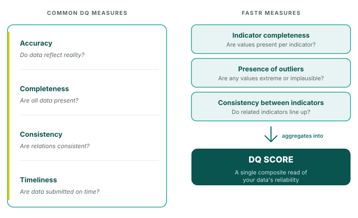

# Style guide

> **Note:** Follow these conventions for consistency, but they are not set in stone. If you find something that doesn't work or have suggestions for improvement, flag it for discussion and we can update the guide.

This document defines the typographic and formatting conventions for FASTR methodology documentation.

---

## Language and spelling

### American English for all English content

All English content in this repo uses American spelling: **visualization** (not visualisation), **finalize** (not finalise), **color** (not colour), **analyze** (not analyse), **organize** (not organise), and so on.

| American (use) | British (do not use) |
|---|---|
| visualization | visualisation |
| analyze (verb) | analyse |
| finalize | finalise |
| color | colour |
| organize | organise |
| optimize | optimise |
| utilize | utilise |

Two exceptions:

- **DHIS2 field names** stay as the platform writes them — e.g. the column `organisationunitid` keeps the British "s" because that's the literal API identifier.
- **The plural noun `analyses`** is the same in American and British English (it's the plural of `analysis`). Use it freely — only the verb form differs.

---

## Headings

### Capitalization: sentence case

Use sentence case for all headings. Only capitalize the first word and proper nouns (like FASTR, DHIS2, RMNCAH-N).

| Correct | Incorrect |
|---------|-----------|
| `## Why focus on high volume indicators?` | `## Why Focus on High Volume Indicators?` |
| `### What do we mean by answerable?` | `### What Do We Mean by Answerable?` |
| `## Data quality assessment` | `## Data Quality Assessment` |
| `### FASTR core indicators` | `### Fastr Core Indicators` |

### Heading hierarchy

| Level | Usage | Example |
|-------|-------|---------|
| `#` | Module title only (one per file) | `# Data extraction` |
| `##` | Major sections | `## Overview`, `## How it works` |
| `###` | Subsections | `### Why monthly facility level data?` |
| `####` | Technical details, sub-subsections | `#### Input file structure` |

### Questions as headings

When phrasing headings as questions, use sentence case with a question mark:

```markdown
### What do we mean by answerable?
### Why focus on high volume indicators?
### Is my question a relevant priority?
```

---

## Text formatting

### Bold

Use bold (`**text**`) for:

- **Key terms** on first introduction
- **Labels** before descriptions
- **Emphasis** on critical concepts
- **Step/Part labels**

#### Sentence case for bold labels

Bold labels must use sentence case, just like headings. Only capitalize the first word and proper nouns.

| Correct | Incorrect |
|---------|-----------|
| `**Geographic level selection**:` | `**Geographic Level Selection**:` |
| `**Data completeness approach**:` | `**Data Completeness Approach**:` |
| `**Input transformation**:` | `**Input Transformation**:` |
| `**Step 1: Load and prepare data**` | `**Step 1: Load and Prepare Data**` |
| `**Part 1: Denominator calculation**` | `**Part 1: Denominator Calculation**` |
| `**Interpretation guide**:` | `**Interpretation Guide**:` |
| `**Key features**:` | `**Key Features**:` |

#### Step and Part labels

Use consistent formatting for sequential steps or parts:

```markdown
**Step 1: Load and prepare data**
**Step 2: Detect outliers**
**Step 3: Assess completeness**

**Part 1: Denominator calculation**
**Part 2: Coverage projection**
```

#### Example usage

```markdown
**Inputs**
- Raw HMIS data (`hmis_ISO3.csv`)
- Geographic identifiers

**Purpose**: Loads and prepares data for analysis.

**Geographic level selection**: The module can analyze at different scales.

**Step 1: Load and prepare data**
The module reads facility-level data...
```

### Inline code

Use backticks (`` ` ``) for:

- Filenames: `` `hmis_data.csv` ``
- Variable names: `` `facility_id` ``, `` `period_id` ``
- Function names: `` `load_data()` ``
- Parameter values: `` `count > 0` ``
- Package names: `` `data.table` ``

### Italics

Use sparingly for:
- Emphasis within sentences
- Placeholder text: *Content to be developed*

---

## Lists

### Bullet points

- No periods for single-line items
- Add periods only when items contain multiple sentences
- Use consistent indentation for sub-bullets

**Single-line items (no periods):**
```markdown
- Raw HMIS data
- Geographic identifiers
- Standardized indicator names
```

**Multi-sentence items (with periods):**
```markdown
- Captures medium-term trends. Reduces impact of short-term fluctuations.
- Sufficient data points for stable averages. Works well with quarterly reporting.
```

### Numbered lists

Use for sequential steps or ordered information:

```markdown
1. Load and prepare data
2. Assess data quality
3. Apply adjustments
```

For sub-steps, use nested numbering:

```markdown
1. First step
   1. Sub-step A
   2. Sub-step B
2. Second step
```

---

## Tables

Use markdown pipe tables with clear headers:

```markdown
| Component | Description |
|-----------|-------------|
| **Inputs** | Raw HMIS data |
| **Outputs** | Adjusted dataset |
```

Guidelines:
- Headers in sentence case
- Use bold for emphasis when needed
- Left-align text columns

---

## Code blocks

### Inline code

Use single backticks for inline code: `` `variable_name` ``

### Code blocks

Use triple backticks with language specification:

````markdown
```r
COUNTRY_ISO3 <- "GIN"
GEOLEVEL <- "admin_area_3"
```
````

Common language tags:
- `r` for R code
- `python` for Python
- `csv` for CSV format
- `text` for plain text output

---

## Blockquotes

Use `>` for:
- Important notes or warnings
- Quoted content
- Highlighted definitions

```markdown
> **Note:** This content was hidden in the original presentation but may be useful to include.
```

---

## Expandable sections

Use `???` for collapsible technical content:

```markdown
??? "Configuration parameters"

    **Parameter**: `THRESHOLD`

    **Default**: 0.05

    **Description**: Sets the outlier detection threshold.
```

Use for:
- Technical documentation
- Function specifications
- Algorithm explanations
- Troubleshooting sections

---

## Mathematical notation

### Inline math

Use single `$` delimiters:

```markdown
The formula is $\text{MAD} = \text{median}(|x - \text{median}(x)|)$
```

### Display math

Use double `$$` on separate lines:

```markdown
$$
\text{Coverage} = \frac{\text{Numerator}}{\text{Denominator}} \times 100
$$
```

---

## Links

### Internal links

Link to other methodology files:

```markdown
See [Data quality adjustment](05_data_quality_adjustment.md) for details.
```

### External links

```markdown
Visit the [DHIS2 documentation](https://docs.dhis2.org) for more information.
```

---

## Abbreviations

Define on first use, then use abbreviation:

```markdown
The Health Management Information System (HMIS) provides routine data.
HMIS data is collected monthly at facility level.
```

Common abbreviations:
- FASTR (always capitalized)
- DHIS2
- HMIS
- RMNCAH-N
- DQA (Data Quality Assessment)

---

## Slide markers

For content that should appear in workshop slides, use:

```markdown
<!-- SLIDE:m4_1 -->
## Slide title

Slide content here.

<!-- /SLIDE -->
```

Naming convention: `m[module]_[section][subsection]`
- `m1_1` - Module 1, section 1
- `m1_2a` - Module 1, section 2, subsection a

---

## Images in slides — the `h:` constraint

> **Where images live:** all shared visual assets (diagrams, screenshots,
> icons, logos, backgrounds) are under `resources/` at the repo root.
> See [`resources/README.md`](../resources/README.md) for the folder
> layout and the per-language diagram mirrors (`resources/diagrams_fr/`,
> `resources/diagrams_pt/`). Path conventions per content type
> (methodology vs. handouts vs. templates) are documented there too.

When you embed an image (SVG, PNG) inside a `<!-- SLIDE -->` block, always set a
**height constraint** unless the image is genuinely tiny. Without one, Marp scales
the image to the slide width — which on the 1280×720 slide canvas usually pushes
the image taller than the title leaves room for, and the bottom gets clipped.

**Syntax:** put `h:<pixels>` inside the alt-text, after the description:

```markdown

```

That sets the image to render at 480px tall (width scales to preserve aspect ratio).

### Height guidelines

The slide canvas is **1280 × 720 px**. The title (`##`) eats ~80 px and the slide
chrome (header/footer/page number) eats ~60 px, leaving roughly **560 px** of
usable image area at full width.

| Layout | Recommended max `h:` |
|--------|----------------------|
| Full-width image (single column) | `h:480` (comfortable) — `h:540` (tight) |
| Two-column layout (`<div class="columns">`) | `h:360`–`h:440` |
| Image alongside a paragraph (≤½ width) | `h:300`–`h:380` |

Pick a value that fits the slide canvas first, then look at how the image renders
intrinsically. If the SVG `viewBox` is portrait-oriented, the same `h:` value will
render narrower (and may fit even in a two-column layout).

### When in doubt

- Open the slide in `core_content/` after running `tools/00_extract_slides.py`
- Render it via the deck builder (`localhost:5173`) or `tools/build_handout_pdfs.py`
- If the image touches the bottom edge or gets clipped, drop the `h:` by 40–80 px

The same rule applies to handout SVGs (`handouts/en/**/*.md` and `handouts/fr/...`),
though handouts give you more room than slides — clipping there usually only
happens for diagrams over 600 px tall.

---

## File structure

Each methodology file should include:

1. **Module title** (`#`)
2. **Overview section** (`##`) - what and why
3. **Main content sections** (`##`)
4. **ASCII separator** (for slide content)
5. **Slide content** (using `<!-- SLIDE:xxx -->` markers)

---

## Footer

End each methodology file with:

```markdown
---

**Last updated**: DD-MM-YYYY
**Contact**: FASTR Project Team

---
```

---

## Quick reference

| Element | Convention |
|---------|------------|
| Headings | Sentence case (capitalize first word + proper nouns only) |
| Bold labels | Sentence case (same rule as headings) |
| Step/Part labels | Sentence case: `**Step 1: Load data**` not `**Step 1: Load Data**` |
| Inline code | Filenames, variables, functions |
| Lists | No periods for single items |
| Tables | Sentence case headers |
| Code blocks | Include language tag |
| Abbreviations | Define on first use in each chapter |
| Slide markers | `<!-- SLIDE:m#_# -->` |
| Terminology | Use "Step" or "Part", never "Stage" |
