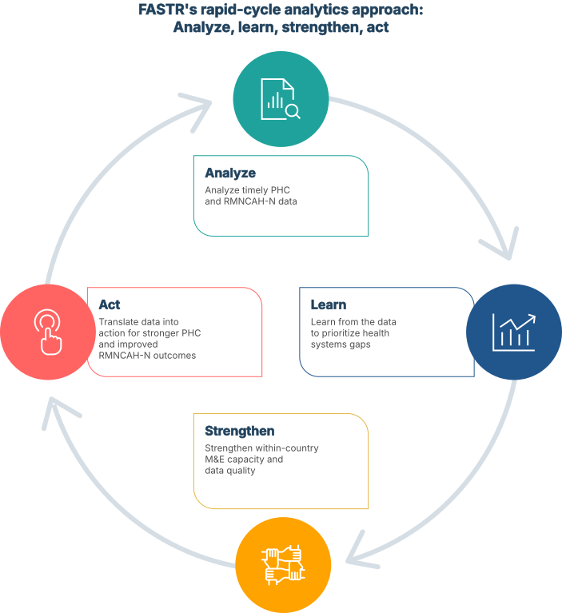

# FASTR RMNCAH-N service use monitoring: Methodology documentation

## Introduction to FASTR

The Global Financing Facility (GFF) supports country-led efforts to improve the timely generation and use of data for decision-making, ultimately leading to stronger primary healthcare (PHC) systems and better reproductive, maternal, newborn, child, and adolescent health and nutrition (RMNCAH-N) outcomes. This set of initiatives and technical support is referred to as **Frequent Assessments and System Tools for Resilience (FASTR)**.

FASTR encompasses four technical approaches: (1) RMNCAH-N service use monitoring using routine health management information system (HMIS) data, (2) rapid-cycle health facility phone surveys, (3) high-frequency household phone surveys, and (4) follow-on analyses. **This methodology documentation focuses specifically on the first approach: RMNCAH-N service use monitoring.**

## RMNCAH-N service use monitoring

The GFF collaborates with Ministries of Health to conduct rapid-cycle analyses of routine HMIS data. This approach addresses three core objectives:

1. **Assess data quality** at national and sub-national levels to identify and address completeness, accuracy, and consistency issues
2. **Track service utilization changes** by measuring monthly shifts in priority RMNCAH-N health service volumes
3. **Monitor coverage progress** by comparing service delivery trends against country-specific targets and benchmarks

These analyses focus on priority indicators tied to national health reforms and World Bank investments, with findings informing country planning processes and project implementation cycles. During the COVID-19 pandemic, the GFF supported Ministries of Health in over 20 countries to monitor the impact of the pandemic on essential health services using this approach.

*Figure 1. Steps to implement RMNCAH-N service use monitoring*

### Why rapid-cycle analytics?

Existing health systems data sources are critical but often come with challenges that limit their use. HMIS data may not be analyzed promptly or may be perceived as too low-quality to use for decision making. Traditional in-person household and facility-based surveys demand extensive resources and time, with long lags between survey design, data collection, and the availability of findings. This prevents decision-makers from using data to drive meaningful improvements in health outcomes. To fill this gap, the GFF supports countries to develop and use rapid-cycle analytic approaches.

---

### How does it work?

Rapid-cycle analytic approaches provide timely, rigorous, and high-priority data that respond to each country's specific priorities and data use needs. This continuous cycle of analyze-learn-strengthen-act seeks to improve the systematic use of data for decision-making towards improved RMNCAH-N outcomes.

*Figure 2. FASTR's rapid-cycle analytics approach: Analyze, learn, strengthen, act*

### Technical approaches

FASTR's four technical approaches, underpinned by capacity strengthening and data use support, enable countries to use rapid-cycle analytics for strengthening PHC systems and improving RMNCAH-N outcomes through the timely and high-frequency analysis and use of data.

1. **Analysis of routine HMIS data** assesses data quality, quantifies changes in priority health service volumes, and compares trends in service coverage to country targets for priority RMNCAH-N indicators.

2. **Rapid-cycle health facility phone surveys** assess the performance of PHC facilities, monitor the implementation of reforms, identify the impact of shocks, and track changes over time. The phone survey is administered to a representative panel sample of PHCs over four quarterly contacts a year.

3. **High-frequency household phone surveys** provide a snapshot of care seeking behavior, foregone care, financial protection, service coverage, and patient experience of care. Household surveys are currently done in partnership with the World Bank's Living Standards Measurement Study.

4. **Follow-on analyses** employ root cause analysis and implementation research approaches to provide deeper understanding of issues uncovered by rapid-cycle analytics (e.g., explaining district-level performance variation, contextualizing the impact of health systems reforms, or investigating underlying causes of data quality issues and service delivery disruptions).

Illustrative capacity-building activities include support to automate the extraction, cleaning, and analysis of routine data and support to institutionalize rapid phone survey data collection and analysis approaches. Data use support prioritizes the integration of rapid-cycle analytics into existing data review and feedback mechanisms at national and subnational levels to strengthen the systematic use of data for decision making.

*Figure 3. Rapid-cycle analytics under the Frequent Assessments and System Tools for Resilience (FASTR) initiative*

### How do countries use FASTR?

FASTR is designed to support country-defined policy questions using routine and survey data. Different countries enter FASTR through different pathways depending on their priorities. Some countries — such as Sierra Leone, Burkina Faso, Zambia, and Liberia — began with service continuity monitoring, triggered by changes in external financing for the health sector. Others — such as Nigeria, Ghana, and DRC — initiated FASTR to answer different priority questions, with disruption analysis as complementary work.

Regardless of the entry point, FASTR enables countries to monitor service continuity and recovery, identify geographic or service-specific challenges, and inform prioritization, planning, and policy dialogue.

### From analysis to action

FASTR outputs — whether DQA scores, service use trends, or coverage estimates — are starting points, not endpoints. Each output triggers a cycle of investigation and action: findings raise questions, questions prompt investigation, investigation yields context, and context informs decisions. FASTR provides the evidence; stakeholders provide the context, judgement, and action.

## Acronyms and abbreviations

| Acronym | Definition |
|---------|------------|
| | ***Programs & organizations*** |
| **DHS** | The Demographic and Health Surveys (DHS) Program |
| **FASTR** | Frequent Assessments and System Tools for Resilience |
| **GFF** | Global Financing Facility |
| **MICS** | Multiple Indicator Cluster Surveys |
| **MoH** | Ministry of Health |
| **UN** | United Nations |
| | ***Data systems & sources*** |
| **DHIS2** | DHIS2 (also spelled DHIS 2, formerly District Health Information Software) |
| **HMIS** | Health Management Information System |
| **WPP** | World Population Prospects |
| | ***Health indicators & services*** |
| **ANC** | Antenatal Care |
| **BCG** | Bacillus Calmette-Guérin (tuberculosis vaccine) |
| **MCV** | Measles-Containing Vaccine |
| **OPD** | Outpatient Department |
| **Penta** | Pentavalent vaccine (diphtheria, tetanus, pertussis, hepatitis B, Haemophilus influenzae type b) |
| **PHC** | Primary Healthcare |
| **RMNCAH-N** | Reproductive, Maternal, Newborn, Child, and Adolescent Health and Nutrition |
| **SBA** | Skilled Birth Attendant |
| | ***Technical & statistical terms*** |
| **DQA** | Data Quality Assessment |
| **MAD** | Median Absolute Deviation |
| | ***Geographic*** |
| **LMIC** | Low- and Middle-Income Country |
| **SSA** | Sub-Saharan Africa |

## Use of routine health management information system data in LMICs

Health-facility data collected through routine HMIS constitute a primary data source for assessing the performance of the health sector. HMIS data are widely used for a variety of purposes including health sector reviews, planning and resource allocation, program monitoring, health care quality improvement, and reporting purposes. Ministries of Health in low- and middle-income countries (LMICs) are striving to ensure equitable access to quality health services and care towards attaining universal health coverage and other national strategies. The efforts can be more successful if decision making at all levels of the sector are well informed by timely, reliable, and comprehensive data gathered through a well-established health information system. Sound decisions are based on sound data; therefore, it is essential to ensure that the data are of good quality.

Poor-quality data impact various levels of the health system in different ways. For program managers, inaccurate data can lead to poor decisions that harm the program's operations and, ultimately, the population's health. At the planning level, poor-quality data can distort evidence of progress towards health-sector goals and hinder annual planning processes by providing misleading results. Additionally, when determining investments in the health sector, poor-quality data can lead to poor targeting of resources. Despite HMIS data being crucial for robust health systems, studies in Sub-Saharan Africa (SSA) have reported challenges with data quality, including issues with completeness, timeliness, accuracy, and consistency [@abouzahr2005; @mavimbe2005; @sychareun2014; @mutale2013; @amoakoh2015; @gimbel2011; @teklegiorgis2016; @rowe2009potential; @belay2013; @moukenet2021]. These concerns about the quality of routine information have undermined its use in decision-making within the health sector [@mutale2013; @belay2013; @xiao2017; @ohagan2017; @chen2014; @glele2014; @bhattacharya2019; @nshimyiryo2020; @ouedraogo2019; @endriyas2019; @mwangu2005; @rowe2009caution]. However, in recent years, countries have made substantial improvements in HMIS data quality which has been reinforced by a system of data quality assessment, data quality improvement, and data use for evidence-based decision making [@nisingizwe2014; @wagenaar2015; @mphatswe2012].

## Defining data quality

Defining data quality is complex, and while there is no one single definition of data quality, there are four dimensions most frequently used to describe it: completeness, timeliness, consistency, and accuracy [@who2017dqa].

### Data quality dimensions and assessment

| **Data quality domain** | **What does it measure?** | **How is it assessed?** |
|------------------------|---------------------------|-------------------------|
| **Completeness** | Are all data present? Is there sufficient information available to make decisions about the health of the population and to target resources to improve health-system coverage, efficiency and quality? | • Assessed by measuring whether all units that are supposed to report actually do (**reporting completeness**)  • Assessed by measuring the completeness of indicator data (no missing values); this is different from overall reporting completeness in that it looks at completeness of specific data elements and not only at the receipt of the monthly reporting form (**indicator completeness**) |
| **Timeliness** | Are data regularly submitted on time? | • Assessed by measuring whether the units that submitted reports did so before a set deadline (**timeliness**) |
| **Consistency** | Are data plausible in view of what has been previously reported? | • Trends are evaluated to determine whether reported values are extreme relative to other values reported during the year or across several years (**presence of outliers**)  • Assess trends in program indicators to determine whether reported values are extreme in relation to other values that are reported during the year or over several years (**consistency over time**)  • Assess program indicators which have a predictable relationship to determine whether the expected relationship exists between those 2 indicators (**consistency between related indicators**)  • Assess the level of agreement between two sources of data measuring the same health indicator; the two sources of data that are usually compared are data flowing through the HMIS and data from a periodic population-based survey (**external comparison with other data sources**)  • Determine the adequacy of the population data used in evaluating the performance of health indicators by comparing two different sources of related population estimates for congruence (**consistency of population data**) |
| **Accuracy** | Do data faithfully reflect the actual level of service delivery conducted in the health facility? | • Assess the accuracy for selected indicators through the review of source documents in health facilities and comparison to monthly reports and HMIS values (**consistency of reported data and original records, data verification factor**) |

## FASTR approach to routine data analysis

The FASTR approach to routine data analysis takes a three-pronged approach:

1. **Identify issues in data quality**
2. **Adjust for issues with data quality** to improve analysis accuracy
3. **Analyze data to answer pressing country-specific policy questions** including identifying changes in priority service volumes and trends in service coverage as compared to country priorities and targets

This approach enables identification of the highest priority data quality issues and subsequent necessary analytical adjustments so that data can be continually improved while appropriate analyses are conducted. Data quality assessment is conducted by indicator and can be disaggregated at sub-national level given facility-level data is used for the analysis. This is important to generate policy relevant regular reporting on data quality, service volume, and coverage estimates which provides a continual snapshot of RMNCAH-N service use.

---

### Focus on a set of core indicators

The FASTR approach to routine data analysis focuses on a core set of RMNCAH-N indicators that characterize the reproductive, maternal and child healthcare continuum, priority health areas across LMICs. These indicators capture key service delivery events, which have higher completeness rates and higher volume. In addition, these indicators serve as proxies for other services and interventions delivered at the same service contact. In addition, outpatient consultations (OPDs) are used as a proxy for the general use of health services. Additional, country and program-specific indicators can be added to the analysis to be responsive to country priorities.

---

### Focus on a set of core data quality metrics

The FASTR approach to routine data analysis focuses on a core set of data quality metrics which enables identification of the highest priority data quality issues for which data quality adjustments can be made. In addition to the core data quality measures, the FASTR approach generates an overall data quality score which combines the core metrics into a single summary measure.

## Results communication and data use

During the COVID-19 pandemic, the GFF supported Ministries of Health in over 20 countries to monitor the impact of the pandemic on essential health services.

- **Report**: [COVID-19: Impact on Essential Health Services](https://www.globalfinancingfacility.org/sites/gff_new/files/documents/GFF-IG13-2-COVID-19-Essential-Health-Services.pdf)
- **Article**: [Healthcare utilization and maternal and child mortality during the COVID-19 pandemic in 18 low- and middle-income countries](https://journals.plos.org/plosmedicine/article?id=10.1371/journal.pmed.1004070)
- **Article**: [Vaccination utilization and subnational inequities during the COVID-19 pandemic](https://www.mdpi.com/2076-393X/11/9/1415)
- **Article**: [Disruptions in maternal and child health service utilization during COVID-19: analysis from eight sub-Saharan African countries](https://academic.oup.com/heapol/article/36/7/1140/6306443)

More results and reports can be found in the [FASTR Resource Repository](https://data.gffportal.org/key-theme/FASTR/resource-repository/index.php/home).

## What this documentation covers

This methodology documentation describes the complete FASTR approach to routine HMIS data analysis, from initial planning through results communication.

### Planning & preparation

- [**Identify questions & indicators**](01_identify_questions_indicators.md) - Defining priority questions and selecting core indicators for FASTR implementation
- [**Data extraction**](02_data_extraction.md) - Extracting and preparing HMIS data from DHIS2 for analysis
- [**The FASTR data analytics platform**](03_fastr_analytics_platform.md) - Using the platform for automated analysis and visualization

### Analytics modules (FASTR platform)

The FASTR analytics platform includes five automated modules:

- [**Data quality assessment**](04_data_quality_assessment.md) - Module 1 in the platform. Assessment of HMIS data quality through completeness, outlier detection, and consistency metrics
- [**Data quality adjustment**](05_data_quality_adjustment.md) - Module 2 in the platform. Techniques for improving data accuracy by adjusting for outliers and incomplete reporting
- [**Service utilization analysis**](06a_service_utilization.md) - Module 3 in the platform. Analysis of health service usage patterns to detect and quantify disruptions
- [**Coverage estimates**](06b_coverage_estimates.md) - Modules 5 & 6 in the platform (Part 1: denominator calculation, Part 2: coverage estimation). Methods for estimating service coverage and comparing trends to country targets

## References

\full_bibliography

---

<!--
////////////////////////////////////////////////////////////////////
//                                                                //
//   _____ _     _____ ____  _____    ____ ___  _   _ _____ _   _ //
//  / ____| |   |_   _|  _ \| ____|  / ___/ _ \| \ | |_   _| \ | |//
//  | (___ | |     | | | | | | |__   | |  | | | |  \| | | | |  \| |//
//   \___ \| |     | | | | | |  __|  | |  | | | | . ` | | | | . ` |//
//   ____) | |___ _| |_| |_| | |____ | |__| |_| | |\  | | | | |\  |//
//  |_____/|_____|_____|____/|______| \____\___/|_| \_| |_| |_| \_|//
//                                                                //
//            Edit workshop slides below this line                //
//                                                                //
////////////////////////////////////////////////////////////////////
-->

<!-- SLIDE:m0_1 -->
## What is FASTR?

**Frequent Assessments and System Tools for Resilience**

The GFF supports country-led efforts to improve the timely generation and use of data for decision-making. This set of initiatives and technical support is referred to as **FASTR**.

FASTR rests on four complementary pillars, underpinned by capacity strengthening and data-use support.

<!--
PRESENTER NOTES:
- Read the acronym aloud. Most participants will not have heard "Frequent Assessments and System Tools for Resilience" spelled out before, and the words themselves explain what FASTR is.
- The opening paragraph is the official GFF wording. Keep it close to verbatim.
- The four-pillar line at the bottom is a pointer to slide 4. Do not enumerate the pillars here; the dedicated slide does that.
- If asked what makes FASTR different from existing HMIS analysis: it is the combination of timely cycles, multiple complementary methods, and embedded capacity support, not any single technique.
-->
<!-- /SLIDE -->

<!-- SLIDE:m0_2 -->
## What are we trying to achieve?

Rapid-cycle analytics accelerate progress on RMNCAH-N outcomes by strengthening the availability and systematic, timely use of data for decision-making.

<!--
PRESENTER NOTES:
- The point of this slide is the gap. Routine HMIS data is available now; in-person household and facility surveys arrive every five years. Decisions cannot wait for the next survey.
- "Systematic and timely use of data" is the goal. Timely is the easy half. Systematic means data review becomes part of the routine, not a one-off.
- The diagram contrasts the survey-only model (a question mark in the years between surveys) with the FASTR model (continuous, timely data alongside the surveys).
- If asked whether FASTR replaces surveys: no. FASTR fills the years between them, and uses survey data when it arrives.
-->
<!-- /SLIDE -->

<!-- SLIDE:m0_3 -->
## An approach: analyze, learn, strengthen, act

FASTR catalyzes continuous cycles of analysis, learning, system strengthening, and action, so that timely data drives decision-making at every level.

<!--
PRESENTER NOTES:
- Walk the cycle aloud: analyze the data, learn what it tells you, strengthen the system based on what you learned, act on the priorities, then loop back to analyze again.
- Emphasize this is continuous, not one-and-done. Each turn of the cycle should leave both the data system and the decisions a little better than the last.
- A single FASTR report does not move the needle. The cycle does. That is why "systematic" matters as much as "timely".
- If asked which step is most important: all four. Skipping "strengthen" is the most common failure mode; analysis lands but the system never improves.
-->
<!-- /SLIDE -->

<!-- SLIDE:m0_4 -->
## Four complementary pillars

FASTR is an integrated approach built on four rigorous, rapid, and low-cost methods for monitoring primary health care systems, underpinned by capacity strengthening and data-use support adapted to country needs.

<!--
PRESENTER NOTES:
- Each pillar is one method. They are designed to complement each other, not duplicate.
- HMIS service-use monitoring is the workhorse. It runs routinely and covers everywhere with reporting facilities. This is the pillar the workshop focuses on.
- The other three add depth where HMIS cannot reach: facility phone surveys for readiness and reform tracking, household and client surveys for the demand side (care-seeking, foregone care, experience), and follow-on analyses for root causes.
- Capacity strengthening and data-use support is the band underneath all four. Without it, the analytical outputs do not get used.
- Make explicit: this workshop teaches the first pillar. The other three are introduced for context so participants know what the wider FASTR offer is.
-->
<!-- /SLIDE -->

<!-- SLIDE:m0_5 -->
## How do countries use FASTR?

FASTR supports country-defined policy questions using routine and survey data. Countries enter through different pathways depending on their priorities.

- **Service disruption monitoring** was the starting point for Sierra Leone, Burkina Faso, Zambia, and Liberia, triggered by changes in external financing.
- **Other analytic priorities** drove Nigeria, Ghana, and DRC into FASTR first, with disruption analysis added as complementary work.

In all cases, FASTR enables countries to:

- Track service continuity and recovery
- Identify geographic or service-specific disparities
- Inform planning, prioritization, and policy dialogue

<!--
PRESENTER NOTES:
- Different entry points, same underlying methodology. The country team decides which policy questions matter; the FASTR methods adapt to those questions.
- Disruption monitoring is one entry point, not the whole offer. Some countries lead with it because of external financing changes; others come in for other reasons.
- The four pillars apply across all use cases. A country can run the HMIS pillar without a household survey, or vice versa.
- The three "in all cases" bullets are the through-line. Whatever the entry point, FASTR ends up serving continuity tracking, disparity identification, and planning dialogue.
-->
<!-- /SLIDE -->

<!-- SLIDE:m0_6 -->
## What is the FASTR approach to RMNCAH-N service use monitoring?

Quarterly analyses of DHIS2 data, focusing on prioritized national indicators.

Building sustainable tools so that stakeholders who need to use data can generate the right analysis and visualizations, at the right time, on their indicators of interest.

Combining analysis and visualization with capacity strengthening and data-use support for sustainability and institutionalization.

<!--
PRESENTER NOTES:
- This is the methodology this workshop teaches. The other three pillars on the previous slide are introduced for context; this one is the meat of the next six modules.
- Quarterly cadence, prioritized indicators, sustainable tooling: those three points are the operating model.
- The diagram on the right is the journey for the rest of the workshop. Identify questions, extract data, assess quality, adjust for quality issues, analyze, communicate. Each step has its own module.
- Avoid going deep here. Point at the diagram and say "this is the rest of the workshop".
- If asked why quarterly: it matches the typical decision cycle for districts and ministries. Faster is possible but rarely useful; slower defeats the point.
-->
<!-- /SLIDE -->

<!-- SLIDE:m0_7 -->
## From analysis to action

FASTR outputs, whether DQA scores, service use trends, or coverage estimates, are **starting points, not endpoints**. They trigger investigation and inform decisions.

<!--
PRESENTER NOTES:
- This cycle applies to all FASTR outputs, not just disruptions.
- DQA findings prompt investigation of data systems and improvements to reporting.
- Utilization changes prompt investigation of service delivery and address bottlenecks.
- Coverage gaps prompt investigation of access barriers and targeted interventions.
- FASTR provides the evidence; stakeholders provide context, judgement, and action.
-->
<!-- /SLIDE -->

---

**Contact**: <fastr@worldbank.org>
