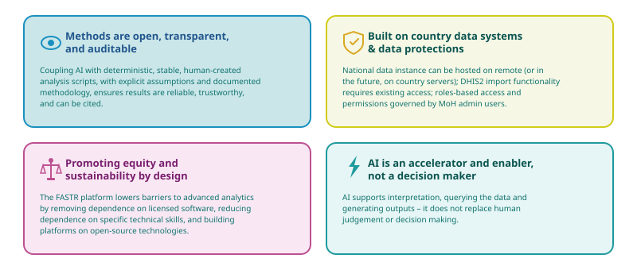

# The AI assistant

## Overview

The FASTR platform includes an AI assistant that provides on-demand support for data interpretation and report generation. Many health systems have more data than capacity to analyze it — M&E staff often have limited time for in-depth analysis, analytical skills vary across teams and regions, and turning data into narrative insights requires both technical and contextual knowledge.

The AI assistant helps bridge this gap by explaining trends and patterns in plain language, generating draft reports and key messages, and answering questions about the data or methodology.

## Capabilities

### Data exploration and analysis

The AI assistant can query metrics and indicators from installed analysis modules, filter and disaggregate by geography, time, and demographics, view raw CSV data behind metrics and visualizations, and explore data across time periods, locations, and sources.

### Visualization and display

The assistant can display existing project visualizations and work with replicants of multi-variant charts. It can create new chart configurations such as bar charts, line graphs, and tables, and combine charts, tables, and narrative text.

### Knowledge and documentation

The AI has access to FASTR methodology documentation and can explain indicators and calculation methods. It interprets results with context on data quality, trends, and limitations, and answers questions about health data.

### Presentation and communication

The assistant builds narratives that combine visuals and text, highlighting key findings and patterns. It creates focused views by filtering to relevant subsets and provides evidence-based insights grounded in the underlying data.

## How it works

The AI follows a "read before responding" principle — it never guesses. For data questions, it finds the relevant metric, reads the actual data values, and responds with a visualization. For methodology questions, it looks up documentation, reads the details, and explains in plain language.

## Privacy and sharing

### What's private

Your conversation with the AI, your whiteboard explorations, and the questions you ask and answers you receive are private to you. Other team members cannot see what you're exploring.

### What's shared

The underlying data (same HMIS data), saved visualizations in the project library, slide decks you create and save, and project settings and module results are shared with the team. Everyone can see saved content.

## Key principles

AI is an accelerator, not a decision maker. You stay in control of judgement (deciding what matters), interpretation (understanding context), and action (making decisions). All calculations — outlier detection, coverage estimates, data quality scores — use proven statistical formulas, not AI. AI interprets and explains. You decide and act.

---

<!--
////////////////////////////////////////////////////////////////////
//                                                                //
//   _____ _     _____ ____  _____    ____ ___  _   _ _____ _   _ //
//  / ____| |   |_   _|  _ \| ____|  / ___/ _ \| \ | |_   _| \ | |//
//  | (___ | |     | | | | | | |__   | |  | | | |  \| | | | |  \| |//
//   \___ \| |     | | | | | |  __|  | |  | | | | . ` | | | | . ` |//
//   ____) | |___ _| |_| |_| | |____ | |__| |_| | |\  | | | | |\  |//
//  |_____/|_____|_____|____/|______| \____\___/|_| \_| |_| |_| \_|//
//                                                                //
//            Edit workshop slides below this line                //
//                                                                //
////////////////////////////////////////////////////////////////////
-->

<!-- SLIDE:mai_1 -->
## The AI assistant

The FASTR platform includes an AI assistant that provides on-demand support for data interpretation and report generation.

**Context:** Many health systems have more data than capacity to analyze it

- M&E staff often have limited time for in-depth analysis
- Analytical skills vary across teams and regions
- Turning data into narrative insights requires both technical and contextual knowledge

**What it does:** The AI assistant helps bridge this gap by:

- Explaining trends and patterns in plain language
- Generating draft reports and key messages
- Answering questions about the data or methodology
<!-- /SLIDE -->

<!-- SLIDE:mai_2 -->
## What the AI assistant can do

**Answer questions about your data**

- "Which regions have the most outliers?"
- "How has reporting completeness changed over time?"
- Creates charts and explanations on-the-fly

**Explain methodology**

- "How are outliers detected?"
- "What does this data quality score mean?"
- Draws from platform documentation

**Help build reports**

- Generate slide decks from your data
- Combine saved charts with narrative text
- Create presentations for different audiences
<!-- /SLIDE -->

<!-- SLIDE:mai_3 -->
## Ask questions, get answers

Type your questions in plain language. The AI analyzes your data and shows you results.

| Topic | Example questions |
|-------|-------------------|
| **Data quality** | "Which regions have the most outliers?" / "Where are the completeness gaps?" |
| **Trends** | "How has ANC1 changed over time?" / "Show me service volumes for 2024" |
| **Disruptions** | "Have any services dropped recently?" / "Did anything change last quarter?" |
| **Regional** | "Which areas have low reporting rates?" / "Where should we focus support?" |

No coding required. No technical jargon necessary. Just ask like you're talking to a colleague.
<!-- /SLIDE -->

<!-- SLIDE:mai_4 -->
## How conversations work

**Example conversation:**

You: "Which regions have the most data quality issues?"
AI: *Creates a chart showing data quality scores by region*

You: "What's causing the low score in the Northern region?"
AI: *Breaks down the issues: outliers, completeness gaps, consistency problems*

You: "Create a summary for my director"
AI: *Builds a slide highlighting priority areas for data quality improvement*

**Think of the AI as a data analyst on your team** — someone who can instantly pull reports, create charts, and answer questions about your health data.
<!-- /SLIDE -->

<!-- SLIDE:mai_5 -->
## Tips for better answers

**Be specific about:**

- Which service — "ANC1" instead of "antenatal care services"
- Which time period — "last 12 months" or "2024"
- Which location — "Banadir" or "all regions"

**You can ask for:** Charts, explanations, comparisons, reports, data tables

**Follow-up questions work great:**

1. Start broad: "Show me data quality scores by region"
2. Narrow down: "What about just ANC indicators?"
3. Go deeper: "Why is the Northern region so low?"
4. Take action: "Create a slide about this for my presentation"
<!-- /SLIDE -->

<!-- SLIDE:mai_6 -->
## AI assistant capabilities

| Area | What it supports |
|------|------------------|
| **Data exploration** | Query metrics from analysis modules; filter by geography, time, demographics; view raw CSV data; explore across time periods and locations |
| **Visualization** | Display project visualizations; create bar charts, line graphs, tables; combine charts, tables, and narrative text |
| **Knowledge** | Access FASTR methodology; explain indicators and calculations; interpret results with context on data quality and limitations |
| **Communication** | Build narratives combining visuals and text; highlight key findings; create focused views; provide evidence-based insights |
<!-- /SLIDE -->

<!-- SLIDE:mai_7 -->
## What happens when you log off

| Content | Saved? | Notes |
|---------|--------|-------|
| Your AI conversation | Temporary | May be available when you return (depends on configuration) |
| Whiteboard content | Temporary* | Disappears when you navigate away |
| Slide decks you create | Permanent | Saved to project, visible to team |
| Saved visualizations | Permanent | Remain in project library |
| Downloaded exports | Permanent | Saved to your computer |

*You can save text or visuals from the whiteboard to a slide deck before leaving.
<!-- /SLIDE -->

<!-- SLIDE:mai_8 -->
## Private vs shared on team projects

**Private to you:**

- Your conversation with the AI
- Your whiteboard explorations
- Questions you ask and answers you receive

Other team members cannot see what you're exploring.

**Shared with team:**

- The underlying data (same HMIS data)
- Saved visualizations in project library
- Slide decks you create and save
- Project settings and module results

Everyone can see saved content.

<!-- /SLIDE -->

<!-- SLIDE:mai_9 -->
## How teams work together

| Who | Action | Result |
|-----|--------|--------|
| **Dr. Amina** (Director) | Asks AI about data quality, explores privately, creates slide deck | Deck now visible to all |
| **Mohamed** (Data Manager) | Asks AI about reporting gaps, saves a chart | Chart in library for everyone |
| **Fatima** (Program Officer) | Opens Amina's slides, uses Mohamed's chart, asks AI to explain | Gets private explanation |

**What each person sees:**

- Their own AI conversations — Yes
- Saved slides and charts from others — Yes
- Each other's private questions — No
<!-- /SLIDE -->

<!-- SLIDE:mai_10 -->
## How the AI assistant works

The AI follows a "read before responding" principle — it never guesses.

**For data questions:**

1. Finds the relevant metric
2. Reads the actual data values
3. Responds with a visualization

**For methodology questions:**

1. Looks up documentation
2. Reads the details
3. Explains in plain language

<!-- /SLIDE -->

<!-- SLIDE:mai_11 -->
## AI is an accelerator, not a decision maker

**You stay in control of:**

- Judgement — deciding what matters
- Interpretation — understanding context
- Action — making decisions

**The numbers come from validated methods**

All calculations (outlier detection, coverage estimates, data quality scores) use proven statistical formulas — not AI.

AI interprets and explains. You decide and act.

<!-- /SLIDE -->

<!-- SLIDE:mai_12 -->
## Principles for success

Responsible automation, focused on the needs of Ministries of Health, and designed for scale.

<!-- /SLIDE -->

<!-- SLIDE:mai_13 -->
## Practice: Using the AI assistant

*Content to be drafted*

*Work in pairs. Compare what the AI produces with your own interpretation.*
<!-- /SLIDE -->

---

**Last updated**: 05-02-2026
**Contact**: FASTR Project Team
