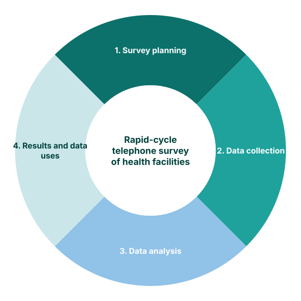

# Health Facility Assessment (HFA) Phone Survey

## Background and purpose

### Objective of the module

The Health Facility Assessment (HFA) module complements routine HMIS data by collecting information directly from health facilities through phone surveys. While routine data provides continuous monitoring of service delivery volumes, phone surveys capture additional dimensions that are not available in administrative systems, including service availability, readiness, and facility-level context.

The FASTR HFA phone survey is designed to be rapid, low-cost, and regularly repeatable. By contacting facilities directly, the survey gathers timely information on operational status, staffing, supply availability, and service provision that can be triangulated with routine HMIS data to provide a more complete picture of health service delivery.

### Analytical rationale

Routine HMIS data tells us *how much* service is being delivered, but not *why* delivery patterns may be changing. Phone surveys help answer questions that routine data cannot address:

- Is a facility open and functioning?
- Are essential supplies and medicines available?
- Are trained staff present?
- What challenges are facilities facing?

By linking survey responses to routine data patterns, the FASTR approach enables more nuanced interpretation of service delivery trends.

### Key points

| Component | Details |
|-----------|---------|
| **Inputs** | Facility sampling frame from HMIS Standardized phone survey questionnaire Facility contact information |
| **Outputs** | - Service availability indicators - Readiness scores - Supply chain status - Staffing information - Linked survey-routine analysis |
| **Purpose** | Complement routine HMIS monitoring with facility-level context to improve interpretation and inform targeted interventions |

---

## Survey methodology

### Sampling approach

The FASTR HFA uses a stratified random sample of health facilities, with stratification typically based on:

1. **Geographic region** - Ensuring representation across provinces/districts
2. **Facility type** - Hospitals, health centers, health posts
3. **Ownership** - Public, private, faith-based
4. **HMIS reporting status** - Active reporters vs. non-reporters

Sample size is determined based on the precision required for key indicators and the resources available for data collection.

### Data collection

Phone surveys are conducted by trained enumerators using a standardized questionnaire. Key features include:

- **Respondent**: Facility in-charge or designated health worker
- **Duration**: 15-30 minutes per facility
- **Frequency**: Quarterly or as needed
- **Quality control**: Call-backs, supervisor monitoring, data validation

### Questionnaire structure

The standard FASTR HFA questionnaire covers:

1. **Facility identification** - Verification of facility details
2. **Operational status** - Current functioning, any closures
3. **Service availability** - Which services are currently offered
4. **Staffing** - Current staff presence by cadre
5. **Essential supplies** - Stock status of key medicines and commodities
6. **Infrastructure** - Basic utilities (water, electricity)
7. **Recent challenges** - Open-ended on current issues

---

## Questionnaire adaptation

### Adaptation guidelines

The standard FASTR questionnaire serves as a starting point that should be adapted to each country context. Key adaptation considerations:

1. **Language** - Translation and back-translation
2. **Health system terminology** - Align with local naming conventions
3. **Indicator priorities** - Focus on nationally relevant services
4. **Skip patterns** - Adjust based on facility types in country
5. **Response options** - Match local context (e.g., supply names)

### Adaptation process

**Step 1: Review standard questionnaire**
Walk through each section with country stakeholders to identify what works and what needs modification.

**Step 2: Identify country priorities**
Determine which services and indicators are most important for the country's health objectives.

**Step 3: Modify questions**
Adapt wording, add country-specific questions, remove irrelevant items.

**Step 4: Pre-test**
Test adapted questionnaire with a small sample of facilities.

**Step 5: Finalize**
Incorporate pre-test feedback and prepare final version for training.

---

## Survey-routine data linkage

### Linking survey responses to HMIS data

A key feature of the FASTR approach is linking phone survey responses to routine HMIS data for the same facilities. This enables:

1. **Validation** - Check if survey-reported service availability matches HMIS reporting patterns
2. **Contextualization** - Understand *why* routine data shows certain patterns
3. **Triangulation** - Compare multiple data sources for the same facilities

### Use cases for linked analysis

- **Non-reporting facilities**: Survey confirms whether facility is closed or just not reporting
- **Service volume changes**: Survey reveals if changes are due to stockouts, staffing, or actual demand
- **Quality interpretation**: Survey data adds context to routine data quality flags

---

## Data use and decision-making

### Using HFA results

Survey results should inform:

1. **Routine data interpretation** - Explain patterns in HMIS data
2. **Targeted support** - Identify facilities needing intervention
3. **Supply chain management** - Track stockout patterns
4. **Health system strengthening** - Inform broader system improvements

### Reporting frequency

Depending on country needs and resources, HFA surveys may be conducted:
- **Quarterly** - For ongoing monitoring
- **Event-driven** - In response to specific concerns (outbreaks, emergencies)
- **Annually** - As part of routine health system assessment

---

<!--
////////////////////////////////////////////////////////////////////
//                                                                //
//            Edit workshop slides below this line                //
//                                                                //
////////////////////////////////////////////////////////////////////
-->

<!-- SLIDE:m8_1 -->
## Why rapid-cycle facility surveys

Routine HMIS data captures the *volume* of services delivered, but cannot explain *why* a number moved. Rapid **Health Facility Assessment (HFA)** phone surveys close that gap. They are designed to:

- **Understand supply-side constraints** on service delivery in primary health care facilities
- **Measure reform implementation** as it happens, rather than after the fact
- **Assess the effect of shocks** on health systems — outbreaks, conflicts, supply disruptions
- **Improve the speed and relevance** of facility surveys as an adaptive management tool

> Phone surveys complement HMIS data with the readiness, capacity, and context information that routine reporting does not capture.
<!-- /SLIDE -->

<!-- SLIDE:m8_1a -->
## Health facility survey design

Analyzing primary health care facility performance and readiness; enables tracking over time.

| Component | Details |
|-----------|---------|
| **Mode + Length** | 30 to 45 min. phone survey |
| **Frequency** | Tool completion over 4 quarterly contacts per year |
| **Target** | Representative panel of 350 PHCs with annual partial replacement |
| **Sampling** | National-level representativeness |
| **Implementer** | Government, academic/technical partner, or survey firm dependent on context and funding source |
| **Rapid adaptation** | Quarterly review of priority topics and emerging health systems questions informs round-to-round adaptation |
<!-- /SLIDE -->

<!-- SLIDE:m8_1b -->
## Adaptive survey content with RMNCAH-N focus

Rapid facility surveys can identify gaps in service delivery and monitor reforms or shocks.

| Round 1 | Round 2 | Round 3 | Round 4 |
|---------|---------|---------|---------|
| Facility characteristics | Facility characteristics* | Facility characteristics* | Facility characteristics* |
| Shocks | Adaptive content** | Adaptive content** | Adaptive content** |
| Resilience to shocks | Shocks | Shocks | Shocks |
| Services | Resilience to shocks | Resilience to shocks | Resilience to shocks |
| Supplies | Supplies | Supplies | Supplies |
| | Financing | Infrastructure | Workforce and staffing |
| | Community engagement | Quality improvement processes | Leadership and coordination |

* Asked only to replacement facilities | ** Additional locally-relevant questions generated during adaptation

<!-- /SLIDE -->

<!-- SLIDE:m8_1c -->
<!-- _class: two-panel -->

## Survey structure — 10 modules

Questions are drawn from the WHO PHCMFI framework and harmonized with the HHFA, SARA, SPA, and SDI facility-assessment tools. The result is a modular instrument that countries adapt to their context.

### What each module covers

- External shocks
- Resilience to shocks
- Service delivery
- Infrastructure
- Financing
- Workforce
- Medical supplies
- Leadership and coordination
- Community engagement
- Quality-of-care improvement processes

### What the tool delivers

- Updated snapshot of primary health-care performance
- Operational capacity of primary health facilities
- Main gaps in service delivery
- Effect of external shocks or reforms on services
- Higher frequency and policy relevance than traditional facility surveys

*Optional modules include emergency preparedness, immunization (with Gavi), ANC operational capacity, and delivery/EmONC operational capacity.*

> The instrument is **100% adaptable** by countries — modules can be added, dropped, or sequenced to fit local priorities.
<!-- /SLIDE -->

<!-- SLIDE:m8_0 -->
<!-- _class: compact -->

## HFA surveys across GFF partner countries

Rapid-cycle phone surveys of health facilities are currently implemented in **20 GFF partner countries**.

### Planning
*10 countries*

Afghanistan, Cameroon, Ethiopia, Ghana, Mauritania, CAR, DRC, Chad, Zambia, Zimbabwe

### In progress
*Cycles 1–4 · 9 countries*

Bangladesh, Guinea, Madagascar, Mali, Nigeria, Senegal, Sierra Leone, Somalia, Tajikistan

### Institutionalised
*1 country*

Burkina Faso

> The approach is designed to adapt to each country's context — survey duration, frequency, and content are defined locally.
<!-- /SLIDE -->

<!-- SLIDE:m8_0a -->
<!-- _class: two-panel -->

## The FASTR approach to rapid health facility assessment

We design and implement **quarterly telephone surveys** of primary health facilities.

These produce regular analyses of primary healthcare performance, availability, and operational capacity of services — focused on priority indicators linked to the RMNCAH-N strategic plan.

These results inform decision-making and concrete actions to strengthen the health system.

<!-- /SLIDE -->

<!-- SLIDE:m8_3 -->
<!-- _class: two-panel -->

## Why integrate HMIS and HFA surveys?

Neither dataset alone answers the question. HMIS tells you what services were delivered. HFA tells you what services *could* be delivered. Read together, they tell you why a number moved and where to act.

### HMIS — DHIS2
*Routine, monthly*

- Captures **volume**: visits, doses, deliveries.
- Picks up changes in service delivery as they happen.
- Does **not** explain why a change occurred.

### HFA — phone survey
*Quarterly*

- Captures **readiness**: staffing, supplies, infrastructure.
- Picks up gaps on the supply side, facility by facility.
- Does **not** measure whether the gap hurt service delivery.

> **Worked example.** A 20% drop in ANC1 visits in one region (HMIS) plus 60% of facilities in that region reporting no ANC supplies (HFA) ⇒ supply-driven decline. Neither figure alone supports that conclusion.
<!-- /SLIDE -->

<!-- SLIDE:m8_3a -->
## A triangulation example — institutional maternal mortality

To answer *"is maternal mortality likely to improve?"*, HMIS and HFA data have to be triangulated with other sources. No single dataset is enough.

### Impact indicator

**Institutional maternal mortality**

### Triangulation sources

- **MPDSR** — maternal death surveillance and response
- **DHIS2** — routine HMIS service data
- **Household surveys** — DHS or equivalent

> You cannot act to reduce maternal mortality without understanding what is happening inside the facilities themselves.
<!-- /SLIDE -->

<!-- SLIDE:m8_3b -->
<!-- _class: dense-table -->

## What DHIS2 alone already lets you measure

With routine HMIS data alone you can already answer essential questions: *Is institutional delivery coverage trending up or down? Are deliveries increasing significantly over time?* What it cannot answer is *why*.

| | OUTPUT | OUTCOME | IMPACT |
|---|--------|---------|--------|
| **Indicator** | **Number of institutional deliveries** | **% of institutional deliveries** | **Institutional maternal mortality** |
| **Analysis** | Service utilization analysis | Coverage estimation | Multi-source triangulation |
| **Sources** | DHIS2 (quarterly) | DHIS2 + household surveys | MPDSR · DHIS2 · DHS |

> DHIS2 tells you the *what*. To understand the *why*, you need a complementary source.
<!-- /SLIDE -->

<!-- SLIDE:m8_3c -->
<!-- _class: dense-table -->

## The complete results chain with HFA

Adding HFA data closes the loop — you can now answer *why* a service delivery number moved.

| | INPUT | OUTPUT | OUTCOME | IMPACT |
|---|-------|--------|---------|--------|
| **Indicator** | **EmONC operational capacity** | **Number of institutional deliveries** | **Institutional delivery coverage** | **Institutional maternal mortality** |
| **What it captures** | Medicines, qualified staff, equipment | Service utilization analysis | Coverage estimation | Multi-source triangulation |
| **Source** | *Rapid phone survey (quarterly)* | *DHIS2 (quarterly)* | *DHIS2 + household surveys (DHS)* | *MPDSR · DHIS2 · DHS* |

> Are facilities **"ready"** to deliver quality EmONC care? That question now sits at the start of the chain, not at the end.
<!-- /SLIDE -->
