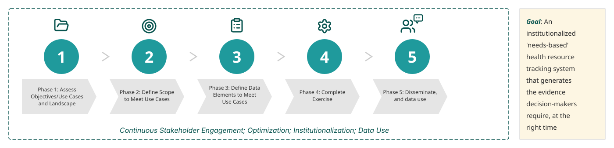

# FASTR and RMET integration

This chapter explores how FASTR service delivery analytics can be integrated with Resource Mapping and Expenditure Tracking (RMET) to provide a comprehensive picture of health system performance and financing.

## What is RMET?

**Resource Mapping and Expenditure Tracking (RMET)** refers to processes that collect budget and expenditure data to inform policies, plans, budgets, financial management, and implementation of health services.

RMET answers questions about health financing:

- What is the envelope of resources available for health?
- How are health programs financed (RMNCAH, HIV, TB, etc.)?
- Are investments aligned to priorities?
- Are resources equitably and efficiently allocated?
- Are committed budgets spent down effectively?

Related methodologies include National Health Accounts (NHA), NASA, and Public Expenditure Reviews (PERs), each serving specific purposes.

## Why integrate FASTR and RMET?

FASTR and RMET provide complementary perspectives:

| FASTR | RMET |
|-------|------|
| Service delivery data | Health financing data |
| Data quality assessment | Budget and expenditure tracking |
| Service utilization trends | Resource allocation patterns |
| Disruption detection | Funding gap analysis |
| Coverage estimates | Donor vs government financing |

**Together they answer critical questions:**

- Does funding availability correlate to program performance?
- Are under-resourced areas showing service disruptions?
- Where should resources be reallocated based on observed gaps?
- Are funding challenges reflected in facility-level service delivery?

## Alignment requirements

For FASTR and RMET to effectively inform each other, alignment is needed across:

**Time periods**
- FASTR typically produces quarterly analyses
- RMET ideally conducted annually
- Findings should reference compatible time frames for triangulation

**Disaggregation**
- Geographic levels (national, subnational, district)
- Program areas (RMNCAH, immunization, etc.)
- Health system functions or levels

**Dissemination pathways**
- TWGs and RMNCAH-N coordination platforms
- WB/GFF project reviews
- National financial and PFM systems
- Annual planning processes

**Data use processes**
- Decision-making timelines
- Stakeholder needs
- Policy windows

## Complementary use cases

| RMET provides... | FASTR can then... |
|------------------|-------------------|
| Estimate of resources available | Inform how resources should be invested based on observed service gaps |
| Funding gap for investment case or strategy | Inform mitigation strategies by identifying where to prioritize limited resources |
| Donor vs government funding breakdown | Identify whether challenges from donor structures affect facility service delivery |
| Subnational resource distribution | Assess how under-resourced areas perform relative to others |
| Program-specific funding levels | Assess program performance relative to resourcing |
| Funding by health system function or level | Identify which functions or levels have the most serious gaps |

## Practical integration

**Embedded into existing processes:**

FASTR findings can be integrated into:
- RMNCAH-N Technical Working Groups
- Quarterly coordination meetings
- WB/GFF project reviews

RMET findings can be integrated into:
- Annual planning cycles
- Budget allocation decisions
- Investment case development

**Triangulation for root cause analysis:**

When FASTR identifies a service disruption, RMET data can help investigate whether:
- The affected area is under-resourced
- Budget execution is delayed
- Resources are misallocated relative to need

When RMET identifies funding gaps, FASTR data can show:
- Which services are most affected
- Where performance is declining
- Priority areas for resource reallocation

---

<!--
////////////////////////////////////////////////////////////////////
//                                                                //
//            Edit workshop slides below this line                //
//                                                                //
////////////////////////////////////////////////////////////////////
-->

<!-- SLIDE:m9_1 -->
## What is Health Resource Tracking?

**Health Resource Tracking (HRT)** or **Resource Mapping and Expenditure Tracking (RMET)** are umbrella terms for processes that collect budget and/or expenditure data to inform policies, plans, budgets, financial management, and implementation — including for services that improve women, children, and adolescent health.

There are several methodologies used for tracking resources such as the NHA, NASA, PERs. Each serves a specific purpose and use case.
<!-- /SLIDE -->

<!-- SLIDE:m9_2 -->
## RMET process overview

Because a main feature of RMET is to be adapted to country needs, this is a general guide to serve as a 'framework' for each country.

- Steps are presented sequentially, but the process is often dynamic and iterative in practice
- Recommendations and approaches should be contextualized for specific needs, other ongoing HRT processes (such as NHA, NASA, etc.), and RMET processes in each country
<!-- /SLIDE -->

<!-- SLIDE:m9_3 -->
## Integrating FASTR and RMET

How can service delivery analytics and resource tracking speak to each other?

| FASTR | RMET |
|-------|------|
| Data quality in DHIS2 | Envelope of resources available |
| Service utilization trends | How programs are financed |
| Disruption detection | Subnational resource distribution |
| Coverage estimates | Funding gaps and allocation |

**Together:** A comprehensive picture of health system performance and financing
<!-- /SLIDE -->

<!-- SLIDE:m9_4 -->
## Why bring them together?

FASTR answers: *How are services performing?*

RMET answers: *How are services resourced?*

**Combined, they can answer:**

- Does funding correlate to performance?
- Are under-resourced areas showing disruptions?
- Where should resources be reallocated?
- Are funding challenges reflected in service delivery?
<!-- /SLIDE -->

<!-- SLIDE:m9_5 -->
## Alignment for triangulation

For FASTR and RMET to inform each other, align:

**Time periods**
- FASTR: quarterly
- RMET: annually
- Reference compatible timeframes

**Disaggregation**
- Same geographic levels
- Same program areas

**Dissemination**
- TWGs, coordination platforms
- Project reviews, annual planning
<!-- /SLIDE -->

<!-- SLIDE:m9_6 -->
## Complementary insights

| RMET shows... | FASTR can then show... |
|---------------|------------------------|
| Resources available | Where to invest based on service gaps |
| Funding gaps | Where to prioritize limited resources |
| Subnational distribution | How under-resourced areas perform |
| Program funding levels | Program performance vs resourcing |

**Result:** Evidence-based resource allocation decisions
<!-- /SLIDE -->
