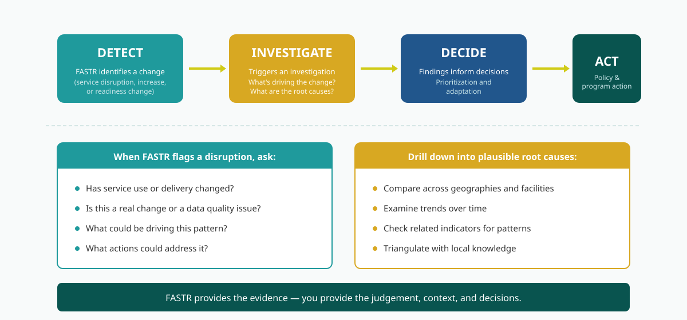

# Workshop activities

This chapter contains hands-on activities for workshop participants.

---

<!--
////////////////////////////////////////////////////////////////////
//                                                                //
//            Edit workshop slides below this line                //
//                                                                //
////////////////////////////////////////////////////////////////////
-->

<!-- SLIDE:m9_1 -->
## Why detecting disruptions matters

Disruption detection isn't just about flagging problems — it triggers investigation into root causes.

<!-- /SLIDE -->

<!-- SLIDE:m9_2 -->
## Activity: Creating a country disruptions report

 **Practice session**

**Goal:** Each country team creates a disruptions report or policy brief

**Duration:** 90 minutes

---

## What you'll produce

Choose a theme for your report:
- Tracking disruption analysis
- Assessing maternal health service utilization
- Immunization coverage trends
- Data quality assessment

**Deliverables:**
- Analysis of service disruptions in your country
- Subnational breakdown identifying priority areas
- 3-5 key messages for decision-makers

---

## Key messages structure

Transform findings into actionable messages:

| Finding | So what? | Action needed |
|---------|----------|---------------|
| ANC1 down 15% in Northern Region | Pregnant women not accessing care | Investigate barriers, strengthen outreach |
| Penta3 stable nationally | Immunization program resilient | Maintain current approach |
| Poor data quality in 2 districts | Can't trust the numbers | Data quality training needed |
<!-- /SLIDE -->

<!-- SLIDE:m9_3 -->
## Presenting reports and group feedback

**Report back**

- Each group presents their section (~5 minutes)

**Discussion**

- What worked well?
- What was challenging?
- Feedback on the approach
<!-- /SLIDE -->

<!-- SLIDE:m9_4 -->
## FASTR Quiz

**15 min | 40 pts**

Buzz in when you have the answer!

**Rules:**
- You can use the AI assistant to find answers — or you might already know!
- Buzz in when your team is ready to answer
- Correct answer = full points for your team
- Wrong answer = other teams can steal for +1 bonus point

---

## Part 1: Core concepts

**3 pts each**

---

## Question 1

What does FASTR stand for?

---

## Answer 1

**F**requent **A**ssessments and Health **S**ystem **T**ools for **R**esilience

---

## Question 2

What are FASTR's 3 data quality dimensions?

---

## Answer 2

Outliers, completeness, consistency

---

## Question 3

What are the 4 technical approaches under FASTR?

---

## Answer 3

1. HMIS analysis
2. Facility phone surveys
3. Household phone surveys
4. Follow-on analyses

---

## Question 4

What is the FASTR cycle?

---

## Answer 4

Analyze, learn, strengthen, act

---

## Part 2: Scenarios

**4 pts each**

---

## Question 5

A district reports 200 ANC1 visits but 350 ANC4 visits.

What's the problem?

---

## Answer 5

**Consistency issue**

ANC1 should always be higher than ANC4 (more women start than complete all 4 visits)

---

## Question 6

You calculate Penta1 coverage and get 147%.

What does this mean?

---

## Answer 6

**Denominator is too small**

Target population is underestimated

---

## Question 7

A facility has not reported for 7 months at the start of the year.

Is it "incomplete" or "inactive"?

---

## Answer 7

**Inactive**

(6+ months non-reporting at beginning/end of period = inactive, not incomplete)

---

## Question 8

Name one reason HMIS data quality might be poor

---

## Answer 8

- Late reporting
- Data entry errors
- Missing reports
- Inconsistent recording

(any valid answer)

---

## Part 3: Target populations

For each service, name the denominator. **3 pts each**

---

## Question 9

ANC1 coverage — target population = ?

---

## Answer 9

Pregnant women (or expected pregnancies)

---

## Question 10

Institutional delivery coverage — target population = ?

---

## Answer 10

Live births (or expected live births)

---

## Question 11

Penta3 coverage — target population = ?

---

## Answer 11

DPT-eligible infants (or surviving infants)

---

## Question 12

Why should Penta1 be higher than Penta3?

---

## Answer 12

**Dropout** — more children start the series than complete it

---

## Final scores

| Part | Points |
|------|--------|
| Part 1: Core concepts (4 Qs) | 12 |
| Part 2: Scenarios (4 Qs) | 16 |
| Part 3: Target populations (4 Qs) | 12 |
| **Total** | **40** |

---

## Debrief

- Which questions were hardest to find?
- What prompts worked well with the AI assistant?
- What did you learn about FASTR?
<!-- /SLIDE -->
