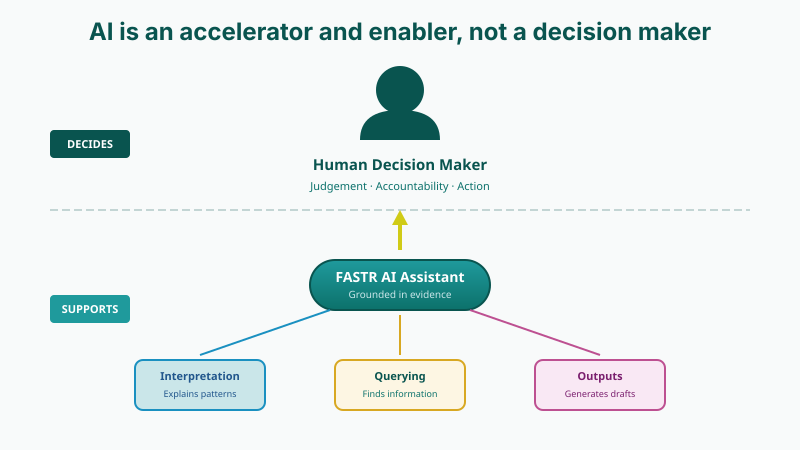
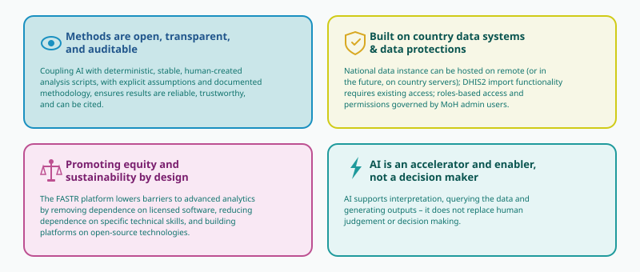

<!-- AUTO-TRANSLATED from 03_fastr_analytics_platform.md -->
<!-- Add REVIEWED marker after human review to protect from overwrite -->

# La plateforme d'analyse de données FASTR

## Aperçu

La plateforme d'analyse FASTR est un outil en ligne conçu pour soutenir l'évaluation, l'ajustement et l'analyse de la qualité des données de santé de routine. Elle permet aux utilisateurs de télécharger et d'analyser des données provenant de diverses sources, y compris le DHIS2, avec des méthodes statistiques intégrées pour générer un ensemble de données ajustées et effectuer des analyses prioritaires sur des indicateurs sélectionnés. La plateforme fournit une interface conviviale pour l'exécution des analyses et offre des options flexibles pour la visualisation et l'exportation des résultats.

## Capacités clés

### Gestion des données

La plateforme offre une fonctionnalité complète de gestion des données. Les utilisateurs peuvent importer et gérer les structures des établissements de santé, y compris les zones administratives et les établissements individuels. Le système prend en charge les importations de données provenant des systèmes d'information sur la gestion de la santé (SIGS) et des évaluations des établissements de santé (HFA), ce qui permet aux utilisateurs de gérer des indicateurs provenant de sources multiples tout en suivant les versions des ensembles de données au fil du temps.

### Analyse des données

Les capacités analytiques sont fournies par le biais de modules configurables. Les utilisateurs peuvent activer et configurer des modules analytiques qui traitent les données à l'aide de scripts statistiques basés sur la technologie R. Ces modules peuvent être enchaînés pour obtenir des données plus détaillées. Ces modules peuvent être enchaînés pour prendre en charge des analyses complexes en plusieurs étapes, avec des outils intégrés pour surveiller l'état du traitement et consulter les journaux.

### Assistant IA

Un assistant IA intégré aide les utilisateurs à comprendre et à interpréter leurs données. L'assistant peut expliquer les résultats des modules, décrire les tendances et les modèles de données, fournir des informations sur les visualisations et aider à générer du contenu narratif pour les rapports. Les utilisateurs peuvent poser des questions sur les données de leur projet en langage naturel et recevoir des conseils contextuels sur l'analyse et l'interprétation.

### Visualisation

La plateforme offre des outils de visualisation robustes pour présenter les résultats analytiques. Les utilisateurs peuvent créer des graphiques, des cartes et des tableaux à partir des données traitées, avec des options de filtrage et de désagrégation selon plusieurs dimensions. Les visualisations peuvent être personnalisées en termes d'apparence et de style, et exportées sous forme d'images ou de fichiers de données pour être utilisées dans des applications externes.

### Rapports

La fonctionnalité de création de rapports permet aux utilisateurs de combiner plusieurs visualisations dans des rapports complets. Les rapports peuvent être exportés sous forme de présentations PowerPoint ou de documents PDF. Les utilisateurs peuvent organiser et réorganiser les pages des rapports pour répondre à des besoins de communication spécifiques et partager les rapports terminés avec les parties prenantes.

### Collaboration

La plateforme prend en charge le travail collaboratif grâce à une structure basée sur les projets. Les utilisateurs peuvent organiser leur travail en projets distincts et attribuer aux membres de l'équipe différents rôles, notamment des autorisations de visualisation, d'édition et d'administration. Les contrôles d'accès s'effectuent au niveau du projet et les projets peuvent être verrouillés pour éviter les modifications involontaires.

## Qui devrait utiliser cette application ?

### Les analystes de données

Les analystes de données trouveront la plateforme très utile pour analyser les tendances des données de santé, créer des visualisations et générer des rapports pour les décideurs. Les modules analytiques et les outils de visualisation sont conçus pour soutenir des flux de travail d'analyse de données rigoureux.

### Gestionnaires de programmes de santé

Les responsables de programmes de santé peuvent utiliser la plateforme pour surveiller les performances des programmes, suivre les indicateurs clés et partager des informations avec leurs équipes. La fonctionnalité de reporting permet une communication régulière des résultats afin de soutenir une gestion de programme basée sur des preuves.

### Administrateurs du système

Les administrateurs du système sont chargés de mettre en place la plateforme, de gérer les utilisateurs, d'importer les données et de configurer le système pour répondre aux besoins de l'organisation. Les outils administratifs permettent de contrôler l'accès des utilisateurs, les sources de données et les paramètres de la plateforme.

## Fonctionnement de l'application

### Niveau de l'organisation (instance)

**L'instance** est l'espace de travail principal de l'organisation au sein de la plateforme. Chaque instance contient tous les utilisateurs enregistrés, la structure administrative partagée (y compris les zones administratives et les établissements de santé), les définitions des indicateurs partagés, les sources de données (SIGS et HFA) et tous les projets créés au sein de l'organisation.

### Niveau du projet

**Les projets** fournissent des espaces de travail d'analyse ciblés au sein d'une instance. Chaque projet permet aux utilisateurs de sélectionner les données à inclure en définissant des périodes, des établissements et des indicateurs spécifiques. Au sein d'un projet, les utilisateurs peuvent activer des modules analytiques, créer des visualisations et élaborer des rapports adaptés à des objectifs analytiques spécifiques.

### Flux de données

La plate-forme suit un flux de données structuré : **Importation des données → Traitement des modules → Visualisations → Rapports**. Les utilisateurs commencent par télécharger les données de l'établissement de santé au niveau de l'instance. Des projets sont ensuite créés avec des fenêtres de données spécifiques qui définissent l'étendue de l'analyse. Les modules analytiques traitent et analysent les données sélectionnées, produisant des résultats qui peuvent être utilisés pour créer des graphiques, des cartes et des tableaux. Enfin, les visualisations sont combinées dans des rapports exportables pour la diffusion.

## Exigences techniques

### Langues supportées

L'application prend actuellement en charge l'anglais et le français. Les paramètres linguistiques peuvent être configurés au niveau de l'instance pour répondre aux besoins des différentes communautés d'utilisateurs.

### Exigences en matière de navigateur

L'application est conçue pour fonctionner avec des navigateurs web modernes. Chrome est recommandé pour des performances optimales, mais Firefox, Safari et Edge sont également pris en charge. JavaScript doit être activé pour une fonctionnalité complète.

## Concepts de base

La compréhension de ces concepts de base aidera les utilisateurs à travailler efficacement avec l'application.

### Instance

Une **instance** est l'espace de travail principal de l'organisation au sein de la plate-forme. Elle sert de conteneur de premier niveau pour tous les utilisateurs, la structure administrative partagée, les sources de données et les projets. Chaque organisation opère généralement au sein d'une seule instance qui fournit la base de tout le travail analytique.

### Projets

Un **projet** est un espace de travail d'analyse ciblé au sein d'une instance. Les projets permettent aux utilisateurs de travailler avec des sous-ensembles spécifiques de données en définissant des périodes, des installations et des indicateurs pertinents pour un objectif analytique particulier. Dans chaque projet, les utilisateurs peuvent activer des modules analytiques, créer des visualisations, générer des rapports et collaborer avec les membres de l'équipe. Plusieurs projets peuvent exister au sein d'une même instance, chacun ayant une portée de données et des configurations d'accès utilisateur différentes.

### Structure

La **structure** définit l'organisation hiérarchique des zones administratives et des établissements de santé au sein de la plateforme.

**Les zones administratives** représentent les frontières géographiques organisées en quatre niveaux maximum. La zone administrative 1 représente les frontières du pays. La zone administrative 2 correspond aux plus grandes unités infranationales telles que les provinces ou les régions. La zone administrative 3 englobe les unités de niveau intermédiaire telles que les districts ou les départements, tandis que la zone administrative 4 représente les unités plus petites telles que les communes ou les sous-districts. Les quatre niveaux administratifs ne sont pas toujours nécessaires.

**Les établissements de santé** sont les points de prestation de services de santé - y compris les hôpitaux, les cliniques et les postes de santé - qui sont liés aux zones administratives au sein de la structure. Les établissements peuvent avoir des attributs supplémentaires tels que le type d'établissement (hôpital, centre de santé ou dispensaire) et la catégorie de propriété (publique, privée ou confessionnelle).

### Sources de données

#### Données SIGS

Les données du système d'information sur la gestion de la santé (SIGS) contiennent des statistiques de routine sur les services de santé recueillies auprès des établissements. Il s'agit notamment d'indicateurs de prestation de services, de données de surveillance des maladies et d'indicateurs de performance des programmes. Les données SIGS sont généralement communiquées sur une base mensuelle et constituent la base de la plupart des analyses de routine du système de santé.

#### Données HFA

Les données d'évaluation des établissements de santé (HFA) contiennent des informations sur les caractéristiques et les capacités des établissements. Il s'agit notamment de données sur la disponibilité des infrastructures, l'équipement et les fournitures, les niveaux de personnel et l'état de préparation des services. Les données HFA complètent les données SIGS en fournissant un contexte sur les établissements à partir desquels les données de routine sont rapportées.

### Indicateurs

**Les indicateurs** sont des paramètres de santé mesurables utilisés dans la plateforme. Il peut s'agir soit d'**Indicateurs communs**, qui sont définis et partagés dans l'instance pour une mesure cohérente, soit d'**Indicateurs DHIS2**, qui sont importés de systèmes DHIS2 externes et peuvent suivre des conventions de dénomination ou des méthodes de calcul différentes.

### Ensembles de données et versions

Un **dataset** est une collection de données de santé, soit SIGS soit HFA. Chaque fois que des données sont importées dans la plateforme, une nouvelle version est créée. Ce système de versions permet aux utilisateurs de suivre les changements au fil du temps, de passer d'une version à l'autre si nécessaire et de conserver un historique complet des données à des fins d'audit et de comparaison.

### modules

**Les modules** sont des unités de traitement des données qui exécutent des scripts analytiques R au sein de la plateforme. Chaque module prend des données d'entrée provenant d'ensembles de données ou des sorties d'autres modules, traite et analyse les données selon des méthodes statistiques définies et produit des objets de résultats sous forme de fichiers de sortie. Les modules peuvent être enchaînés pour prendre en charge des flux de travail analytiques complexes dans lesquels un module utilise les sorties d'un autre module comme ses entrées.

La plateforme distingue deux types de modules. Une **Définition de module** est le modèle ou le plan d'un type d'analyse, définissant les méthodes analytiques et les paramètres disponibles. Une **Instance de module** est un module qui a été activé et configuré dans un projet spécifique. Certains modules ont des conditions préalables, ce qui signifie que d'autres modules doivent d'abord être activés avant de pouvoir être utilisés.

### Visualisations (objets de présentation)

**Les visualisations**, également appelées objets de présentation, sont des représentations visuelles des données générées par les sorties du module. La plate-forme prend en charge trois principaux types de visualisation : les graphiques (y compris les diagrammes à barres, les graphiques linéaires et les diagrammes circulaires), les cartes (visualisations géographiques montrant des données dans des zones administratives) et les tableaux (affichages de données tabulaires).

Les visualisations peuvent être filtrées selon diverses dimensions et désagrégées en fonction de facteurs tels que le type d'établissement, la période ou le niveau administratif. Les utilisateurs peuvent personnaliser l'apparence et le style des visualisations et les exporter pour les utiliser dans des applications externes ou les inclure directement dans des rapports.

### Rapports

**Les rapports sont des collections de pages de visualisation conçues pour être exportées et partagées avec les parties prenantes. Les rapports peuvent être exportés sous forme de présentations PowerPoint ou de documents PDF, et peuvent être organisés avec plusieurs pages configurées avec des mises en page et des orientations personnalisées. Chaque page d'un rapport est un **élément de rapport** qui contient une visualisation.

### Fenêtrage

**Le fenêtrage** fait référence au processus de sélection d'un sous-ensemble de données d'instance à utiliser dans le cadre d'un projet. Les utilisateurs peuvent filtrer les données par période (en sélectionnant des mois ou des années spécifiques), par indicateurs (y compris tous les indicateurs ou seulement des indicateurs spécifiques), par zones administratives (y compris toutes les régions ou des régions spécifiques) et par établissements (en filtrant par type d'établissement ou par propriété). Cette fonctionnalité permet aux projets de se concentrer sur les données les plus pertinentes pour leurs objectifs analytiques sans avoir à charger l'ensemble des données.

### Désagrégation

**La désagrégation** fait référence au processus de décomposition des données par dimensions afin d'identifier les modèles et les variations. Les données peuvent être désagrégées par période (mensuelle, trimestrielle ou annuelle), par zone administrative, par type d'établissement, par propriétaire de l'établissement ou par catégories d'indicateurs. Cette capacité permet une analyse plus nuancée et aide à identifier les disparités entre les différentes dimensions.

### Rôles des utilisateurs

Les utilisateurs peuvent se voir attribuer différents rôles qui déterminent leurs autorisations au sein de la plateforme. Au **niveau de l'instance**, les administrateurs globaux ont un accès complet à tous les paramètres de l'instance et à tous les projets. Au **niveau du projet**, trois rôles sont disponibles : Les administrateurs peuvent modifier les paramètres du projet, les modules, les visualisations et les rapports ; les éditeurs peuvent créer et modifier les visualisations et les rapports ; et les spectateurs peuvent voir le contenu du projet mais ne peuvent pas le modifier.

### Qualité des données

La plateforme évalue automatiquement l'exhaustivité et l'exactitude des données, générant des scores de qualité qui aident les utilisateurs à identifier les problèmes potentiels liés aux données. Ces scores soutiennent les processus d'examen de la qualité des données et permettent de hiérarchiser les domaines nécessitant une attention particulière.

### Statut de verrouillage

Les projets peuvent être **verrouillés** pour empêcher toute modification de leur configuration tout en permettant aux utilisateurs de consulter les rapports. Lorsqu'un projet est verrouillé, les modules et les paramètres de données ne peuvent pas être modifiés, ce qui permet de préserver les configurations analytiques une fois qu'elles ont été finalisées.

---

### Guide de l'utilisateur FASTR :

#### 0.1 Aperçu de la plate-forme
Introduction à la plate-forme d'analyse FASTR, à ses caractéristiques et à ses capacités

0.1 Visite de la page d'atterrissage <iframe src="https://scribehow.com/embed/01_Landing_page_tour__Ixq2SHWYShuwaxBwQMJWMA" width="800" height="679" allow="fullscreen" style="aspect-ratio : 1 / 1 ; border : 0 ; min-height : 480px"></iframe>

#### 1.0 Accéder à la plateforme d'analyse FASTR
Création de comptes, connexion, autorisations et rôles des utilisateurs

1.1 Demander une instance nationale
Pour demander une instance nationale, contactez Ashley Sheffel à l'adresse asheffel@worldbank.org
1.2 Création d'un compte sur la plateforme FASTR Analytics <iframe src="https://scribehow.com/embed/12_Creating_a_FASTR_Analytics_plateforme_account__9Av54dcqRTK1XkP1mYAc_g" width="800" height="679" allow="fullscreen" style="aspect-ratio : 1 / 1 ; border : 0 ; min-height : 480px"></iframe>
1.3 Se connecter à la plateforme <iframe src="https://scribehow.com/embed/13_Signing_into_the_plateforme__ICDGCqyIQ6SxAcK4RKou7g" width="800" height="679" allow="fullscreen" style="aspect-ratio : 1 / 1 ; border : 0 ; min-height : 480px"></iframe>
1.4 Accès FAQ

#### 2.0 modules
Comprendre les modules, les modules d'analyse disponibles, l'installation des modules, l'exécution des analyses

#### 3.0 Visualisations
Types de graphiques disponibles, options de personnalisation, exportation des visualisations

#### 4.0 Rapports
Modèles de rapports, génération automatique de rapports, personnalisation des rapports

#### 5.0 Administration : Généralités
Configuration des zones d'administration (régions, districts), mise en place d'installations, définition d'indicateurs

#### 6.0 Administration : Gestion des données
Exigences en matière de format des données, processus d'importation, validation et traitement des erreurs

#### 7.0 Administration : Projets
Flux de travail pour la mise en place des projets, options de configuration, meilleures pratiques

#### 8.0 Administration : modules
modules d'analyse disponibles, installation des modules, exécution des analyses

---

<!--
////////////////////////////////////////////////////////////////////
//                                                                //
//   _____ _     _____ ____  _____    ____ ___  _   _ _____ _   _ //
//  / ____| |   |_   _|  _ \| ____|  / ___/ _ \| \ | |_   _| \ | |//
//  | (___ | |     | | | | | | |__   | |  | | | |  \| | | | |  \| |//
//   \___ \| |     | | | | | |  __|  | |  | | | | . ` | | | | . ` |//
//   ____) | |___ _| |_| |_| | |____ | |__| |_| | |\  | | | | |\  |//
//  |_____/|_____|_____|____/|______| \____\___/|_| \_| |_| |_| \_|//
//                                                                //
//            Modifiez les diapositives de l'atelier ci-dessous   //
//                                                                //
////////////////////////////////////////////////////////////////////
-->

<!-- SLIDE:m3_1 -->
## Plateforme analytique FASTR

La **plateforme analytique FASTR** est un outil en ligne conçu pour soutenir l'évaluation de la qualité des données, l'ajustement et l'analyse des données de santé de routine.

Elle permet aux utilisateurs de télécharger et d'analyser des données provenant de diverses sources, y compris le DHIS2, avec des méthodes statistiques intégrées pour générer un ensemble de données ajustées et effectuer des analyses prioritaires sur des indicateurs sélectionnés.

La plateforme fournit une interface conviviale pour l'exécution des analyses et offre des options flexibles pour la visualisation et l'exportation des résultats.

  

<!-- /SLIDE -->

<!-- SLIDE:m3_1b -->
## Capacités de la plateforme

<!-- /SLIDE -->

<!-- SLIDE:m3_2a -->
## Instance pays

Chaque pays possède sa propre **instance** de la plateforme analytique FASTR.

Une instance contient :

- Tous les utilisateurs enregistrés et leurs comptes
- La structure administrative partagée (régions, districts, établissements)
- Les définitions des indicateurs et les sources de données
- Tous les projets créés pour ce pays

**Pensez à une instance comme à l'espace de travail dédié à votre pays.**
<!-- /SLIDE -->

<!-- SLIDE:m3_2b -->
## Rôles et autorisations des utilisateurs

Il existe deux niveaux de permissions dans la plateforme :

&nbsp;

**Rôles au niveau de l'instance :**

- **Les administrateurs de l'instance** peuvent ajouter des utilisateurs, créer des projets, attribuer des rôles, télécharger des données, importer et configurer des modules et effectuer des analyses

&nbsp;

**Rôles au niveau du projet :**

- **Les éditeurs de projets** peuvent créer des visualisations, des rapports et télécharger/exporter des résultats
- **Les visualisateurs de projets** peuvent afficher des visualisations, consulter des rapports et télécharger/exporter des résultats

&nbsp;

*Les administrateurs sont assignés par instance ; les éditeurs et les visualisateurs sont assignés par projet.*
<!-- /SLIDE -->

<!-- SLIDE:m3_2c -->
## Projets au sein d'une instance

Chaque instance de pays peut contenir **plusieurs projets**.

Un pays peut n'avoir besoin que d'un seul projet, ou plusieurs projets peuvent être utilisés pour :

- Différentes versions d'analyses
- Un projet de démonstration ou de test
- Des projets distincts pour différentes équipes ou différents programmes

**Questions clés lors de la mise en place :**

- Qui est l'administrateur ?
- Qui peut modifier ?
- Qui peut consulter ?

<!-- /SLIDE -->

<!-- SLIDE:m3_2d -->
## Pratique : Connexion à la plateforme

| | |
|:---|:---|
|  |  |
| **1.** Accédez à {{PLATFORM_URL}} | **2.** Cliquez sur S'inscrire et entrez vos coordonnées |
| **3.** Saisissez vos informations (vérifiez l'email) | **4.** Après vous être connecté, vous serez ajouté à un projet |
<!-- /SLIDE -->

<!-- SLIDE:m3_2 -->
## Démonstration en direct : Accès à la plateforme et rôles

 **Dans cette démo, nous allons :**

- Naviguer vers la plateforme FASTR
- Explorer les rôles des utilisateurs : Administrateur, Éditeur, Visualisateur
- Examiner la gestion des utilisateurs et les permissions
- Comprendre le flux de travail pour télécharger des données et prendre des décisions analytiques

*Le facilitateur fera une démonstration sur la plateforme en direct*
<!-- /SLIDE -->

<!-- SLIDE:m3_2e -->
## Configuration de la plateforme d'analyse

- La configuration de la plateforme d'analyse est une fonctionnalité d'administration

- Nous travaillerons ensemble pour configurer les éléments suivants :
  - Zones administratives (régions, districts)
  - Structure des établissements
  - Définitions des indicateurs

- Notez que comme il s'agit d'une fonctionnalité d'administration, tous les participants ne feront PAS cette étape. Vous sélectionnerez une personne pour avoir les droits d'administrateur, et elle nous aidera à parcourir ces étapes.
<!-- /SLIDE -->

<!-- SLIDE:m3_3 -->
## Activité : Configuration des zones administratives

 **Dans cette session pratique, nous allons configurer :**

- Les zones administratives (régions, districts)
- La structure des établissements
- Les définitions des indicateurs

*Les participants travailleront directement dans la plateforme*
<!-- /SLIDE -->

<!-- SLIDE:m3_4 -->
## Activité : Importer des données

 **Dans cette session pratique, nous allons :**

- Passer en revue les exigences en matière de format de données
- Parcourir le processus d'importation
- Gérer la validation et le contrôle des erreurs

*Les participants importeront les données de leur pays*
<!-- /SLIDE -->

<!-- SLIDE:m3_5 -->
## Activité : Installation et exécution des modules

 **Dans cette session pratique, nous allons :**

- Passer en revue les modules d'analyse disponibles
- Installer les modules requis
- Exécuter les premières analyses

*Les participants configureront et exécuteront les modules sur leurs données*
<!-- /SLIDE -->

<!-- SLIDE:m3_6 -->
## Activité : Création d'un projet

 **Dans cette session pratique, nous allons :**

- Créer un nouveau projet
- Configurer les paramètres du projet
- Sélectionner les indicateurs et les périodes
- Appliquer les meilleures pratiques pour l'organisation du projet

*Les participants créeront leur premier projet*
<!-- /SLIDE -->

<!-- SLIDE:m3_7 -->
## Activité : Création de visualisations

 **Je fais, nous faisons, vous faites**

**Je fais :** Le facilitateur démontre la création d'un graphique de séries temporelles pour CPN1

**Nous faisons :** Ensemble, nous créons une deuxième visualisation (diagramme à barres comparant les régions)

**Vous faites :** Créez une visualisation de votre choix et exportez-la pour votre rapport

<!-- /SLIDE -->

<!-- SLIDE:m3_9 -->
## L'assistant IA

La plateforme FASTR inclut un assistant IA qui fournit un support à la demande pour l'interprétation des données et la génération de rapports.

**Contexte :** De nombreux systèmes de santé disposent de plus de données que de capacité à les analyser

- Le personnel S&E a souvent peu de temps pour des analyses approfondies
- Les compétences analytiques varient selon les équipes et les régions
- Transformer les données en insights narratifs nécessite des connaissances techniques et contextuelles

**Ce qu'il fait :** L'assistant IA aide à combler cet écart en :

- Expliquant les tendances et les patterns en langage clair
- Générant des ébauches de rapports et des messages clés
- Répondant aux questions sur les données ou la méthodologie
<!-- /SLIDE -->

<!-- SLIDE:m3_9a -->
## Ce que l'assistant IA peut faire

**Répondre aux questions sur vos données**

- « Comment la couverture CPN a-t-elle évolué depuis 2023 ? »
- « Quelles régions ont la pire qualité des données ? »
- Crée des graphiques et explications à la volée

**Expliquer la méthodologie**

- « Comment les valeurs aberrantes sont-elles détectées ? »
- « Que signifie cette estimation de couverture ? »
- S'appuie sur la documentation de la plateforme

**Aider à construire des rapports**

- Générer des présentations à partir de vos données
- Combiner graphiques sauvegardés et texte narratif
- Créer des présentations pour différents publics
<!-- /SLIDE -->

<!-- SLIDE:m3_9a1 -->
## L'IA à travers les composants de la plateforme

| Composant | Ce que c'est | Ce que l'IA peut faire |
|-----------|-------------|------------------------|
| **Tableau blanc** | Canevas temporaire pour l'exploration | Créer des graphiques à la volée (ligne/barre/tableau), expliquer, max 3 blocs |
| **Visualisations** | Graphiques sauvegardés dans le projet | Afficher, expliquer, lire les données, utiliser des réplicants |
| **Présentations** | Présentations multi-diapositives | Construire des diapositives combinant graphiques + narratif, max 3 blocs |

**Comportements clés :**

- L'IA interroge toujours les données avant de commenter (pas de suppositions)
- Peut filtrer par indicateur, région, période et désagréger de manière flexible
- Ne peut pas créer/modifier les visualisations sauvegardées ni modifier les données

**Tableau blanc** = exploration temporaire. **Visualisations** = permanentes (vous les créez). **Présentations** = combinent les deux.
<!-- /SLIDE -->

<!-- SLIDE:m3_9e -->
## Comment fonctionne l'assistant IA

L'IA suit un principe de « lire avant de répondre » — elle ne devine jamais.

**Pour les questions sur les données** (ex: « Comment la couverture CPN a-t-elle évolué ? ») :

1. Trouve la métrique pertinente dans votre projet
2. Lit les valeurs réelles des données
3. Répond en fonction de ce qu'elle a lu, avec une visualisation

**Pour les questions méthodologiques** (ex: « Comment les valeurs aberrantes sont-elles détectées ? ») :

1. Consulte la documentation pertinente
2. Lit les détails méthodologiques
3. Explique en langage clair

<!-- /SLIDE -->

<!-- SLIDE:m3_9e1 -->
## Ce que l'IA fait — et ne fait pas

FASTR utilise une approche hybride : statistiques traditionnelles pour les calculs, IA pour l'interaction.

| L'IA gère | Les modules R gèrent |
|-----------|---------------------|
| Requêtes en langage naturel | Détection des valeurs aberrantes (MAD) |
| Explication des tendances en langage clair | Estimation de la couverture (régression) |
| Génération de rapports et narratifs | Scores de qualité des données (algorithmes) |
| Connexion des insights entre indicateurs | Ajustements de complétude |

**Pourquoi c'est important :**

- Les calculs sont reproductibles, auditables et validés
- L'IA rend les résultats accessibles sans nécessiter de compétences en programmation
- Vous obtenez des statistiques rigoureuses avec une interface conversationnelle
<!-- /SLIDE -->

<!-- SLIDE:m3_9e2 -->
## L'IA est un accélérateur, pas un décideur

L'IA soutient votre travail — vous gardez le contrôle du jugement, de la responsabilité et de l'action.

<!-- /SLIDE -->

<!-- SLIDE:m3_9e3 -->
## Principes pour le succès

Une automatisation responsable, axée sur les besoins des ministères de la Santé, et conçue pour passer à l'échelle.

<!-- /SLIDE -->

<!-- SLIDE:m3_9b -->
## Exemples de questions : Questions d'analyse

Utilisez l'assistant IA pour répondre à des questions pertinentes pour les politiques :

**Couverture et tendances :**
> « Comment la couverture CPN a-t-elle évolué de 2023 à 2025 ? »

**Qualité des données :**
> « Quels États ont les meilleurs et les pires scores d'évaluation de la qualité des données ? »

**Perturbations :**
> « Y a-t-il eu des perturbations de services au cours du dernier trimestre ? »

**Analyse infranationale :**
> « Quelles régions ont de bonnes performances et lesquelles nécessitent une attention particulière ? »

L'IA analysera vos données et fournira des réponses avec des preuves à l'appui.
<!-- /SLIDE -->

<!-- SLIDE:m3_9c -->
## Exemples de questions : Génération de rapports

**Générer des rapports :**
> « Créez un bref rapport sur les perturbations des services SRMNIA-N »

**Créer des présentations :**
> « Générez une diapositive résumant les conclusions sur la qualité des données et la couverture »

**Interpréter les visualisations :**
> « Décrivez ce que montre ce graphique pour un rapport trimestriel »

**Adapter à l'audience :**
> « Résumez ces résultats pour une audience de décideurs politiques »
<!-- /SLIDE -->

<!-- SLIDE:m3_9f -->
## Pratique : Utilisation de l'assistant IA

*Contenu à rédiger*

*Travaillez en binômes. Comparez ce que l'IA produit avec votre propre interprétation.*
<!-- /SLIDE -->

<!-- SLIDE:m3_8 -->
## Activité : Création de rapports

 **Je fais, nous faisons, vous faites**

**Je fais :** Le facilitateur démontre la création d'un rapport à l'aide du modèle

**Nous faisons :** Ensemble, nous utilisons l'assistant IA pour générer du texte de rapport à partir de nos visualisations

**Vous faites :** Complétez votre projet de rapport avec votre propre contenu et exportez-le

---

## Utilisation de l'assistant IA

**Pour interpréter une visualisation :**
> *« Décrivez ce que montre ce graphique et rédigez 2-3 phrases résumant les principales conclusions pour un rapport trimestriel du ministère de la Santé. »*

**Pour analyser les variations infranationales :**
> *« Comparez les régions présentées dans ce graphique. Quelles provinces ont de bonnes performances et lesquelles nécessitent une attention particulière ? Suggérez des raisons possibles pour ces différences. »*

L'IA analysera votre graphique et générera du texte que vous pourrez modifier pour votre rapport.

<!-- /SLIDE -->

---

**Dernière mise à jour** : 26-01-2026
**Contact** : Équipe du projet FASTR
