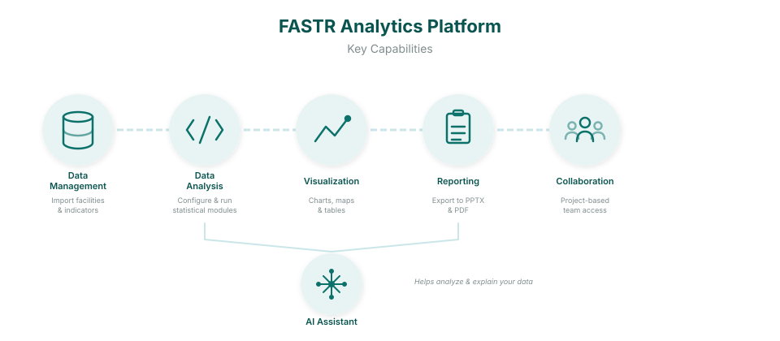

<!-- AUTO-TRANSLATED from 03_fastr_analytics_platform.md -->
<!-- REVIEWED: results-packages rewrite 2026-08-25 — keep in sync with EN by hand -->

# La plateforme d'analyse de données FASTR

## Présentation

La plateforme d'analyse FASTR est un outil en ligne conçu pour faciliter l'évaluation de la qualité, l'ajustement et l'analyse des données de santé courantes. Elle permet aux utilisateurs de télécharger et d'analyser des données provenant de diverses sources, notamment DHIS2, à l'aide de méthodes statistiques intégrées afin de générer un ensemble de données ajustées et d'effectuer des analyses prioritaires sur des indicateurs sélectionnés. La plateforme offre une interface conviviale pour effectuer des analyses et propose des options flexibles pour visualiser et exporter les résultats.

## Principales fonctionnalités

### Gestion des données

La plateforme offre des fonctionnalités complètes de gestion des données. Les utilisateurs peuvent importer et gérer les structures des établissements de santé, y compris les zones administratives et les établissements individuels. Le système prend en charge l’importation de données provenant des systèmes d’information de gestion de la santé (SIGS) et des évaluations des établissements de santé (EES), permettant ainsi aux utilisateurs de gérer des indicateurs provenant de multiples sources tout en assurant le suivi des versions des ensembles de données au fil du temps.

### Analyse des données

Les capacités d'analyse sont fournies par le biais de modules configurables. Les administrateurs sélectionnent et configurent les modules lors de la génération d'un **paquet de résultats** — un ensemble versionné de résultats calculés, produit au niveau de l'instance. Les modules traitent les données à l'aide de scripts statistiques basés sur R et peuvent être enchaînés pour prendre en charge des analyses complexes en plusieurs étapes, avec des outils intégrés permettant de surveiller l'état du traitement et de consulter les journaux. Tous les projets rattachés à un paquet lisent les mêmes résultats calculés.

### Assistant IA

Un assistant IA intégré aide les utilisateurs à comprendre et à interpréter leurs données. L'assistant peut expliquer les résultats des modules, décrire les tendances et les schémas des données, fournir des informations sur les visualisations et aider à générer du contenu narratif pour les rapports. Les utilisateurs peuvent poser des questions sur les données de leur projet en langage naturel et recevoir des conseils contextuels sur l'analyse et l'interprétation.

### Visualisation

La plateforme offre des outils de visualisation robustes pour présenter les résultats analytiques. Les utilisateurs peuvent créer des graphiques, des cartes et des tableaux à partir des données traitées, avec des options permettant de filtrer et de désagréger les données selon plusieurs dimensions. L'apparence et le style des visualisations peuvent être personnalisés, et celles-ci peuvent être exportées sous forme d'images ou de fichiers de données pour être utilisées dans des applications externes.

### Partage des résultats

Une fois que les utilisateurs ont créé des visualisations, la plateforme propose trois moyens de les partager, adaptés à différents publics :

- **Tableaux de bord** — des pages en temps réel et partageables qui regroupent les visualisations dans une vue unique. Les graphiques sont mis à jour à chaque actualisation des données, et le tableau de bord peut être publié via un lien public afin que les parties prenantes puissent l'ouvrir dans un navigateur sans compte FASTR.
- **Présentations** — des supports de type diaporama conçus pour les réunions et les ateliers en direct. Exportation vers PowerPoint ou PDF pour une présentation en personne.
- **Rapports** — documents narratifs détaillés combinant une analyse écrite et des chiffres en temps réel. Exportez-les au format Word ou PDF pour que les parties prenantes puissent lire le document dans son intégralité.

### Collaboration

La plateforme prend en charge le travail collaboratif grâce à une structure basée sur des projets. Les utilisateurs peuvent organiser leur travail en projets distincts et attribuer aux membres de l'équipe différents rôles, notamment des autorisations de consultation, d'édition et d'administration. Les contrôles d'accès s'appliquent au niveau du projet, et les projets peuvent être verrouillés pour empêcher toute modification involontaire.

## À qui s'adresse cette application ?

### Analystes de données

Les analystes de données trouveront cette plateforme utile pour analyser les tendances des données de santé, créer des visualisations et générer des rapports destinés aux décideurs. Les modules d'analyse et les outils de visualisation sont conçus pour prendre en charge des workflows d'analyse de données rigoureux.

### Responsables de programmes de santé

Les responsables de programmes de santé peuvent utiliser la plateforme pour surveiller les performances des programmes, suivre les indicateurs clés et partager des informations avec leurs équipes. La fonctionnalité de reporting permet une communication régulière des résultats afin de soutenir une gestion des programmes fondée sur des données factuelles.

### Administrateurs système

Les administrateurs système sont chargés de mettre en place la plateforme, de gérer les utilisateurs, d’importer des données et de configurer le système pour répondre aux besoins de l’organisation. Les outils d’administration permettent de contrôler l’accès des utilisateurs, les sources de données et les paramètres de la plateforme.

## Fonctionnement de l’application

### Niveau organisationnel (instance)

L'**instance** sert d'espace de travail principal de l'organisation au sein de la plateforme. Chaque instance contient tous les utilisateurs enregistrés, la structure administrative partagée (y compris les zones administratives et les établissements de santé), les définitions d'indicateurs partagées, les sources de données (à la fois SIGS et HFA) et tous les projets créés au sein de l'organisation.

### Niveau du projet

Les **projets** fournissent des espaces de travail d'édition ciblés au sein d'une instance. Chaque projet lit ses chiffres dans le **paquet de résultats** qui lui est rattaché — les projets ne traitent pas eux-mêmes les données. Au sein d'un projet, les utilisateurs créent des visualisations, des tableaux de bord, des présentations et des rapports adaptés à des objectifs analytiques spécifiques. La création d'un projet ne demande qu'un nom, et un projet peut être limité à une seule zone administrative.

### Flux de données

La plateforme suit un flux de données structuré : **Importation des données → Génération d'un paquet de résultats → Visualisations → Tableaux de bord, présentations et rapports**. Les administrateurs commencent par importer les données des établissements de santé au niveau de l'instance. Un paquet de résultats est ensuite généré : les modules analytiques sélectionnés traitent les données et enregistrent leurs résultats ensemble, sous forme de paquet versionné. Les projets rattachent un paquet — plusieurs projets peuvent lire le même — et transforment ses résultats en graphiques, cartes et tableaux. Les visualisations peuvent ensuite être assemblées dans des tableaux de bord pour un partage en direct, des présentations pour une diffusion en direct ou des rapports narratifs pour une diffusion écrite.

## Configuration technique requise

### Langues prises en charge

L'application prend actuellement en charge l'anglais et le français. Les paramètres linguistiques peuvent être configurés au niveau de l'instance afin de répondre aux besoins des différentes communautés d'utilisateurs.

### Configuration requise pour le navigateur

L'application est conçue pour fonctionner avec les navigateurs web modernes. Chrome est recommandé pour des performances optimales, bien que Firefox, Safari et Edge soient également pris en charge. JavaScript doit être activé pour bénéficier de toutes les fonctionnalités.

## Concepts de base

La compréhension de ces concepts fondamentaux aidera les utilisateurs à travailler efficacement avec l'application.

### Instance

Une **instance** est l'espace de travail principal de l'organisation au sein de la plateforme. Elle sert de conteneur de niveau supérieur pour tous les utilisateurs, la structure administrative partagée, les sources de données et les projets. Chaque organisation opère généralement au sein d'une seule instance qui sert de base à tous les travaux d'analyse.

### Projets

Un **projet** est un espace de travail d'édition ciblé au sein d'une instance. Chaque projet lit ses chiffres dans le paquet de résultats qui lui est rattaché. Au sein de chaque projet, les utilisateurs créent des visualisations, génèrent des rapports et collaborent avec les membres de l'équipe. Une instance peut contenir plusieurs projets, chacun avec sa propre configuration d'accès utilisateur — et, si besoin, limité à une seule zone administrative.

### Structure

La **structure** définit l'organisation hiérarchique des zones administratives et des établissements de santé au sein de la plateforme.

Les **zones administratives** représentent des limites géographiques organisées en quatre niveaux maximum. La zone administrative 1 représente les frontières nationales. La zone administrative 2 correspond aux plus grandes unités infranationales telles que les provinces ou les régions. La zone administrative 3 englobe les unités de niveau intermédiaire comme les districts ou les départements, tandis que la zone administrative 4 représente les unités plus petites telles que les communes ou les sous-districts. Toutes les instances ne nécessitent pas les quatre niveaux administratifs.

Les **établissements de santé** sont les points de prestation de soins de santé — notamment les hôpitaux, les cliniques et les postes de santé — qui sont liés aux zones administratives au sein de la structure. Les établissements peuvent présenter des attributs supplémentaires tels que le type d’établissement (hôpital, centre de santé ou dispensaire) et la catégorie de propriété (public, privé ou confessionnel).

### Sources de données

#### Données SIGS

Les données du Système d'information sur la gestion de la santé (SIGS) contiennent des statistiques de routine sur les services de santé collectées auprès des établissements. Cela inclut des indicateurs de prestation de services, des données de surveillance des maladies et des mesures de performance des programmes. Les données SIGS sont généralement communiquées sur une base mensuelle et constituent le fondement de la plupart des analyses de routine du système de santé.

#### Données HFA

Les données de l'évaluation des établissements de santé (HFA) contiennent des informations sur les caractéristiques et la capacité des établissements. Cela inclut des données sur la disponibilité des infrastructures, les équipements et les fournitures, les effectifs et l'état de préparation des services. Les données HFA complètent les données SIGS en fournissant un contexte sur les établissements à partir desquels les données de routine sont communiquées.

### Indicateurs

Les **indicateurs** sont des mesures de santé quantifiables utilisées au sein de la plateforme. Il en existe trois types :

- Les **indicateurs communs** sont définis et partagés à l’échelle de l’instance pour garantir la cohérence des mesures.
- Les **indicateurs DHIS2** sont importés depuis des systèmes DHIS2 externes et peuvent suivre des conventions de nommage ou des méthodes de calcul différentes.
- Les **indicateurs calculés** sont des mesures dérivées qui combinent deux valeurs — généralement un indicateur numérateur divisé par un dénominateur (un autre indicateur ou un chiffre basé sur la population). Par exemple, le nombre de consultations prénatales de premier trimestre (CPN1) divisé par la population cible de femmes enceintes donne une estimation de la couverture CPN1. Les indicateurs calculés peuvent être affichés sous forme de pourcentage, de nombre ou de taux pour 10 000, et ils prennent en charge des seuils de type « feu tricolore » pour une évaluation rapide des performances (par exemple, vert à 80 % ou plus, jaune entre 70 et 79 %, rouge en dessous de 70 %).

Les définitions des indicateurs calculés sont appliquées au moment de la génération d'un paquet de résultats ; une définition modifiée prend donc effet dans le paquet suivant. Les dénominateurs basés sur la population nécessitent le téléchargement d'un fichier CSV de population au niveau de l'instance avant de pouvoir être utilisés.

### Ensembles de données et versions

Un **ensemble de données** est un recueil de données de santé, qu'il s'agisse de données SIGS ou HFA. Chaque fois que des données sont importées dans la plateforme, une nouvelle version est créée. Ce système de gestion des versions permet aux utilisateurs de suivre les modifications au fil du temps, de basculer entre les versions si nécessaire et de conserver un historique complet des données à des fins d'audit et de comparaison.

### Modules

Les **modules** sont des unités de traitement des données qui exécutent des scripts R analytiques au sein de la plateforme. Chaque module utilise des données d'entrée provenant d'ensembles de données ou des résultats d'autres modules, traite et analyse les données selon des méthodes statistiques définies, et produit des objets de résultats sous forme de fichiers de sortie. Les modules peuvent être enchaînés pour prendre en charge des flux de travail analytiques complexes où un module utilise les résultats d'un autre comme données d'entrée.

Les modules sont sélectionnés et configurés dans l'assistant de génération des paquets de résultats, au niveau de l'instance. Certains modules ont des prérequis — d'autres modules dont ils utilisent les résultats — et la plateforme les ajoute automatiquement lorsqu'un module dépendant est sélectionné.

### Visualisations

Les **visualisations** sont des représentations visuelles des données générées à partir des résultats des modules. La plateforme prend en charge trois principaux types de visualisation : les graphiques (notamment les histogrammes, les graphiques linéaires et les diagrammes circulaires), les cartes (visualisations géographiques présentant les données par zone administrative) et les tableaux (affichages de données sous forme de tableaux).

Les visualisations peuvent être filtrées selon différentes dimensions et désagrégées en fonction de facteurs tels que le type d'établissement, la période ou le niveau administratif. Les utilisateurs peuvent personnaliser l'apparence et le style des visualisations, puis les exporter pour les utiliser dans des applications externes ou les inclure directement dans des tableaux de bord, des présentations ou des rapports.

### Tableaux de bord

Les **tableaux de bord** sont des pages en temps réel et partageables qui regroupent des visualisations enregistrées en une seule vue. Chaque vignette d'un tableau de bord est un graphique, une carte ou un tableau qui se met à jour automatiquement dès que les données sous-jacentes sont actualisées — ainsi, un tableau de bord affiche toujours l'état actuel des données sans qu'il soit nécessaire de les réexporter.

Les tableaux de bord peuvent être publiés à une URL publique (avec des contrôles d'accès facultatifs) afin que les parties prenantes puissent les ouvrir dans un navigateur sans avoir besoin d'un compte FASTR. Deux mises en page sont disponibles : une **grille** qui organise les vignettes en lignes et en colonnes, et une **barre latérale** qui organise les vignettes dans un menu de gauche pour la navigation.

Les tableaux de bord prennent également en charge les **groupes de réplicats** : une seule tuile peut contenir plusieurs variantes d’un même graphique (par exemple, une par district), avec un menu déroulant permettant à l’utilisateur de basculer entre elles. Cela permet de conserver un tableau de bord compact lorsque la même analyse doit être présentée pour plusieurs zones.

### Présentations

Les **présentations** sont des documents de type diaporama conçus pour des ateliers en direct ou des réunions avec les parties prenantes. L'éditeur organise un graphique, un titre ou un bloc de texte par diapositive, à l'instar de PowerPoint. Les présentations s'exportent au format PowerPoint (.pptx) ou PDF et conviennent particulièrement aux résultats qui seront projetés dans une salle pendant qu'une personne les commente devant l'auditoire.

### Rapports

Les **rapports** sont des documents narratifs détaillés qui combinent votre analyse écrite avec des chiffres en temps réel provenant de la plateforme. L'éditeur fonctionne comme un traitement de texte avec mise en forme Markdown : les utilisateurs rédigent des commentaires, intègrent des visualisations qui se mettent à jour automatiquement lorsque les données sont actualisées, et ajoutent des images statiques pour le contexte.

Les rapports s'exportent au format **Word (.docx) ou PDF** et sont conçus pour les parties prenantes qui lisent un document de bout en bout, plutôt que d'assister à une présentation. Utilisez une présentation lorsque le document sera projeté lors d'une réunion ; utilisez un rapport lorsque le document sera lu sur un bureau ou dans une boîte de réception.

### Paquets de résultats

Un **paquet de résultats** est un ensemble versionné de résultats calculés, généré au niveau de l'instance. Générer un paquet exécute les modules analytiques sélectionnés sur les jeux de données choisis et enregistre leurs résultats ensemble. Les projets ne traitent pas eux-mêmes les données : chaque projet rattache un paquet et y lit tous ses chiffres, de sorte que plusieurs projets peuvent travailler sur les mêmes résultats cohérents.

Un administrateur peut **épingler** un paquet comme référence de l'instance, et chaque projet peut être réglé pour toujours suivre le paquet épinglé. La mise à jour mensuelle de routine se résume alors à trois gestes : importer les nouvelles données, générer un paquet, l'épingler — les projets suivent.

### Désagrégation

**La désagrégation** désigne le processus consistant à décomposer les données par dimensions afin d’identifier des tendances et des variations. Les données peuvent être désagrégées par période (mensuelle, trimestrielle ou annuelle), par niveau de zone administrative, par type d’établissement, par propriété de l’établissement ou par catégories d’indicateurs. Cette fonctionnalité permet une analyse plus nuancée et aide à identifier les disparités entre les différentes dimensions.

### Rôles des utilisateurs

Différents rôles peuvent être attribués aux utilisateurs afin de déterminer leurs autorisations au sein de la plateforme. Au **niveau de l'instance**, les administrateurs globaux disposent d'un accès complet à tous les paramètres de l'instance et à tous les projets. Au **niveau du projet**, trois rôles sont disponibles : les administrateurs peuvent modifier les paramètres du projet, les modules, les visualisations et les rapports ; les éditeurs peuvent créer et modifier les visualisations et les rapports ; et les lecteurs peuvent consulter le contenu du projet mais ne peuvent pas y apporter de modifications.

### Scores de qualité des données

La plateforme évalue automatiquement l'exhaustivité et l'exactitude des données, générant des scores de qualité qui aident les utilisateurs à identifier les problèmes potentiels liés aux données. Ces scores facilitent les processus de contrôle de la qualité des données et aident à hiérarchiser les domaines nécessitant une attention particulière.

### Statut de verrouillage

Les projets peuvent être **verrouillés** afin d'empêcher toute modification tout en permettant aux utilisateurs de consulter les rapports. Lorsqu'un projet est verrouillé, ses visualisations et ses paramètres ne peuvent pas être modifiés, ce qui permet de préserver le travail une fois finalisé.

!!! conseil « Guide de l'utilisateur »
    Pour des tutoriels étape par étape sur l'utilisation de la plateforme, consultez le [guide de l'utilisateur FASTR](11_user_guide.md).

---

<!--
////////////////////////////////////////////////////////////////////
// //
//   _____ _     _____ ____  _____    ____ ___  _   _ _____ _   _ //
//  / ____| |   |_   _|  _ \| ____|  / ___/ _ \| \ | |_   _| \ | |//
//  | (___ | |     | | | | | | |__   | |  | | | |  \| | | | |  \| |//
//   \___ \| |     | | | | | |  __|  | |  | | | | . ` | | | | . ` |//
//   ____) | |___ _| |_| |_| | |____ | |__| |_| | |\  | | | | |\  |//
//  |_____/|_____|_____|____/|______| \____\___/|_| \_| |_| |_| \_|//
// //
// Modifier les diapositives de l'atelier sous cette ligne //
// //
////////////////////////////////////////////////////////////////////
-->

<!-- SLIDE:m3_1 -->
## Plateforme d'analyse FASTR

La **plateforme d'analyse FASTR** est un outil en ligne conçu pour faciliter l'évaluation de la qualité, l'ajustement et l'analyse des données de santé courantes.

Elle permet aux utilisateurs de télécharger et d'analyser des données provenant de diverses sources, y compris DHIS2, grâce à des méthodes statistiques intégrées permettant de générer un ensemble de données ajustées et d'effectuer des analyses prioritaires sur des indicateurs sélectionnés.

La plateforme offre une interface conviviale pour effectuer des analyses et propose des options flexibles pour visualiser et exporter les résultats.

  

<!-- /SLIDE -->

<!-- SLIDE:m3_1b -->
## Capacités de la plateforme

**Gestion des données** — Importez des listes d'établissements et des données d'indicateurs depuis DHIS2 ou des fichiers

**Analyse des données** — Modules statistiques intégrés pour l'évaluation de la qualité, l'ajustement et la couverture

**Visualisation** — Explorez les résultats à l'aide de graphiques et de tableaux interactifs

**Partage des résultats** — Créez des tableaux de bord en temps réel, des présentations PowerPoint ou des rapports narratifs à l'intention des parties prenantes

**Collaboration** — Travaillez avec votre équipe sur des projets communs

**Assistant IA** — Bénéficiez d'une aide pour interpréter les résultats et comprendre vos données

<!-- /SLIDE -->

<!-- SLIDE:m3_2a -->
## Instance nationale

Chaque pays dispose de sa propre **instance** de la plateforme d'analyse FASTR.

Une instance contient :

- Tous les utilisateurs enregistrés et leurs comptes
- La structure administrative partagée (régions, districts, établissements)
- Les définitions des indicateurs et les sources de données
- Les paquets de résultats — les analyses calculées que lisent les projets
- Tous les projets créés pour ce pays

**Considérez une instance comme l'espace de travail dédié à votre pays.**
<!-- /SLIDE -->

<!-- SLIDE:m3_2b -->
## Rôles et autorisations des utilisateurs

Il existe deux niveaux d'autorisations sur la plateforme :

&nbsp;

**Rôles au niveau de l'instance :**

- **Les administrateurs d'instance** peuvent ajouter des utilisateurs, créer des projets, attribuer des rôles, importer des données et générer des paquets de résultats

&nbsp;

**Rôles au niveau du projet :**

- **Les éditeurs de projet** peuvent créer des visualisations, générer des rapports et télécharger/exporter les résultats
- **Les lecteurs de projet** peuvent consulter les visualisations, consulter les rapports et télécharger/exporter les résultats

&nbsp;

*Les administrateurs sont affectés par instance ; les éditeurs et les lecteurs sont affectés par projet.*
<!-- /SLIDE -->

<!-- SLIDE:m3_2c -->
## Projets au sein d'une instance

Chaque instance de pays peut contenir **plusieurs projets**.

Un pays peut n'avoir besoin que d'un seul projet, ou plusieurs projets peuvent être utilisés pour :

- Différentes versions d'analyses
- Un projet de démonstration ou d'expérimentation
- Des projets distincts pour différentes équipes ou différents programmes

**Questions clés lors de la configuration :**

- Qui est l'administrateur ?
- Qui peut modifier ?
- Qui peut consulter ?

<!-- /SLIDE -->

---

**Contact** : <FASTR@worldbank.org>
