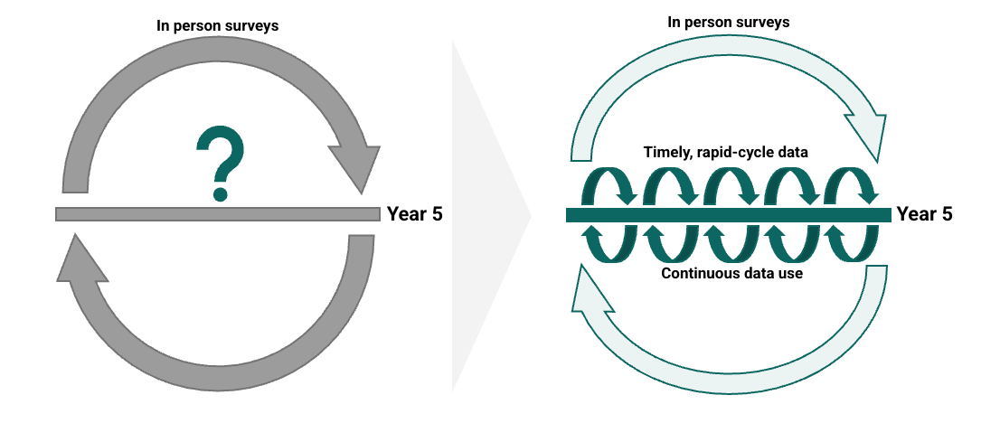

<!-- AUTO-TRANSLATED from 00_introduction.md -->
<!-- Add REVIEWED marker after human review to protect from overwrite -->

# Monitorização da utilização dos serviços do FASTR RMNCAH-N: Documentação metodológica

## Introdução ao FASTR

O Fundo de Financiamento Global (GFF) apoia os esforços liderados pelos países para melhorar a produção e utilização atempada de dados para a tomada de decisões, conduzindo, em última análise, a sistemas de cuidados de saúde primários (CSP) mais fortes e a melhores resultados em termos de saúde e nutrição reprodutiva, materna, neonatal, infantil e dos adolescentes (SRMNIA-N). Este conjunto de iniciativas e de apoio técnico é designado por **Frequent Assessments and System Tools for Resilience (FASTR)**.

O FASTR engloba quatro abordagens técnicas: (1) monitorização da utilização dos serviços da RMNCAH-N utilizando dados de rotina do sistema de informação de gestão da saúde (HMIS), (2) inquéritos telefónicos de ciclo rápido nas unidades de saúde, (3) inquéritos telefónicos de alta frequência aos agregados familiares e (4) análises de acompanhamento. **Esta documentação metodológica centra-se especificamente na primeira abordagem: Monitorização da utilização dos serviços da RMNCAH-N.**

## Monitorização da utilização de serviços RMNCAH-N

O GFF colabora com os Ministérios da Saúde para efetuar análises de ciclo rápido dos dados de rotina do HMIS. Esta abordagem aborda três objectivos principais:

1. **Avaliar a qualidade dos dados** a nível nacional e subnacional para identificar e resolver problemas de integridade, precisão e consistência
2. **Acompanhar as mudanças na utilização de serviços** medindo as mudanças mensais nos volumes de serviços de saúde prioritários da RMNCAH-N
3. **Monitorizar o progresso da cobertura**, comparando as tendências de prestação de serviços com os objectivos e referências específicos do país

Estas análises centram-se em indicadores prioritários ligados às reformas nacionais da saúde e aos investimentos do Banco Mundial, com resultados que informam os processos de planeamento nacional e os ciclos de implementação de projectos. Durante a pandemia da COVID-19, o GFF apoiou os Ministérios da Saúde em mais de 20 países para monitorizar o impacto da pandemia nos serviços de saúde essenciais utilizando esta abordagem.

passos para implementar a monitorização da utilização dos serviços RMNCAH-N (resources/diagrams_pt/steps_to_implement_rmncahn_service_chart.svg)

*Figura 1. Passos para implementar a monitorização da utilização dos serviços da RMNCAH-N*

### Porquê a análise de ciclo rápido?

As fontes de dados dos sistemas de saúde existentes são essenciais, mas muitas vezes apresentam desafios que limitam a sua utilização. Os dados do HMIS podem não ser analisados prontamente ou podem ser considerados de qualidade demasiado baixa para serem utilizados na tomada de decisões. Os inquéritos tradicionais presenciais aos agregados familiares e às unidades sanitárias exigem recursos e tempo consideráveis, com grandes desfasamentos entre a conceção do inquérito, a recolha de dados e a disponibilidade dos resultados. Este facto impede os decisores de utilizarem os dados para promover melhorias significativas nos resultados de saúde. Para colmatar esta lacuna, o GFF apoia os países no desenvolvimento e utilização de abordagens analíticas de ciclo rápido.

---

### Como é que funciona?

As abordagens analíticas de ciclo rápido fornecem dados atempados, rigorosos e de alta prioridade que respondem às prioridades específicas de cada país e às necessidades de utilização de dados. Este ciclo contínuo de analisar-aprender-reforçar-agir procura melhorar a utilização sistemática de dados para a tomada de decisões com vista a melhorar os resultados da RMNCAH-N.

quadro analítico de ciclo rápido FASTR que mostra o ciclo contínuo de analisar, aprender, reforçar e atuar](resources/diagrams_pt/FASTR_rapid_cycle_analytics_approach.svg)

*Figura 2. Abordagem analítica de ciclo rápido do FASTR: Analisar, aprender, reforçar, atuar*

### Abordagens técnicas

As quatro abordagens técnicas do FASTR, sustentadas pelo reforço das capacidades e pelo apoio à utilização de dados, permitem aos países utilizar a análise de ciclo rápido para reforçar os sistemas de CSP e melhorar os resultados da RMNCAH-N através da análise e utilização atempada e de alta frequência dos dados.

1. **A análise dos dados de rotina do HMIS** avalia a qualidade dos dados, quantifica as alterações nos volumes dos serviços de saúde prioritários e compara as tendências da cobertura dos serviços com os objectivos nacionais para os indicadores prioritários da RMNCAH-N.

2. **Inquéritos telefónicos de ciclo rápido a unidades de saúde** avaliam o desempenho das unidades de CSP, monitorizam a implementação de reformas, identificam o impacto de choques e acompanham as mudanças ao longo do tempo. O inquérito telefónico é administrado a um painel representativo de amostragem de PHCs durante quatro contactos trimestrais por ano.

3. **Os inquéritos telefónicos de alta frequência aos agregados familiares** fornecem uma imagem instantânea do comportamento de procura de cuidados, dos cuidados renunciados, da proteção financeira, da cobertura dos serviços e da experiência de cuidados dos pacientes. Os inquéritos aos agregados familiares são atualmente realizados em parceria com o Living Standards Measurement Study do Banco Mundial.

4. **As análises de acompanhamento** empregam abordagens de análise de causas profundas e de investigação de implementação para proporcionar uma compreensão mais profunda das questões reveladas pela análise de ciclo rápido (por exemplo, explicar a variação de desempenho a nível distrital, contextualizar o impacto das reformas dos sistemas de saúde ou investigar as causas subjacentes aos problemas de qualidade dos dados e às interrupções na prestação de serviços).

As actividades ilustrativas de desenvolvimento de capacidades incluem apoio para automatizar a extração, limpeza e análise de dados de rotina e apoio para institucionalizar abordagens de recolha e análise de dados de inquéritos telefónicos rápidos. O apoio à utilização de dados dá prioridade à integração da análise de ciclo rápido nos mecanismos de revisão e feedback de dados existentes a nível nacional e subnacional para reforçar a utilização sistemática de dados para a tomada de decisões.

análise de ciclo rápido no âmbito da iniciativa Avaliações Frequentes e Ferramentas de Sistema para a Resiliência (FASTR)](resources/diagrams_pt/Technical_approaches_image.svg)

*Figura 3. Análise de ciclo rápido no âmbito da iniciativa Avaliações Frequentes e Ferramentas de Sistema para a Resiliência (FASTR)*

### Como é que os países utilizam a FASTR?

A FASTR foi concebida para apoiar questões políticas definidas pelo país utilizando dados de rotina e de inquéritos. Diferentes países entram no FASTR por diferentes vias, dependendo das suas prioridades. Alguns países - como a Serra Leoa, o Burkina Faso, a Zâmbia e a Libéria - começaram com a monitorização da continuidade dos serviços, desencadeada por alterações no financiamento externo do sector da saúde. Outros - como a Nigéria, o Gana e a RDC - iniciaram o FASTR para responder a diferentes questões prioritárias, com a análise de perturbações como trabalho complementar.

Independentemente do ponto de entrada, o FASTR permite aos países monitorizar a continuidade e a recuperação dos serviços, identificar desafios geográficos ou específicos dos serviços e informar a definição de prioridades, o planeamento e o diálogo político.

### Da análise à ação

Os resultados do FASTR - quer sejam pontuações DQA, tendências de utilização de serviços ou estimativas de cobertura - são pontos de partida, não pontos finais. Cada resultado desencadeia um ciclo de investigação e ação: os resultados levantam questões, as questões levam à investigação, a investigação produz contexto e o contexto informa as decisões. O FASTR fornece as provas; as partes interessadas fornecem o contexto, a avaliação e a ação.

## Acrónimos e abreviaturas

| Acrónimo | Definição |
|---------|------------|
| ***Programas e organizações*** |
**DHS** | Programa de Inquéritos Demográficos e de Saúde (DHS)
| **FASTR** | Avaliações Frequentes e Ferramentas de Sistema para Resiliência |
| Fundo de Financiamento Global
| Inquéritos de Indicadores Múltiplos (MICS)
ministério da Saúde | **MoH** | Ministério da Saúde |
| ONU** | Nações Unidas
| ***Sistemas e fontes de dados*** | |
| **DHIS2** | DHIS2 (também designado por DHIS 2, anteriormente District Health Information Software) | |
**HMIS** | Sistema de informação de gestão da saúde
| **WPP** | Perspectivas da população mundial |
| ***Indicadores e serviços de saúde*** | |
| Cuidados pré-natais
| Bacillus Calmette-Guérin (vacina contra a tuberculose)
| Vacina contra o sarampo
| Departamento Ambulatório
| Vacina pentavalente (difteria, tétano, tosse convulsa, hepatite B, Haemophilus influenzae tipo b)
| Cuidados de saúde primários
| Saúde Reprodutiva, Materna, Neonatal, Infantil e do Adolescente e Nutrição
**SBA** | Parteira Qualificada |
| ***Termos técnicos e estatísticos*** |
**DQA** | Avaliação da qualidade dos dados
| Median Absolute Deviation (Desvio Absoluto da Mediana)
| | ***Geográfico*** | |
país de rendimento baixo e médio | **LMIC** | País de rendimento baixo e médio |
**SSA** | África Subsaariana |

## Utilização de dados do sistema de informação de gestão da saúde de rotina em LMIC

Os dados dos estabelecimentos de saúde recolhidos através de HMIS de rotina constituem uma fonte de dados primária para avaliar o desempenho do sector da saúde. Os dados do HMIS são amplamente utilizados para uma variedade de propósitos, incluindo análises do sector da saúde, planeamento e atribuição de recursos, monitorização de programas, melhoria da qualidade dos cuidados de saúde e relatórios. Os Ministérios da Saúde dos países de baixo e médio rendimento (PRMI) estão a esforçar-se por garantir um acesso equitativo a serviços e cuidados de saúde de qualidade, com vista a alcançar a cobertura universal de saúde e outras estratégias nacionais. Os esforços podem ser mais bem sucedidos se a tomada de decisões a todos os níveis do sector for bem informada por dados atempados, fiáveis e abrangentes recolhidos através de um sistema de informação sanitária bem estabelecido. As boas decisões baseiam-se em dados fiáveis; por conseguinte, é essencial garantir que os dados sejam de boa qualidade.

Os dados de má qualidade têm um impacto diferente a vários níveis do sistema de saúde. Para os gestores de programas, dados inexactos podem levar a más decisões que prejudicam as operações do programa e, em última análise, a saúde da população. Ao nível do planeamento, os dados de má qualidade podem distorcer as provas de progresso em relação aos objectivos do sector da saúde e dificultar os processos de planeamento anual, fornecendo resultados enganadores. Além disso, ao determinar os investimentos no sector da saúde, os dados de má qualidade podem levar a uma má orientação dos recursos. Apesar de os dados do HMIS serem cruciais para sistemas de saúde robustos, os estudos na África Subsariana (ASS) relataram desafios com a qualidade dos dados, incluindo problemas com a exaustividade, atualidade, precisão e consistência [@abouzahr2005; @mavimbe2005; @sychareun2014; @mutale2013; @amoakoh2015; @gimbel2011; @teklegiorgis2016; @rowe2009potential; @belay2013; @moukenet2021]. Estas preocupações sobre a qualidade da informação de rotina têm prejudicado a sua utilização na tomada de decisões no sector da saúde [@mutale2013; @belay2013; @xiao2017; @ohagan2017; @chen2014; @glele2014; @bhattacharya2019; @nshimyiryo2020; @ouedraogo2019; @endriyas2019; @mwangu2005; @rowe2009caution]. No entanto, nos últimos anos, os países registaram melhorias substanciais na qualidade dos dados do HMIS, que foram reforçadas por um sistema de avaliação da qualidade dos dados, de melhoria da qualidade dos dados e de utilização dos dados para a tomada de decisões com base em provas [@nisingizwe2014; @wagenaar2015; @mphatswe2012].

## Definição da qualidade dos dados

A definição da qualidade dos dados é complexa e, embora não exista uma definição única de qualidade dos dados, há quatro dimensões mais frequentemente utilizadas para a descrever: exaustividade, atualidade, consistência e precisão [@who2017dqa].

### Dimensões e avaliação da qualidade dos dados

| Domínio da qualidade dos dados** | O que é que mede? | Como é avaliada?
|------------------------|---------------------------|-------------------------|
| Integralidade** | Todos os dados estão presentes? Existe informação suficiente disponível para tomar decisões sobre a saúde da população e para direcionar recursos para melhorar a cobertura, a eficiência e a qualidade do sistema de saúde? | - Avaliada medindo se todas as unidades que devem apresentar relatórios o fazem de facto (**completude dos relatórios**)  - Avaliada medindo a exaustividade dos dados dos indicadores (sem valores em falta); isto é diferente da exaustividade global dos relatórios, na medida em que analisa a exaustividade de elementos de dados específicos e não apenas a receção do formulário de relatório mensal (**completude dos indicadores**)
| Pontualidade** | Os dados são regularmente apresentados a tempo? | Avaliado medindo se as unidades que apresentaram relatórios o fizeram antes de um prazo estabelecido (**oportunidade**)
| Consistência** | Os dados são plausíveis tendo em conta o que foi anteriormente comunicado? | As tendências são avaliadas para determinar se os valores comunicados são extremos em relação a outros valores comunicados durante o ano ou ao longo de vários anos (**presença de valores anómalos**)  - Avaliar as tendências dos indicadores do programa para determinar se os valores comunicados são extremos em relação a outros valores comunicados durante o ano ou ao longo de vários anos (**consistência ao longo do tempo**)  - Avaliar os indicadores do programa que têm uma relação previsível para determinar se existe a relação esperada entre esses 2 indicadores (**consistência entre indicadores relacionados**)  - Avaliar o nível de concordância entre duas fontes de dados que medem o mesmo indicador de saúde; as duas fontes de dados normalmente comparadas são os dados que circulam no HMIS e os dados de um inquérito periódico de base populacional (**comparação externa com outras fontes de dados**)  - Determinar a adequação dos dados populacionais utilizados na avaliação do desempenho dos indicadores de saúde, comparando duas fontes diferentes de estimativas populacionais relacionadas para verificar a congruência (**consistência dos dados populacionais**) |
| Os dados reflectem fielmente o nível real da prestação de serviços realizada na unidade de saúde? | Avaliar a exatidão dos indicadores selecionados através da análise dos documentos de origem nas unidades de saúde e da comparação com os relatórios mensais e os valores do HMIS (**consistência dos dados comunicados e dos registos originais, fator de verificação dos dados**) |

## Abordagem FASTR para a análise de dados de rotina

A abordagem FASTR à análise de dados de rotina adopta uma abordagem em três vertentes:

1. **Identificar problemas na qualidade dos dados**
2. **Ajustar os problemas com a qualidade dos dados** para melhorar a exatidão da análise
3. **Analisar os dados para responder a questões políticas prementes específicas do país**, incluindo a identificação de alterações nos volumes de serviços prioritários e tendências na cobertura de serviços em comparação com as prioridades e objectivos do país

Esta abordagem permite identificar os problemas de qualidade dos dados com maior prioridade e os subsequentes ajustamentos analíticos necessários para que os dados possam ser continuamente melhorados enquanto se efectuam as análises adequadas. A avaliação da qualidade dos dados é efectuada por indicador e pode ser desagregada a nível subnacional, uma vez que os dados a nível dos estabelecimentos são utilizados para a análise. Isto é importante para gerar relatórios regulares relevantes para as políticas sobre a qualidade dos dados, o volume de serviços e as estimativas de cobertura, que fornecem um retrato contínuo da utilização dos serviços da RMNCAH-N.

---

### Concentrar-se num conjunto de indicadores principais

A abordagem do FASTR à análise de dados de rotina centra-se num conjunto central de indicadores RMNCAH-N que caracterizam o continuum dos cuidados de saúde reprodutivos, maternos e infantis, áreas de saúde prioritárias nos países de baixa e média renda. Estes indicadores captam os principais eventos de prestação de serviços, que têm taxas de integralidade mais elevadas e maior volume. Além disso, estes indicadores servem como indicadores de outros serviços e intervenções prestados no mesmo contacto de serviço. Além disso, as consultas externas (OPD) são utilizadas como indicador da utilização geral dos serviços de saúde. Podem ser acrescentados à análise indicadores adicionais, específicos de cada país e de cada programa, para responder às prioridades nacionais.

---

### Concentrar-se num conjunto de métricas de qualidade de dados essenciais

A abordagem FASTR à análise de dados de rotina centra-se num conjunto central de métricas de qualidade de dados que permite a identificação dos problemas de qualidade de dados de maior prioridade para os quais podem ser feitos ajustamentos de qualidade de dados. Para além das principais medidas de qualidade dos dados, a abordagem FASTR gera uma pontuação global de qualidade dos dados que combina as principais métricas numa única medida de resumo.

## Comunicação dos resultados e utilização dos dados

Durante a pandemia da COVID-19, o GFF apoiou os Ministérios da Saúde em mais de 20 países para monitorizar o impacto da pandemia nos serviços essenciais de saúde.

- **Relatório**: [COVID-19: Impacto nos Serviços de Saúde Essenciais] (https://www.globalfinancingfacility.org/sites/gff_new/files/documents/GFF-IG13-2-COVID-19-Essential-Health-Services.pdf)
- **Artigo**: [Utilização dos cuidados de saúde e mortalidade materna e infantil durante a pandemia de COVID-19 em 18 países de baixo e médio rendimento](https://journals.plos.org/plosmedicine/article?id=10.1371/journal.pmed.1004070)
- **Artigo**: [Utilização da vacinação e desigualdades subnacionais durante a pandemia de COVID-19](https://www.mdpi.com/2076-393X/11/9/1415)
- **Artigo**: [Perturbações na utilização dos serviços de saúde materna e infantil durante a COVID-19: análise de oito países da África Subsariana](https://academic.oup.com/heapol/article/36/7/1140/6306443)

Mais resultados e relatórios podem ser encontrados no [Repositório de Recursos FASTR](https://data.gffportal.org/key-theme/FASTR/resource-repository/index.php/home).

## O que esta documentação cobre

Esta documentação metodológica descreve a abordagem completa do FASTR à análise de dados de rotina do HMIS, desde o planeamento inicial até à comunicação dos resultados.

### Planeamento e preparação

- [**Identificar perguntas e indicadores**](01_identify_questions_indicators.md) - Definir as perguntas prioritárias e selecionar os indicadores principais para a implementação do FASTR
- [**Extração de dados**](02_data_extraction.md) - Extrair e preparar os dados HMIS do DHIS2 para análise
- [A plataforma de análise de dados FASTR**](03_fastr_analytics_platform.md) - Utilização da plataforma para análise e visualização automatizadas

### Módulos de análise (plataforma FASTR)

A plataforma de análise FASTR inclui cinco módulos automatizados:

- [**Avaliação da qualidade dos dados**](04_data_quality_assessment.md) - Módulo 1 da plataforma. Avaliação da qualidade dos dados do HMIS através de métricas de exaustividade, deteção de anomalias e consistência
- [**Ajuste da qualidade dos dados**](05_data_quality_adjustment.md) - Módulo 2 na plataforma. Técnicas para melhorar a exatidão dos dados, ajustando os valores anómalos e os relatórios incompletos
- [Análise da utilização de serviços**](06a_service_utilization.md) - Módulo 3 da plataforma. Análise dos padrões de utilização dos serviços de saúde para detetar e quantificar perturbações
- [Estimativas de cobertura**](06b_coverage_estimates.md) - Módulos 5 e 6 da plataforma (Parte 1: cálculo do denominador, Parte 2: estimativa de cobertura). Métodos para estimar a cobertura dos serviços e comparar as tendências com os objectivos nacionais

## Referências

\full_bibliography

---

<!--
////////////////////////////////////////////////////////////////////
// //
// _____ _ _____ ____ _____ ____ ___ _ _ _____ _ _ //
// / ____| | |_ _| _ \| ____| / ___/ _ \| \ | |_ _| \ | |//
// | (___ | | | | | | | | |__ | | | | | | \| | | | | \| |//
// \___ \| | | | | | | | | | | __| | | | | | | . ` | | | | . ` |//
// ____) | |___ _| |_| |_| | |____ | |__| |_| | |\ | | | | |\ |//
// |_____/|_____|_____|____/|______| \____\___/|_| \_|| |_| |_| \_|//
// //
// Editar os diapositivos do workshop abaixo desta linha //
// //
////////////////////////////////////////////////////////////////////
-->

<!-- SLIDE:m0_1 -->
## O que é FASTR?

**Avaliações Frequentes e Ferramentas de Sistema para Resiliência**

O GFF apoia os esforços liderados pelos países para melhorar a produção e utilização atempada de dados para a tomada de decisões. Este conjunto de iniciativas e apoio técnico é designado por **FASTR**.

O FASTR assenta em quatro pilares complementares, sustentados pelo reforço de capacidades e pelo apoio à utilização de dados.

<!--
NOTAS DO APRESENTADOR:
- Ler o acrónimo em voz alta. A maioria dos participantes nunca terá ouvido antes a expressão "Avaliações Frequentes e Ferramentas de Sistema para a Resiliência", e as próprias palavras explicam o que é o FASTR.
- O parágrafo de abertura é a redação oficial do GFF. Mantenha-o quase na íntegra.
- A linha de quatro pilares na parte inferior é um ponteiro para o slide 4. Não enumerar os pilares aqui; o diapositivo dedicado faz isso.
- Se for perguntado o que torna o FASTR diferente da análise HMIS existente: é a combinação de ciclos atempados, múltiplos métodos complementares e apoio à capacidade incorporada, e não uma técnica única.
-->
<!-- /SLIDE -->

<!-- SLIDE:m0_2 -->
## O que estamos a tentar alcançar?

A análise de ciclo rápido acelera o progresso dos resultados da RMNCAH-N ao reforçar a disponibilidade e a utilização sistemática e atempada de dados para a tomada de decisões.

<!--
NOTAS DO APRESENTADOR:
- O objetivo deste diapositivo é a lacuna. Os dados de rotina do HMIS estão disponíveis agora; os inquéritos presenciais aos agregados familiares e às instalações chegam de cinco em cinco anos. As decisões não podem esperar pelo próximo inquérito.
- o objetivo é a "utilização sistemática e atempada dos dados". Oportuno é a parte mais fácil. Sistemático significa que a revisão dos dados passa a fazer parte da rotina, não é algo pontual.
- O diagrama contrasta o modelo só de inquéritos (um ponto de interrogação nos anos entre inquéritos) com o modelo FASTR (dados contínuos e atempados a par dos inquéritos).
- Se for perguntado se o FASTR substitui os inquéritos: não. O FASTR preenche os anos entre eles e utiliza os dados dos inquéritos quando estes chegam.
-->
<!-- /SLIDE -->

<!-- SLIDE:m0_3 -->
## Uma abordagem: analisar, aprender, reforçar, agir

O FASTR catalisa ciclos contínuos de análise, aprendizagem, fortalecimento do sistema e ação, para que os dados oportunos orientem a tomada de decisões a todos os níveis.

<!--
NOTAS DO APRESENTADOR:
- Percorra o ciclo em voz alta: analise os dados, aprenda o que eles lhe dizem, fortaleça o sistema com base no que você aprendeu, aja de acordo com as prioridades e, em seguida, volte a analisar novamente.
- Sublinhe que isto é contínuo, não é uma coisa só. Cada volta do ciclo deve deixar tanto o sistema de dados como as decisões um pouco melhor do que a anterior.
- Um único relatório FASTR não faz a diferença. O ciclo sim. É por isso que "sistemático" é tão importante como "atempado".
- Se me perguntarem qual é a etapa mais importante: as quatro. Saltar o "reforço" é o modo de fracasso mais comum; a análise é feita mas o sistema nunca melhora.
-->
<!-- /SLIDE -->

<!-- SLIDE:m0_4 -->
## Quatro pilares complementares

O FASTR é uma abordagem integrada baseada em quatro métodos rigorosos, rápidos e de baixo custo para monitorizar os sistemas de cuidados de saúde primários, sustentados pelo reforço de capacidades e apoio à utilização de dados adaptados às necessidades do país.

<!--
NOTAS DO APRESENTADOR:
- Cada pilar é um método. Foram concebidos para se complementarem uns aos outros, não para se duplicarem.
- A monitorização da utilização de serviços do HMIS é o cavalo de batalha. Funciona de forma rotineira e abrange todos os locais com instalações de informação. Este é o pilar em que o workshop se concentra.
- Os outros três acrescentam profundidade onde o HMIS não consegue chegar: inquéritos telefónicos aos estabelecimentos para acompanhamento da preparação e da reforma, inquéritos aos agregados familiares e aos clientes para o lado da procura (procura de cuidados, cuidados abandonados, experiência) e análises de acompanhamento para as causas profundas.
- O reforço das capacidades e o apoio à utilização dos dados são a banda subjacente a todos os quatro. Sem ele, os resultados analíticos não são utilizados.
- Tornar explícito: este seminário ensina o primeiro pilar. Os outros três são introduzidos no contexto para que os participantes saibam qual é a oferta mais alargada do FASTR.
-->
<!-- /SLIDE -->

<!-- SLIDE:m0_5 -->
## Como é que os países usam o FASTR?

O FASTR apoia questões políticas definidas pelo país utilizando dados de rotina e de inquéritos. Os países entram através de diferentes vias, dependendo das suas prioridades.

- **A monitorização da rutura de serviços** foi o ponto de partida para a Serra Leoa, Burkina Faso, Zâmbia e Libéria, desencadeada por alterações no financiamento externo.
- **Outras prioridades analíticas** levaram a Nigéria, o Gana e a RDC a entrar primeiro no FASTR, tendo a análise de perturbações sido acrescentada como trabalho complementar.

Em todos os casos, o FASTR permite aos países

- Acompanhar a continuidade e a recuperação dos serviços
- Identificar disparidades geográficas ou específicas dos serviços
- Informar o planeamento, a definição de prioridades e o diálogo político

<!--
NOTAS DO APRESENTADOR:
- Diferentes pontos de entrada, a mesma metodologia subjacente. A equipa do país decide quais as questões políticas importantes; os métodos FASTR adaptam-se a essas questões.
- A monitorização das perturbações é um ponto de entrada, não a oferta completa. Alguns países utilizam-no devido a alterações no financiamento externo; outros utilizam-no por outras razões.
- Os quatro pilares aplicam-se a todos os casos de utilização. Um país pode executar o pilar HMIS sem um inquérito aos agregados familiares, ou vice-versa.
- Os três pontos "em todos os casos" são a linha direta. Qualquer que seja o ponto de entrada, o FASTR acaba por servir o acompanhamento da continuidade, a identificação de disparidades e o diálogo de planeamento.
-->
<!-- /SLIDE -->

<!-- SLIDE:m0_6 -->
## Qual é a abordagem do FASTR à monitorização da utilização dos serviços da RMNCAH-N?

Análises trimestrais dos dados do DHIS2, com foco em indicadores nacionais priorizados.

Construir ferramentas sustentáveis para que as partes interessadas que precisam de usar os dados possam gerar as análises e visualizações corretas, no momento certo, sobre os seus indicadores de interesse.

Combinar a análise e a visualização com o reforço de capacidades e o apoio à utilização de dados para a sustentabilidade e a institucionalização.

<!--
NOTAS DO APRESENTADOR:
- Esta é a metodologia que este workshop ensina. Os outros três pilares no slide anterior são introduzidos para o contexto; este é a essência dos próximos seis módulos.
- Cadência trimestral, indicadores prioritários, ferramentas sustentáveis: esses três pontos são o modelo operacional.
- O diagrama à direita é o percurso para o resto do workshop. Identificar questões, extrair dados, avaliar a qualidade, ajustar os problemas de qualidade, analisar, comunicar. Cada etapa tem o seu próprio módulo.
- Evite aprofundar-se aqui. Aponte para o diagrama e diga "este é o resto da oficina".
- Se lhe perguntarem porquê trimestral: corresponde ao ciclo de decisão típico dos distritos e ministérios. É possível ser mais rápido, mas raramente é útil; ser mais lento não serve para nada.
-->
<!-- /SLIDE -->

<!-- SLIDE:m0_7 -->
## Da análise à ação

Os resultados do FASTR, quer sejam pontuações DQA, tendências de utilização de serviços ou estimativas de cobertura, são **pontos de partida, não pontos finais**. Desencadeiam a investigação e informam as decisões.

<!--
NOTAS DO APRESENTADOR:
- Este ciclo aplica-se a todos os resultados do FASTR, não apenas às interrupções.
- As conclusões do DQA levam a uma investigação dos sistemas de dados e a melhorias nos relatórios.
- As mudanças na utilização levam à investigação da prestação de serviços e à resolução de estrangulamentos.
- As lacunas de cobertura levam a uma investigação das barreiras de acesso e a intervenções direcionadas.
- O FASTR fornece as provas; as partes interessadas fornecem o contexto, a avaliação e a ação.
-->
<!-- /SLIDE -->

---

**Contacto**: <fastr@worldbank.org>
