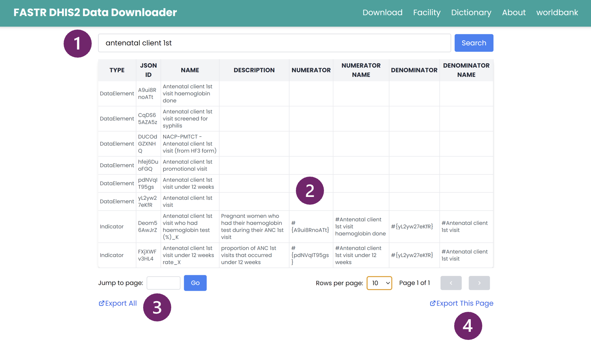
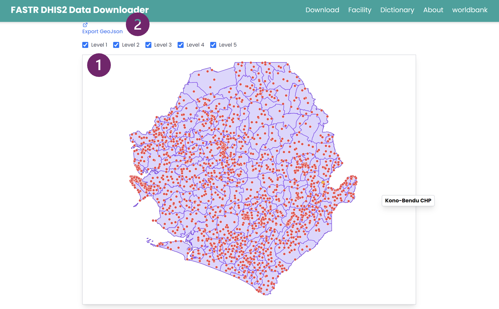

<!-- AUTO-TRANSLATED from 02_data_extraction.md -->
<!-- Add REVIEWED marker after human review to protect from overwrite -->

# Extração de dados

**Nota:** O conteúdo desta secção baseia-se nos materiais de apresentação da FASTR e está sujeito a revisão.

## Visão geral

Esta secção descreve a fundamentação, os requisitos e as práticas recomendadas para a extração de dados de prestação de serviços de rotina do DHIS2 para utilização no pipeline analítico FASTR.

### Porquê extrair dados do DHIS2?

**Ajuste da qualidade dos dados**

A abordagem FASTR dá prioridade ao ajustamento sistemático da qualidade dos dados para permitir uma utilização mais rigorosa dos dados de rotina do DHIS2 e para gerar estimativas analiticamente robustas e relevantes para as políticas. A metodologia inclui procedimentos padronizados para:

- Identificar e ajustar os valores anómalos
- Ajustar os relatórios incompletos
- Aplicar métricas de qualidade de dados consistentes em todos os indicadores e instalações

Estes procedimentos exigem operações de processamento de dados e estatísticas que não podem ser implementadas no ambiente analítico nativo do DHIS2.

**Complexidade da análise

O FASTR aplica métodos analíticos - principalmente técnicas baseadas em regressão - que vão além da análise descritiva de tendências disponível no DHIS2. Enquanto o DHIS2 suporta a visualização de tendências brutas de prestação de serviços, o FASTR permite capacidades analíticas adicionais, incluindo:

- Identificação de aumentos ou diminuições estatisticamente significativos nos volumes de serviços
- Ajuste para limitações de qualidade dos dados
- Contabilização explícita da variação sazonal esperada
- Comparação da prestação de serviços em períodos chave, tais como antes e depois de reformas políticas, choques ou interrupções

A escolha entre confiar apenas na análise do DHIS2 e aplicar a abordagem FASTR deve ser orientada pelo objetivo analítico pretendido. A FASTR foi concebida para análises que exigem maior rigor estatístico, comparabilidade ao longo do tempo e consistência entre níveis geográficos.

!!! aviso "Extrair contagens, não percentagens"

    O pipeline FASTR requer **contagens de serviços brutos** - o número real de eventos relatados por cada instalação a cada mês (por exemplo, *"152 crianças receberam Penta1 nesta instalação em março de 2024"*). Ele **não** aceita porcentagens, proporções, taxas ou números de cobertura pré-calculados.

    **Porque é que isto é importante

    - **A deteção de valores atípicos funciona com base na magnitude.** Um estabelecimento que regista 850 visitas ANC1 quando o seu intervalo habitual é de 100-200 é obviamente um valor atípico. O mesmo estabelecimento que comunica *"92% de cobertura "* não nos diz nada - a percentagem é limitada por 100, oculta o volume subjacente e apaga o sinal que utilizamos para assinalar erros de comunicação.
    - **Para obter um total regional ou nacional, a plataforma soma as contagens dos estabelecimentos. A média das percentagens entre estabelecimentos de diferentes dimensões dá uma resposta errada (um hospital com 100 camas e um posto de saúde com 5 camas teriam o mesmo peso).
    - **O módulo 5 deriva a população alvo (mulheres grávidas, bebés, etc.) dos dados do HMIS, inquéritos e projecções da ONU. O módulo 6 calcula então a cobertura como `count ÷ denominator`. Se introduzir uma % de cobertura diretamente, não há contagem a dividir nem comparação a fazer.
    - **Os módulos 1 e 2 detectam valores anómalos utilizando limiares estatísticos em valores brutos e preenchem os meses em falta utilizando médias móveis de contagens anteriores. Ambos os métodos são estatisticamente insignificantes em percentagens.

    **O que extrair:** apenas o numerador - número de serviços prestados, doses administradas, visitas registadas, óbitos registados, etc. A plataforma trata da agregação, do ajustamento e do cálculo da cobertura.

    **Armadilhas comuns a evitar

    - Os *"elementos de dados "* do DHIS2 que armazenam diretamente a % de cobertura (por exemplo, `ANC1 coverage rate`) - extrair antes a contagem subjacente (por exemplo, `ANC1 visits — first contact`).
    - Indicadores pré-agregados por mês ou trimestre a nível distrital - extrair em vez disso as linhas do mês da instalação.
    - Indicadores computados como *"% de crianças totalmente imunizadas "* - introduzir os componentes subjacentes separadamente (BCG, Penta1, Sarampo1, etc.).

### Que formato e granularidade são necessários?

Os dados devem ser extraídos para cada **indicador de interesse**, a **nível de estabelecimento**, e a um passo de tempo **mensal** para o **período de análise**.

- Os dados devem ser armazenados em **formato longo**, com uma linha por observação
- Os dados devem ser guardados em formato **.csv**
- Os dados podem ser armazenados num único ficheiro ou divididos em vários ficheiros, que podem ser combinados durante o carregamento para a plataforma de análise

**Porquê dados mensais ao nível do estabelecimento?

A utilização dos dados mais pormenorizados disponíveis permite uma avaliação mais precisa dos padrões de comunicação e dos problemas de qualidade dos dados. Os dados mensais a nível dos estabelecimentos permitem um ajuste robusto da exaustividade dos relatórios, a identificação de anomalias específicas dos estabelecimentos e a estimativa das tendências ao longo do tempo, tendo em conta as variações sazonais. Este nível de granularidade apoia a plena aplicação da metodologia FASTR.

### Variáveis-chave

O conjunto de dados extraído deve incluir o seguinte conjunto mínimo de variáveis:

| Elemento | Descrição |
|--------|-------------|
| Unidades orgânicas | Identificador da unidade organizacional |
| Período | Período de tempo da observação
| Nome do indicador | Nome do indicador | Total / contagem
| Total / contagem | Valor agregado do indicador

**Termos da unidade organizacional

| Termo | Descrição |
|------|-------------|
| `orgunitlevel1` | Nível administrativo mais elevado (por exemplo, país) |
| `orgunitlevel2` | Nível administrativo intermédio (por exemplo, estado ou província) |
| `orgunitlevel3` | Distrito ou equivalente |
| `orgunitlevel4` | Subdistrito ou unidade de saúde |
| `orgunitlevel5` | Unidade ou departamento dentro de uma unidade de saúde |
| `organisationunitid` | Identificador único DHIS2 para a unidade organizacional |
| `organisationunitname` | Nome da unidade organizacional |
| Código padronizado da unidade organizacional
| Descrição da unidade organizacional

**Termos do período

| Termo | Descrição |
|------|-------------|
| `periodid` | Identificador único para o período de referência
| `periodname` | Etiqueta do período legível por humanos (por exemplo, janeiro de 2024, Q1 2024) |
| `periodcode` | Código de período padronizado (por exemplo, 202401)
| Descrição, incluindo as datas de início e fim do período

**Termos do elemento de dados**

| Termo | Descrição |
|------|-------------|
| `dataid` | Identificador único para o elemento de dados |
| `dataname` | Nome do elemento de dados |
| `datacode` | Código normalizado do elemento de dados |
| `datadescription` | Descrição do elemento de dados |

**Outros termos**

| Termo | Descrição |
|------|-------------|
| Valor agregado para o elemento de dados por unidade organizacional e período
| `date_downloaded` | Data de extração dos dados, para auditoria e controlo de versões |

### Qual a quantidade de dados?

**Análise inicial do FASTR**

Para a implementação inicial, é geralmente recomendado extrair aproximadamente **cinco anos de dados históricos**. A janela de tempo apropriada deve ser determinada com base em:

- Disponibilidade e exaustividade dos dados
- Consistência das definições dos indicadores ao longo do tempo
- Caraterísticas do sistema nacional de dados de rotina

Uma série cronológica plurianual melhora a fiabilidade da estimativa das tendências e do ajustamento sazonal.

**Atualização de rotina da análise FASTR

Para actualizações de rotina (por exemplo, implementação trimestral):

- Começar com a base de dados FASTR existente e extrair os dados dos meses mais recentes ainda não incluídos (normalmente um **período de três meses**)
- Reextrair os **três meses anteriores** para ter em conta as comunicações tardias ou as revisões dos dados recentes
- Se houver suspeitas de revisões substanciais dos dados históricos, considerar a re-extração de um período histórico mais longo

### Ferramentas para extração de dados

*Conteúdo completo da documentação a ser desenvolvido.*

Esta secção irá abranger:
- Opções de exportação de dados DHIS2
- Métodos de extração baseados na API
- Requisitos de transformação de dados
- Verificações de garantia de qualidade dos dados extraídos

---

<!--
////////////////////////////////////////////////////////////////////
// //
// _____ _ _____ ____ _____ ____ ___ _ _ _____ _ _ //
// / ____| | |_ _| _ \| ____| / ___/ _ \| \ | |_ _| \ | |//
// | (___ | | | | | | | | |__ | | | | | | \| | | | | \| |//
// \___ \| | | | | | | | | | | __| | | | | | | . ` | | | | . ` |//
// ____) | |___ _| |_| |_| | |____ | |__| |_| | |\ | | | | |\ |//
// |_____/|_____|_____|____/|______| \____\___/|_| \_| |_| |_| \_|//
// //
// Editar os diapositivos do workshop abaixo desta linha //
// //
////////////////////////////////////////////////////////////////////
-->

<!-- SLIDE:m2_0 -->
## Mostra as mãos...

Extrai regularmente dados do DHIS2?

Se sim, quais são as principais razões?
<!-- /SLIDE -->

<!-- SLIDE:m2_1 -->
## Porque é que extrairia dados do DHIS2? Porque não fazer a análise no próprio DHIS2?

**Ajuste da qualidade dos dados

A abordagem FASTR centra-se nos ajustamentos da qualidade dos dados para expandir as análises que os países podem fazer com os dados do DHIS2 e para gerar estimativas mais robustas.

**Complexidade da análise

A abordagem FASTR utiliza métodos estatísticos mais avançados, como a análise de regressão, que não estão disponíveis no DHIS2. Enquanto o DHIS2 pode traçar tendências ao longo do tempo utilizando dados em bruto, o FASTR pode ir mais longe, identificando aumentos ou diminuições significativas no volume de serviços, ajustando para questões de qualidade dos dados, contabilizando variações sazonais esperadas e comparando períodos-chave, como antes e depois de uma reforma.

A escolha entre o DHIS2 e a abordagem FASTR deve ser orientada pelo objetivo específico da sua análise. Selecione a ferramenta que melhor se adapta às suas necessidades analíticas!
<!-- /SLIDE -->

<!-- SLIDE:m2_1a -->
## Extrair contagens, não percentagens

O FASTR analisa **contagens de serviços em bruto**, não percentagens, proporções ou valores de cobertura pré-calculados.

| Fazer extração | Não **fazer** extração |
|------------|--------------------|
| Visitas ANC1 por estabelecimento por mês | Taxa de cobertura ANC1 (%) |
| Doses de Penta1 administradas | Proporção de cobertura de vacinação |
| Partos nos estabelecimentos de saúde | Indicadores de cobertura pré-calculados |

**Porquê contagens e não percentagens?

- Não é possível detetar valores anómalos numa percentagem: esta limita-se a 100 e esconde o volume subjacente.
- As percentagens não podem ser somadas em instalações de diferentes dimensões para produzir um total regional.
- A plataforma constrói a própria cobertura a partir de contagens e denominadores populacionais (**Módulos 5 e 6**).
- Os ajustamentos de anomalias e de exaustividade (**módulos 1 e 2**) requerem a execução de contagens brutas.

<!--
NOTAS DO APRESENTADOR:
- Esta é a regra mais importante para a extração de dados.
- Erro comum: extrair "elementos de dados" do DHIS2 que já armazenam a % de cobertura.
- Extrair sempre o numerador (número de serviços); a plataforma trata do resto.
- Se o indicador do DHIS2 disser "taxa", "%" ou "proporção", é o campo errado.
- Exemplo concreto para ancorar a regra: Visitas ANC1 (contagem) vs taxa de cobertura ANC1 (%).
-->
<!-- /SLIDE -->

<!-- SLIDE:m2_1b -->
<!-- _class: columns-image-right -->

## Formato e granularidade dos dados

- Os dados devem ser descarregados para cada **indicador de interesse**, ao nível das **instalações**, e **mensalmente** para o **período de interesse**
- Os dados devem ser guardados em formato longo, o que significa que cada linha representa uma única observação ou medição (ver exemplo)
- Os dados devem ser guardados em formato .csv e podem ser guardados num único ficheiro .csv ou em vários ficheiros .csv que serão combinados quando forem carregados para a plataforma de análise

<!--
NOTAS DO APRESENTADOR:
- Queremos usar os dados mais granulares a que temos acesso para fazer avaliações mais precisas da qualidade e dos ajustes dos dados
- Também queremos poder analisar as tendências ao longo do tempo, tendo em conta factores como a sazonalidade
- A utilização de dados mensais a nível dos estabelecimentos permite-nos efetuar uma análise mais sólida
-->
<!-- /SLIDE -->

<!-- SLIDE:m2_1d -->
## Quantos dados?

**Análise inicial FASTR**

- Em geral, recomenda-se o descarregamento de aproximadamente cinco anos de dados históricos
- No entanto, o período exato deve ser determinado com base na disponibilidade dos dados, na consistência das definições dos indicadores ao longo do tempo e nas especificidades do sistema de dados de rotina de um país
- Idealmente, a utilização de pelo menos cinco anos de dados históricos permite uma avaliação exaustiva das tendências ao longo do tempo

**Atualização de rotina da análise FASTR

- Começar com a base de dados existente e descarregar novos dados que abranjam os meses mais recentes não incluídos anteriormente - trata-se normalmente de um período de três meses quando a análise FASTR está a ser implementada numa base trimestral
- Além disso, inclua os três meses seguintes ao novo período de tempo de dados, uma vez que estes dados relativamente recentes estão frequentemente sujeitos a alterações devido a relatórios tardios ou a ajustamentos da qualidade dos dados
- Se tiver razões para acreditar que houve alterações substanciais nos dados históricos, pode sempre optar por voltar a descarregar um período de tempo mais longo
<!-- /SLIDE -->

<!-- SLIDE:m2_2 -->
## Extração de dados

Oferecemos duas ferramentas para a extração de dados DHIS2 em massa: um Data Downloader de fácil utilização e uma funcionalidade de importação direta dentro da plataforma de análise FASTR.

O Data Downloader fornece uma interface simplificada para descarregar dados DHIS2. Esta ferramenta é particularmente útil para explorar os metadados do DHIS2 e descarregar indicadores que requerem dimensões desagregadas.

O descarregador de dados está disponível em: https://github.com/worldbank/DHIS2-Downloader/releases/

<!-- /SLIDE -->

<!-- SLIDE:m2_2a -->
## Extração de dados

A plataforma de análise **FASTR** contém uma funcionalidade de importação direta para importar automaticamente dados do DHIS2. Esta é frequentemente a abordagem mais fácil, uma vez que os indicadores tenham sido identificados para inclusão na plataforma.

<!-- /SLIDE -->

<!-- SLIDE:m2_2b -->
## Descarregador de dados DHIS2

O Data Downloader é uma aplicação de ambiente de trabalho para extrair dados do DHIS2.

**Principais caraterísticas:**
- Ligação a qualquer instância DHIS2
- Navegar e selecionar elementos de dados e indicadores
- Descarregar dados a nível de estabelecimento em formato CSV
- Manter o histórico de descargas

**Descarregar do GitHub:**

https://github.com/worldbank/DHIS2-Downloader/releases/

 *Facilitador irá demonstrar o Data Downloader*
<!-- /SLIDE -->

<!-- SLIDE:m2_2c -->
## Descarregador de dados: Iniciar sessão

<!--
NOTAS DO APRESENTADOR:
- Praticar o descarregamento de dados + backbone de instalações
- Necessidade de rever os níveis em que as instalações são comunicadas para saber se podemos utilizar a importação direta
-->
<!-- /SLIDE -->

<!-- SLIDE:m2_2d -->
## Descarregador de dados: Visão geral

**Interface principal**

- Procurar elementos de dados e indicadores disponíveis
- Selecionar períodos de tempo e unidades organizacionais
- Configurar opções de descarregamento
- Iniciar a extração de dados

<!-- /SLIDE -->

<!-- SLIDE:m2_2e -->
## Descarregador de dados: Histórico de downloads

**Acompanhe seus downloads

- Ver todas as sessões de descarregamento anteriores
- Voltar a descarregar dados com os mesmos parâmetros
- Aceder aos registos e ao estado das transferências
- Gerir ficheiros descarregados

<!-- /SLIDE -->

<!-- SLIDE:m2_2f -->
## Descarregador de dados: Dicionário de dados

**Explorar dados disponíveis**

- Navegue por todos os elementos de dados do seu DHIS2
- Pesquisar por nome ou código
- Ver metadados e definições
- Identificar indicadores para a sua análise

<!-- /SLIDE -->

<!-- SLIDE:m2_2g -->
## Descarregador de dados: Lista de instalações

**Gestão das instalações**

- Ver a lista completa de instalações
- Filtrar por nível administrativo
- Pesquisar por nome do estabelecimento
- Exportar dados do estabelecimento

<!-- /SLIDE -->

<!-- SLIDE:m2_2h -->
## Descarregador de dados: Mapa das instalações

**Visualização geográfica**

- Descarregar ficheiros de limites GeoJSON
- Alternar fronteiras administrativas por nível (Nível 1 = país, Nível 2 = regiões, etc.)
- Os níveis mais elevados apresentam pontos de instalação
- Útil para verificar a estrutura geográfica

<!-- /SLIDE -->

---

**Contacto**: <fastr@worldbank.org>
