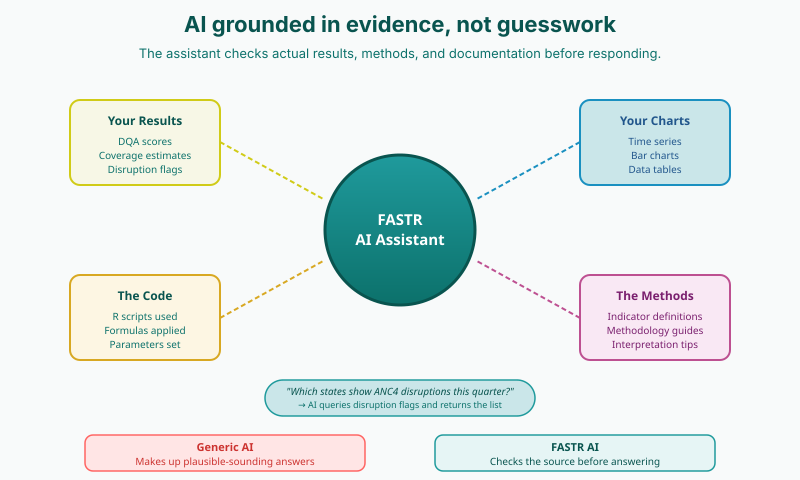

<!-- AUTO-TRANSLATED from 03b_ai_assistant.md -->
<!-- Add REVIEWED marker after human review to protect from overwrite -->

# O assistente de IA

## Visão geral

A plataforma FASTR inclui um assistente de IA que fornece suporte a pedido para interpretação de dados e geração de relatórios. Muitos sistemas de saúde têm mais dados do que capacidade para os analisar - o pessoal de M&A tem muitas vezes tempo limitado para uma análise aprofundada, as competências analíticas variam entre equipas e regiões, e transformar os dados em percepções narrativas requer conhecimentos técnicos e contextuais.

O assistente de IA ajuda a colmatar esta lacuna, explicando tendências e padrões em linguagem simples, gerando projectos de relatórios e mensagens-chave e respondendo a perguntas sobre os dados ou a metodologia.

## Capacidades

### Exploração e análise de dados

O assistente de IA pode consultar métricas e indicadores a partir de módulos de análise instalados, filtrar e desagregar por geografia, tempo e dados demográficos, ver dados CSV em bruto por detrás de métricas e visualizações e explorar dados entre períodos de tempo, localizações e fontes.

### Visualização e exibição

O assistente pode apresentar visualizações de projectos existentes e trabalhar com replicantes de gráficos multi-variantes. Pode criar novas configurações de gráficos, tais como gráficos de barras, gráficos de linhas e tabelas, e combinar gráficos, tabelas e texto narrativo.

### Conhecimento e documentação

A IA tem acesso à documentação da metodologia FASTR e pode explicar indicadores e métodos de cálculo. Interpreta os resultados com contexto sobre a qualidade dos dados, tendências e limitações, e responde a perguntas sobre dados de saúde.

### Apresentação e comunicação

O assistente constrói narrativas que combinam imagens e texto, destacando as principais conclusões e padrões. Cria visualizações direcionadas através da filtragem de subconjuntos relevantes e fornece informações baseadas em provas e fundamentadas nos dados subjacentes.

## Como funciona

A IA segue o princípio "ler antes de responder" - nunca adivinha. Para perguntas sobre dados, encontra a métrica relevante, lê os valores reais dos dados e responde com uma visualização. Para questões de metodologia, procura documentação, lê os pormenores e explica em linguagem simples.

## Privacidade e partilha

### O que é privado

A sua conversa com a IA, as perguntas que faz e as respostas que recebe são privadas para si. Os outros membros da equipa não podem ver o que está a explorar.

### O que é partilhado

Os dados subjacentes (os mesmos dados do HMIS), as visualizações guardadas na biblioteca do projeto, as apresentações de diapositivos e os relatórios que cria e guarda, bem como as definições do projeto e os resultados do módulo são partilhados com a equipa. Todos podem ver o conteúdo guardado.

## Onde a IA oferece maior valor

O assistente de IA fornece o maior valor em duas áreas: **visualizações** (explorar, modificar e compreender gráficos) e **slide decks** (montar apresentações a partir de dados e gráficos guardados). Também pode consultar métricas, ver o estado do módulo e ajudar a compreender a cobertura de dados, embora os módulos e as definições sejam geridos diretamente pelos utilizadores.

## Solicitação eficaz

Um bom aviso inclui seis elementos: (1) um objetivo claro, (2) um público definido, (3) geografia, tempo e âmbito específicos, (4) orientação de interpretação, (5) um formato de saída e (6) protecções para manter a IA baseada nos dados. A regra geral é simples: antes de enviar um pedido, pergunte a si próprio se é óbvio o que pretende obter - se não for, acrescente mais um pormenor.

## Quando a IA ajuda - e quando não ajuda

Nem todas as visualizações beneficiam igualmente da interpretação da IA. Quando os padrões são óbvios - por exemplo, todos os indicadores de qualidade de dados abaixo de 1% - o texto adicional gerado pela IA aumenta a extensão sem acrescentar informações. Mas quando os padrões são complexos - perturbações sustentadas ao longo de vários períodos de tempo, magnitudes variáveis, potenciais quebras estruturais - a interpretação da IA pode quantificar e contextualizar padrões que são difíceis de avaliar visualmente.

## Princípios fundamentais

A IA é um acelerador, não um decisor. O utilizador mantém o controlo da avaliação (decidir o que é importante), da interpretação (compreender o contexto) e da ação (tomar decisões). Todos os cálculos - deteção de outlier, estimativas de cobertura, pontuações de qualidade de dados - utilizam fórmulas estatísticas comprovadas, não IA. A IA interpreta e explica. O utilizador decide e actua.

---

<!--
////////////////////////////////////////////////////////////////////
// //
// _____ _ _____ ____ _____ ____ ___ _ _ _____ _ _ //
// / ____| | |_ _| _ \| ____| / ___/ _ \| \ | |_ _| \ | |//
// | (___ | | | | | | | | |__ | | | | | | \| | | | | \| |//
// \___ \| | | | | | | | | | | __| | | | | | | . ` | | | | . ` |//
// ____) | |___ _| |_| |_| | |____ | |__| |_| | |\ | | | | |\ |//
// |_____/|_____|_____|____/|______| \____\___/|_| \_|| |_| |_| \_|//
// //
// Editar os diapositivos do workshop abaixo desta linha //
// //
////////////////////////////////////////////////////////////////////
-->

<!-- SLIDE:mai_1 -->
## O assistente de IA

A plataforma FASTR inclui um assistente de IA que fornece suporte sob demanda para interpretação de dados e geração de relatórios.

**Contexto:** Muitos sistemas de saúde têm mais dados do que capacidade para os analisar

- A equipa de M&A tem muitas vezes tempo limitado para uma análise aprofundada
- As competências analíticas variam entre equipas e regiões
- Transformar os dados em informações narrativas requer conhecimentos técnicos e contextuais

**O que faz:** O assistente de IA ajuda a colmatar esta lacuna ao

- Explicar tendências e padrões numa linguagem simples
- Gerar projectos de relatórios e mensagens-chave
- Respondendo a perguntas sobre os dados ou a metodologia
<!-- /SLIDE -->

<!-- SLIDE:mai_3 -->
## O que o assistente de IA pode fazer

**Responder a perguntas sobre os seus dados

- "Quais são as regiões com mais outliers?"
- "Como é que a integridade dos relatórios mudou ao longo do tempo?"
- Cria gráficos e explicações em tempo real

**Explicar a metodologia

- "Como são detectados os valores anómalos?"
- "O que significa esta pontuação de qualidade de dados?"
- Baseia-se na documentação da plataforma

**Ajuda a criar relatórios

- Crie apresentações de diapositivos a partir dos seus dados
- Combine gráficos guardados com texto narrativo
- Criar apresentações para diferentes públicos
<!-- /SLIDE -->

<!-- SLIDE:mai_3a -->
## Onde a IA oferece maior valor

**Visualizações** - Explore e compreenda os seus dados

- Aceder a todas as visualizações guardadas no projeto
- Rever os dados subjacentes de qualquer gráfico ou figura
- Modificar os parâmetros de visualização, incluindo o tipo de gráfico, filtros, períodos de tempo e níveis de desagregação
- Receber explicações sobre o que cada visualização representa

**Slide decks** - Crie apresentações a partir das suas descobertas

- Gerar diapositivos de apresentação, incluindo páginas de rosto, divisores de secção e diapositivos de conteúdo
- Incorporar gráficos, tabelas e texto narrativo em esquemas de diapositivos
- Transferir visualizações diretamente para as apresentações
- Editar, reordenar, duplicar ou remover diapositivos conforme necessário

<!-- /SLIDE -->

<!-- SLIDE:mai_4a -->
## Como funcionam as conversas

**Exemplo de conversa:**

O utilizador: "Quais são as regiões com mais problemas de qualidade de dados?"
IA: *Cria um gráfico que mostra as pontuações da qualidade dos dados por região*

Você: "O que é que está a causar a baixa pontuação na região Norte?"
IA: *Divide os problemas: outliers, lacunas de exaustividade, problemas de consistência*

O utilizador: "Criar um resumo para o meu diretor"
AI: *Cria um diapositivo que destaca as áreas prioritárias para a melhoria da qualidade dos dados*

**Pense na IA como um analista de dados da sua equipa** - alguém que pode obter instantaneamente relatórios, criar gráficos e responder a perguntas sobre os seus dados de saúde.
<!-- /SLIDE -->

<!-- SLIDE:mai_6 -->
## Dicas para melhores respostas

**Seja específico sobre:**

- Qual o serviço - "ANC1" em vez de "serviços de cuidados pré-natais"
- Qual o período de tempo - "últimos 12 meses" ou "2024"
- Qual a localização - "Banadir" ou "todas as regiões"

**Pode pedir:** Gráficos, explicações, comparações, relatórios, quadros de dados

**As perguntas de seguimento são óptimas

1. Começar de forma abrangente: "Mostre-me os resultados da qualidade dos dados por região"
2. Reduzir: "E que tal apenas indicadores de ANC?"
3. Ir mais fundo: "Porque é que a região Norte é tão baixa?"
4. Tomar medidas: "Criar um diapositivo sobre isto para a minha apresentação"
<!-- /SLIDE -->

<!-- SLIDE:mai_6a -->
## O que é que faz uma boa apresentação?

Uma boa pergunta diz o que se pretende, a quem se destina, que dados abrange e como é uma boa resposta. Seis elementos para explicar:

| Elemento | O que soletrar | Exemplo |
|---|---------|------------------|---------|
| 1 | **Purpose** | A tarefa e o caso de uso | *Interpretar para uma avaliação de desempenho trimestral* |
| 2 **Audience** | Quem lê, a que nível técnico | *District MoH managers, plain language* |
| País ou área subnacional, período, indicadores *Nigéria, 2024-Q1 a Q4, ANC4 e SBA*
| 4 | Orientação para interpretação** | Tendências, comparações ou interrupções; descrição ou implicações | Identificar interrupções sustentadas; não especular sobre as causas* |
| 5 | Formato de saída** | Balas ou narrativa; slide-ready ou relatório em prosa; comprimento | *Três balas em slide-ready, com menos de 15 palavras cada* |
| 6 | **Guardrails** | Manter-se fundamentado nos dados; sinalizar incertezas ou problemas de qualidade | *Não extrapolar além do gráfico* |

**Regra de ouro:** Antes de enviar, leia a mensagem de volta. Se não for óbvio o que deve ser enviado, acrescente mais um detalhe.

<!--
NOTAS DO APRESENTADOR:
- O objetivo não é memorizar seis itens. É o hábito de perguntar "será que disse à IA tudo o que ela precisa?".
- Faça uma demonstração ao vivo: escreva uma pergunta que omita metade destes elementos, execute-a, depois adicione as peças em falta e volte a executar. O contraste é a lição.
- Lacuna mais comum na prática: as pessoas omitem o formato. A IA utiliza como padrão parágrafos longos quando os participantes precisavam de marcadores prontos para slide.
- Segunda lacuna mais comum: as pessoas omitem as barreiras de proteção. Sem elas, a IA preenche o contexto em falta com especulações plausíveis.
- A regra geral na parte inferior é a única coisa que os participantes precisam de recordar deste diapositivo.
-->
<!-- /SLIDE -->

<!-- SLIDE:mai_8 -->
## O que acontece quando se desliga

| Conteúdo | Salvo? | Notas |
|---------|--------|-------|
| A sua conversa de IA | Temporária | As conversas de IA são guardadas localmente no browser e são visíveis apenas para a pessoa que está a utilizar esse browser. Atualizar a página ou fechar o separador não elimina a conversa. O histórico de conversas só desaparece se a cache do browser for limpa ou se for utilizado um browser ou dispositivo diferente. |
| Apresentações de diapositivos/relatórios criados por si | Permanente | Guardado no projeto, visível para a equipa |
| Visualizações salvas | Permanentes | Permanecem na biblioteca do projeto |
| Exportações descarregadas | Permanentes | Guardadas no seu computador |
<!-- /SLIDE -->

<!-- SLIDE:mai_8a -->
## Privado vs partilhado em projectos de equipa

**Privado para si:**

- A sua conversa com a IA
- Perguntas que faz e respostas que recebe

Os outros membros da equipa não podem ver o que está a explorar.

**Partilhado com a equipa:**

- Os dados subjacentes (os mesmos dados HMIS)
- Visualizações guardadas na biblioteca do projeto
- Diapositivos/relatórios que cria e guarda
- Definições do projeto e resultados do módulo

Todos podem ver o conteúdo guardado.

<!-- /SLIDE -->

<!-- SLIDE:mai_8b -->
## Como as equipas trabalham em conjunto

| Quem | Ação | Resultado |
|-----|--------|--------|
| Dra. Amina** (Diretora) Pergunta à IA sobre a cobertura, explora em privado, cria uma apresentação de diapositivos
| Pergunta à IA sobre as lacunas nos relatórios, guarda um gráfico | Gráfico na biblioteca para todos | **Mohamed** (Gestor de dados)
| Fátima** (responsável pelo programa) abre os diapositivos da Amina, usa o gráfico do Mohamed e pede à IA para explicar

**O que cada pessoa vê:**

- As suas próprias conversas com a IA - Sim
- Diapositivos e gráficos guardados de outros - Sim
- As perguntas privadas de cada um - Não

**Duas pessoas podem utilizar o assistente de IA para adicionar ao mesmo conjunto de diapositivos ao mesmo tempo. Cada conversa é privada e cada instância de IA vê apenas as alterações efectuadas no conjunto, não a conversa.
<!-- /SLIDE -->

<!-- SLIDE:mai_4 -->
## Como funciona o assistente de IA

A IA segue o princípio "ler antes de responder" - nunca adivinha.

**Para perguntas sobre dados:**

1. Encontra a métrica relevante
2. Lê os valores reais dos dados
3. Responde com uma visualização

**Para questões de metodologia:**

1. Consulta a documentação
2. Lê os pormenores
3. Explica em linguagem simples

<!-- /SLIDE -->

<!-- SLIDE:mai_2 -->
## A IA é um acelerador, não um tomador de decisões

**Mantém o controlo de:**

- Julgamento - decidir o que é importante
- Interpretação - compreender o contexto
- Ação - tomar decisões

**Os números provêm de métodos validados

Todos os cálculos (deteção de anomalias, estimativas de cobertura, pontuações de qualidade dos dados) utilizam fórmulas estatísticas comprovadas - não IA.

A IA interpreta e explica. O utilizador decide e actua.

<!-- /SLIDE -->

<!-- SLIDE:mai_5 -->
## Quando a IA acrescenta pouco valor

**A sua interpretação da figura:**

Em todos os distritos, os valores atípicos são muito baixos, com todos os indicadores com uma média inferior a 1%, o que sugere uma qualidade consistente dos relatórios.

***Quando os padrões são óbvios, mais explicações não melhoram a compreensão.***

<!-- /SLIDE -->

<!-- SLIDE:mai_5a -->
## Quando a IA é útil

**A sua interpretação da figura:**

Múltiplas interrupções sustentadas até 2023 a 2025, com utilização do serviço abaixo dos níveis esperados durante os períodos sombreados a vermelho.

**Interpretação da figura pelo AI:**

Em agosto de 2023, os volumes caíram significativamente abaixo dos níveis esperados (12% de défice). As perturbações intensificaram-se de janeiro a maio de 2025, com fevereiro de 2025 a apresentar a maior lacuna, com 10 100 casos (20% abaixo do esperado).

***Quando os padrões não são óbvios, a interpretação da IA pode melhorar a nossa compreensão.***

<!-- /SLIDE -->

---

**Contacto**: <fastr@worldbank.org>
