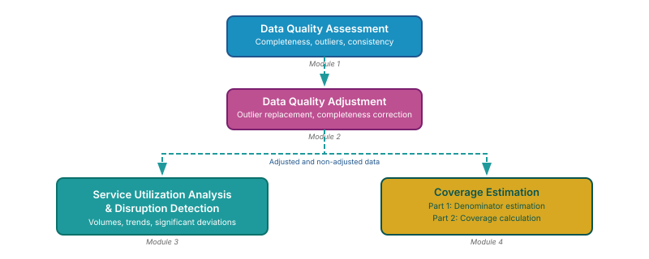
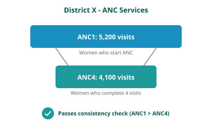
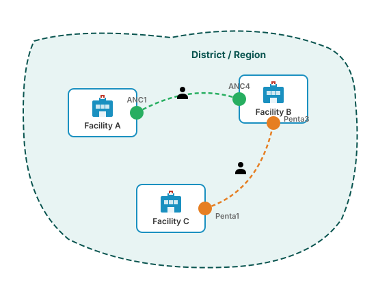

<!-- AUTO-TRANSLATED from 04_data_quality_assessment.md -->
<!-- Add REVIEWED marker after human review to protect from overwrite -->

# Avaliação da qualidade dos dados (DQA)

## Antecedentes e objetivo

### Objetivo do módulo

O módulo de Avaliação da Qualidade dos Dados (DQA) avalia a fiabilidade dos dados de rotina do Sistema de Informação de Gestão da Saúde (HMIS) reportados pelas unidades sanitárias. Funciona como uma etapa inicial de controlo de qualidade dentro do pipeline FASTR, revendo os relatórios mensais das unidades sanitárias para identificar problemas de qualidade dos dados antes da sua utilização na análise a jusante.

O módulo avalia a qualidade dos dados em três dimensões complementares: valores anómalos, que identificam valores comunicados invulgarmente elevados que podem refletir erros de comunicação ou de introdução de dados; exaustividade, que mede a regularidade e a continuidade dos relatórios dos estabelecimentos de saúde ao longo do tempo; e consistência, que avalia se os indicadores relacionados apresentam as relações esperadas. Estas dimensões são combinadas numa pontuação global de DQA, fornecendo uma medida sumária normalizada da fiabilidade dos dados.

Os dados de rotina do HMIS são uma fonte primária para monitorizar a prestação de serviços de saúde, tanto ao nível das unidades sanitárias como da população, captando eventos como vacinas administradas e partos assistidos por pessoal de saúde qualificado. Tal como acontece com todos os dados recolhidos por rotina, os dados do HMIS estão sujeitos a limitações de qualidade. O módulo DQA do FASTR aplica uma análise sistemática dos dados mensais ao nível dos estabelecimentos e dos indicadores para identificar e caraterizar estas limitações. Os resultados são resumidos como estimativas anuais, que podem refletir dados de anos parciais, dependendo da disponibilidade de dados no momento da análise (por exemplo, as análises realizadas a meio do ano podem incluir dados apenas para os meses disponíveis).

### Justificação analítica

A qualidade dos dados afecta diretamente a fiabilidade dos indicadores de saúde e das estimativas de cobertura. Antes de se calcularem as taxas de utilização dos serviços ou a cobertura da população, é necessário avaliar se os dados subjacentes dos estabelecimentos são suficientemente fiáveis. Este módulo identifica os padrões de dados que podem distorcer os resultados analíticos, permitindo que os utilizadores tomem decisões informadas sobre o tratamento de dados nas etapas subsequentes do pipeline.

### Abordagem FASTR à qualidade dos dados

O FASTR adopta uma abordagem multifacetada, baseada na convicção de que a qualidade dos dados não deve ser uma barreira à sua utilização. A abordagem enfatiza a realização de avaliações granulares da qualidade dos dados ao nível dos estabelecimentos; concentra-se em indicadores de grande volume que produzem estimativas mais estáveis; enfatiza a variação ao longo do tempo e do espaço em vez de estimativas pontuais; e interpreta os resultados em colaboração com os decisores nacionais. A utilização dos dados e o fornecimento de feedback são vistos como o primeiro passo para melhorar a qualidade dos dados.

### Pontos-chave

| Componente | Detalhes |
|-----------|---------|
| **Inputs** | Dados brutos do HMIS (`hmis_ISO3.csv`) que contêm os volumes de serviços dos estabelecimentos por mês e indicador<br>Identificadores geográficos/área administrativa<br>Nomes padronizados dos indicadores
| **Outputs** | `M1_output_outliers.csv` - sinalizadores de outliers do indicador de mês de estabelecimento<br>`M1_output_outlier_list.csv` - sinalizadores de outliers apenas (lista de revisão)<br>`M1_output_completeness.csv` - sinalizadores de completude do indicador de mês de estabelecimento<br>`M1_output_consistency_geo.csv` - resultados de consistência subnacional por par de rácios<br>`M1_output_dqa.csv` - pontuações compostas de DQA (média e aprovação/reprovação) |
| Avaliar a fiabilidade dos dados do HMIS através da deteção de anomalias, da avaliação da exaustividade e da verificação da consistência, de modo a garantir dados fiáveis para a estimativa da cobertura

!!! aviso "Lembrete: as entradas devem ser contagens, não percentagens"

    Este módulo espera **contagens de serviços em bruto** (por exemplo, número de visitas, doses, partos comunicados por cada estabelecimento em cada mês). As percentagens, taxas ou valores de cobertura pré-calculados não podem ser analisados aqui - a deteção de valores aberrantes compara os valores com a distribuição de volume de um estabelecimento (uma percentagem limitada a 100 não tem qualquer sinal) e os sinais de integralidade dependem do facto de ter sido comunicada uma contagem. Consulte [Extração de dados](02_data_extraction.md) para saber o que deve ser extraído do seu HMIS.

---

## Fluxo de trabalho analítico

### Visão geral das etapas analíticas

O módulo aplica uma sequência estruturada de verificações da qualidade dos dados, progredindo de observações individuais para uma avaliação global da fiabilidade dos dados:

**Etapa 1: Preparação dos dados**
Os relatórios mensais dos estabelecimentos são carregados e organizados para análise. As datas são padronizadas e as unidades geográficas e os indicadores de saúde disponíveis no conjunto de dados são identificados.

**Etapa 2: Deteção de anomalias**
Para cada estabelecimento e indicador (por exemplo, doses de vacina pentavalente ou consultas de cuidados pré-natais), o módulo identifica valores invulgarmente elevados que podem refletir erros de comunicação ou de introdução de dados. São utilizadas duas abordagens complementares: deteção estatística de valores anómalos com base em desvios do padrão histórico de comunicação de dados de um estabelecimento e verificações proporcionais que assinalam os meses que representam uma parte implausivelmente grande do volume de serviços do estabelecimento nos últimos 12 meses para esse indicador.

**Etapa 3: Avaliação da exaustividade
O módulo avalia a consistência dos relatórios dos estabelecimentos ao longo do tempo, construindo um cronograma completo de relatórios para cada combinação de estabelecimento-indicador e identificando os meses em falta. Os estabelecimentos com períodos prolongados de não comunicação (seis meses ou mais) são classificados como inactivos e não como incompletos.

**Etapa 4: Avaliação da consistência**
Espera-se que os indicadores relacionados sigam relações previsíveis. Por exemplo, o número de primeiras consultas de cuidados pré-natais deve exceder o número de quartas consultas. O módulo avalia estas relações utilizando rácios de indicadores calculados a nível distrital, reduzindo o enviesamento do movimento de pacientes entre estabelecimentos, e assinala os desvios dos padrões esperados.

**Passo 5: Verificações de disponibilidade de indicadores
Antes de aplicar as avaliações de consistência, o módulo verifica se os pares de indicadores necessários estão presentes nos dados. Quando faltam indicadores, a análise adapta-se à informação disponível sem gerar erros.

**Passo 6: Cálculo da pontuação DQA**
Para um conjunto definido de indicadores principais (normalmente, a primeira dose de vacinação pentavalente, a primeira consulta de cuidados pré-natais e as consultas externas), os resultados das verificações de anomalias, integralidade e consistência são combinados numa pontuação global de DQA. Um estabelecimento de saúde-mês só recebe a pontuação mais elevada se todos os indicadores principais cumprirem as normas mínimas nas três dimensões.

**Etapa 7: Resultados**
O módulo gera um conjunto de resultados estruturados, incluindo sinalizadores de outlier, indicadores de integralidade, resultados de consistência e pontuações finais de DQA. Estes resultados são utilizados em módulos FASTR subsequentes e fornecem uma base transparente para a revisão e melhoria da qualidade dos dados.

### Diagrama do fluxo de trabalho

<iframe src="../resources/diagrams/mod1_workflow.html" width="100%" height="800" style="border: 1px solid #ccc; border-radius: 4px;" title="Fluxo de trabalho interativo do módulo 1"></iframe>

### Pontos de decisão chave

**Quando é que um valor é considerado um valor atípico?

Os valores atípicos são identificados através da avaliação da variação dentro da instalação nos relatórios mensais para cada indicador. Um valor é assinalado como um valor atípico se satisfizer **qualquer** dos seguintes critérios:

1. O valor excede 10 vezes o Desvio Absoluto Mediano (DMA) da mediana mensal do indicador; **ou**
2. O valor representa mais de 80 por cento do volume total comunicado para um determinado estabelecimento, indicador e ano **e** a contagem comunicada é superior a 100.

O DMA é calculado utilizando apenas valores iguais ou superiores à mediana, de modo a centrar a deteção em valores invulgarmente elevados e evitar assinalar observações de baixo volume.

**Porque é que a consistência é avaliada a nível distrital e não a nível do estabelecimento?

Os pacientes procuram frequentemente cuidados em diferentes unidades sanitárias dentro do mesmo distrito, dependendo do serviço. Por exemplo, uma mulher pode receber a sua primeira consulta de cuidados pré-natais num centro de saúde primário, mas dar à luz num hospital distrital. A avaliação da consistência ao nível distrital tem em conta este movimento dos pacientes e fornece uma representação mais exacta dos padrões de utilização dos serviços.

**O que acontece quando os indicadores necessários estão em falta?

O módulo adapta-se aos dados que estão disponíveis. Se os pares de indicadores necessários para a avaliação da consistência estiverem em falta, as verificações de consistência não são aplicadas e a pontuação DQA é calculada utilizando apenas as dimensões de outlier e de integralidade. A análise prossegue utilizando as dimensões de qualidade que podem ser avaliadas.

**Como são tratadas as instalações inactivas?

Os estabelecimentos que não apresentem relatórios durante seis ou mais meses consecutivos no início ou no fim do seu período de relatório são classificados como inactivos para esses meses e não como incompletos. Isto evita penalizar os estabelecimentos que ainda não começaram a apresentar relatórios ou que cessaram permanentemente as suas actividades.

### Processamento de dados e resultados

**Visão geral da transformação

O módulo transforma relatórios brutos de instalações em conjuntos de dados com marcas de qualidade através das seguintes etapas:

1. **Formato de entrada**: Observações mensais com identificador do estabelecimento, período de referência, indicador e contagem registada
2. **Enriquecimento**: Cálculo de estatísticas de apoio, incluindo valores medianos, resíduos baseados em MAD e contribuições proporcionais de volume
3. **Conclusão**: Geração explícita de registos para os meses em falta, convertendo as lacunas implícitas nos relatórios em pontos de dados observáveis
4. **Agregação**: Agregação de dados a nível de estabelecimento para o nível distrital para avaliação da consistência
5. **Sinalização**: Atribuição de sinais binários de qualidade para valores anómalos, exaustividade e consistência
6. **Pontuação**: Combinação de sinais de qualidade em pontuações contínuas (0-1) e indicadores correspondentes de aprovação/reprovação
7. **Formato de saída**: Produção de vários ficheiros de saída adaptados a diferentes utilizações analíticas, incluindo a revisão rápida de anomalias, análise completa da qualidade dos dados e entradas para módulos FASTR a jusante

O módulo processa os dados em formato longo, com um registo por combinação de unidade de saúde-indicador-período, e produz medidas padronizadas de qualidade dos dados que são utilizadas pelos módulos subsequentes para informar as decisões de ajustamento, ponderação ou exclusão dos dados.

---
### Resultados da análise e visualização

A análise FASTR gera seis resultados visuais principais (cada um deles é também produzido como um mapa subnacional correspondente, exceto no que diz respeito à exaustividade ao longo do tempo):

**1. Mapa de calor de outliers**

Tabela de mapa de calor com as zonas como linhas e os indicadores de saúde como colunas, codificados por cores de acordo com a percentagem de valores atípicos.

percentagem de instalações-mês que apresentam valores atípicos](resources/default_outputs/Default_1._Proportion_of_outliers.png)


**2. Exaustividade do indicador**

Tabela de mapa de calor com as zonas como linhas e os indicadores de saúde como colunas, codificados por cores de acordo com a percentagem de completude.

![Percentagem de estabelecimentos-mês com dados completos] (resources/default_outputs/Default_2._Proportion_of_completed_records.png)


**3. Completude do indicador ao longo do tempo**

Gráficos cronológicos horizontais que mostram as tendências de conclusão de cada indicador durante o período de análise.

percentagem de estabelecimentos-mês com dados completos ao longo do tempo](resources/default_outputs/Default_3._Proportion_of_completed_records_over_time.png)

**4. Consistência interna**

Tabela de mapa de calor com zonas como linhas e categorias de referência de consistência como colunas, codificadas por cores de acordo com o desempenho.

percentagem de zonas subnacionais que cumprem os indicadores de coerência] (resources/default_outputs/Default_4._Proportion_of_sub-national_areas_meeting_consistency_criteria.png)


**5. Pontuação global de DQA**

Tabela de mapas de calor com zonas como linhas e períodos de tempo como colunas, codificados por cores de acordo com a percentagem da pontuação DQA.

percentagem de meses de estabelecimento com qualidade de dados adequada ao longo do tempo](resources/default_outputs/Default_5._Overall_DQA_score.png)

**6. Pontuação média de DQA**

Tabela de mapa de calor com zonas como linhas e períodos de tempo como colunas, codificados por cores pela pontuação média de DQA.

pontuação média da qualidade dos dados nos meses da instalação] (resources/default_outputs/Default_6._Mean_DQA_score.png)


**Guia de interpretação**

Para os mapas de calor (resultados 1, 2, 4, 5, 6):

- **Linhas**: Áreas geográficas (zonas/regiões)
- **Colunas**: Indicadores de saúde ou períodos de tempo

Para o mapa de calor de outliers (resultado 1):

- **Valores**: Percentagem de estabelecimentos-mês assinalados como anómalos
- Percentagens mais baixas indicam menos valores extremos

Para o mapa de calor da exaustividade do indicador (resultado 2):

- **Valores**: Percentagem de meses de estabelecimento com relatórios completos
- Percentagens mais elevadas indicam relatórios mais completos

Para o gráfico de completude do indicador ao longo do tempo (resultado 3):

- **Gráfico de cronologia horizontal** mostrando as tendências de completude por indicador
- **Eixo X**: Período de tempo
- **Eixo Y**: Percentagem de exaustividade
- Mostra se os relatórios estão a melhorar, a diminuir ou a estabilizar

Para o mapa de calor da consistência interna (resultado 4):

- **Valores**: Percentagem de áreas que cumprem os padrões de referência de consistência
- Mostra se os indicadores relacionados seguem as relações esperadas (por exemplo, ANC1 ≥ ANC4)

Para os mapas de calor da pontuação DQA (resultados 5-6):

- **Resultado 5**: Percentagem de instalações-mês que passam em todos os controlos de qualidade
- **Resultado 6**: Pontuação média de DQA em todos os meses do estabelecimento
- Pontuações mais altas indicam melhor qualidade geral dos dados

---

## Referência pormenorizada

Esta secção fornece detalhes técnicos para os implementadores, programadores e analistas que necessitam de compreender a metodologia subjacente.

### Parâmetros de configuração

O módulo utiliza vários parâmetros configuráveis que controlam o comportamento da análise:

"Definições geográficas"

    ```r
    # Country identifier
    COUNTRY_ISO3 <- "GIN"  # ISO3 country code

    # Geographic level for consistency analysis
    GEOLEVEL <- "admin_area_3"  # Admin level (1=national, 2=region, 3=district, etc.)
    ```

    O parâmetro `GEOLEVEL` determina o nível de agregação para a análise de coerência. Os níveis administrativos mais baixos (3-4) captam padrões locais, mas podem ter dados escassos. Os níveis mais elevados (2) fornecem estimativas mais estáveis, mas podem ocultar incoerências locais.

??? "Parâmetros de deteção de anomalias"

    ```r
    # Proportion threshold for outlier detection
    OUTLIER_PROPORTION_THRESHOLD <- 0.8  # Flag if single month > 80% of the trailing 12-month total

    # Minimum count to consider for outlier flagging
    MINIMUM_COUNT_THRESHOLD <- 100  # Only flag outliers with count > 100

    # Number of Median Absolute Deviations for statistical outlier detection
    MADS <- 10  # Flag if value > 10 MADs from median
    ```

    **Orientação de afinação:**
    - **Deteção mais sensível**: Reduzir `OUTLIER_PROPORTION_THRESHOLD` para 0,6-0,7, reduzir `MADS` para 8
    - **Deteção menos sensível**: Aumentar o `OUTLIER_PROPORTION_THRESHOLD` para 0,9, aumentar o `MADS` para 12-15
    - **Pequenas instalações**: Reduzir o `MINIMUM_COUNT_THRESHOLD` para 50
    - **Só instalações grandes**: Aumentar `MINIMUM_COUNT_THRESHOLD` para 200+

??? "Seleção do código DQA"

    ```r
    # Core indicators used for DQA scoring (default)
    DQA_INDICATORS <- c("anc1", "penta1", "opd")

    # Consistency pairs to evaluate (default)
    CONSISTENCY_PAIRS_USED <- c("penta", "anc", "delivery")
    ```

    **`DQA_INDICATORS` valores aceites** (do parâmetro da plataforma): qualquer subconjunto de `c("anc1", "penta1", "opd")`.

    **`CONSISTENCY_PAIRS_USED` valores aceites** (a partir do parâmetro da plataforma): qualquer subconjunto de `c("penta", "anc", "delivery", "malaria")`.

??? "Intervalos de referência de consistência"

    ```r
    all_consistency_ranges <- list(
      pair_penta    = c(lower = 0.95, upper = Inf),  # Penta1 >= 0.95 * Penta3
      pair_anc      = c(lower = 0.95, upper = Inf),  # ANC1 >= 0.95 * ANC4
      pair_delivery = c(lower = 0.7, upper = 1.3),   # 0.7 <= BCG/Delivery <= 1.3
      pair_malaria  = c(lower = 0.9, upper = 1.1)    # Malaria indicators within 10%
    )
    ```

    Os intervalos reflectem as expectativas programáticas. Por exemplo, a ANC1 deve ser sempre pelo menos 95% da ANC4 (há mais mulheres a iniciar os cuidados do que a completar quatro consultas). A tolerância de 5% é responsável por variações na introdução de dados. A BCG, como vacina de dose à nascença, deve ser aproximadamente igual aos partos efectuados nas unidades de saúde, com uma tolerância de 30% para variações.

### Especificações de entrada/saída

#### Estrutura do ficheiro de entrada

**Ficheiro necessário**: `hmis_[COUNTRY_ISO3].csv`

**Colunas necessárias
- `facility_id` (carácter/inteiro): Identificador único para cada estabelecimento de saúde
- `period_id` (número inteiro): Período de tempo no formato AAAAMM (por exemplo, 202401 para janeiro de 2024)
- `indicator_common_id` (carácter): Nomes de indicadores normalizados (por exemplo, "penta1", "anc1", "opd")
- `count` (numérico): Volume de serviço ou contagem para o indicador
- `admin_area_1` a `admin_area_8` (carácter): Colunas de área geográfica/administrativa

**Exemplo de formato

```csv
facility_id,period_id,indicator_common_id,count,admin_area_1,admin_area_2,admin_area_3
FAC001,202401,penta1,45,Country_A,Province_A,District_A
FAC001,202401,anc1,67,Country_A,Province_A,District_A
FAC001,202402,penta1,52,Country_A,Province_A,District_A
```

**Requisitos de dados:**
- Pelo menos 12 meses de dados recomendados para uma deteção robusta de valores atípicos
- Valores em falta representados como NA ou linhas ausentes (ambos tratados)
- As contagens de zero devem ser zeros explícitos, não em falta
- Colunas geográficas detectadas automaticamente (as colunas 2-8 são opcionais)

#### Ficheiros de saída

??? "M1_output_outlier_list.csv - Apenas anomalias assinaladas"

    **Propósito**: Lista de referência rápida apenas das observações assinaladas como anómalas

    **Colunas:**

    - `facility_id`: Identificador da instalação
    - `admin_area_[2-8]`: Áreas geográficas (incluídas dinamicamente com base nos dados)
    - `indicator_common_id`: Nome do indicador de saúde
    - `period_id`: Período de tempo (AAAAMM)
    - `count`: Volume de serviços reportado

    **Caso de uso**: Gestores de dados que analisam casos anómalos específicos para investigação ou correção

??? "M1_output_outliers.csv - Todos os registos com sinais de anomalia"

    **Objetivo**: Conjunto de dados completo com sinalizadores de anomalias para todas as combinações de estabelecimento-indicador-período

    **Colunas

    - `facility_id`: Identificador do estabelecimento
    - `admin_area_[2-8]`: Zonas geográficas (incluídas dinamicamente com base nos dados)
    - `period_id`: Período de tempo (AAAAMM)
    - `indicator_common_id`: Nome do indicador de saúde
    - `outlier_flag`: Sinalização final combinada de valores atípicos (0 = não atípico, 1 = atípico)

    **Caso de uso**:

    - Entrada para o módulo 2 (Ajustamentos da qualidade dos dados)
    - Análise estatística dos padrões de outlier
    - Geração de visualizações da prevalência de outliers

??? "M1_output_completeness.csv - Estado de completude"

    **Objetivo**: Sinalizadores de integralidade para todas as combinações de estabelecimento-indicador-período, incluindo registos explicitamente criados para meses em falta

    **Colunas:**

    - `facility_id`: Identificador do estabelecimento
    - `admin_area_[2-8]`: Áreas geográficas (incluídas dinamicamente com base nos dados)
    - `indicator_common_id`: Nome do indicador de saúde
    - `period_id`: Período de tempo (AAAAMM)
    - `completeness_flag`: 0=Incompleto (em falta), 1=Completo (comunicado)

    **Caraterísticas especiais**:

    - Contém linhas explícitas para meses não comunicados
    - Períodos inactivos (6+ meses no início/fim com completeness_flag=2) excluídos da exportação
    - Séries cronológicas completas para cada combinação de estabelecimento-indicador

    **Caso de uso**:

    - Cálculo de percentagens de integralidade
    - Identificação de lacunas nos relatórios
    - Análise de tendências do comportamento dos relatórios

??? "M1_output_consistency_geo.csv - Consistência a nível geográfico"

    **Objetivo**: Sinalizadores de consistência calculados ao nível geográfico especificado (por exemplo, distrito)

    **Colunas:**

    - `admin_area_[2-8]`: Identificadores geográficos até ao GEOLEVEL especificado (incluídos dinamicamente com base nos dados)
    - `period_id`: Período de tempo (AAAAMM)
    - `ratio_type`: Nome do par de coerência (por exemplo, "pair_penta", "pair_anc")
    - `sconsistency`: Sinalizador binário (1=consistente, 0=inconsistente, NA=não é possível calcular)

    **Formato**: Formato longo com uma linha por tipo de relação área geográfica-período

    **Caso de utilização**:

    - Compreender os padrões de prestação de serviços a nível distrital
    - Identificação de áreas geográficas com problemas de consistência
    - Criação de mapas de calor de consistência por zona

??? "M1_output_dqa.csv - pontuações finais do DQA"

    **Objetivo**: Pontuações compostas da qualidade dos dados por estabelecimento e período de tempo

    **Colunas

    - `facility_id`: Identificador do estabelecimento
    - `admin_area_[2-8]`: Zonas geográficas (incluídas dinamicamente com base nos dados)
    - `period_id`: Período de tempo (AAAAMM)
    - `dqa_mean`: Média das pontuações dos componentes (0-1)
    - `dqa_score`: Aprovação/reprovação global binária (1 = todas as verificações foram aprovadas; 0 = nenhuma verificação falhou)

    **Caso de utilização**:

    - Filtragem de dados para módulos subsequentes (por exemplo, utilizar apenas os meses das instalações com dqa_score=1)
    - Acompanhamento das tendências da qualidade dos dados ao longo do tempo
    - Identificação de estabelecimentos que precisam de apoio para melhorar a qualidade dos dados

### Documentação das funções principais

??? "load_and_preprocess_data()"

    **Signature**: `load_and_preprocess_data(file_path)`

    **Objetivo**: Carrega os dados do HMIS e prepara-os para análise, criando os campos de data e os indicadores compostos necessários

    **Parâmetros

    - `file_path` (carácter): Caminho para o ficheiro CSV HMIS

    **Retornos**: Lista contendo:

    - `data`: Dataframe pré-processado com campo de data adicionado
    - `geo_cols`: Vetor de nomes de colunas geográficas detectadas

    **Process:**
    1. Lê o ficheiro CSV com dados HMIS
    2. Converte `period_id` (formato YYYYMM) em objectos Date para ordenação temporal
    3. Detecta todas as colunas da área administrativa (admin_area_1 a admin_area_8)
    4. Cria um indicador composto da malária se existirem indicadores componentes:
       - Combina `rdt_positive` + `micro_positive` em `rdt_positive_plus_micro`
       - Este indicador composto é utilizado para controlos de consistência do paludismo

    **Exemplo

    ```r
    inputs <- load_and_preprocess_data("hmis_ISO3.csv")
    data <- inputs$data
    geo_cols <- inputs$geo_cols
    ```

??? "validate_consistency_pairs()"

    **Assinatura**: `validate_consistency_pairs(consistency_params, data)`

    **Purpose**: Valida a existência dos pares de códigos necessários no conjunto de dados antes de executar a análise de consistência

    **Parâmetros:**

    - `consistency_params`: Lista contendo consistency_pairs e consistency_ranges
    - `data`: O conjunto de dados HMIS

    **Retorno**: Consistency_params actualizada apenas com pares válidos (lista vazia se não houver pares válidos)

    **Processo
    1. Verifica quais indicadores estão disponíveis no conjunto de dados
    2. Remove os pares de consistência em que um ou ambos os indicadores estão em falta
    3. Emite avisos sobre os pares removidos
    4. Devolve uma lista vazia se não restarem pares válidos

    **Exemplo de saída:**

    __CÓDIGO_BLOCO_6__

??? "outlier_analysis()"

    **Assinatura**: `outlier_analysis(data, geo_cols, outlier_params)`

    **Finalidade**: Identificar os valores anómalos estatísticos nos volumes de serviço das instalações utilizando dois métodos de deteção

    **Parâmetros:**

    - `data`: Dados HMIS com facility_id, indicator_common_id, period_id, count
    - `geo_cols`: Vetor de nomes de colunas geográficas
    - `outlier_params`: Lista contendo:
      - `outlier_pc_threshold`: Limiar de proporção (predefinição 0,8)
      - `count_threshold`: Limiar mínimo de contagem (predefinição 100)

    **Resultados**: Dataframe com sinalizadores de anomalias e métricas de diagnóstico para cada período de indicador de estabelecimento

    **Campos calculados

    - `median_volume`: Contagem mediana por indicador de instalação
    - `mad_volume`: DMA calculado sobre valores >= mediana
    - `mad_residual`: Resíduo padronizado (|contagem - mediana| / DMA)
    - `outlier_mad`: Sinalizador binário (1 se mad_residual > MADS)
    - `pc`: Contribuição proporcional para o total dos últimos 12 meses (janela móvel que termina no período da linha)
    - `outlier_pc`: Sinal binário (1 se pc > limiar)
    - `outlier_flag`: Sinalizador final (1 se qualquer um dos sinalizadores do método E contagem > limiar mínimo)

    **Etapas do algoritmo

    **Passo 1**: Calcular o volume mediano para cada combinação de estabelecimento-indicador

    **Passo 2**: Calcular o DMA usando apenas valores iguais ou superiores à mediana
    - Evita a distorção de instalações com muitos meses de baixo volume
    - Padroniza os resíduos dividindo (contagem - mediana) pelo DMA
    - Sinaliza outlier_mad = 1 se mad_residual > parâmetro MADS

    **Passo 3**: Calcular a contribuição proporcional
    - Para cada período-indicador de estabelecimento, somar a contagem ao longo dos últimos 12 meses que terminam nesse período (janela móvel)
    - Calcular pc = contagem / window_total (pc é NA se o total da janela for 0)
    - Sinalizadores outlier_pc = 1 se pc > OUTLIER_PROPORTION_THRESHOLD
    - Este denominador de janela móvel substitui um denominador de ano civil, que assinalava falsamente os estabelecimentos cuja única comunicação de dados ocorria no início de um ano civil (o seu único mês era o seu próprio denominador)

    **Passo 4**: Combinar os sinalizadores
    - Final outlier_flag = 1 if (outlier_mad = 1 OR outlier_pc = 1) AND count > MINIMUM_COUNT_THRESHOLD
    - O limiar (por defeito 100) garante que apenas os volumes substanciais são assinalados, evitando falsos positivos em instalações de baixo volume

??? "process_completeness()"

    **Signature**: `process_completeness(outlier_data_main)`

    **Finalidade**: Função principal de orquestração que gera séries cronológicas completas e atribui marcas de integralidade a todos os indicadores

    **Parâmetros:**

    - `outlier_data_main`: Resultados da análise de anomalias (contém todas as combinações de período-indicador-facilidade com contagens)

    **Resultados**: Conjunto de dados de formato longo com marcas de integralidade para todas as combinações de período-indicador de estabelecimento

    **Processo

    1. Identifica globalmente o primeiro e o último período de referência para cada indicador
    2. Chama `generate_full_series_per_indicator()` para cada código
    3. Aplica a lógica de marcação de completitude (completo/incompleto/inativo)
    4. Fusão com metadados geográficos
    5. Combina resultados de todos os indicadores
    6. Remove períodos inactivos (completeness_flag = 2)

    **Estrutura de saída:**

    - Linhas explícitas para os períodos reportados e não reportados
    - Sinal de integralidade: 0 (incompleto), 1 (completo), 2 (inativo - removido)
    - Séries cronológicas completas do primeiro ao último período de declaração por indicador

??? "generate_full_series_per_indicator()"

    **Assinatura**: `generate_full_series_per_indicator(outlier_data, indicator_id, timeframe)`

    **Finalidade**: Cria uma série cronológica mensal completa para um indicador específico, preenchendo as lacunas onde os estabelecimentos não comunicaram

    **Parâmetros:**

    - `outlier_data`: tabela data.table com resultados outlier
    - `indicator_id`: Código específico para processar (por exemplo, "penta1")
    - `timeframe`: Tabela de dados com first_pid e last_pid para cada indicador

    **Resultados**: Série cronológica completa com linhas explícitas para os períodos reportados e não reportados

    **Processo

    1. Subconjuntos de dados para um indicador específico
    2. Gera uma seqüência mensal do primeiro ao último período_id para esse código
    3. Cria uma grelha completa de estabelecimento-período (todos os estabelecimentos × todos os meses) utilizando `CJ()` cross join
    4. Funde com os dados reais reportados
    5. As contagens em falta indicam períodos não comunicados
    6. Aplica o algoritmo de deteção de inatividade

    **Algoritmo de deteção de inactivos:**

    __CÓDIGO_BLOCO_7__

    **Exemplo de cronologia:**

    ```
    Facility A reporting pattern for indicator "penta1":
    Period:  202001 202002 202003 202004 202005 202006 202007 202008 202009 202010
    Count:   NA     NA     NA     NA     50     30     NA     NA     40     35
    Flag:    2      2      2      2      1      1      0      0      1      1
             [----Inactive----] [---Active period with gaps---]

    Explanation:
    - First 4 months: Inactive (6+ months missing before first report at 202005)
    - 202005-202006: Complete (reported)
    - 202007-202008: Incomplete (gaps in active period)
    - 202009-202010: Complete (reported)
    ```

??? "geo_consistency_analysis()"

    **Assinatura**: `geo_consistency_analysis(data, geo_cols, geo_level, consistency_params)`

    **Objetivo**: Calcula os rácios de coerência a nível geográfico para ter em conta os doentes que procuram serviços em várias instalações de um distrito/direção

    **Parâmetros:**

    - `data`: Dados anómalos (com anómalos já assinalados)
    - `geo_cols`: Vetor de nomes de colunas geográficas
    - `geo_level`: Nível geográfico para agregação (por exemplo, "admin_area_3")
    - `consistency_params`: Lista com consistency_pairs e consistency_ranges

    **Retornos**: Dataframe de formato longo com resultados de consistência de nível geográfico

    **Processo

    1. Exclui os valores atípicos (define a contagem como NA quando outlier_flag = 1)
    2. Agrega os dados ao nível geográfico especificado por período (soma das instalações)
    3. Reformula para um formato alargado (uma coluna por indicador)
    4. Calcula o rácio para cada par de indicadores
    5. Assinala a consistência com base em intervalos predefinidos

    **Colunas de saída:**

    - Identificadores geográficos (até ao nível especificado)
    - `period_id`: Período de tempo
    - `ratio_type`: Nome do par de coerência (por exemplo, "par_penta")
    - `consistency_ratio`: Valor do índice calculado
    - `sconsistency`: Marcador binário (1 = consistente, 0 = inconsistente, NA = não pode calcular)

    **Exemplo de saída:**

    ```
    admin_area_2  admin_area_3  period_id  ratio_type    consistency_ratio  sconsistency
    District_A    Ward_1        202401     pair_penta    1.05               1
    District_A    Ward_1        202401     pair_anc      0.88               0
    District_A    Ward_2        202401     pair_penta    0.97               1
    ```

    **Fundamentação**: A medição da consistência a nível geográfico tem em conta o movimento dos doentes entre instalações e fornece uma imagem mais exacta dos padrões de utilização dos serviços numa comunidade.

??? "expand_geo_consistency_to_facilities()"

    **Assinatura**: `expand_geo_consistency_to_facilities(facility_metadata, geo_consistency_results, geo_level)`

    **Objetivo**: Atribui resultados de coerência a nível geográfico a instalações individuais

    **Parâmetros:**

    - `facility_metadata`: Lista de instalações com atribuições geográficas
    - `geo_consistency_results`: Saída de geo_consistency_analysis()
    - `geo_level`: Nível geográfico utilizado na análise de consistência

    **Retorno**: Conjunto de dados ao nível das instalações com sinais de coerência

    **Processo

    - Extrai a lista de estabelecimentos com as suas atribuições geográficas
    - Efectua uma junção à esquerda para replicar as pontuações de consistência ao nível geográfico para todas as instalações nessa área
    - Utiliza a relação muitos-para-muitos para lidar com vários períodos e tipos de rácio

    **Fundamentação**: Uma vez que a consistência é medida a nível geográfico (tendo em conta a deslocação de doentes entre instalações), todas as instalações dentro do mesmo distrito/bairro recebem as mesmas pontuações de consistência.

??? "dqa_with_consistency()"

    **Signature**: `dqa_with_consistency(completeness_data, consistency_data, outlier_data, geo_cols, dqa_rules)`

    **Purpose**: Calcula pontuações abrangentes de DQA, incluindo verificações de consistência quando estão disponíveis pares de consistência

    **Parâmetros:**

    - `completeness_data`: Saída de process_completeness()
    - `consistency_data`: Resultados da consistência da instalação de formato amplo
    - `outlier_data`: Saída de outlier_analysis()
    - `geo_cols`: Vetor de nomes de colunas geográficas
    - `dqa_rules`: Lista que especifica os valores necessários para cada dimensão

    **Configuração de regras de DQA:**

    ```r
    dqa_rules <- list(
      completeness = 1,   # Must be complete (flag = 1)
      outlier_flag = 0,   # Must NOT be an outlier (flag = 0)
      sconsistency = 1    # Must be consistent (flag = 1)
    )
    ```

    **Algoritmo de pontuação:**

    **1. Pontuação de completude - outlier** (por estabelecimento-período):
    - Cada indicador DQA obtém uma pontuação de 0-2 pontos (1 para a exaustividade + 1 para a ausência de anomalias)
    - Máximo possível = 2 × número de indicadores DQA
    - Pontuação = Total de pontos / Máximo de pontos

    **2. Pontuação de consistência** (por período de instalação):
    - Conta apenas os pares em que existem ambos os indicadores (pares NA excluídos do denominador)
    - Pontuação = Número de pares aprovados / Número de pares disponíveis
    - Se não houver pares disponíveis, a pontuação = 0

    **3. Pontuação média DQA:**
    - Média das pontuações de completude-outlier e de consistência
    - Fórmula: `(completeness_outlier_score + consistency_score) / 2`

    **4. Pontuação binária do DQA:**
    - 1 se todas as verificações forem aprovadas (completas, sem anomalias, consistentes)
    - 0 se alguma verificação falhar

    **Tratamento de indicadores em falta:**
    A função trata de forma inteligente os casos em que alguns indicadores de consistência estão em falta:
    - Os valores NA nos pares de consistência NÃO são substituídos por 0
    - Apenas os pares disponíveis contribuem para o denominador
    - Isto evita penalizar as instalações por indicadores que não fornecem

    **Exemplo de cálculo:**

    __BLOQUEIO_DE_CÓDIGO_11__

??? "dqa_without_consistency()"

    **Assinatura**: `dqa_without_consistency(completeness_data, outlier_data, geo_cols, dqa_rules)`

    **Objetivo**: Calcula as pontuações DQA utilizando apenas verificações de exaustividade e de outlier quando os dados de consistência não estão disponíveis ou não existem pares de consistência válidos

    **Quando utilizado:**

    - Nenhum par de consistência definido na configuração
    - Todos os pares de consistência têm indicadores em falta
    - O conjunto de dados não contém códigos emparelhados

    **Pontuação:**

    - Utiliza apenas componentes de integralidade e outlier
    - `dqa_mean` = `completeness_outlier_score`
    - `dqa_score` = 1 se todas as verificações de integralidade e de anomalias forem aprovadas, 0 caso contrário

    **Estrutura de saída:**

    ```r
    dqa_results <- data.frame(
      facility_id,
      admin_area_X,              # Dynamic geographic columns
      period_id,
      completeness_outlier_score, # Range: 0-1
      dqa_mean,                   # Range: 0-1 (equals completeness_outlier_score)
      dqa_score                   # Binary: 0 or 1
    )
    ```

### Métodos estatísticos e algoritmos

??? "Cálculo do desvio absoluto mediano (DMA)"

    O MAD é uma medida robusta de variabilidade que é menos sensível a outliers do que o desvio padrão.

    **Algoritmo MAD padrão:**
    1. Calcular a mediana do conjunto de dados
    2. Calcular os desvios absolutos: |valor - mediana| para cada ponto de dados
    3. Encontre a mediana desses desvios absolutos

    **Modificação FASTR:**
    O módulo calcula o DMA utilizando apenas valores iguais ou superiores à mediana, tornando-o mais sensível a valores anómalos elevados e evitando a distorção de instalações com muitos meses de baixo volume.

    **Cálculo do grau de outlier:**

    $$
    \text{MAD Residual} = \frac{|\text{volume} - \text{volume mediano}|}{\text{MAD}}
    $$

    **Classificação de outlier:**
    - Se MAD Residual > 10 (configurável através do parâmetro `MADS`), o valor é assinalado como um outlier baseado em MAD (`outlier_mad = 1`)
    - O `outlier_flag` final também requer contagem > 100

    **Exemplo

    ```
    Facility ABC, Indicator: penta1
    Monthly counts: 20, 25, 22, 28, 24, 26, 150, 23, 27, 25, 21, 24

    Step 1: Calculate median = 24.5
    Step 2: Values >= median: 25, 28, 24.5, 26, 150, 27, 25, 24.5
    Step 3: Absolute deviations from median: 0.5, 3.5, 0, 1.5, 125.5, 2.5, 0.5, 0
    Step 4: MAD = median(0, 0, 0.5, 0.5, 1.5, 2.5, 3.5, 125.5) = 1.0
    Step 5: For count=150: MAD residual = |150 - 24.5| / 1.0 = 125.5
    Step 6: 125.5 > 10 AND 150 > 100, therefore outlier_flag = 1
    ```

??? "Deteção proporcional de outlier"

    Este método identifica os meses em que uma única observação representa uma proporção invulgarmente elevada do volume comunicado pelo indicador do estabelecimento durante os 12 meses anteriores.

    **Algoritmo
    1. Para cada período de indicador de estabelecimento, somar a contagem dos últimos 12 meses que terminam nesse período (janela móvel por estabelecimento × indicador)
    2. Calcular a proporção: `pc = monthly_count / window_total` (definido como NA se o total da janela for 0)
    3. Assinalar como outlier proporcional (`outlier_pc = 1`) se `pc > OUTLIER_PROPORTION_THRESHOLD` (valor por defeito 0,8)
    4. O `outlier_flag` final também requer contagem > 100

    **Fundamentação
    Um estabelecimento que comunica 80% do seu volume do ano de referência num único mês indica provavelmente um erro de introdução de dados (por exemplo, comunicação cumulativa em vez de mensal, introdução de um dígito extra). A janela dos últimos 12 meses substitui um denominador de um ano civil anterior: um estabelecimento cuja única comunicação de dados ocorreu no início de um ano civil era anteriormente o seu próprio denominador (pc ≈ 1,0) e foi incorretamente assinalado.

    **Exemplo

    __CÓDIGO_BLOCO_14__

??? "Referências de rácio de consistência"

    O módulo aplica parâmetros de referência definidos programaticamente para pares de indicadores:

    **ANC Consistência:**

    $$
    \text{Consistência deANC} =
    \begin{cases}
    1, & \frac{\text{ANC1 Volume}}{\text{ANC4 Volume}} \geq 0,95 \\
    0, & \text{caso contrário}
    \end{casos}
    $$

    **Interpretação**: Mais mulheres devem iniciar o ANC (ANC1) do que completar quatro consultas (ANC4). Espera-se que o rácio seja ≥ 0,95, permitindo uma tolerância de até 5% para variações de dados.

    **Consistência de penta:**

    $$
    \text{Consistência Penta} =
    \begin{casos}
    1, & \frac{\text{Penta1 Volume}}{\text{Penta3 Volume}} \geq 0,95 \\\
    0, & \text{caso contrário}
    \end{casos}
    $$

    **Interpretação**: Mais crianças devem receber Penta1 do que completar a série de três doses (Penta3).

    **Consistência de entrega/BCG:**

    $$
    \text{BCG/Consistência de administração} =
    \begin{casos}
    1, & 0.7 \leq \frac{\text{BCG Volume}}{\text{Delivery Volume}} \leq 1.3 \\
    0, & \text{caso contrário}
    \end{casos}
    $$

    **Interpretação**: A BCG é uma vacina de dose à nascença, pelo que as vacinações com BCG devem ser aproximadamente iguais aos partos em estabelecimentos de saúde. O intervalo mais alargado (±30%) é responsável pelos bebés nascidos noutros locais que recebem BCG no estabelecimento ou pelos bebés nascidos no estabelecimento que recebem BCG noutros locais.

    **Pormenores da aplicação
    A consistência é avaliada ao nível do distrito/bairro (especificado por `GEOLEVEL`) para ter em conta os pacientes que visitam várias unidades de saúde na sua área local para obterem diferentes serviços.

??? "Cálculo da exaustividade"

    Para um determinado indicador num determinado mês:

    $$
    \text{Completude} = \frac{\text{Número de estabelecimentos declarantes}}{\text{Número de estabelecimentos previstos}} \times 100
    $$

    **Definição de instalações previstas:**
    Espera-se que um estabelecimento comunique dados relativos a um indicador se já tiver comunicado dados relativos a esse indicador durante o período de análise E se não estiver assinalado como inativo.

    **Definição de estabelecimento inativo:**
    Um estabelecimento é assinalado como inativo nos períodos em que não comunicou dados durante seis ou mais meses consecutivos antes do seu primeiro relatório ou após o seu último relatório.

    **Exemplo

    __CÓDIGO_BLOCO_15__

    **Nota importante**: Um nível elevado de exaustividade não indica necessariamente que o HMIS é representativo de toda a prestação de serviços no país, uma vez que alguns serviços podem não ser prestados nas unidades sanitárias ou algumas unidades sanitárias podem não comunicar. Nos países em que o DHIS2 não armazena zeros, a exaustividade do indicador pode ser subestimada se houver muitos estabelecimentos com baixo volume de dados.

??? "Cálculo da pontuação composta DQA"

    A pontuação DQA combina três dimensões de qualidade para um conjunto definido de indicadores principais.

    **Pontuações das componentes:**

    **1. Pontuação de completude - outlier:**

    $$
    \text{Pontuação de completude-utlier} = \frac{\sum (\text{passagem de completude} + \text{passagem de outlier})}{2 \times \text{número de indicadores DQA}}
    $$

    **2. Pontuação de consistência:**

    $$
    \text{Pontuação de Consistência} = \frac{\text{Número de pares que passam nos testes de referência}}{\text{Número de pares disponíveis}}
    $$

    **3. Pontuação média de DQA:**

    $$
    \text{Média de DQA} = \frac{\text{Pontuação de Completude-Outlier} + \text{Score de Consistência}}{2}
    $$

    **4. Pontuação binária do DQA:**

    $$
    \text{Pontuação DQA} =
    \begin{casos}
    1, & \text{se todas as verificações forem aprovadas (completas, sem outliers, consistentes)} \\
    0, & \text{se alguma verificação falhar}
    \end{casos}
    $$

    **Critérios de aprovação para pontuação binária:**
    - TODOS os indicadores DQA devem estar completos (completeess_flag = 1)
    - TODOS os indicadores DQA devem estar isentos de anomalias (outlier_flag = 0)
    - TODOS os pares de consistência disponíveis devem ser aprovados nos critérios de referência (sconsistency = 1)

    **Exemplo de cálculo:**

    ```
    Facility 123, Period 202403
    DQA Indicators: penta1, anc1, opd

    Completeness: penta1=1, anc1=1, opd=1 → 3 points
    Outliers: penta1=0, anc1=0, opd=0 → 3 points
    Completeness-Outlier Score = 6 / (2×3) = 1.0

    Consistency Pairs:
    - pair_penta: 1 (pass)
    - pair_anc: 1 (pass)
    Consistency Score = 2 / 2 = 1.0

    DQA Mean = (1.0 + 1.0) / 2 = 1.0
    DQA Score = 1 (all checks passed)
    ```

### Exemplos de código

??? "Exemplo 1: Executando o módulo com configurações padrão"

    ```r
    # Set working directory
    setwd("/path/to/module/directory")

    # Load required libraries
    library(zoo)
    library(stringr)
    library(dplyr)
    library(tidyr)
    library(data.table)

    # The module will automatically:
    # 1. Load hmis_ISO3.csv
    # 2. Run all analyses with default parameters
    # 3. Generate output CSV files in the working directory

    source("01_module_data_quality_assessment.R")
    ```

??? "Exemplo 2: Ajustar a sensibilidade da deteção de outlier"

    ```r
    # Make outlier detection more sensitive (lower thresholds)
    OUTLIER_PROPORTION_THRESHOLD <- 0.6   # Flag if >60% of trailing 12-month volume (was 80%)
    MINIMUM_COUNT_THRESHOLD <- 50         # Consider counts >=50 (was 100)
    MADS <- 8                             # Flag at 8 MADs (was 10)

    # Run the module
    source("01_module_data_quality_assessment.R")
    ```

    **Caso de utilização**: Países com volumes de serviço geralmente baixos em que os limiares predefinidos são demasiado conservadores.

??? "Exemplo 3: Nível geográfico diferente para garantir a coerência

    ```r
    # Use district level (admin_area_2) instead of sub-district (admin_area_3)
    GEOLEVEL <- "admin_area_2"

    # This affects consistency analysis aggregation level
    source("01_module_data_quality_assessment.R")
    ```

    **Caso de utilização**: O nível subdistrital tem dados esparsos ou muito poucas instalações por área, tornando a agregação a nível distrital mais estável.

??? "Exemplo 4: indicadores DQA personalizados"

    ```r
    # Focus DQA on maternal health indicators only
    DQA_INDICATORS <- c("anc1", "anc4", "delivery", "pnc1")

    # Only evaluate anc consistency pair
    CONSISTENCY_PAIRS_USED <- c("anc")

    source("01_module_data_quality_assessment.R")
    ```

    **Caso de uso**: Análise especializada centrada numa área de serviço específica.

??? "Exemplo 5: Candidatura a um país diferente

    ```r
    # Configure for your country
    COUNTRY_ISO3 <- "ISO3"  # Replace with your country code
    PROJECT_DATA_HMIS <- "hmis_ISO3.csv"
    GEOLEVEL <- "admin_area_3"

    # Adjust for country-specific indicators if needed
    DQA_INDICATORS <- c("penta1", "anc1", "opd", "fp_new")

    source("01_module_data_quality_assessment.R")
    ```

??? "Exemplo 6: Utilização programática de resultados"

    ```r
    # After running the module, work with outputs

    # Load DQA results
    dqa_results <- read.csv("M1_output_dqa.csv")

    # Filter to high-quality facility-months only
    high_quality <- dqa_results %>%
      filter(dqa_score == 1)

    # Calculate percentage of facility-months passing DQA by district
    quality_by_district <- dqa_results %>%
      group_by(admin_area_2, period_id) %>%
      summarize(
        total_facility_months = n(),
        passing_quality = sum(dqa_score == 1),
        pct_passing = 100 * passing_quality / total_facility_months
      )

    # Identify facilities with consistently poor quality (never passing)
    poor_quality_facilities <- dqa_results %>%
      group_by(facility_id) %>%
      summarize(
        months_analyzed = n(),
        months_passed = sum(dqa_score == 1),
        pct_passed = 100 * months_passed / months_analyzed
      ) %>%
      filter(pct_passed == 0)
    ```

### Resolução de problemas

??? "Problema: O módulo salta a análise de consistência"

    **Sintomas:**
    - Mensagem da consola: "Não foram encontrados pares de consistência válidos"
    - M1_output_consistency_geo.csv tem apenas cabeçalhos
    - Pontuações DQA calculadas sem componente de consistência

    **Diagnóstico
    Verificar se ambos os indicadores de cada par existem no conjunto de dados:

    ```r
    # Load your data
    data <- read.csv("hmis_[COUNTRY].csv")

    # Check available indicators
    print(unique(data$indicator_common_id))

    # Compare with required pairs
    # For pair_penta: need "penta1" and "penta3"
    # For pair_anc: need "anc1" and "anc4"
    # For pair_delivery: need "bcg" and "delivery" (or "sba")
    ```

    **Soluções:**
    1. Ajustar o `CONSISTENCY_PAIRS_USED` para incluir apenas os pares com indicadores disponíveis
    2. Modificar os nomes dos indicadores nos dados para corresponderem aos nomes esperados
    3. Aceitar que o DQA será calculado sem a componente de consistência

??? "Problema: Todas as instalações assinaladas como anómalas"

    **Sintomas:**
    - Percentagem muito elevada de outlier_flag = 1 em M1_output_outliers.csv
    - A maioria das observações em outlier_list.csv

    **Diagnóstico
    Os seus limiares podem ser demasiado sensíveis para o seu contexto de dados.

    **Soluções:**

    1. Aumentar o limiar MAD:

    ```r
    MADS <- 15  # Increase from default 10
    ```

    2. Aumentar o limiar de proporção:

    ```r
    OUTLIER_PROPORTION_THRESHOLD <- 0.9  # Increase from 0.8
    ```

    3. Aumentar o limiar mínimo de contagem (concentrar-se nas instalações maiores):

    ```r
    MINIMUM_COUNT_THRESHOLD <- 200  # Increase from 100
    ```

    4. Rever os dados: Verificar se existem problemas genuínos de qualidade que exijam uma limpeza dos dados em vez de um ajustamento dos parâmetros

??? "Problema: não foram gerados resultados de DQA"

    **Sintomas:**
    - M1_output_dqa.csv está vazio ou tem apenas cabeçalhos
    - Mensagem da consola: "Ignorar análise DQA - não foi encontrado nenhum dos indicadores necessários"

    **Diagnóstico:**
    Nenhum dos indicadores especificados em `DQA_INDICATORS` existe no seu conjunto de dados.

    **Solução
    Verificar que indicadores DQA estão em falta:

    ```r
    # Load data
    data <- read.csv("hmis_[COUNTRY].csv")

    # Check which DQA indicators are missing
    available_indicators <- unique(data$indicator_common_id)
    missing_indicators <- setdiff(DQA_INDICATORS, available_indicators)
    print(paste("Missing DQA indicators:", paste(missing_indicators, collapse=", ")))

    # Available DQA indicators
    available_dqa <- intersect(DQA_INDICATORS, available_indicators)
    print(paste("Available DQA indicators:", paste(available_dqa, collapse=", ")))
    ```

    Em seguida, atualizar `DQA_INDICATORS` para incluir apenas os indicadores disponíveis:

    ```r
    DQA_INDICATORS <- c("penta1", "anc1")  # Only use what's available
    ```

??? "Problema: os rácios de consistência parecem incorrectos"

    **Sintomas:**
    - Todos os sinalizadores de consistência são 0 (inconsistentes)
    - Os rácios de consistência são inesperadamente altos ou baixos

    **Diagnóstico
    O nível de agregação geográfica pode ser inadequado para os seus dados.

    **Investigação:**

    ```r
    # Load geographic consistency results
    geo_cons <- read.csv("M1_output_consistency_geo.csv")

    # Check distribution of consistency ratios
    summary(geo_cons$consistency_ratio)

    # Check sample sizes at geographic level
    outliers <- read.csv("M1_output_outliers.csv")
    geo_summary <- outliers %>%
      group_by(admin_area_3, period_id) %>%
      summarize(
        n_facilities = n_distinct(facility_id),
        total_volume = sum(count, na.rm = TRUE)
      )
    summary(geo_summary$n_facilities)
    ```

    **Soluções:**

    1. Se as áreas geográficas tiverem muito poucas instalações (1-2), utilizar um nível mais elevado:

    ```r
    GEOLEVEL <- "admin_area_2"  # Use district instead of sub-district
    ```

    2. Se os rácios forem geralmente inferiores a 0,95 para os pares ANC/Penta, isso pode indicar questões programáticas genuínas (abandono elevado) e não problemas de qualidade dos dados

    3. Reveja os intervalos de referência de consistência - podem precisar de ser ajustados ao seu contexto:

    ```r
    # Example: Allow higher dropout (lower ratio) for Penta
    all_consistency_ranges$pair_penta <- c(lower = 0.85, upper = Inf)
    ```

??? "Problema: As percentagens de exaustividade parecem baixas"

    **Sintomas:**
    - Elevada proporção de completeness_flag = 0 em M1_output_completeness.csv

    **Diagnóstico:**
    Isto pode ser legítimo (má comunicação) ou um artefacto da forma como o seu DHIS2 armazena valores zero.

    **Investigação

    ```r
    # Load completeness data
    completeness <- read.csv("M1_output_completeness.csv")

    # Check pattern: Are there explicit zeros or just missing values?
    outliers <- read.csv("M1_output_outliers.csv")
    table(is.na(outliers$count), outliers$count == 0)

    # Check completeness by indicator
    comp_by_indicator <- completeness %>%
      group_by(indicator_common_id) %>%
      summarize(
        pct_complete = 100 * mean(completeness_flag == 1),
        pct_incomplete = 100 * mean(completeness_flag == 0)
      )
    print(comp_by_indicator)
    ```

    **Considerações:**
    1. Se o seu DHIS2 não armazena zeros, os estabelecimentos de baixo volume podem parecer incompletos quando legitimamente não tinham serviços a comunicar
    2. As percentagens de completude devem ser interpretadas em contexto - 70% de completude pode ser aceitável dependendo do sistema de saúde
    3. Utilize o sinal complete_flag nos módulos subsequentes para ponderar as estimativas de forma adequada

??? "Problema: Erro ao ler o ficheiro de entrada"

    **Sintomas:**
    - Erro: "Não é possível abrir o ficheiro 'hmis_[COUNTRY].csv'"
    - O módulo bloqueia durante o carregamento de dados

    **Soluções:**

    1. Verificar o caminho do ficheiro e o diretório de trabalho:

    ```r
    getwd()  # Verify working directory
    list.files()  # Check if HMIS file is present
    ```

    2. Verificar se o nome do ficheiro corresponde ao parâmetro `PROJECT_DATA_HMIS`

    3. Verificar o formato do ficheiro (CSV, codificação correta, separado por vírgulas)

    4. Certificar-se de que as colunas necessárias existem:

    ```r
    # After loading
    names(data)  # Should include: facility_id, period_id, indicator_common_id, count
    ```

### Notas de utilização

??? "Diretrizes de interpretação"

    **Sinais de outlier:**
    - outlier_flag = 1 sugere potenciais problemas de qualidade dos dados, mas requer investigação
    - Nem todos os valores atípicos assinalados são erros (as campanhas de serviço genuínas podem acionar os sinais)
    - Utilizar os valores mad_residual e pc para dar prioridade à revisão

    **Integralidade:**
    - A percentagem de exaustividade varia consoante o contexto do sistema de saúde
    - 80-90%+ é geralmente bom, mas depende do país
    - A tendência ao longo do tempo é mais informativa do que a percentagem absoluta
    - A baixa exaustividade de indicadores específicos pode refletir lacunas reais nos serviços

    **Consistência
    - consistência = 0 pode indicar problemas de qualidade dos dados OU problemas de desempenho programático (por exemplo, abandono escolar elevado)
    - Requer conhecimento programático para interpretar
    - Os padrões geográficos podem ajudar a distinguir problemas sistemáticos de erros aleatórios

    **Pontuações DQA:**
    - dqa_score = 1 indica que os dados passaram em todas as verificações, adequados para utilização não ajustada
    - dqa_score = 0 requer investigação adicional
    - dqa_mean fornece uma visão matizada (0,75 = maioritariamente bom, 0,25 = maioritariamente mau)

??? "Escolher quais os resultados a analisar"

    **Para a avaliação inicial**:

    - Começar com os mapas de calor resumidos da DQA para identificar áreas/indicadores com problemas
    - Concentrar-se nos indicadores de grande volume (ANC1, Penta1, Entrega) que são mais fiáveis
    - Analisar as tendências de exaustividade ao longo do tempo antes das estimativas pontuais

    **Para uma investigação mais aprofundada**:

    - Utilizar ficheiros detalhados de anomalias para ver valores específicos assinalados
    - Cruzar referências de problemas de consistência com conhecimentos programáticos
    - Comparar padrões em áreas geográficas adjacentes

    **Ordem de prioridade**:

    1. Integralidade - afecta se os dados representam o quadro completo
    2. Valores atípicos - distorcem diretamente as estatísticas agregadas
    3. Consistência - pode indicar questões sistémicas ou problemas de introdução de dados

??? "Limitações"

    **Limitações estatísticas**:

    - A deteção de outlier baseada em MAD assume distribuições aproximadamente simétricas
    - Os limiares de consistência (percentil 98) podem necessitar de um ajuste específico ao contexto
    - A avaliação da exaustividade requer uma lista principal exacta das instalações

    **Advertências de interpretação**:

    - Nem todos os problemas assinalados são erros (campanhas, surtos causam picos genuínos)
    - As falhas de consistência podem refletir questões programáticas e não a qualidade dos dados
    - As agregações geográficas podem ocultar a variação a nível dos estabelecimentos

    **Requisitos de dados**:

    - Recomenda-se pelo menos 6 meses de dados para uma deteção estável de anomalias
    - Os identificadores dos estabelecimentos devem ser coerentes em todos os períodos
    - A falta de identificadores geográficos limita a análise subnacional

---

<!--
////////////////////////////////////////////////////////////////////
// //
// _____ _ _____ ____ _____ ____ ___ _ _ _____ _ _ //
// / ____| | |_ _| _ \| ____| / ___/ _ \| \ | |_ _| \ | |//
// | (___ | | | | | | | | |__ | | | | | | \| | | | | \| |//
// \___ \| | | | | | | | | | __| | | | | | | . ` | | | | . ` |//
// ____) | |___ _| |_| |_| | |____ | |__| |_| | |\ | | | | |\ |//
// |_____/|_____|_____|____/|______| \____\___/|_| \_|| |_| |_| \_|//
// //
// Editar os diapositivos do workshop abaixo desta linha //
// //
////////////////////////////////////////////////////////////////////
-->

<!-- SLIDE:m4_0 -->
## Pipeline analítico FASTR



O FASTR passa por cinco módulos sequenciais: **avaliar** a qualidade dos dados, **ajustar** os problemas encontrados, **analisar** os volumes de serviços ajustados, **construir** os denominadores da população-alvo e, em seguida, **estimar** a cobertura.

Veremos como funciona cada passo de cada vez.
<!-- /SLIDE -->

<!-- SLIDE:m4_1 -->
## Abordagem FASTR à qualidade dos dados

O FASTR adopta uma abordagem multifacetada, baseada na convicção de que **a qualidade dos dados não deve ser uma barreira à sua utilização**. A utilização de dados e o fornecimento de feedback é, por si só, o primeiro passo para melhorar a qualidade dos dados.

- Avaliamos e ajustamos a qualidade dos dados ao nível das instalações, com base nos registos HMIS através do acesso API.
- Concentramo-nos em indicadores de grande volume, porque os serviços mais utilizados produzem estimativas mais estáveis.
- Damos ênfase à variação no tempo e no espaço em vez de estimativas pontuais precisas.
- Interpretamos os resultados de forma colaborativa com os decisores nacionais, para que as conclusões se traduzam em ação.
<!-- /SLIDE -->

<!-- SLIDE:m4_1b -->
## Fundamentação para a avaliação da qualidade dos dados

**Desafio:** Os dados de rotina das unidades de saúde podem conter limitações de qualidade:
- Os valores reportados podem estar fora de intervalos plausíveis
- As lacunas nos relatórios afectam a exaustividade dos dados
- Existem incoerências entre indicadores relacionados

&nbsp;

**Implicações:** As limitações da qualidade dos dados afectam a tomada de decisões
- Avaliações inexactas das tendências da prestação de serviços
- Identificação incorrecta de áreas que requerem intervenção
- Afetação de recursos insuficiente
<!-- /SLIDE -->

<!-- SLIDE:m4_1a -->
<!-- _classe: dense-table -->

## Medidas de qualidade dos dados - detalhadas

| Domínio da qualidade dos dados | O que mede? | Como é avaliada? |
|---|---|---|
| Completude** | Todos os dados esperados estão presentes? | Completude dos relatórios - os formulários mensais foram enviados por todos os estabelecimentos esperados?<br>- Completude dos indicadores - os elementos de dados específicos estão presentes, não apenas o formulário? |
| Pontualidade** | Os dados foram apresentados a tempo? | Se as unidades apresentaram os seus relatórios antes do prazo estabelecido. |
| Consistência** | Os valores reportados são plausíveis? | Consistência ao longo do tempo - tendências do mesmo indicador ao longo dos períodos Consistência entre indicadores relacionados (por exemplo, ANC1 ≥ ANC4) Concordância com outras fontes de dados Consistência dos dados populacionais subjacentes
| Exatidão** | Os dados reflectem a prestação real de serviços? | - Revisão dos documentos de origem do estabelecimento e comparação com os valores do HMIS (fator de verificação dos dados). |
<!-- /SLIDE -->

<!-- SLIDE:m4_1e -->
## Como é que a análise da qualidade dos dados FASTR difere da análise DQA feita no DHIS2?

<div style="font-size: 0.8em;">

**Objetivo da avaliação da qualidade dos dados**

- **DHIS2:** centra-se na avaliação da qualidade dos dados para reforçar regularmente a qualidade dos dados ao longo do tempo
- **FASTR:** centra-se na avaliação da qualidade dos dados para informar uma análise que responde a uma questão política premente

**Ajustamento da qualidade dos dados**

- o foco do **DHIS2:** é identificar problemas de qualidade dos dados e trabalhar com os estabelecimentos para melhorar as práticas de comunicação
- **FASTR:** centra-se na aplicação de técnicas de ajustamento analítico para ter em conta os problemas de qualidade dos dados na análise; o objetivo é gerar as estimativas mais sólidas apesar dos desafios de qualidade dos dados

**Seleção de indicadores, medidas e limiares** - O FASTR concentra-se nos elementos de DQA mais relevantes para a análise

- O objetivo da avaliação da qualidade dos dados orienta a seleção de indicadores, medidas e limiares
- O DHIS2 permite a configuração de um painel de controlo de DQA para qualquer seleção de indicadores no DHIS2; o FASTR seleciona os indicadores que serão utilizados numa análise específica
- O DQA do DHIS2 inclui a atualidade como uma medida da qualidade dos dados. O FASTR não inclui a atualidade. A atualidade é uma consideração importante para reforçar os relatórios de rotina, mas é menos importante fazer uma análise com os dados que temos atualmente disponíveis
- O DHIS2 DQA inclui a exaustividade dos relatórios (por exemplo, foi apresentado um relatório) e a exaustividade dos indicadores (por exemplo, foi registado um valor para um elemento de dados individual), enquanto o FASTR se concentra apenas na exaustividade dos indicadores

</div>
<!-- /SLIDE -->

<!-- SLIDE:m4_1f -->
## Como é que a análise da qualidade dos dados FASTR difere da análise DQA feita no DHIS2?

<div style="font-size: 0.8em;">

**Continuação da seleção de indicadores, medidas e limiares**

O objetivo da avaliação da qualidade dos dados orienta a seleção de indicadores, medidas e limiares.

- A DQA do DHIS2 avalia quatro medidas de consistência interna: presença de valores atípicos, consistência ao longo do tempo, consistência entre indicadores relacionados e consistência entre os dados comunicados e os registos originais (esta métrica requer uma avaliação do local/recolha de dados). O FASTR centra-se em duas destas medidas: presença de valores anómalos e consistência entre indicadores relacionados, uma vez que são importantes para a análise e podem ser efectuadas de forma rotineira e remota, sem visitas às unidades de saúde.

- O FASTR e o DHIS2 DQA utilizam métodos diferentes de deteção de valores atípicos (DMA vs. desvios-padrão); o FASTR centra-se na identificação de valores atípicos MUITO grandes que têm uma influência indevida na análise e para os quais serão feitos ajustamentos; o DHIS2 DQA centra-se na identificação de valores atípicos que devem ser acompanhados ao nível da unidade de saúde, sem impacto negativo significativo mesmo que alguns valores corretos sejam assinalados como potenciais valores atípicos, uma vez que estes serão investigados mais aprofundadamente.

- A DQA do DHIS2 pode avaliar a concordância com fontes de dados externas, tais como inquéritos periódicos à população e a consistência dos dados da população que servem de denominador para a análise da cobertura. O FASTR não inclui isto na avaliação da qualidade dos dados, mas incorpora-o na nossa análise de cobertura.

</div>
<!-- /SLIDE -->

<!-- SLIDE:m4_2 -->
## Completude do indicador

<div style="font-size: 0.8em;">

**O que mede:** A medida em que os estabelecimentos comunicam dados sobre indicadores principais selecionados

**Por que é importante:**
- Uma maior exaustividade melhora a fiabilidade dos dados
- A estabilidade ao longo do tempo reforça a análise de tendências

**Distinção-chave:** Integralidade do indicador ≠ Integralidade do relatório. Esta métrica examina elementos de dados específicos, e não apenas se o formulário mensal foi enviado.

**Para a análise FASTR, a integralidade é definida como:** A percentagem de estabelecimentos que apresentam relatórios todos os meses em relação ao número total de estabelecimentos que se espera que apresentem relatórios.
- Considera-se que um estabelecimento está a "comunicar" se houver um valor não omisso registado para o indicador e o mês
- Espera-se que um estabelecimento comunique se tiver comunicado qualquer volume para esse indicador em qualquer altura no espaço de um ano
- As instalações que não comunicam durante seis ou mais meses consecutivos no início ou no fim do seu período de comunicação são classificadas como **inactivas** e não como incompletas. Isto evita penalizar as instalações que ainda não começaram a comunicar ou que cessaram permanentemente as suas actividades

</div>

<!--
NOTAS DO APRESENTADOR:
- A exaustividade dos indicadores mede a medida em que os estabelecimentos que devem comunicar dados sobre os indicadores principais selecionados o fazem de facto
- Uma maior exaustividade melhora a fiabilidade dos dados, especialmente quando a exaustividade é estável ao longo do tempo
- Esta medida é diferente da exaustividade global da comunicação, na medida em que analisa a exaustividade de elementos de dados específicos e não apenas a receção do formulário de comunicação mensal
- Para a análise FASTR, a exaustividade é definida como A percentagem de estabelecimentos que comunicam dados em cada mês em relação ao número total de estabelecimentos que se espera que comuniquem dados
- Considera-se que um estabelecimento está a "comunicar" se houver um valor não omisso registado para o indicador e o mês
- Espera-se que um estabelecimento comunique se tiver comunicado qualquer volume para cada indicador em qualquer altura durante um ano
-->
<!-- /SLIDE -->

<!-- SLIDE:m4_2a -->
## Notas sobre a exaustividade

- Um elevado nível de exaustividade não indica necessariamente que o HMIS é representativo de toda a prestação de serviços no país, uma vez que alguns serviços podem não ser prestados nas instalações, ou algumas instalações podem não comunicar

- Para os países onde o sistema DHIS2 não armazena 0's, a exaustividade do indicador pode ser subestimada se houver muitos estabelecimentos de baixo volume para um determinado indicador
<!-- /SLIDE -->

<!-- SLIDE:m4_2b -->
<!-- _class: output -->
## Indicador de completude de saída

<div class="output-layout">
<div class="output-viz">


</div>
<div class="output-text">

**O que vê:** Mapa de calor que mostra a integralidade por indicador e região ao longo do tempo.

**Fórmula:** % de integralidade = (instalações declaradas / instalações previstas) × 100

**Interpretação:** Procure lacunas sistemáticas por região ou indicador, tendências de declínio ou padrões sazonais. Um baixo nível de exaustividade sugere a existência de obstáculos à comunicação de dados que requerem atenção.

</div>
</div>

<!--
NOTAS DO APRESENTADOR:
- Percorrer o mapa de calor: as linhas são indicadores, as colunas são períodos de tempo
- A intensidade da cor mostra o nível de exaustividade - mais escuro = mais completo
- Aponte quaisquer padrões: quedas sazonais? Indicadores específicos com problemas?
- Sublinhe: estamos a analisar a exaustividade dos indicadores e não a apresentação de formulários
-->
<!-- /SLIDE -->

<!-- SLIDE:m4_3 -->
## Outliers

A presença de outliers examina se um ponto de dados numa série de valores é extremo (ou anormalmente alto ou baixo) em relação a outros na série.

Os outliers podem ser o resultado de mudanças nas actividades programáticas (como uma campanha intensificada) ou podem ser problemas de qualidade de dados.

Para a análise FASTR, identificamos os valores anómalos que são valores suspeitosamente elevados em comparação com o volume habitual de serviços comunicados pelo estabelecimento (por exemplo, os valores baixos não são identificados como anómalos na análise FASTR).

<!--
NOTAS DO APRESENTADOR:
- A presença de outliers examina se um ponto de dados numa série de valores é extremo (seja anormalmente alto ou baixo) em relação a outros na série
- Os outliers podem ser o resultado de mudanças nas actividades programáticas (como uma campanha intensificada) ou podem ser problemas de qualidade dos dados
- Para a análise FASTR, identificamos os valores anómalos que são valores suspeitosamente elevados em comparação com o volume habitual de serviços comunicados pelo estabelecimento (por exemplo, os valores baixos não são identificados como anómalos na análise FASTR)
- Os valores anómalos são identificados através da avaliação da variação dentro da unidade de saúde nos relatórios mensais para cada indicador
- Um outlier é definido como: Um valor superior a 10 vezes o desvio médio absoluto (DMA) do valor mediano mensal para o indicador em cada período de tempo, OU um valor para o qual a contribuição proporcional em volume para uma instalação, indicador e período de tempo é superior a 80%
- E para o qual: O volume é maior ou igual à mediana, o volume não está em falta e o volume é maior que 100
-->
<!-- /SLIDE -->

<!-- SLIDE:m4_3c -->
## Metodologia de deteção de outlier

Os valores atípicos são identificados através da avaliação da variação dentro da instalação nos relatórios mensais para cada indicador.

Um outlier é definido como:

Um valor superior a **10 vezes o desvio médio absoluto (DMA)** do valor mediano mensal para o indicador em cada período de tempo, **OU** um valor para o qual a contribuição proporcional em volume para uma instalação, indicador e período de tempo é **superior a 80%**

**E** para o qual:

- O volume é **maior ou igual à mediana**
- O volume é **sem falta**
- O volume é **superior a 100**

<!--
NOTAS DO APRESENTADOR:
- Para a análise FASTR, o período de tempo considerado para identificar outliers usando a abordagem MAD abrange todo o conjunto de dados. Isto significa que se o conjunto de dados incluir cinco anos de dados, o valor mediano para cada indicador será calculado ao longo de todo o período de cinco anos
- Para a análise FASTR, a abordagem de afetação proporcional para identificar os valores anómalos é aplicada numa base de ano civil. Isto significa que todos os dados do ano 2024 serão utilizados para avaliar a contribuição proporcional dos volumes de serviço comunicados em 2024. Se a análise for efectuada a meio do ano, apenas serão considerados os dados disponíveis até esse momento, o que poderá levar a que os dados de um ano parcial sejam utilizados na avaliação
- Isto restringe a análise FASTR a valores anómalos, que são valores suspeitosamente elevados em comparação com o volume habitual de serviços comunicados por um estabelecimento
- Os dados em falta de um sistema DHIS2 podem dever-se à não comunicação ou à comunicação de zero serviços prestados (os zeros não são frequentemente armazenados no DHIS2). Não podemos distinguir entre dados em falta devido à não comunicação e dados em falta devido à comunicação de zero serviços. Como tal, os valores em falta são excluídos da análise
- Restringimos a deteção de valores atípicos a volumes de serviços superiores a 100, uma vez que tal ajuda a concentrarmo-nos em dados significativos, estáveis e operacionalmente importantes. Reduz o ruído devido à volatilidade dos pequenos volumes e concentra-se nos valores anómalos com maior impacto (por exemplo, os grandes volumes são susceptíveis de ter implicações mais significativas na análise)
-->
<!-- /SLIDE -->

<!-- SLIDE:m4_3a -->
## Investigando um outlier sinalizado

Quando o FASTR sinaliza um valor como outlier, faça estas cinco perguntas antes de decidir o que fazer:

| | Pergunta | O que procurar |
|---|----------|------------------|
| 1 ** Erro de entrada de dados? Erro de digitação, zero extra, valor no campo errado
| 2 | **Problema de relatório?** | Relatórios em falta de outras instalações que alteram o total
| 3 | **Evento real?** | Campanha, surto, abertura de nova instalação
| 4 | **Alteração da definição?** | O indicador foi redefinido ou a agregação foi alterada
| 5 | **Devemos excluí-lo?** | Ele distorce o quadro geral? |
<!-- /SLIDE -->

<!-- SLIDE:m4_3d -->
<!-- _class: output -->
## Saída de deteção de outlier

<div class="output-layout">
<div class="output-viz">


</div>
<div class="output-text">

**O que você vê:** Mapa de calor mostrando a proporção de valores sinalizados como discrepantes por indicador e região.

**Fórmula:** % de valores atípicos = (valores sinalizados / valores totais) × 100

**Interpretação:** Taxas elevadas podem indicar erros de introdução de dados ou eventos legítimos, como campanhas. Rever os registos das instalações para distinguir entre os dois.

</div>
</div>

<!--
NOTAS DO APRESENTADOR:
- Os valores anómalos são valores extremos em relação ao volume habitual de relatórios de uma instituição; apenas os valores suspeitosamente elevados são assinalados.
- As taxas elevadas de valores anómalos podem refletir erros de introdução de dados OU eventos programáticos reais (campanhas, picos). A investigação distingue os dois - ver m4_3a "Investigação de um valor atípico assinalado".
- A fórmula e o método seguem m4_3c "Metodologia de deteção de valores atípicos".
-->
<!-- /SLIDE -->

<!-- SLIDE:m4_4 -->
<style scoped>
table { font-size: 0.7em; }
td, th { padding: 4px 8px !important; }
</style>

## Consistência entre indicadores relacionados

Os indicadores do programa com uma relação previsível são examinados para determinar se existe a relação esperada entre eles. Por outras palavras, este processo examina se a relação observada entre os indicadores, tal como é mostrada nos dados reportados, é a esperada.

<div class="columns">
<div>

| Par de indicadores | Relação esperada |
|----------------|----------------------|
| ANC1 / ANC4 | Rácio deve ser ≥ 0,95 |
| Penta1 / Penta3 | Rácio deve ser ≥ 0,95 |
| BCG / Entrega na instalação | Dentro de 30% (≥0,7 e ≤1,3) |

Esperamos que o número de mulheres grávidas que recebem uma primeira consulta de ANC seja sempre maior do que o número de mulheres grávidas que recebem uma quarta consulta de ANC.

A BCG é uma vacina de dose à nascença, pelo que esperamos que estes indicadores sejam iguais. No entanto, reconhecemos que pode haver mais variabilidade nesta relação prevista, pelo que definimos um intervalo de 30%.

</div>
<div>



</div>
</div>

<!--
NOTAS DO APRESENTADOR:
- A coerência verifica as relações lógicas: ANC1 deve ser sempre ≥ ANC4 (não se pode ter a 4ª consulta sem a 1ª)
- Avaliamos ao nível do DISTRITO porque os pacientes deslocam-se entre instalações dentro de um distrito
- Exemplo: a mulher tem ANC1 no posto de saúde, ANC4 no hospital distrital - continua a ser consistente a nível distrital
- BCG vs. partos permite uma tolerância de 30% porque nem todos os partos ocorrem em estabelecimentos de saúde
- Perguntar: No vosso contexto, é comum os pacientes procurarem serviços diferentes em estabelecimentos diferentes?
-->
<!-- /SLIDE -->

<!-- SLIDE:m4_4b -->
<!-- _class: two-panel -->

## Porquê avaliar a consistência a nível distrital?

<div class="panel-layout">
<div>

Os pacientes muitas vezes acedem a diferentes serviços em diferentes instalações dentro de um distrito:

- Uma mulher pode receber **ANC1** num posto de saúde próximo, mas deslocar-se a um centro de saúde para **ANC4**
- Uma criança pode receber **Penta1** numa clínica local, mas completar **Penta3** num hospital distrital

A verificação da consistência ao nível do estabelecimento de saúde não detectaria estes padrões. A agregação ao nível distrital capta a imagem completa da utilização de serviços numa área geográfica.

</div>
<div>



</div>
</div>
<!-- /SLIDE -->

<!-- SLIDE:m4_4c -->
<!-- _class: output -->
## Saída de consistência interna

<div class="output-layout">
<div class="output-viz">


</div>
<div class="output-text">

**O que vê:** Mapa de calor que mostra a percentagem de distritos onde os pares de indicadores cumprem as relações esperadas (por exemplo, ANC1 ≥ ANC4).

**Fórmula:** % de consistência = (distritos que atendem aos critérios / total de distritos) × 100

**Interpretação: A baixa consistência pode indicar problemas de fluxo de dados, dupla contagem ou subnotificação sistemática a nível distrital.

</div>
</div>
<!-- /SLIDE -->

<!-- SLIDE:m4_5 -->
## Pontuação resumida da qualidade dos dados

Uma medida composta de qualidade de dados fornece uma visão geral de como um conjunto de dados atende aos padrões de qualidade.

Ao integrar várias dimensões da qualidade dos dados numa única pontuação, simplifica a interpretação de informações detalhadas de várias medidas. Isto permite que os sistemas de saúde avaliem rapidamente a fiabilidade dos dados, facilitando a identificação de tendências e problemas num relance.

**Definição de qualidade de dados adequada:**

- Não há dados de indicadores em falta para OPD, Penta1 e ANC1, quando disponíveis
- Ausência de valores anómalos para OPD, Penta1 e ANC1, quando disponíveis
- Relatórios consistentes entre Penta1/Penta3 e ANC1/ANC4
<!-- /SLIDE -->

<!-- SLIDE:m4_5e -->
## Guia de interpretação rápida

| Intervalo de pontuação | O que significa | O que fazer |
|-------------|---------------|------------|
| **Acima de 80%** | Fiável - usar com confiança para análise | Prosseguir com a análise |
| 60-80%** | Utilizável com cautela - algumas lacunas de qualidade | Observar limitações, investigar dimensões fracas
| Identificar qual a dimensão (exaustividade, outliers, consistência) que está a diminuir a pontuação
<!-- /SLIDE -->

<!-- SLIDE:m4_5c -->
<!-- _class: output -->
## Resultado da pontuação geral da qualidade dos dados

<div class="output-layout">
<div class="output-viz">


</div>
<div class="output-text">

**O que vê:** Mapa de calor que mostra a percentagem de instalações-mês que passam **todos** os controlos de qualidade, por indicador e região.

**Pontuação:** Binária - cada estabelecimento-mês é adequado (passa em todas as verificações) ou não. A percentagem reflecte a parte que passa.

**Interpretação: Uma medida rigorosa. Pontuações baixas indicam que muitos estabelecimentos-mês falham pelo menos uma verificação. Utilize esta medida para identificar regiões e indicadores que necessitam de melhorar a qualidade dos dados.

</div>
</div>
<!-- /SLIDE -->

<!-- SLIDE:m4_5d -->
<!-- _class: output -->
## Saída da pontuação média do DQA

<div class="output-layout">
<div class="output-viz">


</div>
<div class="output-text">

**O que você vê:** Mapa de calor mostrando a pontuação média de DQA em meses de instalações, por indicador e região.

**Pontuação:** Média da pontuação de completude e da pontuação de consistência. Varia de 0% a 100%.

**Interpretação:** Uma medida mais matizada do que a pontuação global. Captura o progresso parcial - uma região pode ter uma pontuação de 75% mesmo que nem todas as verificações sejam aprovadas. Utilize esta medida para acompanhar as melhorias ao longo do tempo.

</div>
</div>

<!--
NOTAS DO APRESENTADOR:
- A pontuação média do DQA captura o crédito parcial - útil para acompanhar a melhoria trimestre a trimestre.
- Isso encerra o módulo DQA. A seguir, veremos como o FASTR se ajusta aos problemas que este módulo apresenta.
-->
<!-- /SLIDE -->

<!-- SLIDE:m4_6 -->
## Módulo DQA: Parâmetros de configuração

| Parâmetro | Descrição |
|-----------|-------------|
| Limite de proporção para deteção de outlier** | Ajusta o limite de contribuição proporcional para sinalizar um estabelecimento-mês como outlier
| Limite mínimo de contagem para consideração** | Define a contagem mínima necessária para que um estabelecimento-mês seja considerado um outlier
| Os outliers são definidos como observações que são superiores a X vezes o desvio médio absoluto (DMA) do valor mediano mensal para o indicador em cada período de tempo
| Define quais os indicadores que são incluídos na avaliação dos outliers e da exaustividade para inclusão na pontuação DQA
| Define quais os pares de indicadores utilizados para análise de consistência e os intervalos de rácios esperados

<!--
NOTAS DO APRESENTADOR:
- Esses parâmetros podem ser ajustados nas configurações da plataforma
- Os valores padrão funcionam bem para a maioria dos contextos, mas podem ser personalizados
- O multiplicador MAD de 10 é conservador - apenas assinala os valores extremos
- A contagem mínima de 100 evita que as instalações de baixo volume sejam demasiado assinaladas
- Os pares de consistência podem ser modificados com base nos indicadores que está a analisar
-->
<!-- /SLIDE -->

<!-- ═══════════════════════════════════════════════════════════════════════════
     SLIDES CONDENSADOS: Métodos + Interpretação Combinados
     Para seminários que exigem uma visão geral mais curta e de alto nível
═══════════════════════════════════════════════════════════════════════════ -->

<!-- SLIDE:m4_s0 -->
## Pipeline analítico FASTR


O FASTR passa por cinco módulos sequenciais: **avaliar** a qualidade dos dados, **ajustar** os problemas encontrados, **analisar** os volumes de serviço ajustados, **construir** os denominadores da população-alvo e, em seguida, **estimar** a cobertura.

Veremos como funciona cada passo de cada vez.
<!-- /SLIDE -->

<!-- SLIDE:m4_s1b -->
## Abordagem FASTR para a qualidade dos dados

A FASTR adopta uma abordagem multifacetada, baseada na convicção de que **a qualidade dos dados não deve ser uma barreira à sua utilização**.

- Realizar avaliações granulares da qualidade dos dados a nível dos estabelecimentos
- Concentrar-se em indicadores de grande volume que produzam estimativas mais estáveis
- Dar ênfase à variação no tempo e no espaço em vez de estimativas pontuais
- Interpretar os resultados de forma colaborativa com os decisores nacionais

**A utilização de dados e o fornecimento de feedback são vistos como o primeiro passo para melhorar a qualidade dos dados
<!-- /SLIDE -->

<!-- SLIDE:m4_s2 -->
## Fundamentação para a avaliação da qualidade dos dados

**Desafio:** Os dados de rotina das unidades de saúde podem conter limitações de qualidade:
- Valores reportados fora de intervalos plausíveis
- Lacunas nos relatórios que afectam a exaustividade
- Inconsistências entre indicadores relacionados

**Implicações:** Estas limitações podem distorcer a tomada de decisões:
- Avaliação imprecisa das tendências da prestação de serviços
- Identificação incorrecta das áreas que necessitam de intervenção
- Afetação de recursos subaproveitada
<!-- /SLIDE -->

<!-- SLIDE:m4_s2b -->
## Objectivos da avaliação da qualidade dos dados

**Objetivo 1: Permitir o ajuste analítico**
A avaliação sistemática suporta ajustes direcionados, melhorando a utilidade dos dados do HMIS para a tomada de decisões baseadas em evidências.

**Objetivo 2: Monitorizar as tendências da qualidade dos dados**
- Informar a seleção de indicadores com base em perfis de qualidade
- Orientar intervenções direcionadas e supervisão de apoio
- Avaliar a eficácia das iniciativas de melhoria ao longo do tempo
<!-- /SLIDE -->

<!-- SLIDE:m4_s3 -->
## Completude do indicador

A exaustividade dos indicadores mede se os estabelecimentos que deveriam comunicar dados sobre indicadores específicos o fazem efetivamente. Isto é diferente da exaustividade geral dos relatórios - estamos a analisar elementos de dados específicos e não apenas se o formulário mensal foi apresentado.

**Definição:** Percentagem de estabelecimentos que comunicam dados todos os meses em relação aos estabelecimentos que deveriam comunicar dados.
- Um estabelecimento está a "comunicar" se houver um valor não omisso para o indicador nesse mês
- Um estabelecimento está "previsto para comunicar" se tiver comunicado qualquer volume para esse indicador no ano anterior

Um nível de exaustividade mais elevado e estável aumenta a fiabilidade dos dados.

<div style="background: #E8F4F3; border-left: 4px solid #1A8A8A; padding: 0.5em 1em; tamanho da fonte: 0.75em; margem superior: 0.5em;">

**Notas sobre a exaustividade:**

- Um nível elevado de exaustividade não indica necessariamente que o HMIS é representativo de toda a prestação de serviços no país, uma vez que alguns serviços podem não ser prestados nas unidades sanitárias, ou algumas unidades sanitárias podem não comunicar dados.
- Para os países em que o sistema DHIS2 não armazena 0's, a integralidade do indicador pode ser subestimada se houver muitos estabelecimentos de baixo volume para um determinado indicador.

</div>
<!-- /SLIDE -->

<!-- SLIDE:m4_s3a -->
<!-- _class: output -->
## Indicador de completude de saída

<div class="output-layout">
<div class="output-viz">


</div>
<div class="output-text">

**O que vê:** Mapa de calor que mostra a integralidade por indicador e região ao longo do tempo.

**Fórmula:** % de integralidade = (instalações declaradas / instalações previstas) × 100

**Interpretação:** Procure lacunas sistemáticas por região ou indicador, tendências de declínio ou padrões sazonais. Um baixo nível de exaustividade sugere a existência de obstáculos à comunicação de dados que requerem atenção.

</div>
</div>

<!--
NOTAS DO APRESENTADOR:
- Percorrer o mapa de calor: as linhas são indicadores, as colunas são períodos de tempo
- A intensidade da cor mostra o nível de exaustividade - mais escuro = mais completo
- Aponte quaisquer padrões: quedas sazonais? Indicadores específicos com problemas?
- Sublinhe: estamos a analisar a exaustividade dos indicadores e não a apresentação de formulários
-->
<!-- /SLIDE -->

<!-- SLIDE:m4_s3b -->
## Deteção de outlier

Os valores anómalos são valores que são suspeitosamente **elevados** em comparação com o volume habitual de relatórios de um estabelecimento. Podem resultar de erros de introdução de dados ou de alterações programáticas genuínas (por exemplo, campanhas).

**Nota:** O FASTR apenas assinala os valores elevados como anómalos - os valores invulgarmente baixos não são assinalados, uma vez que estes reflectem mais provavelmente interrupções do serviço do que erros de dados.

**Como são identificados os valores anómalos:** Para cada estabelecimento e indicador, avaliamos a variação dentro do estabelecimento nos relatórios mensais. Um valor é assinalado se se desviar significativamente do padrão típico do estabelecimento (utilizando limiares estatísticos baseados no desvio absoluto médio).

<!--
NOTAS DO APRESENTADOR:
- A presença de outliers examina se um ponto de dados numa série de valores é extremo (anormalmente alto ou baixo) em relação a outros na série
- Os outliers podem ser o resultado de mudanças nas actividades programáticas (como uma campanha intensificada) ou podem ser problemas de qualidade dos dados
- Para a análise FASTR, identificamos os valores anómalos que são valores suspeitosamente elevados em comparação com o volume habitual de serviços comunicados pelo estabelecimento (por exemplo, os valores baixos não são identificados como anómalos na análise FASTR)
- Os valores anómalos são identificados através da avaliação da variação dentro da unidade de saúde nos relatórios mensais para cada indicador
- Um outlier é definido como: Um valor superior a 10 vezes o desvio médio absoluto (DMA) do valor mediano mensal para o indicador em cada período de tempo, OU um valor para o qual a contribuição proporcional em volume para uma instalação, indicador e período de tempo é superior a 80%
- E para o qual: O volume é maior ou igual à mediana, o volume não está em falta, e o volume é maior que 100
- Para a análise FASTR, o período de tempo considerado para identificar os valores atípicos utilizando a abordagem MAD abrange todo o conjunto de dados. Isto significa que, se o conjunto de dados incluir cinco anos de dados, o valor mediano para cada indicador será calculado ao longo de todo o período de cinco anos
- Para a análise FASTR, a abordagem de afetação proporcional para identificar os valores anómalos é aplicada numa base de ano civil. Isto significa que todos os dados do ano 2024 serão utilizados para avaliar a contribuição proporcional dos volumes de serviço comunicados em 2024. Se a análise for efectuada a meio do ano, apenas serão considerados os dados disponíveis até esse momento, o que poderá levar a que os dados de um ano parcial sejam utilizados na avaliação
- Isto restringe a análise FASTR a valores anómalos, que são valores suspeitosamente elevados em comparação com o volume habitual de serviços comunicados por um estabelecimento
- Os dados em falta num sistema DHIS2 podem dever-se à não comunicação ou à comunicação de zero serviços prestados (os zeros não são frequentemente armazenados no DHIS2). Não podemos distinguir entre dados em falta devido à não comunicação e dados em falta devido à comunicação de zero serviços. Como tal, os valores em falta são excluídos da análise
- Restringimos a deteção de valores atípicos a volumes de serviços superiores a 100, uma vez que tal ajuda a concentrarmo-nos em dados significativos, estáveis e operacionalmente importantes. Reduz o ruído devido à volatilidade dos pequenos volumes e concentra-se nos valores anómalos com maior impacto (por exemplo, os grandes volumes são susceptíveis de ter implicações mais significativas na análise)
-->
<!-- /SLIDE -->

<!-- SLIDE:m4_s3bb -->
<!-- _class: output -->
## Saída de deteção de outlier

<div class="output-layout">
<div class="output-viz">


</div>
<div class="output-text">

**O que você vê:** Mapa de calor mostrando a proporção de valores sinalizados como discrepantes por indicador e região.

**Fórmula:** % de valores atípicos = (valores sinalizados / valores totais) × 100

**Interpretação:** Taxas elevadas podem indicar erros de introdução de dados ou eventos legítimos, como campanhas. Rever os registos das instalações para distinguir entre os dois.

</div>
</div>

<!--
NOTAS DO APRESENTADOR:
- A presença de outliers examina se um ponto de dados numa série de valores é extremo (seja anormalmente alto ou baixo) em relação a outros na série
- Os outliers podem ser o resultado de mudanças nas actividades programáticas (como uma campanha intensificada) ou podem ser problemas de qualidade dos dados
- Para a análise FASTR, identificamos os valores anómalos que são valores suspeitosamente elevados em comparação com o volume habitual de serviços comunicados pelo estabelecimento (por exemplo, os valores baixos não são identificados como anómalos na análise FASTR)
- Os valores anómalos são identificados através da avaliação da variação dentro da unidade de saúde nos relatórios mensais para cada indicador
- Um outlier é definido como: Um valor superior a 10 vezes o desvio médio absoluto (DMA) do valor mediano mensal para o indicador em cada período de tempo, OU um valor para o qual a contribuição proporcional em volume para uma instalação, indicador e período de tempo é superior a 80%
- E para o qual: O volume é maior ou igual à mediana, o volume não está em falta, e o volume é maior que 100
- Para a análise FASTR, o período de tempo considerado para identificar os valores atípicos utilizando a abordagem MAD abrange todo o conjunto de dados. Isto significa que, se o conjunto de dados incluir cinco anos de dados, o valor mediano para cada indicador será calculado ao longo de todo o período de cinco anos
- Para a análise FASTR, a abordagem de afetação proporcional para identificar os valores anómalos é aplicada numa base de ano civil. Isto significa que todos os dados do ano de 2024 serão utilizados para avaliar a contribuição proporcional dos volumes de serviço comunicados em 2024. Se a análise for efectuada a meio do ano, apenas serão considerados os dados disponíveis até esse momento, o que poderá levar a que os dados de um ano parcial sejam utilizados na avaliação
- Isto restringe a análise FASTR a valores anómalos, que são valores suspeitosamente elevados em comparação com o volume habitual de serviços comunicados por um estabelecimento
- Os dados em falta num sistema DHIS2 podem dever-se à não comunicação ou à comunicação de zero serviços prestados (os zeros não são frequentemente armazenados no DHIS2). Não podemos distinguir entre dados em falta devido à não comunicação e dados em falta devido à comunicação de zero serviços. Como tal, os valores em falta são excluídos da análise
- Restringimos a deteção de valores atípicos a volumes de serviços superiores a 100, uma vez que tal ajuda a concentrarmo-nos em dados significativos, estáveis e operacionalmente importantes. Reduz o ruído devido à volatilidade dos pequenos volumes e concentra-se nos valores anómalos com maior impacto (por exemplo, os grandes volumes são susceptíveis de ter implicações mais significativas na análise)
-->
<!-- /SLIDE -->

<!-- SLIDE:m4_s4 -->
## Consistência interna

<div style="font-size: 0.9em;">

A consistência interna verifica se os indicadores relacionados mantêm as relações lógicas esperadas. O FASTR avalia os seguintes pares de indicadores para medir a consistência interna:

| Par de indicadores | Relação esperada |
|----------------|----------------------|
| ANC1/ANC4 | Rácio deve ser maior que 1 |
| Penta1/Penta3 | O rácio deve ser superior a 1 |
| BCG/Parto nas instalações | Rácio deve estar dentro de 30% (i.e. >=0,7 e <=1,3) |

Esperamos que o número de mulheres grávidas que recebem uma primeira consulta de ANC seja sempre superior ao número de mulheres grávidas que recebem uma quarta consulta de ANC.

A BCG é uma vacina de dose à nascença, pelo que esperamos que a BCG e o parto num estabelecimento de saúde sejam iguais. No entanto, reconhecemos que pode haver mais variabilidade nesta relação prevista, pelo que estabelecemos um intervalo de 30%.

O FASTR avalia a consistência a nível **distrital** em vez de a nível do estabelecimento de saúde. Isto deve-se ao facto de os pacientes procurarem frequentemente cuidados em diferentes instalações dentro do mesmo distrito - uma mulher pode ter a sua consulta ANC1 num posto de saúde mas deslocar-se ao hospital distrital para a ANC4. A avaliação a nível distrital tem em conta esta deslocação das pacientes.

</div>
<!-- /SLIDE -->

<!-- SLIDE:m4_s4b -->
<!-- _class: output -->
## Saída de consistência interna

<div class="output-layout">
<div class="output-viz">


</div>
<div class="output-text">

**O que vê:** Mapa de calor que mostra a % de distritos onde os pares de indicadores cumprem as relações esperadas (por exemplo, ANC1 ≥ ANC4).

**Fórmula:** % de consistência = (distritos que atendem aos critérios / total de distritos) × 100

**Interpretação: A baixa consistência pode indicar problemas de fluxo de dados, dupla contagem ou subnotificação sistemática a nível distrital.

</div>
</div>
<!-- /SLIDE -->

<!-- SLIDE:m4_s5 -->
## Pontuação resumida da qualidade dos dados

Uma medida composta de qualidade de dados fornece uma visão geral de como um conjunto de dados atende aos padrões de qualidade.

Ao integrar várias dimensões da qualidade dos dados numa única pontuação, simplifica a interpretação de informações detalhadas de várias medidas. Isto permite que os sistemas de saúde avaliem rapidamente a fiabilidade dos dados, facilitando a identificação de tendências e problemas num relance.

**Definição de qualidade de dados adequada:**

- Não há dados de indicadores em falta para OPD, Penta1 e ANC1, quando disponíveis
- Ausência de valores anómalos para OPD, Penta1 e ANC1, quando disponíveis
- Relatórios consistentes entre Penta1/Penta3 e ANC1/ANC4

<!--
NOTAS DO APRESENTADOR:
- A pontuação DQA combina todas as dimensões numa pontuação resumida
- 100% = completo + sem valores anómalos + consistente - o objetivo para dados de qualidade
- Utilizar o mapa de calor para identificar áreas prioritárias para a melhoria da qualidade dos dados
- Isto completa o módulo DQA - de seguida, veremos como ajustar estes problemas
-->
<!-- /SLIDE -->

<!-- SLIDE:m4_s5b -->
<!-- _class: output -->
## Resultado da pontuação geral da qualidade dos dados

<div class="output-layout">
<div class="output-viz">


</div>
<div class="output-text">

**O que vê:** Mapa de calor que mostra a percentagem de instalações-mês que passam **todos** os controlos de qualidade, por indicador e região.

**Pontuação:** Binária - cada estabelecimento-mês é adequado (passa em todas as verificações) ou não. A percentagem reflecte a parte que passa.

**Interpretação: Uma medida rigorosa. Pontuações baixas indicam que muitos estabelecimentos-mês falham pelo menos uma verificação. Utilize esta medida para identificar regiões e indicadores que necessitam de melhorar a qualidade dos dados.

</div>
</div>
<!-- /SLIDE -->

<!-- SLIDE:m4_s5c -->
<!-- _class: output -->
## Saída da pontuação média do DQA

<div class="output-layout">
<div class="output-viz">


</div>
<div class="output-text">

**O que você vê:** Mapa de calor mostrando a pontuação média de DQA em meses de instalações, por indicador e região.

**Pontuação:** Média da pontuação de completude e da pontuação de consistência. Varia de 0% a 100%.

**Interpretação:** Uma medida mais matizada do que a pontuação global. Capta o progresso parcial - uma região pode ter uma pontuação de 75% mesmo que nem todas as verificações sejam aprovadas. Utilize esta medida para acompanhar as melhorias ao longo do tempo.

</div>
</div>

<!--
NOTAS DO APRESENTADOR:
- A pontuação DQA combina todas as dimensões numa pontuação resumida
- 100% = completo + sem valores atípicos + consistente - o objetivo para dados de qualidade
- Utilizar o mapa de calor para identificar áreas prioritárias para a melhoria da qualidade dos dados
- Isto completa o módulo DQA - de seguida, veremos como ajustar estes problemas
-->
<!-- /SLIDE -->
