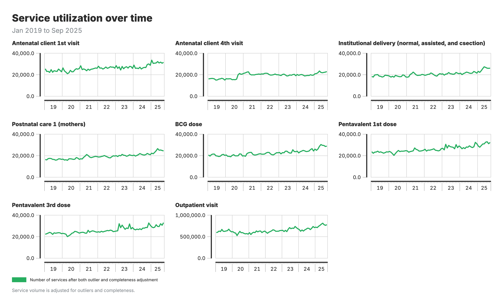
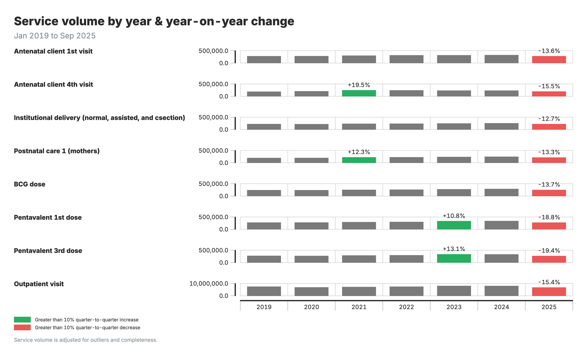
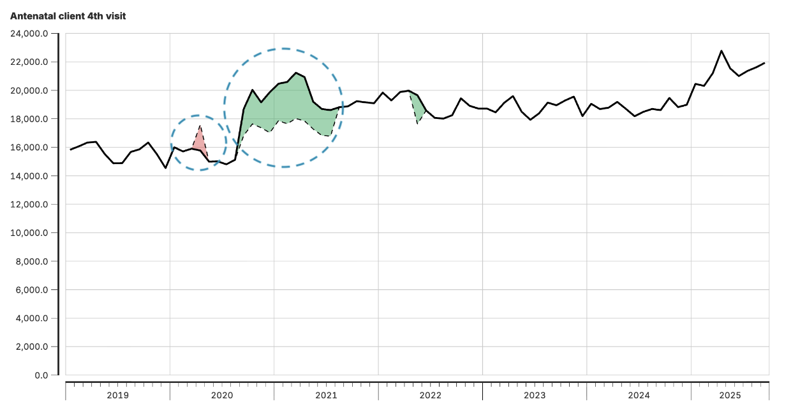

<!-- AUTO-TRANSLATED from 06a_service_utilization.md -->
<!-- Add REVIEWED marker after human review to protect from overwrite -->

# Análise da utilização dos serviços

## Antecedentes e objetivo

### Objetivo do módulo

O módulo de Utilização de Serviços analisa os padrões de prestação de serviços de saúde para detetar e quantificar as perturbações nos volumes de serviços ao longo do tempo. Identifica desvios dos padrões esperados de prestação de serviços e estima a magnitude dessas interrupções a nível nacional, provincial e distrital.

Utilizando o controlo estatístico do processo e métodos baseados em regressão, o módulo compara os volumes de serviços observados com os níveis esperados derivados de tendências históricas e padrões sazonais. Isto permite distinguir a variação rotineira e previsível (como aumentos sazonais de casos de malária) de perturbações substanciais de serviços, incluindo declínios súbitos em serviços de SRMNIA-N - como imunização e cuidados de saúde materna ou infantil - durante períodos de conflito ou emergências de saúde pública.

A análise produz estimativas quantificadas de défices e excedentes de serviços, permitindo que as mudanças na prestação de serviços sejam sistematicamente medidas e comparadas ao longo do tempo e a níveis geográficos.

### Fundamentação analítica

Os dados de utilização de serviços fornecem uma visão sobre a forma como as populações acedem aos serviços essenciais de saúde, mas os volumes observados podem variar por várias razões, incluindo sazonalidade, mudanças de política, choques externos (como pandemias, catástrofes naturais ou conflitos), limitações de qualidade de dados e mudanças na disponibilidade de serviços. Sem uma análise sistemática, é difícil distinguir a variação normal das perturbações materiais na prestação de serviços.

Este módulo aplica uma abordagem padronizada e baseada em dados para identificar desvios na utilização de serviços e quantificar a sua magnitude. Os resultados permitem a deteção de problemas emergentes na prestação de serviços, a comparação entre níveis geográficos e o acompanhamento ao longo do tempo, incluindo durante períodos de perturbação e recuperação. Os resultados estão estruturados para serem utilizados na monitorização de rotina, na elaboração de relatórios analíticos e na avaliação de alterações no desempenho dos serviços de saúde.

### Pontos-chave

| Componente | Detalhes |
|-----------|---------|
| **Inputs** | Volumes de serviço ajustados do Módulo 2 (`M2_adjusted_data.csv` e `M2_adjusted_data_admin_area.csv`)<br>Sinalizadores de outlier do Módulo 1 (`M1_output_outliers.csv`)<br>HMIS em bruto (`hmis_ISO3.csv`) - apenas para `facility_id` a `admin_area_1` lookup |
| **Outputs** | Dados ajustados de passagem (`M3_service_utilization.csv`)<br>Sinalizadores de perturbação (`M3_chartout.csv`)<br>Impactos quantificados por nível geográfico (`M3_disruptions_analysis_admin_area_1` a `_4.csv`)<br>Resumos de défice/excedente (`M3_all_indicators_shortfalls_admin_area_1` a `_4.csv`) |
| Detetar e quantificar as perturbações na prestação de serviços através de uma análise em duas fases: as cartas de controlo identificam quando ocorrem as perturbações, a regressão em painel quantifica a sua magnitude

---

## Fluxo de trabalho analítico

### Visão geral das etapas analíticas

O módulo funciona em duas partes sequenciais, cada uma com um objetivo distinto:

**Parte 1: Análise da carta de controlo** - Identifica padrões invulgares nos volumes de serviço

1. **Preparar os dados**: Carregar os dados dos serviços de saúde, remover os valores anómalos previamente identificados, agregar ao nível geográfico adequado e preencher os meses em falta utilizando a interpolação.

2. **Modelar os padrões esperados**: Para cada combinação de indicador de saúde e área geográfica, usar métodos estatísticos robustos para estimar como devem ser os volumes de serviços com base em tendências históricas e padrões sazonais (por exemplo, contabilizar aumentos previsíveis de casos de malária durante a estação das chuvas).

3. **Detetar desvios**: Comparar os volumes de serviço reais com os padrões esperados e identificar desvios significativos utilizando várias regras de deteção:
   - **Perturbações acentuadas**: Um único mês com desvios extremos
   - **Quedas sustentadas**: Declínios graduais ao longo de vários meses
   - **Quedas sustentadas**: Períodos consistentemente abaixo dos níveis esperados
   - **Subidas sustentadas**: Períodos consistentemente acima dos níveis esperados
   - **Padrões de dados em falta**: Lacunas nos relatórios que podem indicar problemas

4. **Sinalizar períodos de interrupção**: Marcar os meses em que é detectado qualquer padrão de interrupção, assegurando que os meses recentes são sempre assinalados para revisão.

**Parte 2: Análise de perturbações** - Quantifica o impacto das perturbações identificadas

5. **Aplicar modelos de regressão**: Utilizar regressão de painel a vários níveis geográficos (nacional, provincial, distrital) para estimar o volume de serviços alterado durante os períodos de perturbação assinalados, controlando as tendências e a sazonalidade.

6. **Calcular défices e excedentes**: Comparar os volumes previstos com os volumes reais para quantificar a magnitude das interrupções em números absolutos e percentagens.

7. **Gerar resultados**: Criar ficheiros de resumo que mostrem os impactos das perturbações em cada nível geográfico, prontos para visualização e elaboração de relatórios.

### Diagrama de fluxo de trabalho

<iframe src="../resources/diagrams/mod3_workflow.html" width="100%" height="800" style="border: 1px solid #ccc; border-radius: 4px;" title="Fluxo de trabalho interativo do módulo 3"></iframe>

### Pontos de decisão chave

**Nível geográfico de análise**

O módulo suporta a análise de perturbações a várias escalas geográficas. Os utilizadores podem limitar a análise aos níveis nacional e provincial, o que é computacionalmente mais rápido e adequado para a monitorização de rotina, ou alargar a análise aos níveis distrital e distrital para obter informações mais granulares para uma investigação e resposta direcionadas.

**Seleção do nível da carta de controlo

O nível a que as cartas de controlo são calculadas determina onde é efectuada a modelação estatística. Isto é configurado através de dois sinalizadores e segue a convenção FASTR em que os números de nível administrativo mais elevado correspondem a unidades geográficas mais pequenas.

- **Configuração predefinida (ambos os sinalizadores definidos como FALSE)**
  As cartas de controlo são calculadas a um nível subnacional intermédio (**admin_area_2**). Os volumes de serviço são agregados a este nível e a estimativa de tendências, o cálculo do limite de controlo e a deteção de perturbações são efectuados para cada combinação geografia-indicador. Esta opção é a mais eficiente em termos de cálculo e é adequada para a monitorização de rotina.

- **MODELO_DE_DISTRITO_EXECUTADO = TRUE**
  As cartas de controlo são calculadas a um nível subnacional mais fino (**admin_area_3**). Os volumes de serviço são agregados a unidades geográficas mais pequenas, permitindo a deteção de perturbações localizadas que podem ser ocultadas em níveis de agregação mais elevados. Esta opção é mais intensiva em termos de cálculo, mas proporciona uma maior resolução espacial.

- **RUN_ADMIN_AREA_4_ANALYSIS = TRUE**
  As cartas de controlo são calculadas ao nível geográfico mais granular disponível (**admin_area_4**). Isto permite a identificação de perturbações altamente localizadas ou ao nível das instalações. É a opção que consome mais recursos e é normalmente utilizada para análises direcionadas ou de diagnóstico.

O nível do gráfico de controle de qualidade selecionado determina onde a modelagem estatística é conduzida, incluindo a estimativa de tendências, o cálculo do limite de controle e a marcação de interrupções. Independentemente do nível a que as cartas de controlo são calculadas, os resultados das perturbações são agregados e comunicados a todos os níveis geográficos disponíveis (nacional e subnacional).


**Definições de sensibilidade

O módulo utiliza limiares estatísticos configuráveis para definir o que constitui uma perturbação. As definições mais sensíveis (limiares mais baixos) assinalam desvios mais pequenos dos padrões esperados e são adequadas para fins de alerta precoce. As definições mais conservadoras (limiares mais elevados) restringem a deteção a desvios maiores e são úteis para se concentrarem em perturbações importantes.

**Tratamento da exaustividade dos relatórios

O módulo aceita versões alternativas das contagens de serviços produzidas pelo Módulo 2, permitindo aos utilizadores escolher entre analisar os volumes brutos comunicados ou os volumes ajustados para a exaustividade dos relatórios. Isto proporciona flexibilidade para alinhar a análise das perturbações com diferentes pressupostos de qualidade dos dados.


### Processamento de dados e resultados

**Transformação de entrada**

O módulo começa com contagens mensais de serviços ao nível dos estabelecimentos (por exemplo, entregas comunicadas por cada estabelecimento). Estes dados são agregados ao nível geográfico selecionado. As observações identificadas como anómalas no Módulo 1 são excluídas para evitar que os valores anómalos influenciem a estimativa das tendências e os limites de controlo.

**Estimativa e deteção de padrões

Utilizando métodos estatísticos robustos, o módulo estima os padrões de utilização de serviços esperados para cada indicador e unidade geográfica com base em dados históricos, tendo em conta as tendências a longo prazo e a sazonalidade. Os meses em que os volumes de serviço observados se desviam significativamente destes padrões esperados são assinalados como potenciais interrupções.

**Quantificação dos impactos das perturbações

Para os períodos identificados como perturbados, são utilizados modelos baseados em regressão para estimar os volumes de serviço contrafactuais - que representam a utilização esperada na ausência de perturbações. As diferenças entre os volumes previstos e observados são calculadas para quantificar os défices ou excedentes de serviço.

**Estrutura de saída

Os resultados finais apresentam métricas de perturbação a vários níveis geográficos, desde resumos nacionais a resultados locais pormenorizados. Os dados originais reportados são preservados, com campos adicionais que fornecem valores esperados, sinais de perturbação e impactos quantificados.

---

### Resultados da análise e visualização

A análise FASTR gera quatro resultados visuais principais para a utilização do serviço:

**1. Mudança no volume de serviço**

Gráfico de barras que mostra os volumes anuais de serviços por região e indicador, com anotações sobre a variação percentual anual.

variação do volume de serviços ao longo do tempo](resources/default_outputs/Module3_1_Change_in_service_volume.png)

**2. Serviços efectivos versus serviços previstos (nacional)**

Gráfico de linhas que compara os volumes de serviços observados com as previsões do modelo a nível nacional.

número de serviços efetivo vs. previsto a nível nacional](resources/default_outputs/Module3_2_Actual_vs_expected_national.png)

**3. Serviços reais versus serviços previstos (subnacional)**

Gráficos de linhas por região, comparando os volumes observados com os padrões esperados.

número de serviços efectivos e previstos a nível subnacional] (resources/default_outputs/Module3_3_Actual_vs_expected_subnational.png)

**4. Variação do volume devido a ajustamentos da qualidade dos dados**

Gráfico de barras agrupadas que compara os volumes de serviços em quatro cenários de ajustamento: sem ajustamento, apenas ajustamento de outlier, apenas ajustamento de integralidade e ambos os ajustamentos.

variação do volume devido a ajustamentos da qualidade dos dados] (resources/default_outputs/Module3_4_Volume_change_adjustments.png)

**Guia de interpretação**

Para o gráfico de variação do volume de serviços (saída 1):

- **Barras**: Volumes anuais de serviços por região
- **Anotações**: Variação anual em percentagem entre anos consecutivos

Para os gráficos reais versus esperados (resultados 2-3):

- **Linha preta**: Volumes de serviço reais (observados)
- **Áreas sombreadas a vermelho**: Períodos de défice (real abaixo do previsto)
- **Áreas sombreadas a verde**: Períodos de excedente (real acima do esperado)

Para o gráfico de variação de volume (output 4):

- **Quatro barras por ano**: Cada barra representa um cenário de ajuste diferente
- Comparar as alturas das barras para ver como os ajustamentos afectam os volumes comunicados

---

## Referência detalhada

### Parâmetros de configuração

??? "Parâmetros de análise do núcleo"

    | Parâmetro | Predefinição | Tipo | Descrição | Orientação de ajuste |
    |-----------|---------|------|-------------|-----------------|
    | `COUNTRY_ISO3` | "ISO3" | String | Código de país de três letras | Defina o código do seu país (por exemplo, "RWA", "UGA", "ZMB") |
    | `SELECTEDCOUNT` | "count_final_outliers" | String | Coluna de dados usada para modelagem de regressão | Opções: `count_final_none`, `count_final_outliers`, `count_final_completeness`, `count_final_both` |
    | `VISUALIZATIONCOUNT` | "count_final_outliers" | String | Coluna de dados utilizada para visualização | As mesmas opções que `SELECTEDCOUNT`; podem ser diferentes se pretender modelar uma e traçar outra |

??? "Parâmetros da carta de controlo"

    | Parâmetro | Padrão | Tipo | Descrição | Orientação de ajuste
    |-----------|---------|------|-------------|-----------------|
    | `SMOOTH_K` | 7 | Inteiro (ímpar) | Tamanho da janela da mediana móvel em meses | Valores maiores = tendências mais suaves, menos sensibilidade. Deve ser um número ímpar (por exemplo, 5, 7, 9, 11)
    | Limiar de unidades MAD para perturbações acentuadas | Menor = mais sensível (por exemplo, 1,0), maior = mais conservador (por exemplo, 2,0) |
    | 0,90 | Numérico | Limite de proporção para quedas sustentadas | 0,90 = sinalizar se estiver abaixo de 90% do esperado (queda de 10%). Use 0,80 para o limite de queda de 20%
    | Se o valor real diferir do previsto em >10%, use o valor previsto nas visualizações

    **Nota**: `RISE_THRESHOLD` é automaticamente calculado como `1 / DIP_THRESHOLD` (predefinição: ~1,11) para espelhar simetricamente a deteção de interrupções.

??? "Parâmetros de análise geográfica"

    | Parâmetro | Predefinição | Tipo | Descrição | Orientação de ajuste
    |-----------|---------|------|-------------|-----------------|
    | Nível geográfico para cartas de controlo | Definido automaticamente com base em `RUN_DISTRICT_MODEL` e `RUN_ADMIN_AREA_4_ANALYSIS` |
    | `RUN_DISTRICT_MODEL` | FALSE | Lógico | Se deve executar regressões admin_area_3 | Definir TRUE para análise a nível distrital (aumenta o tempo de execução) |
    | Se deve executar a análise admin_area_4 | Definir TRUE para análise de nível mais fino (muito lento para grandes conjuntos de dados) |

??? "Parâmetros da fonte de dados"

    | Parâmetro | Predefinição | Tipo | Descrição |
    |-----------|---------|------|-------------|
    | `PROJECT_DATA_HMIS` | "hmis_ISO3.csv" | String | Nome do ficheiro para os dados brutos do HMIS

??? "Guia de seleção de parâmetros"

    **Para análise de alta sensibilidade** (deteção de perturbações mais pequenas):
    - `MADS_THRESHOLD = 1.0`
    - `DIP_THRESHOLD = 0.95` (queda de 5%)
    - `SMOOTH_K = 5` (menos suavização)

    **Para uma análise conservadora** (apenas grandes perturbações):
    - `MADS_THRESHOLD = 2.0`
    - `DIP_THRESHOLD = 0.80` (queda de 20%)
    - `SMOOTH_K = 9` ou `11` (mais suavização)

    **Para um tempo de execução mais rápido**:
    - `RUN_DISTRICT_MODEL = FALSE`
    - `RUN_ADMIN_AREA_4_ANALYSIS = FALSE`
    - `CONTROL_CHART_LEVEL = "admin_area_2"`

### Especificações de entrada/saída

??? "Requisitos de entrada"

    #### Entradas primárias

    1. **`M2_adjusted_data.csv`** (fonte de dados principal)
       - Resultado do Módulo 2 (Ajustes de qualidade dos dados)
       - Contém contagens de serviços ajustadas com diferentes pressupostos de exaustividade
       - Colunas obrigatórias: `facility_id`, `indicator_common_id`, `period_id`, `count_final_none`, `count_final_outliers`, `count_final_completeness`, `count_final_both`

    2. **`M1_output_outliers.csv`**
       - Resultado do módulo 1 (avaliação da qualidade dos dados)
       - Contém `outlier_flag` para identificar e excluir pontos de dados anómalos
       - Colunas obrigatórias: `facility_id`, `indicator_common_id`, `period_id`, `outlier_flag`

    3. **`hmis_ISO3.csv`** (utilizado apenas para pesquisa geográfica)
       - Ficheiro HMIS em bruto utilizado unicamente para extrair o mapeamento facility_id → admin_area_1
       - Necessário porque M2_adjusted_data.csv não inclui admin_area_1
       - Colunas obrigatórias: `facility_id`, `admin_area_1`

    #### Requisitos de dados

    - **Cobertura temporal**: Mínimo de 12 meses de dados para modelação sazonal
    - **Integralidade dos dados**: Os meses em falta são preenchidos por interpolação
    - **Integralidade geográfica**: Dados a níveis administrativos especificados
    - **Dados de contagem**: Contagens inteiras não negativas (as previsões são limitadas a zero)

    ### Saídas

    #### 1. Resultados da carta de controlo

    **`M3_chartout.csv`**

    **Finalidade**: Contém as perturbações marcadas da análise do gráfico de controlo de qualidade

    **Colunas**:

    - `admin_area_*`: Identificador geográfico (o nível depende de `CONTROL_CHART_LEVEL`)
    - `indicator_common_id`: Código do indicador do serviço de saúde
    - `period_id`: Período de tempo no formato AAAAMM
    - `tagged`: Sinal binário (1 = perturbação detectada, 0 = normal)

    **Utilização**: Identifica os meses que requerem investigação adicional para cada combinação indicador-geografia

    **`M3_service_utilization.csv`**

    **Finalidade**: Cópia de passagem dos dados ajustados para visualização

    **Origem**: Cópia direta de `M2_adjusted_data.csv`

    **Uso**: Fornece dados de base para traçar volumes de serviço reais

    **`M3_memory_log.txt`**

    **Finalidade**: Rastreia o uso de memória durante a execução

    **Utilização Diagnóstico para otimização do desempenho e resolução de problemas

    #### 2. Resultados da análise de perturbações

    **`M3_disruptions_analysis_admin_area_1.csv`** (Nível nacional - sempre gerado)

    **Colunas**:

    - `admin_area_1`: Nome do país
    - `indicator_common_id`: Indicador do serviço de saúde
    - `period_id`: Período de tempo (AAAAMM)
    - `count_sum`: Volume real de serviços (soma de todos os estabelecimentos)
    - `count_expect_sum`: Volume de serviço esperado (soma das previsões)
    - `count_expected_if_above_diff_threshold`: Valor para plotagem (esperado se |diferença| > DIFERENÇA, caso contrário, real)

    **`M3_disruptions_analysis_admin_area_2.csv`** (Nível de província - sempre gerado)

    **Coluna adicional**: `admin_area_2` (nome da província/região)

    **A mesma estrutura**: Como o ficheiro admin_area_1 mas desagregado por província

    **`M3_disruptions_analysis_admin_area_3.csv`** (Nível distrital - condicional)

    **Gerado quando**: `RUN_DISTRICT_MODEL = TRUE`

    **Colunas adicionais**: `admin_area_2`, `admin_area_3`

    **A mesma estrutura**: Como acima, mas desagregada por distrito

    **`M3_disruptions_analysis_admin_area_4.csv`** (Nível de bairro - condicional)

    **Gerado quando**: `RUN_ADMIN_AREA_4_ANALYSIS = TRUE`

    **Colunas adicionais**: `admin_area_2`, `admin_area_3`, `admin_area_4`

    **Aviso**: Ficheiro de tamanho muito grande para países com muitas alas

    #### 3. Ficheiros de resumo de défice/excedente

    **`M3_all_indicators_shortfalls_admin_area_*.csv`** (um para cada nível geográfico)

    **Objetivo**: Métricas pré-calculadas de défice e excedente para relatórios

    **Colunas comuns**:

    - Identificador(es) geográfico(s): `admin_area_*`
    - `indicator_common_id`: Indicador do serviço de saúde
    - `period_id`: Período de tempo (AAAAMM)
    - `count_sum`: Volume real de serviços
    - `count_expect_sum`: Volume de serviço previsto
    - `shortfall_absolute`: Número absoluto de serviços em falta (se a interrupção for negativa)
    - `shortfall_percent`: Percentagem do défice em relação ao previsto
    - `surplus_absolute`: Número absoluto de serviços em excesso (se a perturbação for positiva)
    - `surplus_percent`: Percentagem de excedente em relação ao previsto

    **Nota**: Se os níveis geográficos opcionais forem desactivados, são criados ficheiros de espaço reservado vazios para compatibilidade com os processos a jusante.

    #### Ficheiros temporários (limpos automaticamente)

    Durante a execução, o módulo cria ficheiros de lote temporários para gestão da memória:
    - `M3_temp_controlchart_batch_*.csv`
    - `M3_temp_indicator_batch_*.csv`
    - `M3_temp_province_batch_*.csv`
    - `M3_temp_district_batch_*.csv`
    - `M3_temp_admin4_batch_*.csv`

    Estes ficheiros são automaticamente eliminados após a conclusão bem sucedida. Se o script falhar, estes ficheiros podem permanecer e serão limpos na próxima execução.

### Documentação das funções principais

??? "`robust_control_chart(panel_data, selected_count)`"

    **Purpose**: Identifica anomalias na utilização de serviços utilizando regressão robusta e limites de controlo baseados em MAD.

    **Entradas**:

    - `panel_data`: Dados de séries cronológicas para uma combinação específica de indicador-geografia
    - `selected_count`: Nome da coluna que contém as contagens de volume de serviço a analisar

    **Processo

    1. Ajusta um modelo linear robusto (utilizando `MASS::rlm()`) com controlos sazonais e tendências temporais
    2. Aplica a suavização da mediana móvel aos valores previstos para reduzir o ruído
    3. Calcula os resíduos e normaliza-os utilizando o Desvio Absoluto Mediano (DMA)
    4. Aplica uma lógica de marcação baseada em regras para identificar diferentes tipos de perturbação
    5. Assinala automaticamente os meses mais recentes para garantir uma deteção atempada

    **Resultados**:

    - `count_predict`: Volume de serviço previsto a partir de regressão robusta
    - `count_smooth`: Previsões suavizadas usando a mediana móvel
    - `residual`: Diferença entre valores reais e suavizados
    - `robust_control`: Resíduo padronizado (residual/MAD)
    - `tagged`: Sinalizador binário (1 = perturbação detectada, 0 = variação normal)
    - Sinalizadores adicionais: `tag_sharp`, `tag_sustained`, `tag_sustained_dip`, `tag_sustained_rise`, `tag_missing`

    **Caraterísticas principais**:

    - Trata dados em falta com interpolação
    - Utiliza regressão robusta para minimizar a influência de outliers
    - Emprega várias regras de deteção de perturbações para diferentes padrões
    - Assegura previsões não negativas (as contagens não podem ser negativas)

    ### Modelos de regressão de painel

    A análise de perturbações utiliza modelos de regressão em painel (`fixest::feols()`) a vários níveis geográficos. São executadas regressões separadas para cada unidade geográfica em cada nível, com erros padrão agrupados para ter em conta a correlação dentro da área.

    **Modelo a nível nacional** (Área administrativa 1):

    ```r
    count ~ date + factor(month) + tagged
    ```

    Regressão única em todas as instalações, com erros padrão agrupados a nível distrital (`admin_area_3`) quando está disponível mais do que um distrito; caso contrário, não agrupados.

    **Modelos a nível da província** (Área administrativa 2):

    ```r
    count ~ date + factor(month) + tagged
    ```

    Regressão separada para cada província, com erros padrão agrupados a nível distrital quando mais de um distrito está disponível; caso contrário, não agrupados.

    **Modelos a nível distrital** (Área administrativa 3 - opcional):

    ```r
    count ~ date + factor(month) + tagged
    ```

    Execução de regressão separada para cada distrito (é necessário um mínimo de 10 observações), com erros padrão agrupados ao nível do distrito (`admin_area_4`) quando está disponível mais do que um distrito; caso contrário, não agrupados.

    **Modelos a nível de distrito** (Área administrativa 4 - opcional):

    ```r
    count ~ date + factor(month) + tagged
    ```

    Execução de regressão separada para cada ala/unidade mais fina (é necessário um mínimo de 8 observações, sem agrupamento).

    ### Funções de apoio

    **`mem_usage(msg)`**: Rastreia e regista o consumo de memória durante a execução

    **Processamento de dados**:

    - Processamento em lote com ficheiros temporários baseados em disco para eficiência de memória
    - Operações eficientes de data.table para grandes conjuntos de dados
    - Estratégias progressivas de agregação e fusão

### Métodos estatísticos e algoritmos

??? "Análise de cartas de controlo"

    Os volumes de serviço são agregados ao nível geográfico especificado (configurável através de `CONTROL_CHART_LEVEL`). O pipeline remove os outliers (`outlier_flag == 1`), preenche os meses em falta e filtra os meses de baixo volume (<50% do volume médio global).

    Um modelo de regressão robusto estima os volumes de serviço esperados por indicador × área geográfica (`panelvar`). Uma mediana móvel centrada é aplicada para suavizar os valores previstos. Os valores residuais (reais - suavizados) são normalizados utilizando o MAD. As perturbações são identificadas através de um sistema de marcação baseado em regras.

    #### Regras de deteção de perturbações

    Cada regra é controlada por parâmetros definidos pelo utilizador, permitindo a personalização da sensibilidade e do comportamento da lógica de deteção:

    **Perturbações acentuadas**: Sinaliza um único mês quando o residual padronizado (residual dividido pelo MAD) excede um limite:

    $$ \left| \frac{\text{residual}}{\text{MAD}} \right| \geq \text{MADS_THRESHOLD} $$

    - **Parâmetro:** `MADS_THRESHOLD` (predefinição: `1.5`)
    - Valores mais baixos tornam a deteção mais sensível a picos ou quedas súbitas.

    **Quedas sustentadas**: Assinala uma queda sustentada se:

    - Três meses consecutivos apresentarem desvios ligeiros (residual padronizado ≥ 1 mas < `MADS_THRESHOLD`), e
    - O mês atual tiver um resíduo padronizado ≥ 1,5 (limiar codificado).

    Isso captura declínios mais lentos e compostos.

    **Quedas sustentadas**: Sinaliza períodos em que o volume real cai consistentemente abaixo de uma proporção definida do volume esperado (previsão suavizada):

    $$ \text{count_original} < \text{DIP_THRESHOLD} \times \text{count_smooth} $$

    - **Parâmetro:** `DIP_THRESHOLD` (predefinição: `0.90`)
    - Os utilizadores podem ajustar este parâmetro para detetar descidas mais profundas ou menos profundas (por exemplo, `0.80` para uma descida de 20%).

    **Subidas sustentadas**: Simétrico a quedas, assinala períodos de desempenho superior consistente:

    $$ \text{count_original} > \text{LIMIAR_DE_ELEVAÇÃO} \times \text{count_smooth} $$

    - **Parâmetro:** `RISE_THRESHOLD` (predefinição: `1 / DIP_THRESHOLD`, por exemplo, `1.11`)
    - Os utilizadores podem ajustar este parâmetro para detetar picos de volume ascendentes.

    **Dados em falta**: Assinala quando 2 ou mais dos últimos 3 meses têm um volume de serviço em falta (`NA`) ou nulo.

    - **Regra fixa**.

    **Substituição de cauda recente**: Assinala automaticamente todos os meses nos últimos 6 meses de dados para garantir que as tendências recentes são revistas, mesmo que a marcação baseada no modelo não seja conclusiva.

    - **Regra fixa**.

    **Marcação final**: A um mês é atribuído `tagged = 1` se **qualquer** das seguintes condições for satisfeita:

    - `tag_sharp == 1`
    - `tag_sustained == 1`
    - `tag_sustained_dip == 1`
    - `tag_sustained_rise == 1`
    - `tag_missing == 1`
    - É abrangido pelos 6 meses mais recentes (`last_6_months == 1`)

    ### Modelo de regressão robusto

    **Ajuste do modelo**:

    Se ≥12 observações e >12 datas únicas:

    $$Y_{it} = \beta_0 + \sum \gamma_m \cdot \text{mês}_m + \beta_1 \cdot \text{data} + \epsilon_{it}$$

    Se apenas ≥12 observações:

    $$Y_{it} = \beta_0 + \beta_1 \cdot \text{date} + \epsilon_{it}$$

    Se os dados forem insuficientes: utilizar a mediana dos valores observados.

    **Aplicar a suavização da mediana móvel às previsões**:

    $$ \text{count_smooth}_{it} = \text{Median}(\text{count_predict}_{t-k}, \dots, \text{count_predict}_t, \dots, \text{count\_predict}_{t+k}) $$

    - **Parâmetro:** `SMOOTH_K` (predefinição: 7, tem de ser ímpar)
    - Um `SMOOTH_K` maior suaviza mais; um menor retém mais variação.

    **Calcular os resíduos**:

    $$ \text{residual}_{it} = \text{contagem_original}_{it} - \text{contagem_suave}_{it} $$

    **Padronizar os resíduos utilizando MAD**:

    $$ \text{controlo_robusto}_{it} = \text{residual}_{it} / \text{MAD}_i $$$

    ### Modelos de regressão da análise de perturbações

    Depois de as anomalias serem identificadas e guardadas no `M3_chartout.csv`, a análise de perturbações quantifica o seu impacto utilizando modelos de regressão. Estes modelos estimam a alteração da utilização do serviço durante os períodos de perturbação assinalados, ajustando as tendências a longo prazo e as variações sazonais.

    Para cada indicador, estimamos:

    $$ Y_{it} = \beta_0 + \beta_1 \cdot \text{date} + \sum_{m=1}^{12} \gamma_m \cdot \text{month}_m + \beta_2 \cdot \text{tagged} + \epsilon_{it} $$

    em que:
    - $Y_{it}$ é o volume de serviço observado,
    - $\text{date}$ capta as tendências temporais,
    - $\text{month}_m$ controla a sazonalidade,
    - $\text{tagged}$ é a dummy de perturbação (da análise da carta de controlo),
    - $\epsilon_{it}$ é o termo de erro.

    O coeficiente do `tagged` ($\beta_2$) mede a variação relativa da utilização dos serviços durante as perturbações assinaladas. São efectuadas regressões separadas a nível nacional, provincial e distrital para avaliar o impacto em diferentes escalas geográficas.

    #### Regressão a nível nacional

    A regressão a nível nacional estima a forma como a utilização dos serviços muda a nível nacional quando ocorre uma perturbação. Em vez de analisar províncias ou distritos individuais separadamente, este modelo considera os dados de todo o país numa única regressão. Os erros são agrupados ao nível geográfico mais baixo disponível (`lowest_geo_level`), normalmente distritos.

    **Especificação do modelo

    $$Y_{it} = \beta_0 + \beta_1 \cdot \text{date} + \sum_{m=1}^{12} \gamma_m \cdot \text{mês} + \beta_2 \cdot \text{tagged} + \epsilon_{it}$$

    Onde:
    - $Y_{it}$ = volume (por exemplo, número de entregas)
    - $\text{date}$ = tendência temporal
    - $\text{month}_m$ = controlo da sazonalidade (variável de fator)
    - $\text{tagged}$ = dummy para o período de perturbação
    - $\epsilon_{it}$ = termo de erro, agrupado a nível distrital (`admin_area_3`)

    #### Regressão ao nível da província

    A regressão de perturbação a nível provincial estima como a utilização de serviços muda a nível provincial quando ocorre uma perturbação. Ao contrário do modelo a nível nacional, esta abordagem efectua regressões separadas para cada província para captar as variações regionais.

    **Especificação do modelo** (executado separadamente para cada província):

    $$Y_{it} = \beta_0 + \beta_1 \cdot \text{date} + \sum_{m=1}^{12} \gamma_m \cdot \text{mês} + \beta_2 \cdot \text{tagged} + \epsilon_{it}$$

    Onde:
    - $Y_{it}$ = volume (por exemplo, número de entregas)
    - $\text{date}$ = tendência temporal
    - $\text{mês}_m$ = controlo da sazonalidade (variável de fator)
    - $\text{tagged}$ = dummy para o período de perturbação
    - $\epsilon_{it}$ = termo de erro, agrupado a nível distrital

    #### Regressão a nível distrital

    A regressão de perturbação a nível distrital estima como a utilização de serviços muda a nível distrital quando ocorre uma perturbação. Esta abordagem efectua regressões separadas para cada distrito para captar variações localizadas.

    **Especificação do modelo** (executado separadamente para cada distrito):

    $$Y_{it} = \beta_0 + \beta_1 \cdot \text{date} + \sum_{m=1}^{12} \gamma_m \cdot \text{mês} + \beta_2 \cdot \text{tagged} + \epsilon_{it}$$

    Onde:
    - $Y_{it}$ = volume (por exemplo, número de entregas)
    - $\text{date}$ = tendência temporal
    - $\text{mês}_m$ = controlo da sazonalidade (variável de fator)
    - $\text{tagged}$ = dummy para o período de perturbação
    - $\epsilon_{it}$ = termo de erro, agrupado ao nível do bairro (`admin_area_4`) se existirem vários agrupamentos

    #### Resultados da regressão

    Cada nível de regressão produz os seguintes resultados:

    **Valores esperados (`expect_admin_area_*`)**: Volume de serviço previsto ajustado para sazonalidade e tendências.

    **Efeito de perturbação (`b_admin_area_*`)**: Variação relativa estimada durante as interrupções:

    $$ b_{\text{admin_area_*}} = -\frac{\text{diff mean}}{\text{predict mean}} $$

    **Coeficiente de tendência (`b_trend_admin_area_*`)**: Reflecte a tendência a longo prazo.

    - Positivo = aumento da utilização do serviço
    - Negativo = diminuição da utilização dos serviços
    - Próximo de zero = tendência estável

    **P-value (`p_admin_area_*`)**: Mede a significância estatística do efeito de perturbação.

    - Valores mais baixos = evidência mais forte de uma verdadeira perturbação

    ### Métodos estatísticos utilizados

    **Regressão robusta (`MASS::rlm`)**:

    - Utiliza mínimos quadrados iterativamente reponderados (IRLS)
    - Minimiza a influência de outliers e valores extremos
    - Mais resistente à especificação incorrecta do modelo do que os mínimos quadrados normais
    - Predefinição: ponderação de Huber com um máximo de 100 iterações

    **MAD (Desvio Absoluto Mediano)**:

    - Medida robusta de escala/variabilidade
    - Fórmula: `MAD = median(|x - median(x)|)`
    - Mais resistente aos valores atípicos do que o desvio padrão
    - Utilizado para normalizar os resíduos para deteção de anomalias

    **Regressão de painel (`fixest::feols`)**:

    - Estimativa de efeitos fixos com erros padrão agrupados
    - Tem em conta a correlação dentro do grupo nos erros
    - Mais eficiente do que os pacotes tradicionais de regressão em painel
    - Lida com painéis desequilibrados de forma graciosa

    **Agrupamento geográfico**:

    - As regressões utilizam erros padrão agrupados ao nível geográfico mais baixo disponível
    - Isto tem em conta a correlação dentro da área nos padrões de prestação de serviços
    - Exemplo: O modelo nacional agrupa-se por distrito, o modelo provincial agrupa-se por distrito
    - Evita a subestimação dos erros-padrão e os falsos positivos

### Etapas da análise detalhada

??? "Parte 1: Análise da carta de controlo"

    #### Passo 1: Preparar os dados

    - Carregar volumes de serviço ajustados do `M2_adjusted_data.csv`.
    - Carregar os sinalizadores de outlier do `M1_output_outliers.csv`.
    - Carregar o HMIS em bruto apenas para extrair a pesquisa `facility_id → admin_area_1` (depois descartar).
    - Fundir os sinais de anomalia em dados ajustados por estabelecimento × indicador × mês.
    - Remover as linhas assinaladas como anómalas (`outlier_flag == 1`).
    - Criar uma variável `date` a partir de `period_id` e extrair `year` e `month`.
    - Criar um `panelvar` único para cada combinação área geográfica-indicador.
    - Agregar os dados ao nível geográfico especificado, somando o `count_model` (com base no `SELECTEDCOUNT`) por data.
    - Preencher os meses em falta em cada painel para garantir a continuidade.
    - Preencher os metadados em falta utilizando o preenchimento progressivo e retroativo.

    #### Passo 2: Filtrar os meses de baixo volume

    - Calcule o volume de serviço médio global para cada `panelvar`.
    - Se o `count_original` for <50% da média global, elimine o valor definindo-o como `NA`.

    #### Passo 3: Aplicar a regressão e a suavização

    Estimar o volume de serviço esperado usando regressão robusta e, em seguida, suavizar a tendência prevista.

    - Ajuste a regressão robusta (`rlm`) para cada painel usando uma das três especificações de modelo com base na disponibilidade de dados.
    - Aplicar a suavização da mediana móvel às previsões utilizando o tamanho da janela `SMOOTH_K`.
    - Se a suavização não for possível (por exemplo, nas extremidades da série), voltar às previsões do modelo.
    - Calcular os resíduos: real - suavizado
    - Padronizar os resíduos usando MAD

    Esta variável de controlo normalizada é utilizada para detetar anomalias no Passo 4.

    #### Passo 4: Perturbações de etiquetas

    Aplique a marcação baseada em regras para identificar possíveis interrupções. Cada regra é regida por parâmetros definidos pelo utilizador que podem ser ajustados em termos de sensibilidade:

    - **Rupções agudas**: Marcar se `|robust_control| ≥ MADS_THRESHOLD`
    - **Quedas sustentadas**: Marcar se 3 meses consecutivos tiverem desvios ligeiros (residual ≥ 1 mas < MADS_THRESHOLD) e o mês atual tiver um residual ≥ 1,5
    - **Quedas sustentadas**: Marcar toda a sequência se `count_original < DIP_THRESHOLD × count_smooth` durante mais de 3 meses
    - **Subidas sustentadas**: Marcar toda a sequência se `count_original > RISE_THRESHOLD × count_smooth` durante mais de 3 meses
    - **Dados em falta**: Marcar se 2+ dos últimos 3 meses estiverem em falta ou forem zero
    - **Substituição de cauda recente**: Marcar automaticamente todos os meses nos últimos 6 meses de dados

    É atribuído a um mês o código `tagged = 1` se qualquer uma das condições acima referidas for satisfeita. Os registos marcados são guardados em `M3_chartout.csv` e passados para a análise de perturbação.

??? "Parte 2: Análise de perturbações"

    #### Etapa 1: Preparação de dados

    - O conjunto de dados `M3_chartout` é fundido com o conjunto de dados principal para integrar a variável `tagged`, que identifica as perturbações assinaladas.
    - O nível geográfico mais baixo disponível (`lowest_geo_level`) é identificado para o agrupamento, com base na coluna `admin_area_*` de maior resolução disponível.

    #### Passo 2: Regressão a nível nacional

    Para cada `indicator_common_id`, estimar o modelo a nível nacional com erros agrupados a nível distrital.

    - Um modelo de regressão de painel é aplicado a nível nacional, estimando o volume de serviços esperado (`expect_admin_area_1`) para cada indicador.
    - O modelo controla as tendências a longo prazo e os padrões sazonais na utilização dos serviços.
    - Quando uma perturbação (`tagged = 1`) é identificada, os volumes de serviços previstos são ajustados através da remoção do efeito estimado da perturbação para isolar o seu impacto.
    
    #### Passo 3: Regressão intermédia a nível subnacional

    Para cada combinação `indicator_common_id` × `admin_area_2`, são estimados modelos subnacionais, com erros padrão agrupados a um nível administrativo inferior.

    - É aplicado um modelo de regressão de painel de efeitos fixos a um nível subnacional intermédio, estimando os volumes de serviço esperados (`expect_admin_area_2`) e tendo em conta as caraterísticas geográficas variáveis no tempo.
    - O modelo controla as tendências históricas e a sazonalidade.
    - Quando é identificada uma perturbação, os volumes previstos são ajustados para isolar o efeito da perturbação.

    #### Passo 4: Regressão fina a nível subnacional (se `RUN_DISTRICT_MODEL = TRUE`)

    Para cada combinação de `indicator_common_id` × `admin_area_3`, são estimados modelos subnacionais, com erros padrão agrupados ao nível do distrito (`admin_area_4`) quando está disponível mais do que um distrito.

    - Um modelo de regressão de painel de efeitos fixos é aplicado a um nível subnacional fino, estimando os volumes de serviço esperados (`expect_admin_area_3`).
    - Os painéis com menos de 10 observações são ignorados.
    - O modelo controla as tendências históricas e a sazonalidade.
    - Quando é identificada uma perturbação, os volumes previstos são ajustados para isolar o efeito da perturbação.

    #### Passo 5: Regressão ao nível da ala (se `RUN_ADMIN_AREA_4_ANALYSIS = TRUE`)

    Para cada combinação `indicator_common_id` × `admin_area_4`, os modelos ao nível da ala são estimados sem agrupamento.

    - Um modelo de regressão de painel é aplicado ao nível geográfico mais fino, estimando os volumes de serviço esperados (`expect_admin_area_4`).
    - Os painéis com menos de 8 observações são ignorados.
    - O modelo controla as tendências históricas e a sazonalidade.
    - Quando é identificada uma perturbação, os volumes previstos são ajustados para isolar o efeito da perturbação.

    #### Passo 6: Preparar os resultados para visualização

    Uma vez que os valores esperados tenham sido calculados para cada nível (país, província, distrito), o pipeline compara os valores previstos e reais para avaliar a magnitude da perturbação.

    Para cada mês e indicador, o pipeline calcula:

    - **Diferença absoluta e percentual** entre os valores previstos e reais:

    $$ \text{diff_percent} = 100 \times \frac{\text{previsto} - \text{real}}{\text{previsto}} $$

    - É utilizado um parâmetro de limiar configurável `DIFFPERCENT` (predefinição: `10`) para determinar quando é que uma perturbação é significativa.

        Se a diferença percentual for superior a ±10%, o valor esperado (previsto) é retido e utilizado para a elaboração de gráficos e estatísticas de resumo. Caso contrário, é utilizado o valor real observado.

        Isto assegura que as flutuações menores não conduzem a perturbações artificiais na visualização, enquanto os desvios significativos são preservados.

    - O valor final ajustado para a representação gráfica é armazenado num campo como `count_expected_if_above_diff_threshold`.

        Este valor reflecte
        - A contagem prevista (se o desvio for superior ao limiar), ou
        - A contagem real (se estiver dentro do intervalo aceitável).

    Esta lógica é aplicada de forma consistente em todos os níveis de administração. Estes valores ajustados são depois exportados como parte dos ficheiros de saída finais para cada nível.


### Exemplos de código

??? "Exemplo 1: Executando o módulo com configurações padrão"

    ```r
    # Set working directory
    setwd("/path/to/module/directory")

    # Load required libraries
    library(data.table)
    library(lubridate)
    library(zoo)
    library(MASS)
    library(fixest)
    library(stringr)
    library(dplyr)
    library(tidyr)

    # Configure country
    COUNTRY_ISO3 <- "SLE"
    PROJECT_DATA_HMIS <- "hmis_SLE.csv"

    # Use default settings (admin_area_2 level analysis)
    RUN_DISTRICT_MODEL <- FALSE
    RUN_ADMIN_AREA_4_ANALYSIS <- FALSE

    # Run the module
    source("03_module_service_utilization.R")
    ```

    Com as predefinições, o módulo executa a análise da carta de controlo ao nível de admin_area_2 e produz estimativas de perturbação para os níveis nacional e regional.

??? "Exemplo 2: Ajustar a sensibilidade de deteção de perturbações"

    ```r
    # Make disruption detection more sensitive (lower thresholds)
    MADS_THRESHOLD <- 1.0        # Flag at 1 MAD (default: 1.5)
    DIP_THRESHOLD <- 0.95        # Flag if <95% of expected (default: 0.90)
    SMOOTH_K <- 5                # Smaller smoothing window (default: 7)

    # Make disruption detection less sensitive (higher thresholds)
    MADS_THRESHOLD <- 2.0        # Flag only at 2 MADs
    DIP_THRESHOLD <- 0.80        # Flag only if <80% of expected
    SMOOTH_K <- 9                # Larger smoothing window

    source("03_module_service_utilization.R")
    ```

    **Caso de uso**: Ajustar a sensibilidade com base na qualidade dos dados. Os dados mais ruidosos podem exigir limiares menos sensíveis para evitar falsos positivos.

??? "Exemplo 3: Executar análise a nível distrital"

    ```r
    # Enable district-level analysis (slower but more detailed)
    RUN_DISTRICT_MODEL <- TRUE
    RUN_ADMIN_AREA_4_ANALYSIS <- FALSE

    source("03_module_service_utilization.R")
    ```

    **Caso de uso**: Quando são necessários padrões de perturbação a nível distrital para a planificação de programas subnacionais.

    **Nota**: A análise a nível distrital aumenta substancialmente o tempo de execução. Para países grandes, considere a execução durante a noite.

??? "Exemplo 4: Seleção do cenário de ajustamento para análise"

    ```r
    # Use unadjusted data for sensitivity analysis
    SELECTEDCOUNT <- "count_final_none"
    VISUALIZATIONCOUNT <- "count_final_none"

    # Use outlier-adjusted only
    SELECTEDCOUNT <- "count_final_outliers"
    VISUALIZATIONCOUNT <- "count_final_outliers"

    # Use fully adjusted data (default)
    SELECTEDCOUNT <- "count_final_both"
    VISUALIZATIONCOUNT <- "count_final_both"

    source("03_module_service_utilization.R")
    ```

    **Caso de uso**: Comparar estimativas de perturbação em diferentes cenários de ajustamento da qualidade dos dados.

??? "Exemplo 5: Otimização de memória para grandes conjuntos de dados"

    ```r
    # Reduce batch sizes for memory-constrained environments
    BATCH_SIZE_CC <- 50      # Control chart batches (default: 100)
    BATCH_SIZE_IND <- 3      # Indicator batches (default: 5)
    BATCH_SIZE_PROV <- 10    # Province batches (default: 20)
    BATCH_SIZE_DIST <- 10    # District batches (default: 15)

    # Disable memory-intensive analyses
    RUN_DISTRICT_MODEL <- FALSE
    RUN_ADMIN_AREA_4_ANALYSIS <- FALSE

    source("03_module_service_utilization.R")
    ```

    **Caso de uso**: Executando em máquinas com RAM limitada (<8GB).

??? "Exemplo 6: Uso programático de saídas"

    ```r
    # Load disruption analysis outputs
    disruptions_national <- read.csv("M3_disruptions_analysis_admin_area_1.csv")
    shortfalls_national <- read.csv("M3_all_indicators_shortfalls_admin_area_1.csv")

    # Calculate total service shortfall by indicator
    annual_shortfalls <- shortfalls_national %>%
      mutate(year = period_id %/% 100) %>%
      group_by(indicator_common_id, year) %>%
      summarise(
        total_expected = sum(count_expect_sum, na.rm = TRUE),
        total_actual = sum(count_sum, na.rm = TRUE),
        total_shortfall = sum(shortfall_absolute, na.rm = TRUE),
        avg_shortfall_pct = mean(shortfall_percent, na.rm = TRUE),
        .groups = "drop"
      )

    # Identify months with largest disruptions
    worst_months <- shortfalls_national %>%
      filter(shortfall_percent > 10) %>%
      arrange(desc(shortfall_percent)) %>%
      head(20)

    # Load control chart results for detailed analysis
    control_chart <- read.csv("M3_chartout.csv")

    # Count tagged periods by indicator
    tagged_summary <- control_chart %>%
      group_by(indicator_common_id) %>%
      summarise(
        total_periods = n(),
        tagged_periods = sum(tagged, na.rm = TRUE),
        pct_tagged = 100 * tagged_periods / total_periods,
        .groups = "drop"
      )
    ```


### Resolução de problemas

??? "Problemas e soluções comuns"

    #### Problema: O script trava com o erro "sem memória

    **Soluções**:

    - Reduzir o tamanho dos lotes (por exemplo, `BATCH_SIZE_IND <- 3`)
    - Definir `RUN_DISTRICT_MODEL <- FALSE`
    - Definir `RUN_ADMIN_AREA_4_ANALYSIS <- FALSE`
    - Fechar outras aplicações
    - Executar numa máquina com mais RAM

    ---

    #### Problema: Aviso "modelo falhou ao convergir"

    **Explicação**: A regressão robusta não convergiu totalmente em 100 iterações

    **Impacto**: Normalmente mínimo - a convergência parcial é muitas vezes suficiente

    **Soluções**:

    - Verificar a qualidade dos dados para esse painel
    - Aumentar o parâmetro `maxit` na chamada `rlm()` (linha 229, 247)
    - Geralmente, é seguro ignorar se apenas alguns painéis forem afectados

    ---

    #### Problema: Muitas linhas vazias nos arquivos de saída

    **Explicação**: Dados insuficientes para certas combinações indicador-geografia

    **Soluções**:

    - Comportamento esperado para indicadores esparsos
    - Filtrar os resultados para valores que não estão a faltar
    - Considerar a agregação a um nível geográfico superior

    ---

    #### Questão: Todos os meses recentes assinalados como interrupções

    **Explicação**: Marcação automática dos últimos 6 meses

    **Objetivo**: Assegurar que as tendências recentes são analisadas mesmo sem provas estatísticas sólidas

    **Soluções**:

    - Comportamento esperado, não é um bug
    - Rever manualmente os meses recentes
    - Ajustar a lógica `last_6_months` se necessário (linha 333)

    ---

    #### Problema: a variável `tagged` foi retirada da regressão

    **Mensagem**: Variável automaticamente definida como 0

    **Explicação**: Nenhuma variação em `tagged` dentro desse painel (tudo 0 ou tudo 1)

    **Soluções**:

    - Esperado em painéis sem interrupções ou com interrupções constantes
    - Não é um erro - o efeito de perturbação está corretamente definido como 0

    ---

    #### Problema: Os ficheiros temporários permanecem após a execução

    **Causa**: O script travou antes da limpeza

    **Soluções

    - Eliminar manualmente: `M3_temp_*.csv`
    - Ou voltar a executar o script (limpeza automática no início)

    ---

    #### Problema: Resultados muito diferentes em diferentes níveis geográficos

    **Explicação**: A agregação geográfica diferente capta padrões diferentes

    **Exemplo**: A tendência nacional pode ser estável enquanto alguns distritos registam grandes interrupções

    **Soluções**:

    - Comportamento esperado - não é um erro
    - Utilize o nível apropriado para a sua pergunta de investigação
    - Verifique os padrões entre os níveis para obter robustez

### Notas de uso

??? "Diretrizes de interpretação"

    **Efeitos de perturbação (b_admin_area_*)**:

    - Valores negativos indicam quebras no volume de serviço durante os períodos de interrupção
    - Valores positivos indicam excedentes de volume de serviço durante os períodos de interrupção
    - Valores mais próximos de zero indicam impactos menores das perturbações

    **Valores de P (p_admin_area_*)**:

    - Valores < 0,05 sugerem perturbações estatisticamente significativas
    - Valores > 0,05 podem indicar uma variação normal e não verdadeiras perturbações

    **Coeficientes de tendência (b_trend_admin_area_*)**:

    - Os valores positivos indicam um aumento da utilização do serviço ao longo do tempo
    - Valores negativos indicam uma diminuição da utilização do serviço ao longo do tempo
    - Valores próximos de zero indicam padrões de utilização estáveis

??? "Escolher as saídas a analisar"

    **Para visões gerais rápidas**:

    - Comece com mapas de calor ano a ano para identificar áreas/indicadores com mudanças notáveis
    - Utilizar gráficos de controlo para indicadores com suspeitas de perturbações
    - Concentrar-se em indicadores de grande volume onde os padrões são mais fiáveis

    **Para análise subnacional**:

    - O nível provincial fornece padrões fiáveis com um volume de dados suficiente
    - O nível distrital é útil para identificar problemas locais, mas os padrões podem ser mais ruidosos
    - Verificação cruzada dos padrões distritais com as tendências provinciais para garantir a coerência

    **Para análises baseadas no tempo**:

    - Períodos recentes (últimos 6 meses) podem mostrar padrões preliminares que podem mudar
    - Procurar mudanças sustentadas (3+ meses consecutivos) em vez de picos num único mês
    - Considerar eventos conhecidos (mudanças de política, campanhas, greves) ao interpretar

??? "Limitações"

    **Limitações estatísticas**:

    - A deteção de perturbações funciona melhor com mais de 2 anos de dados históricos
    - Os indicadores de baixo volume podem mostrar alterações percentuais elevadas a partir de pequenas alterações absolutas
    - Os padrões sazonais requerem pelo menos 12 meses de dados para serem modelados com exatidão

    **Advertências de interpretação**:

    - As perturbações detectadas exigem uma investigação contextual (nem todas são problemáticas)
    - As perturbações positivas (excedentes) podem refletir campanhas, recuperação ou problemas de dados
    - Padrões geográficos afectados pela distribuição das instalações e pelas taxas de notificação

    **Requisitos de dados**:

    - Os resultados dependem da qualidade da exaustividade e dos ajustamentos de módulos anteriores
    - A falta de identificadores geográficos reduzirá a cobertura da análise subnacional

### Variação trimestral em relação ao trimestre anterior

Para além das comparações ano a ano, o FASTR gera métricas de variação trimestral (QoQ) que comparam o trimestre atual com o trimestre anterior. A variação trimestral é calculada como: (trimestre atual - trimestre anterior) / trimestre anterior × 100. As alterações que excedem ±10% são assinaladas para investigação de acompanhamento para determinar se reflectem uma alteração programática real, um problema de qualidade dos dados ou um evento esperado (como uma campanha). Esta métrica complementa a visualização ano a ano, capturando mudanças mais recentes na prestação de serviços.

---

<!--
////////////////////////////////////////////////////////////////////
// //
// _____ _ _____ ____ _____ ____ ___ _ _ _____ _ _ //
// / ____| | |_ _| _ \| ____| / ___/ _ \| \ | |_ _| \ | |//
// | (___ | | | | | | | | |__ | | | | | | \| | | | | \| |//
// \___ \| | | | | | | | | | __| | | | | | | . ` | | | | . ` |//
// ____) | |___ _| |_| |_| | |____ | |__| |_| | |\ | | | | |\ |//
// |_____/|_____|_____|____/|______| \____\___/|_| \_|| |_| |_| \_|//
// //
// Editar os diapositivos do workshop abaixo desta linha //
// //
////////////////////////////////////////////////////////////////////
-->

<!-- SLIDE:m6_0 -->
## Dos dados ajustados à análise

O módulo 2 produziu o conjunto de dados ajustado - outliers substituídos, gaps imputados. O módulo 3 é onde esse trabalho compensa.

No Módulo 3, os utilizadores podem analisar **os dados ajustados ou não ajustados**, dependendo da pergunta. Os dados ajustados informam-no sobre os padrões subjacentes; os dados não ajustados informam-no sobre o que foi efetivamente comunicado.

Os próximos diapositivos abordam duas perspectivas da prestação de serviços:

- **Utilização do serviço** - volumes ao longo do tempo, comparações trimestrais e anuais
- **Deteção de perturbações** - um modelo estatístico que assinala quando os volumes reais se desviam do que o historial da instituição prevê

A estimativa da cobertura, que divide os serviços por uma população-alvo, vem depois.
<!-- /SLIDE -->

<!-- SLIDE:m6_1 -->
## Análise da utilização de serviços

A análise da utilização de serviços mede as mudanças nos volumes de serviços de saúde ao longo do tempo. Ao comparar a prestação de serviços em anos consecutivos, esta análise identifica aumentos ou diminuições nos padrões de utilização entre regiões e indicadores.

A principal métrica é a **variação percentual anual**, que quantifica as mudanças na prestação de serviços entre anos consecutivos. A fórmula calcula a diferença entre os volumes do ano atual e do ano anterior, expressa em percentagem do ano anterior. As alterações superiores a ±10% são assinaladas para revisão, uma vez que representam normalmente alterações significativas na prestação de serviços e não uma variação normal.
<!-- /SLIDE -->

<!-- SLIDE:m6_1c -->
## Produção de utilização de serviços

<div style="display: flex; gap: 1em;">
<div style="flex: 1.2;">



</div>
<div style="flex: 1; font-size: 0.85em;">

**O que você vê:** Gráfico de linhas mostrando volumes absolutos de serviços ao longo do tempo por indicador.

**O que ele mostra:** Contagem de serviços prestados a cada mês/trimestre.

**Interpretação:** Procure tendências gerais (aumento/diminuição) e quedas ou picos repentinos que possam necessitar de investigação.

</div>
</div>
<!-- /SLIDE -->

<!-- SLIDE:m6_1d -->
## Variação trimestral em relação ao trimestre anterior

<div style="display: flex; gap: 1em;">
<div style="flex: 1.2;">


</div>
<div style="flex: 1; font-size: 0.85em;">

**O que você vê:** Mapa de calor comparando o trimestre atual com o trimestre anterior, com alterações >±10% sinalizadas.

**Fórmula:** Variação QoQ % = (trimestre atual - trimestre anterior) / trimestre anterior × 100

**Interpretação:** As alterações assinaladas requerem acompanhamento - trata-se de uma alteração real do programa, de um problema de dados ou de um evento esperado?

</div>
</div>
<!-- /SLIDE -->

<!-- SLIDE:m6_1e -->
<!-- _class: output -->
## Mudança de ano para ano output

<div class="output-layout">
<div class="output-viz">



</div>
<div class="output-text">

**O que você vê:** Mapa de calor comparando o período atual com o mesmo período do ano passado, com alterações >±10% sinalizadas.

**Fórmula:** Variação anual % = (este ano - ano passado) / ano passado × 100

**Interpretação:** As alterações assinaladas requerem acompanhamento - trata-se de uma alteração real do programa, de um problema de dados ou de um evento esperado?

</div>
</div>
<!-- /SLIDE -->

<!-- SLIDE:m6_1f -->
## Direccionalidade do indicador

Uma alteração assinalada só se torna uma descoberta quando se sabe em que direção se quer que o indicador se mova.

- **Os indicadores de utilização de serviços** (consultas de ANC, assistência qualificada ao parto, imunizações) devem **aumentar** à medida que os sistemas se reforçam.
- **Os indicadores de morbilidade e mortalidade** (mortes maternas, desnutrição grave, incidência de doenças) devem **cair**.
- **Os indicadores de intervalo** situam-se entre dois limiares. A taxa de cesarianas é o caso canónico - demasiado baixa significa falta de acesso, demasiado alta significa excesso de medicalização.

Um aumento de 15% nos cuidados pós-natais é uma boa notícia; o mesmo aumento nas mortes maternas não é. Verifique sempre a direção antes de ler o sinal.
<!-- /SLIDE -->

<!-- SLIDE:m6_2 -->
## Deteção de interrupções e excedentes nos serviços

A abordagem FASTR para detetar interrupções de serviço e excedentes utiliza **regressão de séries temporais interrompidas (ITS)** com efeitos fixos ao nível do estabelecimento. Este quadro estatístico permite uma interpretação mais significativa e a comparação de dados de contagem em áreas subnacionais, possibilitando uma visão que os dados brutos por si só não podem fornecer.

Ao concentrar-se em mudanças e tendências significativas em vez de números brutos, esta abordagem permite uma análise mais exacta e comparável. As alterações anteriores grandes e inesperadas nos dados históricos são removidas para estabelecer uma linha de base limpa. As alterações inesperadas de volume são então estimadas comparando os volumes observados com os volumes esperados com base em tendências históricas e sazonalidade.
<!-- /SLIDE -->

<!-- SLIDE:m6_2b -->
<!-- _class: output -->
## Como funciona a deteção de interrupções

<div class="output-layout">
<div class="output-text">

A análise prossegue em quatro etapas. Em primeiro lugar, **utilizamos dados anteriores para definir expectativas**, examinando vários anos de dados históricos para compreender o padrão típico de cada mês, tendo em conta as alterações sazonais regulares.

Em segundo lugar, **detectamos alterações invulgares** comparando os volumes de serviço actuais com estas expectativas. Os volumes que são muito superiores ou inferiores ao esperado são assinalados como alterações invulgares que requerem investigação.

Em terceiro lugar, **tratamos de perturbações passadas** ajustando os dados históricos para eliminar alterações anteriores grandes e inesperadas. Isto garante que os eventos pontuais não distorcem a nossa compreensão do que constitui uma prestação de serviços "normal".

Em quarto lugar, **detectamos as perturbações ao longo do tempo** examinando as tendências para identificar mudanças claras na utilização dos serviços de saúde ao longo de vários meses, distinguindo entre flutuações temporárias e mudanças sustentadas.

</div>
<div class="output-viz">



</div>
</div>

<!--
NOTAS DO APRESENTADOR:
1. Usando dados passados para definir expectativas: Começamos por analisar os dados dos serviços de saúde dos últimos anos para compreender o padrão típico de cada mês. Por exemplo, se virmos que certos serviços costumam ter volumes mais altos ou mais baixos durante determinados meses, usamos esse padrão para ajudar a definir as expectativas "normais" para cada mês no futuro. Este passo ajuda-nos a ter em conta as alterações sazonais regulares, como um aumento das consultas relacionadas com a gripe durante os meses de inverno.
2. Detetar alterações invulgares: Assim que soubermos o que é "normal", podemos comparar os volumes de serviço actuais com essas expectativas. Se virmos que o número de pessoas que utilizam um determinado serviço de saúde é muito superior ou inferior ao esperado, consideramos que se trata de uma alteração invulgar. Isto pode dever-se a factores como uma epidemia, uma catástrofe natural ou mesmo alterações na política de cuidados de saúde.
3. Lidar com perturbações passadas: Para manter a precisão da nossa análise, ajustamos os nossos dados históricos removendo grandes alterações inesperadas anteriores. Isto garante que os eventos pontuais do passado não distorcem a nossa compreensão do que é "normal" atualmente.
4. Detetar perturbações ao longo do tempo: Por último, analisamos as tendências ao longo do tempo para ver se existem mudanças claras na utilização dos serviços de saúde. Por exemplo, se houver uma queda nas vacinações de rotina durante vários meses, podemos identificar esse facto como uma perturbação a longo prazo. Ao monitorizar estas tendências, temos uma melhor noção se as mudanças são apenas sazonais ou se podem dever-se a problemas maiores e duradouros que precisam de atenção.
-->
<!-- /SLIDE -->

<!-- SLIDE:m6_2d -->
<!-- _class: output -->
## Saída de interrupção de serviço

<div class="output-layout">
<div class="output-viz">


</div>
<div class="output-text">

**O que você vê:** Gráfico comparando o volume de serviço real com o volume esperado previsto pelo modelo, levando em conta a sazonalidade.

**O que ele mostra:** Desvios em relação ao esperado - interrupções (abaixo) ou excedentes (acima).

**Interpretação:** Considerar factores externos: COVID, greves, rupturas de stock, campanhas. Os desvios persistentes justificam uma investigação do programa.

</div>
</div>
<!-- /SLIDE -->

<!-- SLIDE:m6_5a -->
## Módulo de utilização de serviços: Parâmetros de configuração

**Nota:** Esses parâmetros se aplicam apenas à análise de interrupção. A análise de utilização de serviço ano a ano não requer configuração.

<div style="font-size: 0.75em;">

| Parâmetro | Descrição |
|-----------|-------------|
| Variável de contagem para modelagem** | Contagem ajustada usada para calcular valores esperados |
| Variável de contagem para visualização** | Contagem ajustada plotada como real observada
| Regressões na área administrativa 3. Sim = detalhada; Não = mais rápida
| Executar análise da área administrativa 4** | Análise de nível mais fino. Lenta em grandes conjuntos de dados
| Limite MAD** | MADs sinalizando desvios acentuados. Padrão 1,5; maior = menos sensível
| Janela de suavização (k)** | Meses na mediana móvel (ímpar). Predefinição 7
| Limiar de queda** | Sinalizar se real < X × esperado. Padrão 0,9 (≥10% de queda); 0,8 = apenas grandes quedas
| Limite de % de diferença** | Sinalizador quando o real difere do esperado em > X%. Padrão 10 |

</div>

<!--
NOTAS DO APRESENTADOR:
- Estes parâmetros controlam a sensibilidade da deteção de perturbações
- Limite MAD: menor = mais sensível (mais sinalizadores), maior = mais conservador
- Janela de suavização: maior = tendências mais suaves, menor = capta mudanças rápidas
- Limite de mergulho: 0.9 significa assinalar se <90% do esperado (queda de 10%)
- A análise a nível distrital é opcional - aumenta significativamente o tempo de cálculo
- Seleção da variável de contagem: utilizar "ambos" para a maioria das análises (outlier + exaustividade ajustada)
- Os parâmetros podem ser ajustados com base no contexto do país e na qualidade dos dados
-->
<!-- /SLIDE -->

<!-- ═══════════════════════════════════════════════════════════════════════════
     SLIDES CONDENSADOS: Métodos + Interpretação Combinados
═══════════════════════════════════════════════════════════════════════════ -->

<!-- SLIDE:m6_s00 -->
## Análise de dados

Três coisas que o FASTR faz com os seus dados:

1. **Utilização de serviços** - quantos serviços foram prestados, como é que isso mudou de trimestre para trimestre e de ano para ano, e que direção significa "bom" para cada indicador.
2. **Deteção de interrupções** - separar as quedas reais no serviço da variação sazonal normal, aprendendo o ritmo esperado de cada indicador.
3. **Cobertura** - combinar o numerador (volume do HMIS) com um denominador defensável (população-alvo) para estimar a percentagem de pessoas que precisavam de um serviço e o receberam.

Cada sub-tópico termina com os resultados FASTR que verá na plataforma e como os ler.
<!-- /SLIDE -->

<!-- SLIDE:m6_s0b -->
## O que é utilização de serviço?

A utilização de serviços mede **quantos serviços de saúde estão a ser prestados** - consultas pré-natais, vacinas, partos, consultas externas - por quem, onde e ao longo do tempo.

O seu acompanhamento indica-lhe se o sistema está a satisfazer a procura. Uma tendência crescente pode mostrar um melhor acesso; uma tendência decrescente pode indicar uma rutura de stock, uma greve, um choque ou uma diminuição real das necessidades.

O FASTR calcula a utilização dos serviços a partir dos dados do HMIS, discriminados por indicador, geografia e período de tempo. Os resultados que se seguem mostram o volume em si, a forma como se alterou em termos trimestrais e anuais, e qual a direção das boas notícias para cada indicador.
<!-- /SLIDE -->

<!-- SLIDE:m6_s2 -->
## Utilização de serviços: detectando mudanças

Os volumes de serviços sobem e descem naturalmente - mais casos de malária na estação das chuvas, por exemplo. Como é que se distingue uma **variação normal** de uma **perturbação real**?

**O FASTR aprende o ritmo normal** de cada indicador em cada área:
- Tendência a longo prazo (os serviços estão a crescer ou a diminuir?)
- Sazonalidade (que meses são normalmente mais elevados?)

Depois compara os **volumes observados** com os **volumes esperados**:

- **abaixo** do esperado → potencial perturbação (rutura de stock? greve? conflito?)
- **Acima do esperado → aumento invulgar (campanha de vacinação? novo programa?)

O módulo mede **quantos serviços foram perdidos ou ganhos** e durante que período.
<!-- /SLIDE -->


<!-- SLIDE:m6_s1 -->
## Análise da utilização de serviços

A análise da utilização de serviços acompanha o número de serviços de saúde que estão a ser prestados ao longo do tempo, identificando tendências, anomalias e comparações entre áreas.

<div style="display: flex; gap: 1em;">
<div style="flex: 1.2;">


</div>
<div style="flex: 1; font-size: 0.85em;">

**O que você vê:** Gráfico de linhas mostrando volumes absolutos de serviços ao longo do tempo por indicador.

**O que ele mostra:** Contagem de serviços prestados a cada mês/trimestre.

**Interpretação:** Procure tendências gerais (aumento/diminuição) e quedas ou picos repentinos que possam necessitar de investigação.

</div>
</div>
<!-- /SLIDE -->

<!-- SLIDE:m6_s1b -->
<!-- _class: output -->
## Mudança de ano para ano output

<div class="output-layout">
<div class="output-viz">


</div>
<div class="output-text">

**O que você vê:** Mapa de calor comparando o período atual com o mesmo período do ano passado, com alterações >±10% sinalizadas.

**Fórmula:** Variação anual % = (este ano - ano passado) / ano passado × 100

**Interpretação:** As alterações assinaladas requerem acompanhamento - trata-se de uma alteração real do programa, de um problema de dados ou de um evento esperado?

</div>
</div>

<!--
NOTAS DO APRESENTADOR:
- Versão condensada combinando tendências de serviço e comparação anual
- O primeiro gráfico mostra volumes absolutos - identifica padrões gerais
- O segundo gráfico mostra as alterações relativas - mais fácil de comparar entre indicadores
- As alterações anuais >±10% são assinaladas - mas o limiar é configurável
- Para as alterações assinaladas, perguntar: problema de qualidade dos dados, alteração real do programa ou evento externo?
- Estes resultados não requerem denominadores de população - útil quando os denominadores são incertos
-->
<!-- /SLIDE -->

<!-- SLIDE:m6_s0c -->
## Direccionalidade do indicador

Uma alteração assinalada só se torna uma descoberta quando se sabe em que direção se quer que o indicador se mova.

- **Os indicadores de utilização de serviços** (consultas de ANC, assistência qualificada ao parto, imunizações) devem **aumentar** à medida que os sistemas se reforçam.
- **Os indicadores de morbilidade e mortalidade** (mortes maternas, desnutrição grave, incidência de doenças) devem **cair**.
- **Os indicadores de intervalo** situam-se entre dois limiares. A taxa de cesarianas é o caso canónico - demasiado baixa significa falta de acesso, demasiado alta significa excesso de medicalização.

Um aumento de 15% nos cuidados pós-natais é uma boa notícia; o mesmo aumento nas mortes maternas não é. Verifique sempre a direção antes de ler o sinal.
<!-- /SLIDE -->

<!-- SLIDE:m6_s1a -->
## Variação trimestral

<div style="display: flex; gap: 1em;">
<div style="flex: 1.2;">


</div>
<div style="flex: 1; font-size: 0.85em;">

**O que você vê:** Mapa de calor comparando o trimestre atual com o trimestre anterior, com alterações >±10% sinalizadas.

**Fórmula:** Variação QoQ % = (trimestre atual - trimestre anterior) / trimestre anterior × 100

**Interpretação:** As alterações assinaladas requerem acompanhamento - trata-se de uma alteração real do programa, de um problema de dados ou de um evento esperado?

</div>
</div>

<!--
NOTAS DO APRESENTADOR:
- As alterações QoQ >±10% são sinalizadas - mas o limite é configurável
- Para alterações sinalizadas, perguntar: problema de qualidade dos dados, alteração real do programa ou evento externo?
- Estes resultados não requerem denominadores de população - útil quando os denominadores são incertos
- Complementar à visão anual: capta as alterações mais recentes
-->
<!-- /SLIDE -->

<!-- SLIDE:m6_s2b -->
<!-- _class: output -->
## Saída de interrupção de serviço

<div class="output-layout">
<div class="output-viz">


</div>
<div class="output-text">

**O que você vê:** Gráfico comparando o volume de serviço real com o volume esperado previsto pelo modelo, levando em conta a sazonalidade.

**O que ele mostra:** Desvios em relação ao esperado - interrupções (abaixo) ou excedentes (acima).

**Interpretação:** Considerar factores externos: COVID, greves, rupturas de stock, campanhas. Os desvios persistentes justificam uma investigação do programa.

</div>
</div>

<!--
NOTAS DO APRESENTADOR:
- Versão condensada centrada na metodologia de deteção de perturbações
- Principais conclusões: as contagens brutas são difíceis de interpretar sem contexto
- O modelo estatístico fornece uma base de referência "esperada", tendo em conta a sazonalidade
- Perturbação = desvio sustentado abaixo do esperado, não apenas um único mês mau
- Ao interpretar as perturbações, ter em conta factores externos: COVID, greves, etc.
- Os desvios persistentes justificam uma investigação mais aprofundada das causas
- Pode ser efectuada a nível nacional, provincial ou distrital, dependendo da qualidade dos dados
-->
<!-- /SLIDE -->
