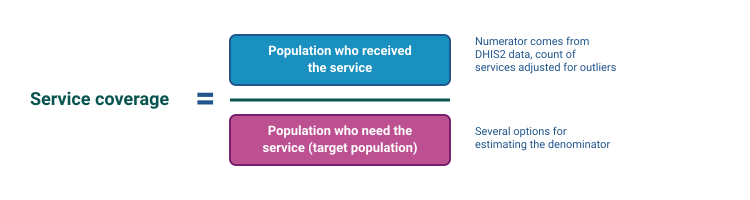
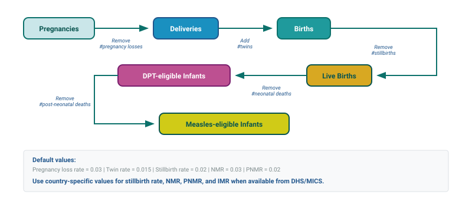
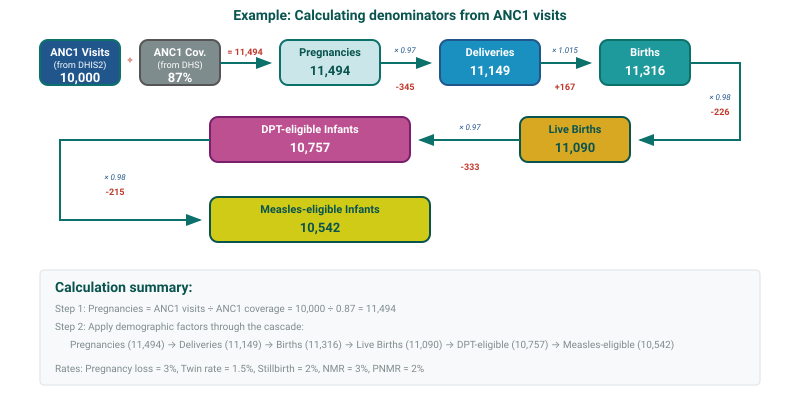
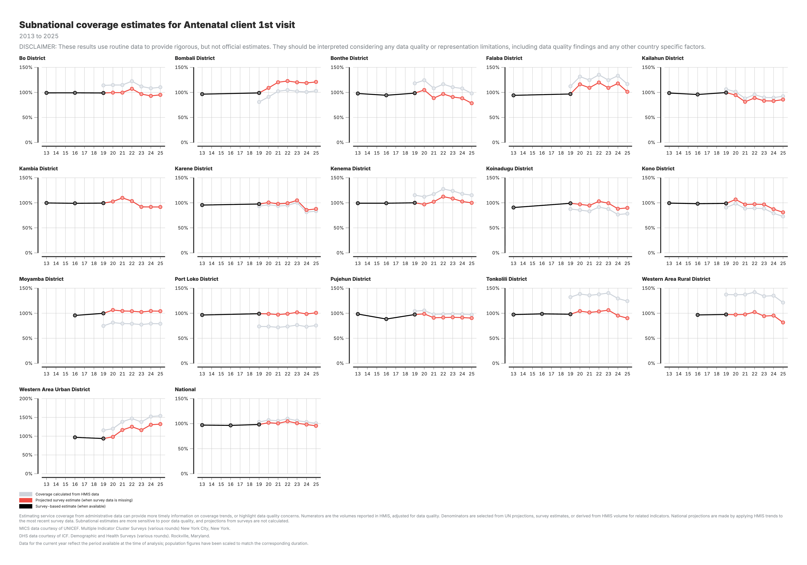

<!-- AUTO-TRANSLATED from 06b_coverage_estimates.md -->
<!-- Add REVIEWED marker after human review to protect from overwrite -->

# Estimativas de cobertura

## Antecedentes e objetivo

### Objetivo do módulo

O módulo de Estimativas de Cobertura quantifica a cobertura dos serviços de saúde integrando volumes de serviços administrativos ajustados do Sistema de Informação de Gestão da Saúde (HMIS), projecções populacionais das Perspectivas da População Mundial das Nações Unidas (UN WPP) e dados de inquéritos aos agregados familiares. Embora o módulo se baseie atualmente nos Inquéritos Demográficos e de Saúde (DHS) e nos Inquéritos de Indicadores Múltiplos (MICS), foi concebido para acomodar outras fontes de inquéritos representativos a nível nacional, à medida que forem ficando disponíveis. O módulo calcula a percentagem da população-alvo que recebeu um determinado serviço de saúde, fornecendo uma medida padronizada do alcance do serviço para utilização na monitorização, comparação e análise a jusante.
O módulo está estruturado em dois componentes.

**A Parte 1** constrói denominadores da população-alvo utilizando várias abordagens metodológicas e avalia o seu desempenho comparando as estimativas de cobertura resultantes com os valores de referência dos inquéritos disponíveis para cada indicador de saúde.

**A Parte 2** permite que os utilizadores revejam e ajustem as selecções de denominadores com base em considerações programáticas e alarguem as estimativas de cobertura baseadas em inquéritos ao longo do tempo, utilizando tendências derivadas de dados administrativos, nos casos em que os dados dos inquéritos não estão disponíveis.

Em conjunto, estes componentes convertem volumes de serviços administrativos em estimativas de cobertura padronizadas que podem ser examinadas ao longo do tempo e em todos os níveis geográficos, e utilizadas em contextos analíticos e de monitorização.

### Fundamentação analítica

A cobertura dos serviços de saúde é uma métrica essencial para avaliar o desempenho e a equidade do sistema de saúde. Embora o Módulo 2 produza volumes de serviços ajustados, estes números por si só não indicam até que ponto os serviços chegam às populações que se destinam a servir. As estimativas de cobertura colocam a prestação de serviços em contexto, relacionando os volumes de serviços com as necessidades da população.

Este módulo aborda os principais desafios na estimativa da cobertura, incluindo:

- **Múltiplas fontes de dados**: Integra dados do HMIS com dados de inquéritos

- **Incerteza do denominador**: Diferentes métodos para estimar as populações-alvo podem produzir resultados diferentes; o módulo avalia sistematicamente as opções

- **Lacunas temporais**: Os inquéritos ocorrem a cada 3-5 anos; o módulo projecta estimativas para os anos intermédios utilizando tendências administrativas

- **Análise subnacional**: Permite a monitorização da cobertura a nível nacional, provincial e distrital

### Pontos-chave

| Componente | Detalhes |
|-----------|---------|
| **Inputs** | M2_adjusted_data (national & subnational) from Module 2<br>Survey data (MICS/DHS) from GitHub repository<br>Population data (UN WPP) from GitHub repository |
| M5_denominators (national, admin2, admin3): populações-alvo calculadas - M5_combined_results (national, admin2, admin3): estimativas de cobertura com todos os denominadores - M5_selected_denominator_per_indicator: melhor denominador por indicador e nível<br>**M6 (Parte 2)** - M6_coverage_estimation (national, admin2, admin3): cobertura final com HMIS, inquérito e estimativas projectadas |
| Parte 1 = `m005` (requer `m002`) - Parte 2 = `m006` (requer `m005`) |
| Estimar a cobertura dos serviços de saúde comparando os volumes de serviços com as populações-alvo, validados em relação aos parâmetros de referência dos inquéritos

!!! aviso "Lembrete: A entrada HMIS tem de ser contagens, não % de cobertura"

    A estimativa de cobertura funciona dividindo o número de serviços prestados (a **contagem** que flui através dos Módulos 1, 2 e 3) por um denominador de população-alvo que a plataforma constrói por si própria. Se o extrato original do HMIS continha taxas de cobertura pré-calculadas em vez de contagens de serviços, não há nada para este módulo calcular - a contagem é o numerador e a plataforma fornece o denominador. Consulte [Extração de dados](02_data_extraction.md) para saber o que deve extrair do seu HMIS.

### Parte 1 e parte 2 explicadas

A estimativa de cobertura está dividida em **dois módulos** que são sempre executados em sequência: `m005` (Parte 1) produz todas as opções de denominador, e `m006` (Parte 2) seleciona uma cadeia de denominadores e transforma-a em estimativas de cobertura final.

**Parte 1 - Cálculo do denominador do `m005` e pré-seleção da cadeia

- Requer: `m002` (dados HMIS ajustados)

- Calcula as populações-alvo (denominadores) utilizando várias abordagens: Baseado no HMIS (de ANC1, parto, BCG, Penta1, nados-vivos) e baseado na população (UN WPP)

- Compara cada cadeia baseada no HMIS com a WPP da ONU e pré-seleciona a cadeia cujo rácio mediano está mais próximo de 1,0 (a cadeia `best`) - esta é uma cadeia aplicada a todos os indicadores, não uma escolha por indicador

- Produz todos os valores dos denominadores, mais um `M5_combined_results_*.csv` por nível geográfico com cobertura estimada utilizando todos os denominadores disponíveis, a cobertura da cadeia `best` e os valores brutos do inquérito

- Saídas: `M5_denominators_national.csv`, `M5_denominators_admin2.csv`, `M5_denominators_admin3.csv`, `M5_combined_results_national.csv`, `M5_combined_results_admin2.csv`, `M5_combined_results_admin3.csv`, `M5_selected_denominator_per_indicator.csv`

**Parte 2 - Seleção da cadeia de denominadores do `m006` e projeção do inquérito**

- Requer: `m005` (`M5_combined_results_*.csv` para nacional / admin2 / admin3)

- Parâmetro de utilizador único `DENOMINATOR_CHAIN` (`auto`, `anc1`, `delivery`, `bcg`, `penta1`) - `auto` mantém a cadeia pré-selecionada por `m005`; qualquer outro valor obriga a uma única cadeia em todos os indicadores e todos os níveis geográficos

- Calcula os deltas de cobertura ano após ano a partir da cadeia selecionada e projecta o valor do inquérito mais recente utilizando esses deltas (método aditivo)

- Saídas: `M6_coverage_estimation_national.csv`, `M6_coverage_estimation_admin2.csv`, `M6_coverage_estimation_admin3.csv` - cada linha contém a cobertura HMIS, o valor original do inquérito e o valor projetado do inquérito lado a lado

---

## Fluxo de trabalho analítico

### Visão geral das etapas analíticas

#### Parte 1: Cálculo e seleção do denominador

**Passo 1: Carregar e preparar fontes de dados
O módulo começa por carregar três fontes de dados e garantir que são compatíveis. Os dados do HMIS são agregados de totais mensais para totais anuais. Os dados dos inquéritos são harmonizados (DHS com prioridade sobre MICS) e preenchidos para criar séries temporais contínuas. Os dados da população são filtrados para o país de destino.

**Passo 2: Calcular opções de denominadores múltiplos
Para cada indicador de saúde, o módulo calcula várias populações-alvo possíveis:

- **Denominadores baseados em serviços**: Usando os volumes do HMIS divididos pela cobertura do inquérito (por exemplo, se 10.000 mulheres receberam ANC1 e o inquérito diz que a cobertura é de 80%, a estimativa de gravidezes = 10.000/0,80 = 12.500)

- **Denominadores baseados na população**: Utilizando projecções populacionais e taxas de natalidade da ONU

- Cada denominador é ajustado para factores demográficos (perda de gravidez, nados-mortos, taxas de mortalidade) para corresponder ao grupo etário alvo do indicador

**Passo 3: Calcular a cobertura para cada denominador
O módulo calcula a cobertura dividindo o volume de serviços por cada opção de denominador. Isto produz várias estimativas de cobertura por indicador, cada uma baseada num pressuposto populacional diferente.

**Passo 4: Pré-selecionar uma única cadeia de denominadores
A nível nacional, o módulo compara cada cadeia baseada no HMIS (ANC1, parto, Penta1) com as estimativas populacionais do WPP da ONU para as mesmas populações-alvo (gravidezes, nados-vivos, bebés elegíveis para DPT). Para cada cadeia, calcula o rácio mediano dos valores da cadeia em relação aos valores do PPT da ONU e, em seguida, escolhe a cadeia cujo rácio mediano está mais próximo de 1,0. A cadeia BCG é apenas nacional e é excluída da comparação automática (pode ainda ser forçada como uma substituição manual). O UN WPP serve como uma âncora demográfica independente e não como o "melhor" valor de cobertura.

**Passo 5: Aplicar a cadeia em todas as regiões geográficas
A mesma cadeia selecionada a nível nacional é reutilizada para a área administrativa 2 e para a área administrativa 3, assegurando que uma fonte consistente alimenta todas as áreas geográficas. Se a cadeia for apenas nacional (BCG), as linhas subnacionais são eliminadas desse resultado.

**Passo 6: Gerar resultados
O módulo guarda: valores do denominador por indicador (`M5_denominators_*.csv`); resultados combinados (`M5_combined_results_*.csv`) que contêm a cobertura para cada opção de denominador, as entradas da cadeia `best` utilizadas por `m006` e os valores brutos do inquérito; e uma tabela de resumo (`M5_selected_denominator_per_indicator.csv`) que lista o denominador que a cadeia atribui a cada indicador em cada nível.

**Passo 7: Repetir para os níveis subnacionais
Se estiverem disponíveis dados subnacionais, o processo repete-se para o nível administrativo 2 (por exemplo, províncias) e nível 3 (por exemplo, distritos), com mecanismos de recurso para lidar com dados de inquéritos locais em falta.

#### Parte 2: Seleção do denominador e projeção do inquérito

**Passo 1: Configuração do utilizador
O utilizador define um parâmetro, `DENOMINATOR_CHAIN`. O valor predefinido `auto` mantém a cadeia pré-selecionada da Parte 1 (as linhas `best` em `M5_combined_results_*.csv`). Qualquer outro valor (`anc1`, `delivery`, `bcg`, `penta1`) obriga a que seja utilizada uma única cadeia para cada indicador e cada nível geográfico.

**Passo 2: Filtrar para a cadeia selecionada
O módulo lê o `M5_combined_results_*.csv` e mantém apenas as linhas que pertencem à cadeia selecionada, eliminando as linhas brutas do `survey`. Isto produz um valor de cobertura por indicador × ano × geografia.

**Passo 3: Calcular as tendências de cobertura
São calculadas as alterações ano após ano (deltas) na cobertura baseada em HMIS. Isto mostra se a cobertura está a aumentar, a diminuir ou a ficar estável ao longo do tempo.

**Passo 4: Identificar a linha de base do inquérito
Para cada área geográfica e indicador, a observação do inquérito mais recente é identificada como o ponto de referência para as projecções.

**Passo 5: Projeção das estimativas do inquérito
O módulo estende as estimativas de cobertura do inquérito para anos sem inquéritos, aplicando as tendências do HMIS. A projeção utiliza: Valor do último inquérito + (Cobertura HMIS do ano atual - Cobertura HMIS do ano do inquérito). Isto preserva a calibração do inquérito enquanto incorpora as tendências observadas.

**Passo 6: Combinar todas as estimativas
O resultado final combina três tipos de estimativas:

- **Cobertura baseada no SISH**: Cálculo direto a partir de volumes de serviços e denominadores selecionados

- **Valores originais do inquérito**: Observações reais do inquérito aos agregados familiares

- **Cobertura projectada do inquérito**: Estimativas do inquérito alargadas utilizando as tendências do HMIS

**Passo 7: Guardar os resultados finais
Os resultados são guardados com estruturas de colunas padronizadas para cada nível administrativo, prontos para visualização e elaboração de relatórios.

### Diagrama de fluxo de trabalho

<iframe src="../resources/diagrams/mod4_workflow.html" width="100%" height="800" style="border: 1px solid #ccc; border-radius: 4px;" title="Estimativa de cobertura (Módulos 5 e 6) Fluxo de trabalho interativo"></iframe>

### Pontos de decisão chave

**1. Seleção de denominadores**

Na Parte 1 (`m005`), o módulo compara cada cadeia de denominadores baseada no HMIS com as estimativas populacionais do UN WPP e pré-seleciona a cadeia cujo rácio mediano em relação ao UN WPP é o mais próximo de 1,0. A mesma cadeia é então aplicada a todos os indicadores e a todos os níveis geográficos para garantir a consistência. Na Parte 2 (`m006`), o utilizador pode manter esta cadeia auto-selecionada ou forçar uma cadeia específica (`anc1`, `delivery`, `bcg`, ou `penta1`). A escolha determina se as estimativas de cobertura são ancoradas principalmente num conjunto de denominadores baseados em serviços HMIS (por exemplo, tudo derivado de visitas ANC1) ou noutro (por exemplo, tudo derivado de doses Penta1).

**2. Tratamento de lacunas entre inquéritos**

Os inquéritos aos agregados familiares são realizados em intervalos irregulares, normalmente a cada três a cinco anos. Na Parte 1, os valores do inquérito são preenchidos entre os anos do inquérito, assumindo implicitamente uma cobertura constante até à observação do inquérito seguinte. Na Parte 2, a cobertura é projectada utilizando tendências derivadas dos dados do HMIS, permitindo que as alterações na prestação de serviços se reflictam em períodos sem dados de inquérito.

**3. Utilização de dados de inquéritos nacionais versus subnacionais**

A estimativa de cobertura a níveis subnacionais requer tanto volumes de serviços subnacionais de HMIS (do Módulo 2) como valores de referência de inquéritos subnacionais (DHS/MICS). O módulo trata os dados em falta em dois pontos distintos:

- **Não existem dados HMIS subnacionais para o país** - quando `M2_adjusted_data_admin_area.csv` não contém linhas subnacionais utilizáveis, ou quando não existem quaisquer dados de inquérito subnacional no conjunto de dados DHS/MICS unificado para o país, a Parte 1 recua para `NATIONAL_ONLY` e a Parte 2 detecta ficheiros admin2/admin3 `M5_combined_results_*.csv` vazios e salta completamente o bloco correspondente. Nesse caso, `M6_coverage_estimation_admin2.csv` e/ou `M6_coverage_estimation_admin3.csv` continuam a ser escritos, mas como ficheiros vazios apenas com os cabeçalhos de coluna corretos.

- **HMIS subnacional presente mas um determinado indicador não tem valor de inquérito subnacional** - o módulo **não** transporta o valor do inquérito nacional para as áreas subnacionais como substituto. A coluna `*carry` correspondente é deixada como `NA` para esse ano-indicador geográfico, pelo que nenhum denominador implícito no HMIS pode ser calculado para esse indicador a esse nível, e o indicador simplesmente não aparece nos resultados de cobertura subnacional.

- **A pré-seleção de cadeias não tem resultado admin2/admin3** - quando `m005` não consegue identificar a melhor cadeia a nível nacional (não há sobreposição de dados HMIS e UN WPP), as entradas do denominador por indicador voltam a `NOT_AVAILABLE`. Quando a cadeia selecionada é apenas nacional (BCG), `denominator_admin2` e `denominator_admin3` em `M5_selected_denominator_per_indicator.csv` são explicitamente definidos como `NOT_AVAILABLE` e não são produzidas linhas subnacionais para essa cadeia.

As alternativas ao nível do indicador dentro do próprio conjunto de dados *inquérito* são mais restritas e permanecem em vigor a todos os níveis geográficos: quando SBA está ausente, o módulo reutiliza o valor do inquérito de entrega; quando `pnc1_mother` está ausente, reutiliza o valor do inquérito `pnc1`.

**4. Ajustamento dos denominadores para as populações-alvo**

Cada indicador de saúde corresponde a uma população-alvo específica (por exemplo, as mulheres grávidas para os cuidados pré-natais ou os bebés para a vacinação infantil). O módulo aplica ajustamentos demográficos sequenciais - tais como perda de gravidez, nados-mortos e mortalidade - para alinhar os denominadores com a população-alvo relevante para cada indicador.


### Processamento de dados e resultados

**Integração de entradas**

O módulo integra três fontes de dados primárias: volumes de serviços HMIS anualizados agregados por unidade geográfica; estimativas de cobertura de inquéritos aos agregados familiares harmonizadas entre rondas de inquéritos e preenchidas para criar séries temporais contínuas; e projecções populacionais filtradas para extrair populações específicas por idade e sexo relevantes para cada indicador de saúde.

**Construção do denominador**

Usando a relação entre os volumes de serviços HMIS reportados e as estimativas de cobertura baseadas em inquéritos, o módulo deriva denominadores implícitos no HMIS que representam a dimensão da população consistente com a prestação de serviços observada e os níveis de cobertura dos inquéritos. Estes denominadores são ainda ajustados para refletir populações-alvo específicas do indicador através de correcções demográficas sequenciais, incluindo perda de gravidez, nados-mortos e mortalidade.

**Cálculo da cobertura

As estimativas de cobertura múltipla são calculadas dividindo os volumes de serviços por opções de denominadores alternativos, incluindo abordagens baseadas na população e implícitas no HMIS. O erro quadrático em relação aos valores do inquérito transportado é calculado para transparência do diagnóstico, enquanto a seleção real da cadeia em `m005` é determinada pela proximidade do WPP da ONU a nível nacional.

**Projeção temporal

Para os anos posteriores à observação do inquérito mais recente, as estimativas de cobertura são projectadas combinando o valor do último inquérito observado com as tendências derivadas dos dados do HMIS.

---

### Resultados da análise e visualização

A análise FASTR gera visualizações de estimativas de cobertura em vários níveis geográficos:

**1. Cobertura calculada a partir dos dados do HMIS (nacional)**

Tendências de cobertura a nível nacional, comparando as estimativas derivadas do HMIS com as referências dos inquéritos.

cobertura calculada a partir de dados do HMIS a nível nacional](resources/default_outputs/Module4_1_Coverage_HMIS_National.png)

**2. Cobertura calculada a partir dos dados do HMIS (área administrativa 2)**

Padrões de cobertura a um nível subnacional intermédio (**admin_area_2**), destacando a variação geográfica na prestação de serviços entre regiões.

cobertura calculada a partir dos dados do HMIS ao nível da área administrativa 2](resources/default_outputs/Module4_2_Coverage_HMIS_Admin2.png)

**3. Cobertura calculada a partir dos dados do HMIS (área administrativa 3)**

Estimativas de cobertura a um nível subnacional mais fino (**admin_area_3**), apoiando uma monitorização mais localizada e a identificação de disparidades subnacionais.

cobertura calculada a partir dos dados do HMIS ao nível da área administrativa 3](resources/default_outputs/Module4_3_Coverage_HMIS_Admin3.png)

**Guia de interpretação**

Para todos os gráficos de cobertura (resultados 1-3):

- **Linha preta/pontos**: Cobertura baseada em inquéritos (DHS/MICS) - o padrão de referência
- **Linha/pontos cinzentos**: Cobertura baseada no HMIS calculada a partir dos dados do estabelecimento
- **Linha/pontos vermelhos**: Cobertura projectada que alarga as estimativas do inquérito usando as tendências do HMIS
- **Eixo Y**: Percentagem de cobertura (0-100%)
- **Eixo X**: Período de tempo (anos)

Níveis geográficos:

- **Produto 1**: Tendências a nível nacional
- **Resultado 2**: Repartição da área administrativa 2 (regional/provincial)
- **Output 3**: Desagregação da área administrativa 3 (distrital) para orientação local

---

## Referência pormenorizada

### Parte 1: Cálculo do denominador (pormenores técnicos)

#### Parâmetros de configuração

O módulo começa com vários parâmetros configuráveis que controlam a análise:

```r
COUNTRY_ISO3 <- "ISO3"                         # ISO3 country code (e.g., "RWA", "UGA", "ZMB")
SELECTED_COUNT_VARIABLE <- "count_final_both"  # Which adjusted count to use
ANALYSIS_LEVEL <- "NATIONAL_PLUS_AA2"          # Geographic scope
```

**Opções de nível de análise:**

- `NATIONAL_ONLY`: Apenas análise a nível nacional
- `NATIONAL_PLUS_AA2`: Nacional + área administrativa 2 (por exemplo, províncias)
- `NATIONAL_PLUS_AA2_AA3`: Nacional + área administrativa 2 + área administrativa 3 (por exemplo, distritos)

**Taxas de ajustamento demográfico
```r
PREGNANCY_LOSS_RATE <- 0.03      # 3% pregnancy loss
TWIN_RATE <- 0.015               # 1.5% twin births
STILLBIRTH_RATE <- 0.02          # 2% stillbirths
P1_NMR <- 0.039                  # Neonatal mortality rate
P2_PNMR <- 0.028                 # Post-neonatal mortality rate
INFANT_MORTALITY_RATE <- 0.067   # Infant mortality rate
UNDER5_MORTALITY_RATE <- 0.103   # Under-5 mortality rate
```

**Opções de variáveis de contagem:**

- `count_final_none`: Sem ajustamentos (dados brutos comunicados)
- `count_final_outliers`: Apenas ajustamento de outlier **(predefinição)**
- `count_final_completeness`: Apenas ajustamento de integralidade
- `count_final_both`: Ambos os ajustamentos combinados


#### Fontes de dados de entrada

A parte 1 integra três fontes de dados primárias:

**1. Dados ajustados do HMIS** (do Módulo 2)

- Nacionais: __BLOCO_DE_CÓDIGO_96__
- Subnacional: __BLOQUEIO_DE_CÓDIGO_97__
- Contém volumes de serviços por indicador, área e período de tempo

**2. Dados de inquéritos** (DHS/MICS)

- Fonte: Repositório GitHub (conjunto de dados de inquérito unificado)
- Fornece referências de cobertura para comparação
- Os dados do DHS têm prioridade sobre o MICS quando ambos estão disponíveis

**3. Dados sobre a população** (UN WPP)

- Fonte: Repositório GitHub
- Fornece denominadores baseados na população
- Inclui a população total, os nascimentos, as populações com menos de 1 ano e com menos de 5 anos

**Contexto de dados adicionais:**

**Projecções demográficas (UN WPP)**
Provenientes das Perspectivas da População Mundial das Nações Unidas, estas estimativas fornecem valores de população total e por idade utilizados para calcular os denominadores das estimativas de cobertura. Estas projecções têm em conta as tendências demográficas, incluindo a fertilidade, a mortalidade e a migração.

**Dados de inquéritos - MICS**
Os MICS, realizados pela UNICEF, fornecem estimativas baseadas em inquéritos aos agregados familiares para os principais indicadores de saúde, incluindo a cobertura dos serviços de saúde materna e infantil.

**Dados de inquéritos - DHS**
O DHS, realizado pela USAID, fornece dados de inquéritos sobre a utilização de serviços de saúde, incluindo taxas de imunização e cobertura de cuidados maternos.

#### Documentação das funções principais

??? "`process_hmis_adjusted_volume()`"

    **Objetivo**: Prepara os dados do HMIS para o cálculo do denominador

    **Input**:

    - Dados de volume ajustados do Módulo 2
    - Variável de contagem selecionada (por exemplo, `count_final_both`)

    **Processamento**:

    - Agrega os dados mensais aos totais anuais
    - Conta o número de meses de relatório por ano
    - Dinamiza os dados para um formato alargado (uma coluna por indicador)

    **Saída**:

    - `annual_hmis`: Contagens anuais de serviços por área e ano
    - `hmis_countries`: Lista de países no conjunto de dados
    - `hmis_iso3`: Código(s) ISO3 presente(s)

    **Estrutura de exemplo**:

    ```
    admin_area_1  admin_area_2  year  countanc1  countdelivery  ...  nummonth
    Country_Name  Province_A    2020  12500      10200          ...  12
    Country_Name  Province_A    2021  13000      10500          ...  11
    ```

??? "`process_survey_data()`"

    **Finalidade**: Harmoniza e alarga os dados dos inquéritos para serem utilizados como indicadores de cobertura

    **Input**:

    - Dados do inquérito (DHS/MICS)
    - Nomes de países HMIS e códigos ISO3
    - Referência nacional facultativa (para recurso subnacional)

    **Principais etapas de processamento**:

    1. **Harmonização**
       - Recodifica nomes de códigos (por exemplo, `polio1` → `opv1`, `vitamina` → `vitaminA`)
       - Normaliza as etiquetas de origem (`dhs`, `mics`)
       - Filtra por país e intervalo de datas

    2. **Priorização de fontes**
       - Quando existem DHS e MICS para o mesmo ano/área/indicador
       - O DHS é selecionado preferencialmente
       - Preserva os pormenores da fonte para efeitos de transparência

    3. **Lógica de retorno
       - Se `sba` estiver em falta, utiliza os valores `delivery`
       - Se `pnc1_mother` estiver em falta, utiliza os valores `pnc1`
       - A níveis subnacionais, os valores do inquérito em falta para qualquer indicador são deixados como `NA` - nenhum valor nacional é substituído (as lacunas são comunicadas no registo de execução por indicador)

    4. **Preenchimento progressivo
       - Cria séries cronológicas completas para cada área
       - Transporta o último valor observado (`na.locf`)
       - Cria colunas de "transporte" (por exemplo, `anc1carry`, `bcgcarry`)

    **Saída**:

    - `carried`: Dados alargados do inquérito com valores preenchidos progressivamente
    - `raw`: Observações brutas do inquérito (formato alargado)
    - `raw_long`: Observações brutas do inquérito (formato longo) com pormenores de origem

??? "`process_national_population_data()`"

    **Objetivo**: Prepara as estimativas da população WPP da ONU para o cálculo do denominador

    **Input**:

    - Estimativas da população (UN WPP)
    - Identificadores de país HMIS

    **Processamento**:

    - Filtra para o nível nacional e país de destino
    - Extrai indicadores-chave da população:
      - `crudebr_unwpp`: Taxa bruta de natalidade
      - `poptot_unwpp`: População total
      - `totu1pop_unwpp`: População com menos de 1 ano

    **Output**:

    - `wide`: Indicadores de população em formato alargado
    - `raw_long`: Dados da população em formato longo com rastreio da fonte

??? "`calculate_denominators()`"

    **Objetivo**: Calcula todos os denominadores possíveis a partir dos dados do HMIS e da população. Esta é a função principal que gera estimativas de denominadores múltiplos.

    **Entrada**:

    - `hmis_data`: Contagens anuais de serviços
    - `survey_data`: Valores de referência do inquérito (transitados)
    - `population_data`: Estimativas do WPP da ONU (apenas nacional)

    **Tipos de denominadores calculados**:

    **A. Denominadores baseados em serviços** (usando o numerador do HMIS ÷ cobertura do inquérito):

    1. **Da ANC1**:
       - __BLOQUEIO_DE_CÓDIGO_131__: Estimativa de gravidez
       - `danc1_delivery`: Estimativa de partos
       - `danc1_birth`: Estimativa dos nascimentos (vivos + nados-mortos)
       - `danc1_livebirth`: Estimativa de nados-vivos
       - `danc1_dpt`: Elegível para DPT (ajustado para mortalidade neonatal)
       - `danc1_measles1`: Elegível para MCV1
       - `danc1_measles2`: Elegível para MCV2

    2. **A partir da entrega**:
       - `ddelivery_livebirth`, `ddelivery_birth`, `ddelivery_pregnancy`
       - `ddelivery_dpt`, `ddelivery_measles1`, `ddelivery_measles2`

    3. **Do SBA** (Assistência qualificada ao parto):
       - A mesma estrutura dos denominadores de partos
       - `dsba_livebirth`, `dsba_birth`, `dsba_pregnancy`
       - `dsba_dpt`, `dsba_measles1`, `dsba_measles2`

    4. **Do BCG** (apenas nacional):
       - `dbcg_pregnancy`, `dbcg_livebirth`, `dbcg_dpt`

    5. **Do Penta1**:
       - `dpenta1_dpt`, `dpenta1_measles1`, `dpenta1_measles2`

    **B. Denominadores baseados na população** (apenas a nível nacional):

    - `dwpp_pregnancy`: Da taxa bruta de natalidade × população total ÷ (1 + taxa de gémeos)
    - `dwpp_livebirth`: Da taxa bruta de natalidade × população total
    - `dwpp_dpt`: População com menos de 1 ano
    - `dwpp_measles1`: População com menos de 1 ano ajustada pela mortalidade neonatal
    - `dwpp_measles2`: Mais ajustada para a mortalidade pós-neonatal

    **C. Vitamina A e imunização completa**:

    Para cada denominador de nados-vivos, são criados automaticamente denominadores adicionais:

    - `d*_vitaminA`: Nados-vivos × (1 - U5MR) × 4,5 (crianças de 6 a 59 meses)
    - `d*_fully_immunized`: Nados-vivos × (1 - IMR)

    **Ajustamento para notificações incompletas**:

    Quando `nummonth < 12`, os denominadores de base populacional são escalonados:

    ```
    denominator_adjusted = denominator × (nummonth / 12)
    ```

    **Output**:

    Quadro de dados com todos os denominadores calculados mais os dados originais do HMIS e do inquérito

??? "`classify_source_type()`"

    **Objetivo**: Categoriza os denominadores para evitar referências circulares

    **Lógica**:

    - `reference_based`: Denominador calculado a partir do mesmo indicador (por exemplo, `danc1_pregnancy` para ANC1)
    - `unwpp_based`: Denominador dos dados da população do WPP da ONU
    - `independent`: Denominador de um indicador de serviço diferente

    **Importância**:

    Esta classificação garante que, ao selecionar os "melhores" denominadores, evitamos utilizar denominadores baseados na referência (que mostrariam artificialmente uma cobertura de 100% igual ao valor do inquérito).

??? "`select_best_chain()` e `compare_coverage_to_survey()`"

    **Finalidade**: o `select_best_chain()` pré-seleciona uma única cadeia de denominadores a nível nacional. o `compare_coverage_to_survey()` filtra então todas as estimativas de cobertura para essa cadeia e junta os valores dos inquéritos para comparação do diagnóstico.

    **Entrada** (`select_best_chain`):

    - Tabela de denominadores nacionais (com as colunas `dwpp_*`, `danc1_*`, `ddelivery_*`, `dpenta1_*`)
    - parâmetro `DENOMINATOR_CHAIN` (predefinição `auto`)

    **Algoritmo de seleção (modo automático)**:

    1. Para cada cadeia candidata (`anc1`, `delivery`, `penta1` - `bcg` é excluído do modo automático por ser apenas nacional) e para cada população-alvo disponível no PPM da ONU (`pregnancy`, `livebirth`, `dpt`), calcular o rácio entre o valor da cadeia e o valor do PPM da ONU, se ambos forem positivos
    2. Utilizar o rácio mediano de todos os anos e populações-alvo para cada cadeia
    3. Selecionar a cadeia cujo rácio mediano é o mais próximo de 1,0
    4. Se `DENOMINATOR_CHAIN` estiver definido para uma cadeia específica (por exemplo, `anc1`), ignore a comparação e utilize diretamente essa cadeia

    **Output** (`select_best_chain`): o nome da cadeia selecionada (por exemplo, `delivery`) e o prefixo (por exemplo, `ddelivery_`)

    **`compare_coverage_to_survey()` then**:

    1. Filtra as linhas de cobertura para aquelas cujo denominador começa com o prefixo da cadeia
    2. Junta valores de referência de inquérito preenchidos progressivamente
    3. Calcula `squared_error = (coverage - survey)²` como uma coluna de diagnóstico (não utilizada para seleção)
    4. Devolve a cobertura filtrada e uma tabela de mapeamento de denominadores que lista o denominador da cadeia para cada indicador

    **Decisões chave de conceção**:

    - A seleção é **por cadeia** (uma cadeia para todos os indicadores e todas as geografias), não por indicador
    - O WPP da ONU serve de âncora para a seleção da cadeia; os valores do inquérito não são utilizados para escolher a cadeia
    - A mesma cadeia é aplicada aos níveis subnacionais para garantir a coerência geográfica
    - Se a cadeia for apenas nacional (BCG), os resultados subnacionais são eliminados

??? "`create_combined_results_table()`"

    **Finalidade**: Funde estimativas de cobertura e observações de inquéritos numa saída unificada

    **Input**:

    - Resultados da comparação da cobertura (melhor denominador selecionado)
    - Observações brutas do inquérito
    - Todos os dados de cobertura (opcional, inclui todos os denominadores)

    **Estrutura de saída**:

    ```
    admin_area_1  year  indicator_common_id  denominator_best_or_survey  value
    Country_Name  2020  anc1                 best                        85.3
    Country_Name  2020  anc1                 survey                      84.2
    Country_Name  2020  anc1                 danc1_pregnancy             85.3
    Country_Name  2020  anc1                 dwpp_pregnancy              82.1
    ```

    **Categorias de denominador**:

    - `best`: Denominador ótimo selecionado
    - __BLOQUEIO_DE_CÓDIGO_196__: Observação real do inquérito
    - `d*_*`: Resultados do denominador individual (todas as opções)

#### Métodos estatísticos e algoritmos

??? "Preenchimento progressivo (última observação transitada)"

    Os dados dos inquéritos têm normalmente lacunas (por exemplo, DHS de 5 em 5 anos). Para criar denominadores contínuos:

    ```r
    na.locf(survey_value, na.rm = FALSE)
    ```

    **Exemplo**:

    ```
    Year:   2015  2016  2017  2018  2019  2020
    Raw:    85.3  NA    NA    NA    87.2  NA
    Filled: 85.3  85.3  85.3  85.3  87.2  87.2
    ```

    Isto pressupõe que a cobertura se mantém constante até à próxima observação.

??? "UN WPP-seleção de cadeia de proximidade (modo automático)"

    Para selecionar a cadeia de denominadores a aplicar em todos os indicadores:

    $$
    \text{Cadeia selecionada} = \arg \min_{c} \left| \operatorname{median}_{t,p} \left( \frac{D_{c,p,t}}{D_{\text{wpp},p,t}} \right) - 1 \right|
    $$

    Onde:

    - $D_{c,p,t}$ = denominador da cadeia $c$ para a população-alvo $p$ no ano $t$ (apenas valores positivos)
    - $D_{\text{wpp},p,t}$ = denominador correspondente do WPP da ONU
    - $c \in \{\text{anc1}, \text{delivery}, \text{penta1}\}$ (BCG excluído por ser apenas nacional)
    - $p$ itera sobre as populações-alvo disponíveis no WPP da ONU (`pregnancy`, `livebirth`, `dpt`)

    É selecionada a cadeia cujo rácio mediano está mais próximo de 1,0 em todos os anos e populações-alvo. O erro quadrático em relação aos valores do inquérito continua a ser calculado e apresentado nos resultados da Parte 1, mas apenas como um diagnóstico - não conduz à seleção.

#### Quadro concetual: Cascatas demográficas

Antes de apresentar as fórmulas específicas, é importante compreender o **fluxo concetual** dos cálculos dos denominadores. Os denominadores são obtidos através de ajustamentos demográficos sequenciais que reflectem a cascata biológica desde a gravidez até às populações-alvo de serviços de saúde específicos.

**Exemplo ilustrativo: Da gravidez à população elegível para a DPT**

Considere como uma estimativa de 10.000 gravidezes se traduz na população elegível para a vacinação DPT:

```
Starting point (pregnancies):           10,000
→ After pregnancy loss (3%):            10,000 × (1 - 0.03) = 9,700 deliveries
→ After twin adjustment (1.5% rate):    9,700 × (1 - 0.015/2) = 9,627 births
→ After stillbirths (2%):               9,627 × (1 - 0.02) = 9,435 live births
→ After neonatal deaths (3.9%):         9,435 × (1 - 0.039) = 9,067 DPT-eligible children
```

Esta cascata demonstra como cada fator demográfico reduz sequencialmente a dimensão da população à medida que avançamos nas fases da vida. As fórmulas matemáticas detalhadas nas secções seguintes seguem esta mesma lógica, mas funcionam em **ambas as direcções**:

- **Cascata ascendente**: Partindo de indicadores anteriores (ANC1, Parto) e ajustando-os a populações-alvo posteriores
- **cascata para trás**: Partindo de indicadores mais recentes (BCG, Penta1) e trabalhando para trás para estimar populações mais antigas

As taxas e fórmulas específicas para cada fonte de denominador são fornecidas em pormenor abaixo.

#### Cálculos de denominadores baseados em HMIS

**Denominadores derivados de ANC1**

A partir das contagens de serviços ANC1 e da cobertura do inquérito, calculamos:

**Gravidezes estimadas** (cálculo de base):

$$
d_{\text{anc1-pregnancy}} = \frac{\text{count}_{\text{anc1}} \times 100}{\text{coverage}_{\text{anc1}}}
$$

**Partos estimados** (ajustados para perda de gravidez):

$$
d_{\text{anc1-delivery}} = d_{\text{anc1-pregnancy}} \times (1 - \text{taxa de perda de gravidez})
$$

**Nascimentos estimados** (ajustados para nascimentos de gémeos):

$$
d_{\text{anc1-nascimento}} = d_{\text{anc1-parto}} / (1 - 0,5 \times \text{taxa de gémeos})
$$

**Estimativa de nados-vivos** (ajustada para nados-mortos):

$$
d_{\text{anc1-livebirth}} = d_{\text{anc1-birth}} \times (1 - \text{taxa de nados-mortos})
$$

**População elegível para as vacinas DPT/Penta** (ajustada para a mortalidade neonatal):

$$
d_{\text{anc1-dpt}} = d_{\text{anc1-livebirth}} \times (1 - \text{taxa de mortalidade neonatal})
$$

**População elegível para MCV1** (ajustada para mortalidade pós-neonatal):

$$
d_{\text{anc1-measles1}} = d_{\text{anc1-dpt}} \times (1 - \text{taxa de mortalidade pós-neonatal})
$$

**População elegível para MCV2** (ajustada para mortalidade pós-neonatal adicional):

$$
d_{\text{anc1-measles2}} = d_{\text{anc1-dpt}} \times (1 - 2 \times \text{taxa de mortalidade pós-neonatal})
$$

---

**Denominadores derivados do parto**

A partir das contagens de entregas institucionais e da cobertura do inquérito:

**Nascidos vivos estimados** (cálculo de base):

$$
d_{\text{delivery-livebirth}} = \frac{\text{count}_{\text{delivery}} \times 100}{\text{coverage}_{\text{delivery}}}
$$

**Nascimentos estimados** (ajustados para nados-mortos):

$$
d_{\text{delivery-birth}} = d_{\text{delivery-livebirth}} / (1 - \text{taxa de natalidade})
$$

**Gravidezes estimadas** (ajustadas para nascimentos de gémeos e perda de gravidez):

$$
d_{\text{delivery-pregnancy}} = d_{\text{delivery-birth}} \times (1 - 0,5 \times \text{taxa de gémeos}) / (1 - \text{taxa de perda de gravidez})
$$

**População elegível para vacinas DPT/Penta**:

$$
d_{\text{delivery-dpt}} = d_{\text{delivery-livebirth}} \times (1 - \text{taxa de mortalidade neonatal})
$$

**População elegível para MCV1**:

$$
d_{\text{delivery-measles1}} = d_{\text{delivery-dpt}} \times (1 - \text{taxa de mortalidade pós-neonatal})
$$

**População elegível para MCV2**:

$$
d_{\text{delivery-measles2}} = d_{\text{delivery-dpt}} \times (1 - 2 \times \text{taxa de mortalidade pós-neonatal})
$$

*Nota: Os denominadores derivados da Assistência Qualificada ao Nascimento (SBA) seguem as mesmas fórmulas que os denominadores do parto.*

---

**Denominadores derivados do BCG** *(Apenas análise nacional)*

A partir das contagens de vacinação BCG e da cobertura do inquérito:

**Nascidos vivos estimados** (cálculo de base):

$$
d_{\text{bcg-livebirth}} = \frac{\text{count}_{\text{bcg}} \times 100}{\text{coverage}_{\text{bcg}}}
$$

**Gravidez estimada** (trabalhando para trás através de ajustamentos demográficos):

$$
d_{\text{bcg-pregnancy}} = \frac{d_{\text{bcg-livebirth}}}{(1 - \text{pregnancy loss rate}) \times (1 + \text{twin rate}) \times (1 - \text{stillbirth rate})}
$$

**População elegível para vacinas DPT/Penta**:

$$
d_{\text{bcg-dpt}} = d_{\text{bcg-livebirth}} \times (1 - \text{taxa de mortalidade neonatal})
$$

---

**Denominadores derivados de Penta1**

A partir das contagens de vacinação do Penta1 e da cobertura do inquérito:

**População elegível para as vacinas DPT/Penta** (cálculo de base):

$$
d_{\text{penta1-dpt}} = \frac{\text{count}_{\text{penta1}} \times 100}{\text{coverage}_{\text{penta1}}}
$$

**População elegível para MCV1**:

$$
d_{\text{penta1-measles1}} = d_{\text{penta1-dpt}} \times (1 - \text{taxa de mortalidade pós-neonatal})
$$

**População elegível para a MCV2**:

$$
d_{\text{penta1-measles2}} = d_{\text{penta1-dpt}} \times (1 - 2 \times \text{taxa de mortalidade pós-neonatal})
$$

---

**Denominadores derivados de contagens de nados-vivos**

Quando os dados de nados-vivos são diretamente comunicados no HMIS:

**Estimativa de nados-vivos** (cálculo de base):

$$
d_{\text{livebirths-livebirth}} = \frac{\text{count}_{\text{livebirth}} \times 100}{\text{coverage}_{\text{livebirth}}}
$$

**Gravidezes estimadas** (trabalhando para trás):

$$
d_{\text{livebirths-pregnancy}} = \frac{d_{\text{livebirths-livebirth}} \times (1 - 0,5 \times \text{taxa de gémeos})}{(1 - \text{taxa de natimortos}) \times (1 - \text{taxa de perda de gravidez})}
$$

**Estimativa de partos**:

$$
d_{\text{livebirths-delivery}} = d_{\text{livebirths-pregnancy}} \times (1 - \text{taxa de perda de gravidez})
$$

**Nascimentos estimados**:

$$
d_{\text{livebirths-birth}} = d_{\text{livebirths-livebirth}} / (1 - \text{taxa de natalidade})
$$

**População elegível para vacinas DPT/Penta**:

$$
d_{\text{livebirths-dpt}} = d_{\text{livebirths-livebirth}} \times (1 - \text{taxa de mortalidade neonatal})
$$

**População elegível para MCV1**:

$$
d_{\text{livebirths-measles1}} = d_{\text{livebirths-dpt}} \times (1 - \text{taxa de mortalidade pós-neonatal})
$$

**População elegível para MCV2**:

$$
d_{\text{livebirths-measles2}} = d_{\text{livebirths-dpt}} \times (1 - 2 \times \text{taxa de mortalidade pós-neonatal})
$$

#### Cálculos do denominador baseados no UNWPP

**Denominadores derivados do UN WPP** *(Apenas análise nacional)*

Em vez de utilizar volumes de serviços, estes denominadores são calculados diretamente a partir de projecções populacionais e taxas demográficas:

**Gravidez estimada** (a partir da taxa bruta de natalidade e da população total):

$$
d_{\text{wpp-pregnancy}} = \frac{\text{Taxa bruta de natalidade}}{1000} \times \text{População total} \times \frac{1}{1 + \text{twin rate}}
$$

**Estimativa de nados-vivos** (a partir da taxa bruta de natalidade):

$$
d_{\text{wpp-livebirth}} = \frac{\text{Taxa bruta de natalidade}}{1000} \times \text{População total}
$$

**População elegível para vacinas DPT/Penta** (população com menos de 1 ano):

$$
d_{\text{wpp-dpt}} = \text{Total da população de menores de 1 ano da WPP}
$$

**População elegível para MCV1** (ajustada para mortalidade neonatal):

$$
d_{\text{wpp-measles1}} = d_{\text{wpp-dpt}} \times (1 - \text{taxa de mortalidade neonatal})
$$

**População elegível para MCV2** (ajustada para mortalidade pós-neonatal):

$$
d_{\text{wpp-measles2}} = d_{\text{wpp-dpt}} \times (1 - \text{taxa de mortalidade neonatal}) \times (1 - 2 \times \text{taxa de mortalidade pós-neonatal})
$$

**Ajustamento para notificação incompleta:**

Quando os dados do HMIS contêm menos de 12 meses de dados comunicados num ano, todos os denominadores do UNWPP são escalados para corresponder ao período de comunicação:

$$
d_{\text{ajustado}} = d_{\text{wpp}} \times \frac{\text{meses reportados}}{12}
$$

Este ajustamento assegura que os denominadores são comparáveis aos volumes de serviço que podem representar apenas relatórios de anos parciais.

---

**Denominadores derivados de estimativas de nados-vivos (cálculos secundários)**

Depois de calculados todos os denominadores primários de nados-vivos (de ANC1, Parto, BCG, Penta1, Contagens de Nados-Vivos e WPP), o módulo gera estimativas adicionais da população-alvo para intervenções específicas, aplicando ajustamentos de mortalidade específicos por idade:

**Crianças com idades compreendidas entre os 6 e os 59 meses (população-alvo da suplementação com vitamina A)**

Para cada fonte de denominador de nados-vivos, é calculado o número estimado de crianças com idades compreendidas entre os 6 e os 59 meses:

$$
d_{\text{source-vitaminA}} = d_{\text{source-livebirth}} \times (1 - \text{taxa de mortalidade inferior a 5 anos}) \times 4,5
$$

Onde:

- `source` representa qualquer um de: anc1, delivery, bcg, penta1, livebirths, ou wpp
- O fator **4,5** representa a duração aproximada (em anos) da faixa etária alvo da Vitamina A (6-59 meses ≈ 4,5 anos)
- A taxa de mortalidade de menores de 5 anos ajusta-se à sobrevivência da criança para atingir a faixa etária de 6-59 meses
- Resultado: **População estimada de crianças com idades compreendidas entre os 6 e os 59 meses** elegíveis para suplemento de vitamina A

**Bebés com menos de 12 meses (população-alvo de crianças totalmente imunizadas)**

Para cada fonte de denominador de nados-vivos, é calculado o número estimado de bebés com menos de 12 meses:

$$
d_{\text{source-fully-immunized}} = d_{\text{source-livebirth}} \times (1 - \text{taxa de mortalidade infantil})
$$

Onde:

- `source` representa qualquer um de: anc1, delivery, bcg, penta1, livebirths, ou wpp
- A taxa de mortalidade infantil ajusta-se à sobrevivência até aos 12 meses de idade
- Resultado: **População estimada de bebés com menos de 1 ano de idade** elegíveis para avaliação completa da vacinação

Estas estimativas da população-alvo são calculadas automaticamente para **todos os denominadores de nados-vivos disponíveis**, assegurando uma metodologia consistente em diferentes indicadores de origem.

#### Passos de execução do fluxo de trabalho

A parte 1 executa o seguinte fluxo de trabalho para cada nível administrativo (nacional, admin2, admin3):

**Passo 1: Carregar e validar os dados de entrada**

- Carregar dados ajustados do HMIS do Módulo 2 (ficheiros nacionais e subnacionais)
- Carregar dados de inquérito do repositório GitHub (conjunto de dados DHS/MICS unificado)
- Carregar dados de população do WPP da ONU do repositório GitHub
- Validar a correspondência dos códigos ISO3 entre os conjuntos de dados
- Agregar os dados mensais do HMIS aos totais anuais
- Harmonizar os dados dos inquéritos (DHS com prioridade sobre MICS)
- Preencher os valores do inquérito para criar séries temporais contínuas

**Passo 2: Calcular denominadores baseados no HMIS**

- Para cada indicador de saúde com dados de cobertura de inquérito:
  - Calcular o denominador de base: __BLOQUEIO_DE_CÓDIGO_203__
  - Aplicar cascatas demográficas para derivar denominadores relacionados
  - Gerar denominadores a partir de todos os indicadores de origem disponíveis (ANC1, Parto, BCG, Penta1, Nados Vivos)

**Passo 3: Calcular denominadores baseados no WPP**

- Extrair projecções populacionais para o país alvo
- Calcular estimativas de gravidez a partir da taxa bruta de natalidade
- Calcular estimativas de nados-vivos
- Gerar denominadores de população com menos de 1 ano
- Aplicar ajustamentos de mortalidade para populações elegíveis para vacinação
- Ajustar para períodos de notificação incompletos (meses reportados < 12)

**Etapa 4: Calcular denominadores secundários**

- Para cada denominador `*_livebirth`:
  - Calcular o denominador da vitamina A: `livebirth × (1 - U5MR) × 4.5`
  - Calcular o denominador totalmente imunizado: `livebirth × (1 - IMR)`

**Passo 5: Calcular estimativas de cobertura

- Dividir o volume de serviços HMIS por cada opção de denominador
- Criar estimativas de cobertura para todas as combinações de indicador-denominador
- Preservar a cobertura baseada em inquéritos como referência

**Passo 6: Pré-selecionar a cadeia de denominadores (ao nível da cadeia, não por indicador)**

- A nível nacional, para cada cadeia de HMIS candidata (`anc1`, `delivery`, `penta1`), calcular o rácio mediano dos valores da cadeia em relação aos valores do WPP da ONU nas populações-alvo `pregnancy`, `livebirth` e `dpt`
- Selecionar a cadeia cujo rácio mediano está mais próximo de 1,0; esta passa a ser a cadeia `best`
- Aplicar a mesma cadeia à área administrativa 2 e à área administrativa 3 (eliminar as linhas subnacionais se a cadeia for BCG, que é apenas nacional)
- Assinalar o mapeamento denominador-por-indicador da cadeia em `M5_selected_denominator_per_indicator.csv`
- Calcular o erro quadrático em relação aos valores do inquérito como uma coluna de diagnóstico (não utilizada para seleção)

**Passo 7: Formatar e guardar os resultados

- Guardar ficheiros de denominadores com metadados de origem e destino
- Guardar resultados combinados com todas as estimativas de cobertura
- Marcar o melhor denominador para facilitar a filtragem
- Incluir valores de inquérito nos resultados
- Criar ficheiros separados para os níveis nacional, admin2 e admin3
- Gerar ficheiros vazios com a estrutura correta para níveis de administração não disponíveis

??? "Especificação dos ficheiros de saída"

    A parte 1 (módulo `m005`) gera sete ficheiros CSV:

    **Ficheiros de denominadores**

    **1. M5_denominadores_nacionais.csv**

    **2. M5_denominadores_admin2.csv**

    **3. M5_denominadores_admin3.csv**

    **Estrutura**:

    ```
    admin_area_1, [admin_area_2/3], year, denominator, source_indicator, target_population, value
    ```

    **Fields**:

    - `denominator`: Nome completo do denominador (por exemplo, `danc1_livebirth`)
    - `source_indicator`: Serviço utilizado (por exemplo, `source_anc1`, `source_wpp`)
    - `target_population`: Grupo-alvo (por exemplo, `target_livebirth`, `target_dpt`)
    - `value`: Tamanho do denominador calculado

    **Ficheiros de resultados combinados

    **4. M5_resultados_combinados_nacional.csv** - colunas: `admin_area_1, year, indicator_common_id, denominator_best_or_survey, value`

    **5. M5_combined_results_admin2.csv** - colunas: `admin_area_1, admin_area_2, year, indicator_common_id, denominator_best_or_survey, value`

    **6. M5_combined_results_admin3.csv** - colunas: `admin_area_1, admin_area_3, year, indicator_common_id, denominator_best_or_survey, value`

    **Campos**:

    - `indicator_common_id`: Indicador de saúde (por exemplo, `anc1`, `penta3`)
    - `denominator_best_or_survey`: Ou `best` (a cadeia pré-selecionada por `m005`), `survey` (observação DHS/MICS em bruto) ou um nome de denominador específico (por exemplo, `danc1_pregnancy`, `dwpp_livebirth`)
    - `value`: Percentagem de cobertura (0-100+) para as linhas do denominador, ou cobertura bruta do inquérito para as linhas do `survey`

    **Entrada especial `best`**: Duplica o denominador da cadeia para cada indicador para que o `m006` possa filtrar no `denominator_best_or_survey == "best"` sem precisar de saber qual a cadeia selecionada.

    **7. M5_selected_denominator_per_indicator.csv**

    **Finalidade**: Tabela de resumo que lista o denominador da cadeia pré-selecionada que é atribuído a cada indicador em cada nível geográfico. Uma vez que o `m005` seleciona uma única cadeia e aplica-a a todas as regiões geográficas, as três colunas contêm normalmente a mesma cadeia (apenas a variante da população-alvo difere por indicador).

    **Estrutura**:

    ```
    indicator_common_id, denominator_national, denominator_admin2, denominator_admin3
    ```

    **Fields**:

    - `indicator_common_id`: Indicador de saúde (por exemplo, `anc1`, `penta3`)
    - `denominator_national`: Denominador da cadeia utilizado a nível nacional (por exemplo, `danc1_pregnancy` para `anc1` se a cadeia ANC1 tiver sido selecionada)
    - `denominator_admin2`: O mesmo denominador no nível administrativo 2, ou `NOT_AVAILABLE` quando a cadeia é apenas nacional (BCG)
    - `denominator_admin3`: O mesmo denominador no nível 3 da administração, ou `NOT_AVAILABLE` quando a cadeia é exclusivamente nacional (BCG)

??? "Salvaguardas e validação de dados"

    A parte 1 inclui múltiplos controlos de validação:

    1. **Validação ISO3**: Garante que os dados do inquérito e da população correspondem ao país do HMIS

    2. **Correspondência geográfica**: Valida os nomes das áreas administrativas entre o HMIS e o inquérito
       - Informa a taxa de correspondência (por exemplo, "15/20 regiões correspondem")
       - Regressa ao nível geográfico superior se for detectada uma incompatibilidade

    3. **Mecanismos de retorno**:
       - Se não existirem dados de inquéritos subnacionais para o país, toda a execução recua para `NATIONAL_ONLY`
       - A nível subnacional, as lacunas por indicador no inquérito são deixadas como `NA` (não há substituição nacional para subnacional)
       - SBA → Entrega se SBA estiver em falta (aplicado a todos os níveis)
       - PNC1_mãe → PNC1 se estiver em falta (aplicado a todos os níveis)

    4. **Tratamento de casos extremos**: Detecta quando a admin_area_3 deve ser utilizada como admin_area_2 em determinados contextos nacionais

    5. **Tratamento de dados vazios**: Cria CSVs vazios com a estrutura correta quando os dados não estão disponíveis

    6. **Tratamento de erros**: Envolve o processamento de inquéritos em `tryCatch` para tratar graciosamente as incompatibilidades

??? "Indicadores suportados"

    A Parte 1 processa os seguintes indicadores de saúde:

    **Saúde materna**:

    - __BLOQUEIO_DE_CÓDIGO_256__: Cuidados pré-natais 1ª consulta
    - `anc4`: Cuidados pré-natais 4+ visitas
    - `delivery`: Parto institucional
    - `sba`: Assistência qualificada ao parto
    - `pnc1`: Assistência pós-natal (criança)
    - `pnc1_mother`: Cuidados pós-natais (mãe)

    **Imunização**:

    - `bcg`: Vacina BCG
    - `penta1`, `penta2`, `penta3`: Vacina pentavalente
    - `measles1`, `measles2`: Vacina contra o sarampo
    - `rota1`, `rota2`: Vacina contra o rotavírus
    - `opv1`, `opv2`, `opv3`: Vacina oral contra a poliomielite
    - `fully_immunized`: Estado de imunização completo

    **Saúde da criança**:

    - `nmr`: Taxa de mortalidade neonatal (apenas inquérito)
    - `imr`: Taxa de mortalidade infantil (apenas inquérito)
    - `vitaminA`: Suplemento de vitamina A

??? "Notas de utilização e melhores práticas"

    **Quando usar qual variável de contagem**

    - `count_final_none`: Sem ajustes (dados brutos reportados)
    - `count_final_outliers`: Apenas ajuste de outlier **(padrão)**
    - `count_final_completeness`: Apenas ajustamento de integralidade
    - `count_final_both`: Ambos os ajustamentos combinados

    **Interpretação dos "melhores" denominadores**

    O "melhor" denominador pode variar de acordo com o indicador e a área, com base em:

    - Disponibilidade de dados (alguns serviços não são comunicados universalmente)
    - Completude dos relatórios (afecta os denominadores baseados no HMIS)
    - Qualidade da projeção da população (afecta os denominadores do WPP)
    - Níveis de cobertura do inquérito (valores extremos reduzem as opções de denominador)

    **Porquê vários denominadores?

    Denominadores diferentes servem objectivos diferentes:

    - **Dominadores independentes**: Fornecem validação cruzada entre serviços
    - **Denominadores de referência**: Mostram a consistência interna do HMIS (mas são excluídos do "melhor" por defeito)
    - **Denominadores WPP**: Oferecem referências baseadas na população
    - A comparação de várias opções revela problemas de qualidade dos dados

??? "Resolução de problemas comuns"

    **Problema**: Não há correspondência de áreas administrativas entre o HMIS e o inquérito

    - **Solução**: Verificar se o código ISO3 está correto; verificar as convenções de nomenclatura da área de administração; o módulo voltará à análise nacional

    **Problema**: Todos os denominadores apresentam uma cobertura >100%

    - **Solução**: Pode indicar uma subnotificação no inquérito ou uma sobrenotificação no HMIS; verificar a qualidade dos dados do Módulo 2

    **Problema**: UNWPP selecionado como "melhor" para a maioria dos indicadores

    - **Solução**: Pode indicar uma fraca qualidade ou integridade dos dados do HMIS; rever os ajustamentos do Módulo 2

---

### Parte 2: Seleção do denominador e projeção do inquérito (detalhes técnicos)

#### Finalidade e objectivos

A Parte 2 tem três objectivos principais:

1. **Seleção de denominadores orientada para o utilizador**: Enquanto a Parte 1 pré-seleciona automaticamente uma única cadeia de denominadores com base na proximidade das estimativas implícitas no HMIS com as estimativas populacionais do WPP da ONU a nível nacional, a Parte 2 permite que os utilizadores anulem esta seleção e forcem uma cadeia diferente (`anc1`, `delivery`, `bcg`, ou `penta1`) com base no conhecimento programático ou nas prioridades políticas

2. **Análise de tendências temporais**: Calcula as alterações ano após ano (deltas) na cobertura para compreender as tendências de prestação de serviços ao longo do tempo

3. **Projeção de inquéritos**: Projecta as estimativas de cobertura baseadas em inquéritos no tempo, utilizando as tendências observadas nos dados administrativos (HMIS), preenchendo as lacunas onde os dados dos inquéritos não estão disponíveis

#### Configuração do utilizador

A Parte 2 (módulo `m006`) expõe um único parâmetro de configuração, `DENOMINATOR_CHAIN`, que controla o denominador utilizado para **todos** os cálculos de cobertura:

```r
DENOMINATOR_CHAIN <- "auto"   # Options: "auto", "anc1", "delivery", "bcg", "penta1"
```

**Opções:**

- `"auto"` *(predefinição)* - Utilizar a cadeia `best` pré-selecionada pela Parte 1 (`m005`) - uma única cadeia escolhida pela proximidade do WPP da ONU a nível nacional e reutilizada para todos os indicadores e todos os níveis geográficos.
- `"anc1"` - Forçar todas as estimativas de cobertura a utilizar a cadeia de denominadores derivada da ANC1 (`danc1_pregnancy`, `danc1_livebirth`, `danc1_dpt`, etc.).
- `"delivery"` - Forçar a cadeia derivada da entrega (`ddelivery_*`).
- `"bcg"` - Forçar a cadeia derivada do BCG (`dbcg_*`, apenas a nível nacional).
- `"penta1"` - Forçar a cadeia derivada do Penta1 (`dpenta1_*`).

Quando uma cadeia fixa é selecionada, o módulo aplica a mesma fonte a todos os indicadores e a todos os níveis geográficos para fins de consistência. A cobertura é então derivada para cada indicador utilizando a variante da população-alvo apropriada dessa cadeia (por exemplo, `danc1_pregnancy` para ANC1/ANC4, `danc1_livebirth` para parto/BCG/SBA, `danc1_dpt` para Penta1-3, `danc1_measles1` para MCV1, etc.).

*o *âmbito geográfico** é herdado do parâmetro `ANALYSIS_LEVEL` da parte 1 - `m006` é executado para saídas nacionais, da área administrativa 2 e da área administrativa 3 a partir de `m005`, se estas estiverem presentes.

#### Funções e métodos principais

??? "Função 1: `coverage_deltas()`"

    **Purpose**: Calcula as mudanças ano a ano na cobertura para cada combinação de indicador-denominador-geografia.

    **Algoritmo**:

    ```r
    coverage_deltas <- function(coverage_df, lag_n = 1, complete_years = TRUE)
    ```

    **Processo**:

    1. Agrupa dados por geografia (áreas administrativas), indicador e denominador
    2. Opcionalmente, preenche os anos em falta para criar uma série cronológica completa
    3. Ordena os dados cronologicamente dentro de cada grupo
    4. Calcula o delta como: $\Delta\text{cobertura}_t = \text{cobertura}_t - \text{cobertura}_{t-1}$

    **Formulação matemática**:
    $$
    \Delta C_{i,d,g,t} = C_{i,d,g,t} - C_{i,d,g,t-1}
    $$

    onde:
    - $C$ = estimativa de cobertura
    - $i$ = indicador
    - $d$ = denominador
    - $g$ = área geográfica
    - $t$ = tempo (ano)

    **Entrada**:

    - `coverage_df`: Quadro de dados com estimativas de cobertura
    - `lag_n`: Número de anos a desfasar (predefinição = 1 para ano a ano)
    - `complete_years`: Preencher ou não os anos em falta (predefinição = VERDADEIRO)

    **Output**:

    Quadro de dados com valores de cobertura originais e uma coluna `delta` que mostra a variação de um ano para outro.

    **Exemplo de saída**:

    | admin_area_1 | indicator_common_id | denominator | year | coverage | delta |
    |--------------|---------------------|-------------|------|----------|-------|
    | País A | penta3 | dpenta1_dpt | 2018 | 75.2 | NA |
    | País A | penta3 | dpenta1_dpt | 2019 | 78.5 | 3.3 |
    | País A | penta3 | dpenta1_dpt | 2020 | 80.1 | 1.6 |

??? "Função 2: `project_survey_from_deltas()`"

    **Purpose**: Projecta estimativas de cobertura baseadas em inquéritos utilizando tendências de dados administrativos.

    **Algoritmo**:

    ```r
    project_survey_from_deltas <- function(deltas_df, survey_raw_long)
    ```

    **Processo**:

    1. **Identificar a linha de base**: Para cada combinação de geografia-indicador, encontrar a observação de inquérito mais recente
       - Extrair o último ano de inquérito observado
       - Registar o valor de cobertura da linha de base nesse ano

    2. **Anexar a linha de base a cada caminho de denominador**: Uma vez que a Parte 2 opera em selecções de denominadores específicos, anexe a linha de base a cada série de denominadores

    3. **Calcular deltas cumulativos**: Para os anos posteriores ao ano de referência, calcular a soma acumulada dos deltas:

       $$\text{delta acumulado}_t = \sum_{\tau = \text{ano de referência} + 1}^{t} \Delta C_\tau$$

    4. **Calcular a projeção**: Adicionar o delta cumulativo ao valor da linha de base:

       $$\text{Cobertura projectada}_t = \text{Cobertura de base} + \text{delta cumulativo}_t$$

    **Formulação matemática**:

    Para cada indicador $i$, denominador $d$ e geografia $g$:

    1. Encontrar a linha de base:

    $$
    y_{\text{baseline}} = \max\{t : S_{i,g,t} \text{ existe}\}
    $$

    $$
    S_{\text{baseline}} = S_{i,g,y_{\text{baseline}}}
    $$

    2. Para $t > y_{\text{baseline}}$:

    $$
    \hat{S}_{i,d,g,t} = S_{\text{baseline}} + \sum_{\tau = y_{\text{baseline}} + 1}^{t} \Delta C_{i,d,g,\tau}
    $$

    em que:

    - $S$ = estimativa de cobertura baseada no inquérito
    - $\hat{S}$ = cobertura projectada do inquérito
    - $\Delta C$ = variação anual da cobertura administrativa

    **Pressupostos**:

    - As tendências observadas nos dados administrativos reflectem mudanças reais na cobertura dos serviços
    - O inquérito de base fornece um ponto de referência exato
    - As tendências dos dados administrativos podem ser aplicadas às estimativas do inquérito

    **Entrada**:

    - `deltas_df`: Saída de `coverage_deltas()` contendo alterações de cobertura
    - `survey_raw_long`: Dados brutos do inquérito com anos e valores

    **Output**:

    Quadro de dados com cobertura projectada para cada ano, indicador, denominador e combinação geográfica.

    **Exemplo de saída**:

    | admin_area_1 | indicator_common_id | denominator | year | baseline_year | projected |
    |--------------|---------------------|-------------|------|---------------|-----------|
    | País A | penta3 | dpenta1_dpt | 2018 | 2018 | 75.0 |
    | País A | penta3 | dpenta1_dpt | 2019 | 2018 | 78.3 |
    | País A | penta3 | dpenta1_dpt | 2020 | 2018 | 79.9 |

??? "Função 3: `build_final_results()`"

    **Purpose**: Combina a cobertura do HMIS, as estimativas do inquérito projetado e os valores originais do inquérito num conjunto de dados de saída unificado.

    **Algoritmo**:

    ```r
    build_final_results <- function(coverage_df, proj_df, survey_raw_df = NULL)
    ```

    **Processo**:

    1. **Preparar a cobertura do HMIS**: Extrair estimativas de cobertura dos dados administrativos
       - Mudar o nome da coluna de cobertura para `coverage_cov` para maior clareza

    2. **Unir projecções**: Unir estimativas de inquéritos projectadas
       - Corresponder por geografia, ano, indicador e denominador
       - Criar a coluna `coverage_avgsurveyprojection`

    3. **Processar os dados originais do inquérito** (se disponíveis):
       - Recolher várias fontes de inquérito através do valor médio
       - Preservar metadados da fonte (source, source_detail)
       - Expandir os valores do inquérito em todos os denominadores para esse indicador

    4. **Calcular as projecções finais**: Utilizar uma fórmula de projeção melhorada que se ancora no último valor do inquérito:

       Para anos após o último ano de inquérito:

       $$
       \text{Cobertura projectada}_t = \text{Valor do último inquérito} + (C_{\text{HMIS},t} - C_{\text{HMIS, último ano de inquérito}})
       $$

       Esta abordagem aditiva:
       - Preserva a calibração para os dados do inquérito
       - Aplica a tendência (delta) do HMIS para alargar a estimativa para a frente
       - Evita erros compostos de deltas ano a ano

    5. **Combinar resultados**: Combina todos os componentes utilizando a junção externa completa para preservar:
       - Anos com apenas dados HMIS
       - Anos com apenas dados de inquérito
       - Anos com ambas as fontes de dados

    **Formulação matemática**:

    Let:

    - $t_s$ = ano do último inquérito
    - $S_{t_s}$ = cobertura do inquérito no ano $t_s$
    - $C_{\text{HMIS},t}$ = cobertura baseada em HMIS no ano $t$

    Para $t > t_s$:

    $$
    \hat{C}_t = S_{t_s} + (C_{\text{HMIS},t} - C_{\text{HMIS},t_s})
    $$

    **Entrada**:

    - `coverage_df`: Estimativas de cobertura baseadas no HMIS a partir de denominadores selecionados
    - `proj_df`: Estimativas de inquérito projectadas a partir de `project_survey_from_deltas()`
    - `survey_raw_df`: Dados originais do inquérito (opcional)

    **Output**:

    Quadro de dados abrangente com colunas:

    - Identificadores geográficos (admin_area_1, admin_area_2, admin_area_3)
    - ano, indicator_common_id, denominador
    - `coverage_cov`: Cobertura baseada no HMIS
    - `coverage_original_estimate`: Valores originais do inquérito
    - `coverage_avgsurveyprojection`: Cobertura projectada do inquérito
    - `survey_raw_source`: Fonte de dados do inquérito (por exemplo, "DHS", "MICS")
    - `survey_raw_source_detail`: Informação pormenorizada sobre a fonte

#### Funções auxiliares

??? "Função auxiliar: filtro por cadeia de denominadores"

    **Finalidade**: Filtra os resultados combinados da Parte 1 (`m005`) de acordo com o parâmetro `DENOMINATOR_CHAIN` definido na Parte 2 (`m006`).

    **Algoritmo**:

    1. Ler `DENOMINATOR_CHAIN` (`auto`, `anc1`, `delivery`, `bcg`, ou `penta1`).
    2. Se `auto`: manter as linhas onde `denominator_best_or_survey == "best"` (a cadeia pré-selecionada por `m005`).
    3. Se for uma cadeia específica (por exemplo, `anc1`): manter as linhas onde `denominator_best_or_survey` começa com o prefixo da cadeia (por exemplo, `danc1_`). O mapeamento entre o indicador e a variante da população-alvo já foi codificado pelo `m005` quando expandiu os denominadores para indicadores, pelo que este passo é um filtro de prefixo puro.
    4. Eliminar todas as linhas restantes de `survey` e renomear `value` para `coverage`.
    5. Devolver o quadro de dados filtrado.

    **Entrada**:

    - `combined_results_df`: Saída da Parte 1 com todas as opções de denominador
    - `chain`: Valor de `DENOMINATOR_CHAIN`

    **Saída**:

    Quadro de dados filtrado que contém apenas as linhas que correspondem à cadeia selecionada (um denominador por indicador).

??? "Função auxiliar: `extract_survey_from_combined()`"

    **Finalidade**: Extrai os valores brutos do inquérito dos resultados combinados da Parte 1.

    **Algoritmo**:

    1. Filtro para linhas onde `denominator_best_or_survey == "survey"`
    2. Mudar o nome da coluna `value` para `survey_value`
    3. Selecionar colunas relevantes dinamicamente com base nos níveis de administração presentes

    **Entrada**:

    Quadro de dados de resultados combinados da Parte 1

    **Output**:

    Quadro de dados do inquérito com colunas: áreas administrativas, ano, indicator_common_id, survey_value

#### Etapas de execução do fluxo de trabalho

A Parte 2 executa o seguinte fluxo de trabalho para cada nível administrativo (nacional, admin2, admin3):

**Etapa 1: Carregar dados**

- Carregar os resultados combinados da parte 1 para todos os níveis administrativos
- Verificar quais os níveis administrativos que têm dados
- Extrair dados do inquérito para utilizar como base de projeção
- Exibir mensagens sobre a disponibilidade de dados

**Passo 2: Para cada nível de administração

**Sub-passo 1: Filtrar por seleção de denominador

- Aplicar as escolhas de denominador do utilizador utilizando `filter_by_denominator_selection()`
- Mensagem: Número de registos selecionados

**Sub-etapa 2: Calcular deltas

- Calcular as alterações de cobertura ano após ano utilizando `coverage_deltas()`
- Cria séries cronológicas completas com lacunas preenchidas

**Sub-etapa 3: projetar valores do inquérito

- Utilizar `project_survey_from_deltas()` para alargar as estimativas do inquérito
- A linha de base está ancorada no inquérito mais recente
- As projecções utilizam deltas cumulativos das tendências do HMIS

**Sub-etapa 4: Construir resultados finais

- Combinar a cobertura do HMIS, as projecções e os inquéritos originais
- Calcular as estimativas finais projectadas utilizando a fórmula aditiva
- Preservar todos os metadados

**Passo 3: Padronizar e guardar os resultados

- Definir as colunas necessárias para cada nível de administração
- Assegurar que todas as colunas necessárias existem (adicionar como NA se estiverem em falta)
- Ordenar as colunas corretamente
- Remover colunas inadequadas do nível de administrador
- Guardar como CSV com codificação UTF-8
- Criar ficheiros vazios para os níveis de administração sem dados

#### Especificações de saída

A parte 2 (módulo `m006`) produz três ficheiros de saída:

#### 1. Saída nacional: `M6_coverage_estimation_national.csv`

**Colunas**:

- `admin_area_1`: Nome do país
- `year`: Ano da estimativa
- `indicator_common_id`: Código do indicador normalizado
- `denominator`: Nome do denominador da cadeia selecionada por `DENOMINATOR_CHAIN` (por exemplo, `danc1_pregnancy`)
- `coverage_original_estimate`: Cobertura original baseada em inquéritos (NA para anos sem inquéritos)
- `coverage_avgsurveyprojection`: Cobertura projectada do inquérito utilizando as tendências do HMIS
- `coverage_cov`: Estimativa de cobertura baseada no HMIS

#### 2. Resultado do nível 2 de administração: `M6_coverage_estimation_admin2.csv`

**Colunas**:

Igual ao nacional, mais:

- `admin_area_2`: Nome da divisão administrativa de segundo nível (por exemplo, província, região)


#### 3. Saída do nível 3 de administração: `M6_coverage_estimation_admin3.csv`

**Colunas**:

- `admin_area_1`: Nome do país
- `admin_area_3`: Nome da divisão administrativa de terceiro nível (por exemplo, distrito)
- `year`: Ano da estimativa
- `indicator_common_id`: Código do indicador padronizado
- `denominator`: Nome do denominador da cadeia selecionada
- `coverage_original_estimate`: Cobertura do inquérito original
- `coverage_avgsurveyprojection`: Cobertura projectada do inquérito
- `coverage_cov`: Cobertura baseada no HMIS

Nota: embora o esquema do objeto de resultados `m006` enumere `survey_raw_source` e `survey_raw_source_detail`, a atual etapa de escrita do `m006` mantém apenas as oito colunas acima (o nacional tem sete). Os metadados de origem e de pormenor do inquérito estão disponíveis no `M5_combined_results_*.csv` da Parte 1, se necessário.

#### Considerações metodológicas

??? "1. estratégia de seleção da cadeia de denominadores"

    **Quando usar `auto` (o padrão)**:

    - Pretende que a pré-seleção de proximidade WPP da Parte 1 da ONU escolha a cadeia
    - Ponto de partida para análise ou relatório de rotina
    - Não existe uma razão programática forte para preferir uma fonte

    **Quando forçar uma cadeia específica (`anc1`, `delivery`, `bcg`, `penta1`)**:

    - O conhecimento programático diz que um fluxo de relatórios HMIS (por exemplo, ANC1) é o mais fiável no país
    - Pretende-se garantir a consistência nas comparações entre países, utilizando a mesma fonte em todo o lado
    - Realização de análises de sensibilidade para ver como a cadeia afecta a cobertura
    - Problemas conhecidos com a fonte selecionada automaticamente (por exemplo, preocupações com a qualidade dos dados nesse fluxo de notificação)

    Lembre-se que a cadeia é aplicada a **todos os indicadores e todos os níveis geográficos** - não pode misturar cadeias por indicador.

??? "2. metodologia de projeção"

    A abordagem de projeção na Parte 2 utiliza um **método delta aditivo** em vez de uma substituição multiplicativa ou direta:

    **Vantagens**:

    - Preserva a calibração de nível dos dados do inquérito
    - Prolonga suavemente as estimativas do inquérito utilizando tendências administrativas
    - Evita erros compostos de mudanças de ano para ano
    - Mantém a consistência quando a cobertura do HMIS é estável

    **Limitações**:

    - Pressupõe que as tendências do HMIS reflectem as verdadeiras alterações de cobertura
    - Pode divergir da realidade se a qualidade dos dados administrativos diminuir
    - As projecções tornam-se menos fiáveis a partir do inquérito de base
    - Não tem em conta os enviesamentos sistemáticos nos dados do HMIS

    **Melhores práticas**: As projecções devem ser validadas com base nos novos dados do inquérito, quando disponíveis, e a linha de base deve ser actualizada com o inquérito mais recente.

??? "3. tratamento de dados em falta"

    A Parte 2 implementa várias estratégias para dados em falta:

    - **Séries temporais completas**: A função `coverage_deltas()` pode preencher os anos em falta, criando uma série contínua
    - **Lacunas nos inquéritos**: As projecções estendem as estimativas para a frente, mas os anos anteriores ao primeiro inquérito permanecem NA
    - **Lacunas a nível administrativo**: O script detecta e ignora automaticamente os níveis de administração sem dados
    - **Dominadores em falta**: Se um denominador selecionado não existir para um indicador, essa combinação indicador-denominador é omitida

??? "4. consistência da análise multinível"

    A Parte 2 processa cada nível administrativo de forma independente:

    - **Nacional**: Estimativas agregadas a nível nacional
    - **Administração 2**: Estimativas provinciais/regionais (pode não corresponder à soma nacional devido a denominadores diferentes)
    - **Administração 3**: Estimativas a nível distrital

    **Importante**: As estimativas entre níveis podem não ser diretamente comparáveis se forem selecionados denominadores diferentes ou se a qualidade dos dados variar de acordo com o nível.

??? "Validação e controlos de qualidade"

    Os utilizadores devem validar os resultados da Parte 2 através de:

    1. **Verificando a razoabilidade da projeção**:
       - Os valores projectados estão dentro de intervalos plausíveis (0-100%)?
       - As tendências fazem sentido do ponto de vista programático?

    2. **Comparação de denominadores**:
       - Executar a Parte 2 com diferentes selecções de denominadores
       - Avaliar a sensibilidade dos resultados à escolha do denominador

    3. **Validação em relação a novos inquéritos**:
       - Quando estiverem disponíveis novos dados de inquéritos, comparar as projecções com os valores reais
       - Atualizar a linha de base e voltar a executar, se necessário

    4. **Revisão das tendências do HMIS**:
       - Grandes deltas podem indicar problemas de qualidade dos dados
       - As alterações súbitas devem ser investigadas

    5. **Consistência a nível administrativo**:
       - Verificar se as tendências subnacionais estão alinhadas com os padrões nacionais
       - Investigar grandes discrepâncias


??? "Resolução de problemas comuns"

    **Problema**: "Não há dados nos resultados combinados de admin2"

    - **Causa**: A Parte 1 não processou o nível 2 de administração ou não existem dados subnacionais
    - **Solução**: Ajustar o parâmetro `ANALYSIS_LEVEL` da Parte 1 (por exemplo, definir para `NATIONAL_ONLY`) ou verificar as entradas da Parte 1

    **Problema**: As projecções apresentam valores implausíveis (>100% ou <0%)

    - **Causa**: Grandes erros nos dados do HMIS ou denominador inadequado
    - **Solução**: Rever a seleção do denominador, verificar a qualidade dos dados do HMIS, considerar um denominador diferente

    **Problema**: Denominadores em falta no resultado

    - **Causa**: Denominador selecionado não calculado na Parte 1 para esse indicador
    - **Solução**: Verificar as opções de denominador da Parte 1, verificar a compatibilidade indicador-denominador

    **Problema**: Lacunas na cobertura projectada

    - **Causa**: Dados do HMIS em falta nalguns anos
    - **Solução**: Rever os resultados do Módulo 2, verificar se os dados estão completos


### Exemplos de código

??? "Exemplo 1: Executando a Parte 1 com configurações padrão"

    ```r
    # Set working directory
    setwd("/path/to/module/directory")

    # Load required libraries
    library(dplyr)
    library(tidyr)
    library(zoo)
    library(stringr)
    library(purrr)

    # Configure country
    COUNTRY_ISO3 <- "KEN"  # Replace with your country code

    # Use default analysis level (national + admin2)
    ANALYSIS_LEVEL <- "NATIONAL_PLUS_AA2"

    # Run Part 1
    source("05_module_coverage_estimates_part1.R")
    ```

    A Parte 1 gera estimativas de denominador e seleciona o melhor denominador para cada indicador com base na comparação de inquéritos.

??? "Exemplo 2: Ajuste dos parâmetros de mortalidade"

    ```r
    # Use country-specific mortality rates from DHS or other sources
    PREGNANCY_LOSS_RATE <- 0.04      # Default: 0.03
    TWIN_RATE <- 0.02                # Default: 0.015
    STILLBIRTH_RATE <- 0.025         # Default: 0.02
    P1_NMR <- 0.045                  # Default: 0.039
    P2_PNMR <- 0.030                 # Default: 0.028
    INFANT_MORTALITY_RATE <- 0.070   # Default: 0.067
    UNDER5_MORTALITY_RATE <- 0.110   # Default: 0.103

    # These parameters affect survival-adjusted denominators
    source("05_module_coverage_estimates_part1.R")
    ```

    **Fontes para taxas específicas de cada país**: Relatórios finais do DHS, Grupo Inter-agências das Nações Unidas para a Estimativa da Mortalidade Infantil (UN IGME) ou estatísticas vitais nacionais.

??? "Exemplo 3: Executar a Parte 2 com uma cadeia de denominadores fixos"

    ```r
    # Force all coverage calculations to use the ANC1-derived denominator chain
    DENOMINATOR_CHAIN <- "anc1"          # Options: "auto", "anc1", "delivery", "bcg", "penta1"

    # Run Part 2 (module m006)
    source("06_module_coverage_estimates_part2.R")
    ```

    **Caso de uso**: Quando os conhecimentos programáticos sugerem que um ponto de entrada específico é mais fiável em todos os indicadores (por exemplo, relatórios ANC1 muito fortes), ou para consistência nas comparações entre países. Utilizar `"auto"` (a predefinição) para manter a melhor seleção de indicador por indicador da Parte 1.

??? "Exemplo 4: Análise apenas nacional para avaliação rápida"

    ```r
    # Part 1: Run national level only (faster)
    ANALYSIS_LEVEL <- "NATIONAL_ONLY"
    source("05_module_coverage_estimates_part1.R")

    # Part 2: Will automatically skip subnational levels
    source("06_module_coverage_estimates_part2.R")
    ```

    **Caso de utilização**: Análise exploratória inicial, ou quando os dados de inquéritos subnacionais não estão disponíveis.

??? "Exemplo 5: Análise subnacional completa"

    ```r
    # Part 1: Include admin3 level
    ANALYSIS_LEVEL <- "NATIONAL_PLUS_AA2_AA3"
    source("05_module_coverage_estimates_part1.R")

    # Part 2: Will process all available levels
    source("06_module_coverage_estimates_part2.R")
    ```

    **Caso de uso**: Análise pormenorizada a nível distrital quando existem dados de inquéritos subnacionais.

??? "Exemplo 6: Utilização programática de resultados"

    ```r
    # Load coverage outputs
    coverage_national <- read.csv("M6_coverage_estimation_national.csv")
    coverage_admin2 <- read.csv("M6_coverage_estimation_admin2.csv")

    # Filter to specific indicator
    penta3_national <- coverage_national %>%
      filter(indicator_common_id == "penta3")

    # Compare HMIS-based and survey-projected coverage
    coverage_comparison <- penta3_national %>%
      select(year, coverage_cov, coverage_avgsurveyprojection, coverage_original_estimate) %>%
      mutate(
        hmis_survey_gap = coverage_cov - coverage_avgsurveyprojection,
        data_source = case_when(
          !is.na(coverage_original_estimate) ~ "Survey",
          !is.na(coverage_avgsurveyprojection) ~ "Projected",
          TRUE ~ "HMIS only"
        )
      )

    # Identify admin2 areas with coverage below threshold
    low_coverage_areas <- coverage_admin2 %>%
      filter(indicator_common_id == "penta3", year == max(year)) %>%
      filter(coverage_avgsurveyprojection < 80) %>%
      arrange(coverage_avgsurveyprojection)
    ```


### Notas de utilização

??? "Colunas do ficheiro de saída"

    **Os ficheiros de saída da parte 2** (`M6_coverage_estimation_*.csv`) contêm:

    | Coluna | Descrição |
    |--------|-------------|
    | `admin_area_1` | Nome do país |
    | `admin_area_2` / `admin_area_3` | Área subnacional (se aplicável) |
    | `year` | Ano civil |
    | `indicator_common_id` | Código do indicador de saúde |
    | `denominator` | Nome do denominador da cadeia selecionada por `DENOMINATOR_CHAIN` |
    | `coverage_cov` | Cobertura derivada do HMIS (numerador ÷ denominador × 100) |
    | `coverage_original_estimate` | Valor do inquérito, quando disponível |
    | `coverage_avgsurveyprojection` | Valor do inquérito projetado com base nas tendências do HMIS |

??? "Revisão das opções de denominador"

    Os ficheiros de saída da Parte 1 (`M5_combined_results_*.csv`) contêm estimativas de cobertura de todas as opções de denominador. Para rever:

    1. Abrir o ficheiro de resultados combinados
    2. Filtrar para o indicador de interesse
    3. Comparar a coluna `value` em diferentes entradas `denominator_best_or_survey`
    4. A linha marcada com `best` mostra o denominador selecionado automaticamente
    5. As linhas marcadas com `survey` mostram as observações reais do inquérito

    Para anular a seleção automática na Parte 2 (`m006`), altere o parâmetro `DENOMINATOR_CHAIN` de `"auto"` para um de `"anc1"`, `"delivery"`, `"bcg"` ou `"penta1"`. A cadeia selecionada é aplicada em todos os indicadores e níveis geográficos.

??? "Requisitos de dados subnacionais"

    O módulo verifica a disponibilidade de dados subnacionais em duas fases:

    - **Fase 1 (Parte 1, `m005`)**: Se `ANALYSIS_LEVEL` estiver definido para incluir admin2 ou admin3, o módulo verifica se o conjunto de dados do inquérito unificado contém quaisquer linhas subnacionais para o país. Caso contrário, todo o nível de análise é rebaixado para `NATIONAL_ONLY`. Se existirem dados de inquéritos subnacionais, mas os nomes das áreas administrativas não corresponderem aos nomes das áreas administrativas do HMIS, o nível subnacional correspondente é ignorado e a análise passa para o nível superior seguinte (admin3 → admin2, admin2 → apenas nacional). Continua a ser escrito um `M5_combined_results_*.csv` vazio para qualquer nível ignorado.
    - **Fase 2 (Parte 2, `m006`)**: Lê o `M5_combined_results_*.csv` produzido pela Parte 1. Se um ficheiro subnacional tiver zero linhas, o sinalizador `RUN_ADMIN2` / `RUN_ADMIN3` correspondente é definido como `FALSE`, todo o bloco admin2/admin3 é ignorado e é escrito um `M6_coverage_estimation_*.csv` vazio para esse nível.
    - As mensagens da consola indicam quais os níveis de análise que estão a ser processados e quais foram ignorados.

??? "Controlos de validação"

    Depois de executar ambas as partes, reveja os resultados para:

    1. Valores de cobertura fora do intervalo esperado (negativos ou >100%)
    2. Lacunas nas séries cronológicas (anos em falta)
    3. Coerência entre `coverage_cov` e `coverage_avgsurveyprojection`
    4. Selecções de denominador na saída da parte 1

### Valor acrescentado para além da análise padrão do DHIS2

Embora o DHIS2 forneça uma base robusta para a recolha de dados, armazenamento e visualização básica, o FASTR baseia-se nesta base com capacidades adicionais: ajuste automático da qualidade dos dados antes da análise, métodos analíticos avançados, incluindo deteção de perturbações e projeção de cobertura, visualizações padronizadas usando abordagens de mudança de percentagem, estimativa de cobertura melhorada usando denominadores derivados de inquéritos, ciclos analíticos mais rápidos alinhados com os prazos de tomada de decisões do país e reforço da capacidade incorporada através de métodos reproduzíveis.

---

<!--
////////////////////////////////////////////////////////////////////
// //
// _____ _ _____ ____ _____ ____ ___ _ _ _____ _ _ //
// / ____| | |_ _| _ \| ____| / ___/ _ \| \ | |_ _| \ | |//
// | (___ | | | | | | | | |__ | | | | | | \| | | | | \| |//
// \___ \| | | | | | | | | | __| | | | | | | . ` | | | | . ` |//
// ____) | |___ _| |_| |_| | |____ | |__| |_| | |\ | | | | |\ |//
// |_____/|_____|_____|____/|______| \____\___/|_| \_|| |_| |_| \_|//
// //
// Editar os diapositivos do workshop abaixo desta linha //
// //
////////////////////////////////////////////////////////////////////
-->

<!-- SLIDE:m6_5b -->
## Estimativa de cobertura

Abordámos a utilização de serviços - o que foi comunicado e onde os volumes estão a mudar. A estimativa de cobertura responde a uma pergunta diferente: **que percentagem da população-alvo recebeu efetivamente cada serviço**.

O FASTR constrói a cobertura em duas partes:

- Primeiro, constrói e valida as cadeias de denominadores.
- Depois, aplica a cadeia escolhida para calcular a cobertura e projecta valores entre inquéritos.

A divisão das duas partes permite que a cadeia de denominadores seja revista e substituída de forma independente.
<!-- /SLIDE -->

<!-- SLIDE:m6_6 -->
## Estimativa de cobertura de serviço



**Cobertura** = serviços prestados ÷ população-alvo

O HMIS diz-nos quantos serviços foram prestados (numerador), mas não o tamanho da população-alvo (denominador). A cobertura padrão do HMIS utiliza populações de captação, que são frequentemente inexactas. Os inquéritos (DHS/MICS) fornecem uma cobertura fiável, mas apenas a cada 5 ou mais anos.
<!-- /SLIDE -->

<!-- SLIDE:m6_6b -->
## A nossa abordagem à análise da cobertura dos serviços

A nossa abordagem deriva e valida denominadores populacionais, melhorando significativamente as estimativas de cobertura reportadas pelos sistemas HMIS.

Em países com dados precisos, esta abordagem ajuda a identificar desigualdades subnacionais e actualiza estimativas desactualizadas, enquanto em países com dados menos precisos, as tendências continuam a fornecer informações valiosas sobre o desempenho.

Utilizamos estas estimativas para acompanhar as tendências recentes e as disparidades subnacionais na cobertura de serviços de saúde selecionados.
<!-- /SLIDE -->

<!-- SLIDE:m6_6c -->
## Processo analítico em duas partes

O módulo de estimativa de cobertura funciona em duas partes sequenciais:

| Parte | Componentes |
|------|------------|
**Parte 1: Cálculo do denominador** | Construir quatro cadeias de denominadores candidatos, combinando os volumes do HMIS com a cobertura do inquérito em cada ponto de entrada e, em seguida, alargando através de parâmetros demográficos. Comparar as cadeias com o PPM da ONU e selecionar a cadeia cujo rácio mediano em relação ao PPM da ONU seja o mais próximo de 1,0. |
| Aplicar a cadeia selecionada a todos os indicadores. Projetar os valores do inquérito para os anos pós-inquérito utilizando os deltas anuais do HMIS. Gerar estimativas finais de cobertura a nível nacional e subnacional. |

<!--
NOTAS DO APRESENTADOR:
- Cobertura = serviços / população alvo - o desafio é conhecer a população alvo
- O HMIS utiliza normalmente populações de captação que são frequentemente inexactas
- A nossa abordagem: derivar denominadores dos dados do HMIS validados com base em inquéritos
- A Parte 1 calcula e valida os denominadores, a Parte 2 gera estimativas
- Isto permite seguir as tendências e as disparidades subnacionais em termos de cobertura
-->
<!-- /SLIDE -->

<!-- SLIDE:m6_7 -->
## Exemplo de cobertura de serviços


<!-- /SLIDE -->

<!-- SLIDE:m6_8 -->
## Denominadores por tipo de serviço

Cada indicador de saúde corresponde a uma população-alvo específica:

| Serviço | População-alvo (denominador) |
|---------|--------------------------------|
| ANC1, ANC4 | Mulheres grávidas |
parto institucional | Nados-vivos | BCG | Nascidos-vivos
bCG | Nascidos vivos | Penta1, Penta3 | Bebés
| Penta1, Penta3 | Bebés que sobrevivem para além do período neonatal |
| Sarampo1, Sarampo2 | Bebés que sobrevivem para além da infância |

<!--
NOTAS DO APRESENTADOR:
- Diferentes serviços têm diferentes populações-alvo
- ANC: mulheres grávidas (antes do parto)
- Parto, BCG: nados-vivos (no momento ou pouco depois do nascimento)
- Vacinas Penta: bebés que sobreviveram ao período neonatal (primeiros 28 dias)
- Vacinas contra o sarampo: bebés que sobreviveram para além da infância
- Compreender as populações-alvo é fundamental para escolher denominadores corretos
- Os ajustamentos demográficos convertem uma população-alvo noutra
-->
<!-- /SLIDE -->

<!-- SLIDE:m6_9 -->
## Relações esperadas que ajudam na estimativa de denominadores



<!--
NOTAS DO APRESENTADOR:
A cascata demográfica mostra como as populações se transformam através das fases da vida
- Começa com a gravidez → aplica-se a perda de gravidez → partos
- Partos → ajuste para gémeos → nascimentos
- Nascimentos → subtrair nados-mortos → nados-vivos
- Nados vivos → subtrair mortes neonatais → elegível para DPT
- Elegíveis à DPT → subtrair mortes pós-neonatais → Elegíveis ao sarampo
- Cada passo utiliza as taxas de mortalidade específicas do país
- Esta lógica funciona em ambas as direcções (para a frente e para trás)

Fórmulas-chave:
- Preg = Del/(1-PLR)
- Del = Preg*(1-PLR)
- TB = Del/(1-0.5*TWR)
- Del = TB*(1-0.5*TWR)
- TB = LB/(1-SBR)
- LB = TB*(1-SBR)
- Preg = (LB*(1-0,5*TWR))/((1-SBR)*(1-PLR))

A nível provincial, utilizamos todos os valores por defeito!
-->
<!-- /SLIDE -->


<!-- SLIDE:m6_10 -->
## Estimando denominadores a partir de ANC-1

Exemplo prático. O inquérito diz que 80% das mulheres grávidas recebem ANC1. O HMIS reporta 10.000 consultas ANC1 no período, portanto 10.000 ÷ 0,80 ≈ 12.500 gravidezes. A partir das gravidezes, o FASTR percorre a cascata: gravidezes → partos (aplicar a taxa de perda de gravidez) → nados-vivos (aplicar a taxa de nados-mortos) → crianças que sobrevivem a cada faixa etária (aplicar a mortalidade neonatal e infantil). Cada etapa utiliza as taxas específicas de cada país, obtidas a partir do DHS ou das estatísticas vitais mais recentes. A cadeia termina com a população elegível para qualquer serviço a jusante - DPT, sarampo, controlo do crescimento - sem necessidade de solicitar o inquérito para cada um deles.



<!--
NOTAS DO APRESENTADOR:
- Percorra o exemplo lentamente: Visitas ANC1 → taxa de cobertura → gravidezes → passos em cascata
- Os 80% são do inquérito, os 10.000 são do HMIS - é o casamento das duas fontes de dados
- A taxa de cada etapa é específica de cada país; os números acima das setas no diagrama são ilustrativos
- Ponto final: ~9.067 crianças elegíveis para vacinação DPT (de 12.500 gravidezes)
- Os números são ilustrativos - as taxas reais variam consoante o país
-->
<!-- /SLIDE -->

<!-- SLIDE:m6_11 -->
## Derivando denominadores de pontos de entrada

Cada indicador HMIS (ANC1, entregas, BCG, Penta1) serve como um **ponto de entrada** para calcular denominadores. A partir de qualquer ponto de entrada, a cascata deriva outras populações em ambas as direcções:

- **Para a frente:** Aplicar taxas de mortalidade/atrito para descer na cascata
  - *Exemplo: Elegível para DPT → Elegível para Sarampo1 → Elegível para Sarampo2
- **Inverter as taxas de mortalidade (adicionar mortes) para subir na cascata
  - *Exemplo:* Penta1 → Nados-vivos → Partos → Gravidezes

Isto dá-nos **múltiplas estimativas independentes do denominador** para cada população-alvo, permitindo-nos selecionar a mais exacta.

<!--
NOTAS DO APRESENTADOR:
- Cada indicador do HMIS pode servir como ponto de entrada para o cálculo do denominador
- A cascata funciona em duas direcções - para a frente e para trás
- Para a frente: aplicar taxas de mortalidade para obter populações a jusante
- Para trás: inverter a lógica (adicionar mortes de volta) para obter populações a montante
- Exemplo: a partir do Penta1, pode estimar os nados-vivos, depois os partos e depois as gravidezes
- Múltiplos pontos de entrada dão-nos múltiplas estimativas independentes do denominador
- A existência de múltiplas estimativas permite a validação e a seleção da melhor opção
-->
<!-- /SLIDE -->

<!-- SLIDE:m6_13 -->
## Metodologia de seleção do denominador

O FASTR constrói **quatro cadeias de denominadores candidatos**, cada uma ancorada num serviço de ponto de entrada HMIS diferente (ANC1, entregas, BCG, Penta1). Para cada cadeia, a plataforma:

1. **Calcula a população do ponto de entrada** combinando o volume do serviço HMIS com a cobertura do inquérito mais recente para esse serviço. (Exemplo: volume de ANC1 ÷ cobertura do inquérito ANC1 → estimativa de gravidezes)
2. **Estende-se através da cascata demográfica** utilizando parâmetros específicos do país - perda de gravidez, nados-mortos, mortalidade neonatal e pós-neonatal - para derivar as outras populações-alvo de que uma cadeia necessita (nados-vivos, bebés sobreviventes, etc.).

Para escolher entre as quatro cadeias, a plataforma compara cada uma delas com as **Perspectivas da População Mundial das Nações Unidas (PPM das Nações Unidas)** a nível nacional e seleciona a cadeia cujo rácio médio em relação às PPM das Nações Unidas é o mais próximo de 1,0.

**A cadeia escolhida é então utilizada para todos os indicadores e todos os níveis geográficos.

**Na Parte 2 (m006), um analista pode anular a seleção automática definindo `DENOMINATOR_CHAIN` para uma cadeia específica (`anc1`, `delivery`, `bcg`, ou `penta1`) se as considerações programáticas defenderem uma escolha diferente.

<!--
NOTAS DO APRESENTADOR:
- A lógica de seleção reside na função select_best_chain() do m005.
- O WPP da ONU é a *âncora* utilizada para comparar cadeias; os inquéritos NÃO são o critério de seleção.
- Rácio mediano mais próximo de 1,0 = cadeia cuja população calculada corresponde, em média, ao PPM da ONU.
- Uma cadeia aplica-se a TODOS os indicadores na análise - não cadeias diferentes por indicador.
- A mesma cadeia aplica-se a TODOS os níveis geográficos (nacional, admin2, admin3).
- Os utilizadores podem substituir manualmente através do parâmetro DENOMINATOR_CHAIN em m006.
-->
<!-- /SLIDE -->

<!-- SLIDE:m6_14 -->
## Saída de cobertura: Tendências nacionais

<div style="display: flex; gap: 1em;">
<div style="flex: 1.2;">


</div>
<div style="flex: 1; font-size: 0.85em;">

**O que você vê:** Gráfico de linhas mostrando a cobertura ao longo do tempo. Preto = inquérito, Cinzento = derivado de HMIS, Vermelho = projetado.

**Fórmula:** % de cobertura = (serviços / população-alvo) × 100

**Interpretação: Compare os valores do HMIS e do inquérito - grandes lacunas sugerem problemas de denominador. Os valores projectados ampliam os inquéritos utilizando as tendências do HMIS.

</div>
</div>
<!-- /SLIDE -->

<!-- SLIDE:m6_14b -->
<!-- _class: output -->
## Saída de cobertura: Comparação subnacional

<div class="output-layout">
<div class="output-viz">



</div>
<div class="output-text">

**O que se vê:** Estimativas de cobertura por área subnacional, permitindo a comparação geográfica.

**Fórmula:** % de cobertura = (serviços / população-alvo) × 100

**Interpretação: Identificar áreas de baixa cobertura para definição de prioridades. Cobertura >100% sugere subestimação do denominador ou dupla contagem.

</div>
</div>
<!-- /SLIDE -->

<!-- SLIDE:m6_19 -->
## Módulo de cobertura: Parâmetros de configuração

<div style="font-size: 0.8em;">

| Parâmetro | Descrição |
|-----------|-------------|
| Valor de contagem a utilizar** | Qual a contagem ajustada a utilizar para o cálculo da cobertura
| Nível para o qual calcular a cobertura** | Níveis geográficos para a estimativa de cobertura: nacional, provincial (área administrativa 2) ou distrital (área administrativa 3) |
| Taxa de perda de gravidez** | Proporção de gravidezes que terminam em perda antes do parto
| Taxa de gémeos** | Proporção de partos que resultam em gémeos
| Taxa de natimortos** | Proporção de nascimentos que são natimortos
| Taxa de mortalidade neonatal** | Mortes nos primeiros 28 dias por nado-vivo
| Taxa de mortalidade pós-neonatal** | Mortes de 28 dias a 1 ano por nado vivo
| Taxa de mortalidade infantil** | Mortes antes de 1 ano de idade por nado vivo
| Taxa de mortalidade de menores de 5 anos** | Mortes antes dos 5 anos por nado vivo

</div>

As taxas de mortalidade específicas de cada país podem ser obtidas a partir dos relatórios DHS, do IGME da ONU ou das estatísticas vitais nacionais.

<!--
NOTAS DO APRESENTADOR:
- Os parâmetros de configuração controlam os cálculos do denominador
- Variável de contagem: quais dados ajustados usar (recomendar "ambos")
- Níveis de análise: nacional, provincial, distrital - escolha com base na qualidade dos dados
- Taxas demográficas: predefinições fornecidas, mas devem ser utilizados valores específicos do país
- Fontes de taxas: Relatórios DHS, estimativas IGME da ONU, estatísticas vitais nacionais
- As taxas de mortalidade afectam significativamente os cálculos dos denominadores
- Maior mortalidade = denominadores de população sobrevivente mais pequenos
-->
<!-- /SLIDE -->

<!-- ═══════════════════════════════════════════════════════════════════════════
     SLIDES CONDENSADOS: Métodos + Interpretação Combinados
═══════════════════════════════════════════════════════════════════════════ -->

<!-- SLIDE:m6_s3 -->
## O que é cobertura?

Em linguagem simples, a **cobertura** diz-lhe que percentagem das pessoas que precisavam de um serviço o receberam efetivamente. É uma percentagem: serviços prestados divididos pela população-alvo, vezes 100.

Uma cobertura elevada significa que o sistema está a chegar à maioria das pessoas que deveria. Uma cobertura baixa significa que as pessoas que precisavam do serviço não o obtiveram - ou não estava disponível, não era acessível ou não foi utilizado.

---

## Cobertura: o problema do denominador

O numerador é fácil - é o que os estabelecimentos reportam no DHIS2. Mas o **denominador** (quantas pessoas precisaram do serviço) não está no DHIS2. Sem ele, é possível contar os serviços prestados, mas não se pode dizer que percentagem da população isso representa.


---

## Denominadores por tipo de serviço

O denominador não é um número único - é um grupo diferente para cada serviço. ANC mede em relação a gravidezes, BCG em relação a nados vivos, Penta em relação a bebés sobreviventes.

<div style="font-size: 0.85em;">

| Serviço | População-alvo (denominador) |
|---|---|
| **ANC1, ANC4** | Mulheres grávidas no período |
| **Parto qualificado** | Mulheres grávidas (partos previstos) |
| Cuidados pós-natais - mãe** | Nados vivos recentes / mulheres no pós-parto |
| **BCG (no nascimento)** | Nascidos vivos |
| PENTA1, PENTA3** | Bebés sobreviventes na coorte elegível por idade
**Sarampo 1 (9 meses)** | Bebés sobreviventes com 9-12 meses de idade |
**PNC1 - recém-nascido** | Nascidos vivos |

</div>

---

## Como o FASTR deduz o denominador

O FASTR trabalha para trás na cadeia para estimar a população-alvo a partir do que os estabelecimentos já reportam.

**Exemplo: Um inquérito diz que 80% das mulheres grávidas recebem ANC1. O HMIS regista 10.000 visitas ANC1. Portanto, há aproximadamente **10.000 ÷ 0,80 = 12.500 gravidezes** nesse período.

A partir da contagem de gravidezes, a cascata demográfica fornece partos, nados-vivos e crianças sobreviventes - utilizando taxas específicas do país para perdas de gravidez, nados-mortos, gémeos e mortalidade infantil.


<!-- /SLIDE -->

<!-- SLIDE:m6_s3c -->
## Exemplo de cobertura de serviço: ANC4+

O que entra na taxa de cobertura de um indicador. **Numerador** = o número de mulheres grávidas com quatro ou mais consultas pré-natais, retirado diretamente do DHIS-2. **Denominador** = o número total de gravidezes na população durante o mesmo período.

O numerador é fácil: os estabelecimentos comunicam-no todos os meses. O denominador é a parte difícil: O DHIS-2 não contém uma contagem de gravidezes. Sem um denominador defensável, a percentagem de cobertura não tem significado.

Os próximos slides explicam como o FASTR constrói esse denominador a partir dos dados que possui.


<!-- /SLIDE -->

<!-- SLIDE:m6_s3f -->
## Cinco opções de denominador para análise FASTR

O FASTR constrói o denominador a partir dos dados que possui. Quatro das cinco opções baseiam-se num serviço HMIS de rotina cuja população-alvo é conhecida através de inquéritos; a quinta utiliza projecções demográficas da ONU.

- **ANC1** → calcula retroativamente as gravidezes
- **Assistência qualificada ao parto** → cálculo retroativo dos partos
- **Imunização BCG** → cálculo retroativo de nados vivos *(apenas nacional)*
- **Imunização Penta1** → cálculo retroativo de bebés elegíveis para DPT *(apenas nacional)*
- **Perspectivas da população mundial da ONU** → projecções demográficas de nados-vivos *(apenas a nível nacional)*

Cada opção produz uma cascata de denominadores completa para cada um dos outros indicadores. O FASTR calcula todos os cinco e seleciona o melhor ajuste - ver os próximos slides.
<!-- /SLIDE -->

<!-- SLIDE:m6_s3ga -->
## Usando relações demográficas para estimar denominadores

Assim que tiver um ponto de entrada - por exemplo, o número de gravidezes do ANC1 - pode encadear rácios demográficos para calcular a população alvo para todos os outros serviços. Cada seta na cascata é um rácio extraído de uma fonte nacional (DHS, censo, estatísticas vitais):

- Gravidezes → nados-vivos utiliza taxas de perdas fetais e precoces
- Nados-vivos → bebés sobreviventes utiliza a mortalidade neonatal e infantil
- Bebés sobreviventes → coortes elegíveis por idade utiliza a sobrevivência específica por idade

Combine a cadeia e o FASTR pode retornar o denominador para qualquer serviço a partir de qualquer entrada única.
<!-- /SLIDE -->

<!-- SLIDE:m6_s3h -->
## Relações esperadas que ajudam na estimativa de denominadores


<!-- /SLIDE -->

<!-- SLIDE:m6_s3j -->
## Quatro cadeias paralelas, o melhor ajuste vence

ANC1 não é o único ponto de entrada. O FASTR executa o mesmo cálculo retroativo a partir de **quatro serviços diferentes**:

- **ANC1** → estimativas de gravidez
- **Assistência qualificada ao parto** → estima os partos
- **BCG** → estima os nados-vivos
- **Penta1** → estima os bebés elegíveis para DPT

Cada ponto de entrada produz uma cascata completa. O FASTR compara então todos os quatro com as Perspectivas da População Mundial da ONU e **mantera a cadeia cujo rácio mediano está mais próximo de 1,0**. Essa cadeia selecionada é então aplicada uniformemente a todos os indicadores, para que as estimativas de cobertura em todo o país sejam internamente consistentes.
<!-- /SLIDE -->

<!-- SLIDE:m6_s3g -->
## Como o FASTR estima a cobertura

Juntando as peças, o FASTR estima a cobertura em três passos:

1. **Construir denominadores de várias maneiras.** Voltar a calcular as populações-alvo de cada ponto de entrada de rotina do HMIS (ANC1, SBA, BCG, Penta1) combinando os volumes de serviço com os valores de cobertura do inquérito. *Exemplo: 10.000 consultas ANC1 com uma cobertura de 80% do inquérito implicam ~12.500 gravidezes.* Paralelamente, derivar denominadores das projecções demográficas da ONU.

2. **Selecione a melhor cadeia.** Calcule a cobertura com cada opção de denominador e compare o rácio médio dos denominadores derivados do HMIS com os denominadores projectados pela ONU. A cadeia cujo rácio mediano se aproxima mais de 1,0 é mantida e aplicada uniformemente em todos os indicadores.

3. **Projetar a cobertura para a frente.** Ancorar no último valor de inquérito disponível e aplicar as tendências do HMIS ano após ano para estender as estimativas de cobertura para os anos posteriores ao inquérito.

> Os inquéritos ancoram o cálculo retroativo; o WPP da ONU arbitra entre cadeias; as tendências do HMIS levam a estimativa para a frente.
<!-- /SLIDE -->

<!-- SLIDE:m6_s4 -->
## Saída de cobertura: Tendências nacionais

<div style="display: flex; gap: 1em;">
<div style="flex: 1.2;">


</div>
<div style="flex: 1; font-size: 0.85em;">

**O que você vê:** Gráfico de linhas mostrando a cobertura ao longo do tempo. Preto = inquérito, Cinzento = derivado do HMIS, Vermelho = projetado.

**Fórmula:** % de cobertura = (serviços / população-alvo) × 100

**Interpretação: Compare os valores do HMIS e do inquérito - grandes lacunas sugerem problemas de denominador. Os valores projectados ampliam os inquéritos utilizando as tendências do HMIS.

</div>
</div>
<!-- /SLIDE -->

<!-- SLIDE:m6_s4b -->
<!-- _class: output -->
## Saída de cobertura: Comparação subnacional

<div class="output-layout">
<div class="output-viz">


</div>
<div class="output-text">

**O que se vê:** Estimativas de cobertura por área subnacional, permitindo a comparação geográfica.

**Fórmula:** % de cobertura = (serviços / população-alvo) × 100

**Interpretação: Identificar áreas de baixa cobertura para definição de prioridades. Cobertura >100% sugere subestimação do denominador ou dupla contagem.

</div>
</div>

<!--
NOTAS DO APRESENTADOR:
- Dois resultados apresentados: tendências nacionais e comparação subnacional
- Nacional: comparar HMIS (cinzento), inquérito (preto), projetado (vermelho)
- A diferença entre o HMIS e o inquérito indica a precisão do denominador
- Subnacional: identificar disparidades geográficas para definição de prioridades
- Cobertura >100%: denominador demasiado pequeno ou serviços contabilizados duas vezes
- Cobertura muito baixa: denominador demasiado grande ou subnotificação
- Utilizar estes resultados para informar o planeamento do programa e a atribuição de recursos
-->
<!-- /SLIDE -->

<!-- SLIDE:m6_s6 -->
## O que o pipeline FASTR acrescenta ao DHIS2

O DHIS2 guarda os dados; o FASTR transforma-os nas análises que acabou de ver. Três adições, correspondendo aos três sub-tópicos desta secção:

- **Os outliers e as lacunas nos relatórios são corrigidos antes de qualquer análise ser executada, pelo que as tendências, alterações e interrupções que lê reflectem a prestação de serviços - e não o ruído dos dados.
- **Os volumes de serviço são comparados com o ritmo esperado de cada indicador (tendência a longo prazo + sazonalidade). As quedas e os excedentes reais são assinalados automaticamente; o ruído de um mês não o é.
- **Cobertura com um denominador derivado.** Os denominadores são calculados a partir dos pontos de entrada do HMIS e comparados com as Perspectivas da População Mundial das Nações Unidas, dando um valor de cobertura mais defensável do que se se baseasse apenas nas populações de captação.

O mesmo processo decorre todos os trimestres, pelo que os países obtêm resultados num ritmo de rotina em vez de esperarem por uma análise pontual.
<!-- /SLIDE -->

<!-- SLIDE:m6_s7 -->
## Principais conclusões

> "O FASTR não lhe dará todas as respostas, mas pode dizer-lhe **onde procurar**."

**O que o FASTR pode fazer:**

- Analisar a utilização dos serviços e as tendências de cobertura nas áreas subnacionais e ao longo do tempo
- Avaliar a prontidão dos serviços dos PHCs e obter feedback atempado dos gestores das instalações
- Identificar "bandeiras vermelhas" ou sinais que precisam de acompanhamento imediato

**Estes dados permitem-lhe:**

- **Orientar recursos** para programas, serviços ou distritos que estão a ficar para trás
- **Fazer correcções de curso** quando os programas não estão a atingir os resultados pretendidos
- **Identificar desvios positivos** para aprender com eles
- **Compreender as causas de raiz** através da triangulação com outras fontes de dados
<!-- /SLIDE -->

<!-- SLIDE:m6_20 -->
## O que o pipeline FASTR acrescenta ao DHIS2

O DHIS2 guarda os dados; o FASTR transforma-os nas análises que acabou de ver. Três adições, correspondendo aos três sub-tópicos desta secção:

- **Os outliers e as lacunas nos relatórios são corrigidos antes de qualquer análise ser executada, pelo que as tendências, alterações e interrupções que lê reflectem a prestação de serviços - e não o ruído dos dados.
- **Os volumes de serviço são comparados com o ritmo esperado de cada indicador (tendência a longo prazo + sazonalidade). As quedas e os excedentes reais são assinalados automaticamente; o ruído de um mês não o é.
- **Cobertura com um denominador derivado.** Os denominadores são calculados a partir dos pontos de entrada do HMIS e comparados com as Perspectivas da População Mundial das Nações Unidas, dando um valor de cobertura mais defensável do que se se baseasse apenas nas populações de captação.

O mesmo processo decorre todos os trimestres, pelo que os países obtêm resultados num ritmo de rotina em vez de esperarem por uma análise pontual.
<!-- /SLIDE -->

<!-- SLIDE:m6_21 -->
## Principais conclusões

> "O FASTR não lhe dará todas as respostas, mas pode dizer-lhe **onde procurar**."

**O que o FASTR pode fazer:**

- Analisar a utilização dos serviços e as tendências de cobertura nas áreas subnacionais e ao longo do tempo
- Avaliar a prontidão dos serviços dos PHCs e obter feedback atempado dos gestores das instalações
- Identificar "bandeiras vermelhas" ou sinais que precisam de acompanhamento imediato

**Estes dados permitem-lhe:**

- **Orientar recursos** para programas, serviços ou distritos que estão a ficar para trás
- **Fazer correcções de curso** quando os programas não estão a atingir os resultados pretendidos
- **Identificar desvios positivos** para aprender com eles
- **Compreender as causas principais** através da triangulação com outras fontes de dados
<!-- /SLIDE -->
