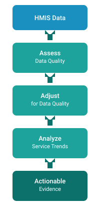
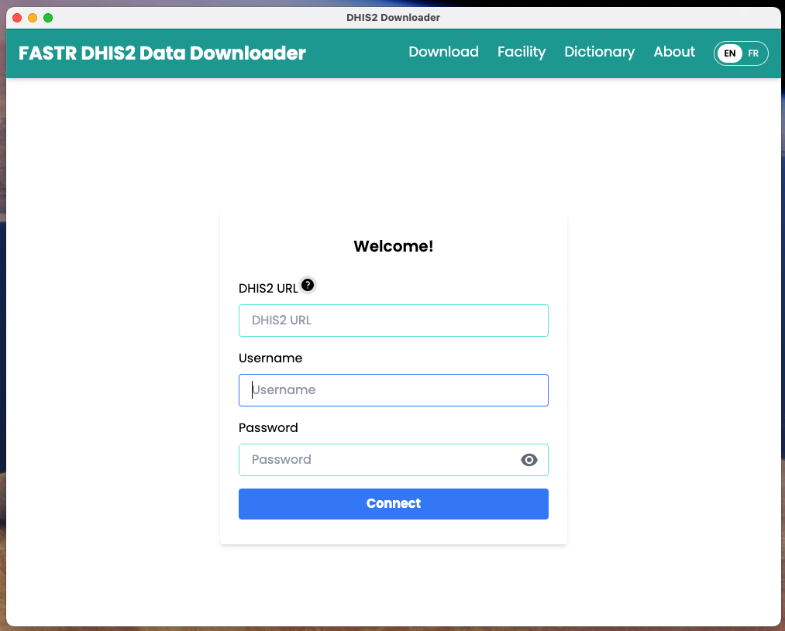
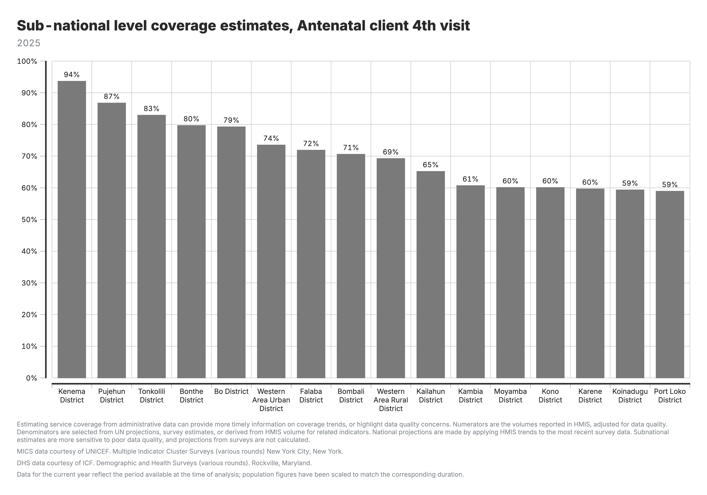

<!-- _class: title-cover -->

# FASTR Workshop - Australia

**Jan 10-12** | **Perth**

*TBD*

---

<!-- _class: agenda -->
# Agenda

**Day 1**

<table>
<tr style="background: #CAE6E9;"><th>Time</th><th>Agenda</th><th>Facilitator/Presenter</th></tr>
<tr><td></td><td>Title Slide</td><td></td></tr>
<tr><td></td><td>Agenda</td><td></td></tr>
<tr><td></td><td>Workshop Objectives</td><td></td></tr>
<tr><td></td><td>Introduction to FASTR</td><td></td></tr>
<tr><td></td><td>Identify Questions & Indicators</td><td></td></tr>
<tr><td></td><td>Data Extraction</td><td></td></tr>
<tr><td></td><td>End of Day 1</td><td></td></tr>
</table>

---

<!-- _class: agenda -->
# Agenda

**Day 2**

<table>
<tr style="background: #CAE6E9;"><th>Time</th><th>Agenda</th><th>Facilitator/Presenter</th></tr>
<tr><td></td><td>Day 2 Recap</td><td></td></tr>
<tr><td></td><td>FASTR Analytics Platform</td><td></td></tr>
<tr><td></td><td><em>Tea Break</em></td><td></td></tr>
<tr><td></td><td>Data Quality Assessment</td><td></td></tr>
<tr><td></td><td>Data Quality Adjustment</td><td></td></tr>
<tr><td></td><td>End of Day 2</td><td></td></tr>
</table>

---

<!-- _class: agenda -->
# Agenda

**Day 3**

<table>
<tr style="background: #CAE6E9;"><th>Time</th><th>Agenda</th><th>Facilitator/Presenter</th></tr>
<tr><td></td><td>Day 3 Recap</td><td></td></tr>
<tr><td></td><td>Data Analysis</td><td></td></tr>
<tr><td></td><td><em>Lunch Break</em></td><td></td></tr>
<tr><td></td><td>Results Communication</td><td></td></tr>
<tr><td></td><td>Closing</td><td></td></tr>
</table>

---

## Introduction to FASTR

The Global Financing Facility (GFF) supports country-led efforts to strengthen the use of timely data for decision-making, with the goal of improving primary healthcare (PHC) performance and RMNCAH-N outcomes.

**Frequent Assessments and Health System Tools for Resilience (FASTR)** is the GFF's rapid-cycle analytics framework for monitoring health system performance using high-frequency data.

FASTR brings together four complementary technical approaches:

1. Routine HMIS data analysis
2. Health facility phone surveys
3. High-frequency household phone surveys
4. Follow-on, problem-driven analyses

---

## RMNCAH-N service use monitoring

Rapid-cycle approaches using routine HMIS data can:

- **Evaluate HMIS data quality** at national and sub-national levels
- **Measure monthly changes** in health service utilization
- **Compare coverage trends** with country targets

---

## Why rapid-cycle analytics?

Routine health information systems are a critical source of data, but they are often underused due to concerns about data quality and long delays between data collection and analysis. Traditional household and facility surveys, while essential, are resource-intensive and infrequent.

FASTR's rapid-cycle analytics address this gap by providing:

- Timely insights aligned with country decision cycles
- Continuous learning rather than one-off assessments
- Direct feedback loops between data, analysis, and action

---

## Focus of the analysis

### Core indicators

FASTR prioritizes a core set of RMNCAH-N indicators that:

- Represent key service delivery contacts across the continuum of care
- Have relatively high reporting completeness and volumes
- Serve as proxies for broader service delivery performance

<small>*The indicator set can be expanded to reflect country-specific priorities.*</small>

### Core data quality metrics

Analysis is anchored in a standardized set of data quality metrics:

- Reporting completeness
- Extreme value (outlier) detection
- Consistency across related indicators

<small>*These metrics are summarized into an overall data quality score.*</small>

---

## Introduction to FASTR: gaps and challenges

*Content to be developed*

This section will cover:
- Identifying gaps and challenges that FASTR is well suited to support
- How FASTR serves as an entry point to reduce fragmentation
- Starting the conversation with government stakeholders

---

## Development of a data use case

*Content to be developed*

This section will cover:
- Co-creation workshop approach with MoH and stakeholders
- Data use case development guidance
- Example use cases from country implementations

---

## What makes a good indicator for FASTR analysis?

- **Relevance**: Does this indicator align with our priority questions and objectives?
- **Volume**: Is this indicator collected at a high volume, improving robustness of analysis?
- **Completeness**: Does the indicator have a high completeness rate across reporting facilities?
- **Frequency**: Is the indicator reported frequently enough (e.g., monthly) to support rapid-cycle analysis?
- **Type**: Is this indicator a count of services delivered?

---

## Preparing for data extraction

*Content to be developed*

This section will cover:
- Pre-extraction checklist
- Understanding your DHIS2 configuration
- Mapping indicators to data elements
- Planning your extraction timeline

---

## Why extract data from DHIS2?

### Data quality adjustment

The FASTR approach focuses on data quality adjustments to expand the analyses countries can do with DHIS2 data and to generate more robust estimates.

The FASTR methodology includes specific approaches to:
- Identify and adjust for outliers
- Adjust for incomplete reporting
- Apply consistent data quality metrics

These adjustments require processing that cannot be done within DHIS2's native analytics.

---

## Why extract data from DHIS2?

### Analysis complexity

The FASTR approach uses more advanced statistical methods, such as regression analysis, which are not available in DHIS2. While DHIS2 can plot trends over time using raw data, FASTR can go further by:

- Identifying significant increases or decreases in service volume
- Adjusting for data quality issues
- Accounting for expected seasonal variations
- Comparing key periods, such as before and after a reform

The choice between DHIS2 and the FASTR approach should be guided by the specific purpose of your analysis.

---

## Data format and granularity

Data should be downloaded for each **indicator of interest**, at **facility level**, and **monthly** for the **period of interest**.

- Data should be saved in **long format** meaning each row represents a single observation or measurement
- Data should be saved in **.csv format** and can be saved in either a single .csv file or multiple .csv files

### Why monthly facility level data?

We want to use the most granular data we have access to in order to make more fine tuned assessments for data quality. Using monthly facility level data allows us to conduct the most robust analysis.

---

## Key variables

The data extracted should include the following required elements:

| Element | Description |
|---------|-------------|
| Org units | Organizational unit identifier |
| Period | Time period of the data |
| Indicator name | Name of the indicator |
| Total/count | The aggregated value |

---

## How much data?

### Initial FASTR analysis
- Download approximately **five years** of historical data
- Exact period depends on data availability and consistency in indicator definitions

### Routine update to FASTR analysis
- Download new data covering the most recent months not previously included (usually **three months** for quarterly implementation)
- Include the **three preceding months** as recent data is often subject to changes due to late reporting or data quality adjustments

---

## Data extraction tools

We offer two tools for bulk DHIS2 data extraction:

**API Script** (Google Colab)
- Input login credentials, specify timeframes, indicators, and administrative levels
- Download data as a .csv file

**Data Downloader**
- More intuitive, streamlined interface
- Recommended for most users

Both tools enable efficient data extraction, and we provide training resources to support their use.

---

## DHIS2 Data Downloader

The Data Downloader is a desktop application for extracting data from DHIS2.

**Key features:**
- Connect to any DHIS2 instance
- Browse and select data elements and indicators
- Download facility-level data in CSV format
- Maintain download history

**Download from GitHub:**

https://github.com/worldbank/DHIS2-Downloader/releases/

 *Facilitator will demonstrate the Data Downloader*

---

## Data Downloader: Login

**Connect to your DHIS2 instance**

- Enter your DHIS2 server URL
- Provide your username and password
- The tool securely stores credentials for future sessions

---

## Data Downloader: Overview

**Main interface**

- Browse available data elements and indicators
- Select time periods and organization units
- Configure download options
- Start data extraction

---

## Data Downloader: Download history

**Track your downloads**

- View all previous download sessions
- Re-download data with same parameters
- Access download logs and status
- Manage downloaded files

---

## Data Downloader: Data dictionary

**Explore available data**

- Browse all data elements from your DHIS2
- Search by name or code
- View metadata and definitions
- Identify indicators for your analysis

---

## Data Downloader: Facility list

**Facility management**

- View complete facility list
- Filter by administrative level
- Search by facility name
- Export facility data

---

## Data Downloader: Facility map

**Geographic visualization**

- Download GeoJSON boundary files
- Toggle administrative boundaries by level (Level 1 = country, Level 2 = regions, etc.)
- Higher levels display facility points
- Useful for verifying geographic structure

---

# See You Tomorrow!

**Day 1 Complete**

We resume tomorrow at **09:00**

---

# Day 2

---

## Introduction to the FASTR Analytics Platform

The FASTR analytics platform is a web-based tool for data quality assessment, adjustment, and analysis of routine health data.

**Key features:**

- Upload and analyze data from DHIS2 and other sources
- Built-in statistical methods for data quality adjustment
- User-friendly interface for running analyses
- Flexible visualization and export options

**In this session, we will provide a conceptual walkthrough of the platform and its capabilities.**

---

## Live Demo: Platform Access & Roles

 **In this demo, we will:**

- Navigate to the FASTR platform
- Explore user roles: Administrator, Editor, Viewer
- Review user management and permissions
- Understand the workflow for uploading data and making analytical decisions

*Facilitator will demonstrate in the live platform*

---

## Activity: Setting Up Admin Areas

 **In this hands-on session, we will configure:**

- Admin areas (regions, districts)
- Facility structure
- Indicator definitions

*Participants will work directly in the platform*

---

## Activity: Importing Data

 **In this hands-on session, we will:**

- Review data format requirements
- Walk through the import process
- Handle validation and error checking

*Participants will import their country's data*

---

## Activity: Installing and Running Modules

 **In this hands-on session, we will:**

- Review available analysis modules
- Install required modules
- Run initial analyses

*Participants will configure and run modules on their data*

---

## Activity: Creating a Project

 **In this hands-on session, we will:**

- Set up a new project
- Configure project settings
- Select indicators and time periods
- Apply best practices for project organization

*Participants will create their first project*

---

## Activity: Creating Visualizations

 **In this hands-on session, we will:**

- Explore available chart types
- Create and customize visualizations
- Export charts for use in reports

*Participants will build visualizations from their analysis*

---

## Activity: Creating Reports

 **In this hands-on session, we will:**

- Use report templates
- Generate automated reports
- Customize report content and layout

*Participants will create their first quarterly report draft*

---

#  Tea Break

**15 minutes**

Back at 

---

## Data quality assessment - Module 1

Evaluating the reliability of routine health information system data

---
## Rationale for data quality assessment

**Challenge:** Routine health facility data may contain quality limitations:
- Reported values may fall outside plausible ranges
- Reporting gaps affect data completeness
- Inconsistencies exist between related indicators

**Implications:** Data quality limitations affect decision-making
- Inaccurate assessments of service delivery trends
- Misidentification of areas requiring intervention
- Suboptimal resource allocation

---

## Objectives of data quality assessment

**Objective 1: Enable analytical adjustment**

Systematic data quality assessment supports the application of targeted adjustments, enhancing the utility of HMIS data for evidence-based decision-making.

**Objective 2: Monitor data quality trends**

Data quality assessment enables ongoing monitoring to:
- Inform indicator selection based on quality profiles across the HMIS
- Guide targeted data quality interventions and supportive supervision in areas with weaker data quality
- Evaluate the effectiveness of data quality improvement initiatives over time

---
## Core dimensions of data quality

**1. Completeness**
Are health facilities submitting reports consistently?

**2. Outlier prevalence**
Are reported values within plausible ranges?

**3. Internal consistency**
Do related indicators demonstrate expected relationships?

These three dimensions provide a comprehensive assessment of data reliability for analytical purposes.

---

## Indicator completeness

**What it measures:** The extent to which facilities report data on selected core indicators

**Why it matters:**
- Higher completeness improves data reliability
- Stability over time strengthens trend analysis

**Key distinction:**
Indicator completeness ≠ reporting completeness. This metric examines specific data elements, not just whether the monthly form was submitted.

---

## Definition of indicator completeness

For the FASTR analysis, completeness is defined as:

**The percentage of reporting facilities each month out of the total number of facilities expected to report.**

- A facility is deemed to be "reporting" if there is a non-missing, non-zero value recorded for the indicator and month
- A facility is expected to report if it has reported any volume for that indicator anytime within a year
- Facilities that do not report for six or more consecutive months at the beginning or end of their reporting period are classified as **inactive** rather than incomplete. This prevents penalizing facilities that have not yet begun reporting or have permanently ceased operations

---

## Notes on completeness

- A high level of completeness does not necessarily indicate that the HMIS is representative of all service delivery in the country as some services may not be delivered in facilities, or some facilities may not report

- For countries where the DHIS2 system does not store 0's, indicator completeness may be underestimated if there are many low-volume facilities for a given indicator

---

## Completeness: Percent of monthly values that are complete

For a given indicator in a given time period, the percent of monthly values that are complete:

<strong>% complete = # monthly values that are complete / total N of monthly values</strong>

---

## Outliers

The presence of outliers examines whether a data point in a series of values is extreme (either abnormally high or low) in relation to others in the series.

Outliers can be the result of changes in programmatic activities (such as an intensified campaign) or can be data quality problems.

For the FASTR analysis, we identify outliers which are suspiciously high values compared to the usual volume of services reported by the facility (e.g., low values are not identified as outliers in the FASTR analysis).

---

## Outlier illustration

Region A displays an anomalous spike in February that substantially exceeds values reported by other regions — indicative of a data entry error or reporting issue.

---

## Outlier detection methodology

Outliers are identified by assessing the within-facility variation in monthly reporting for each indicator.

An outlier is defined as:

A value greater than **10 times the median absolute deviation (MAD)** from the monthly median value for the indicator in each time period, **OR** a value for which the proportional contribution in volume for a facility, indicator, and time period is **greater than 80%**

**AND** for which:

- The volume is **greater than or equal to the median**
- The volume is **not missing**
- The volume is **greater than 100**

---

## Outliers: Percent of monthly values that are outliers

For a given indicator in a given time period, the percent of monthly values that are outliers:

**% outliers = # monthly values that are outliers / total N of monthly values**

---

## Consistency between related indicators

Program indicators with a predictable relationship are examined to determine whether the expected relationship exists between them. In other words, this process examines whether the observed relationship between the indicators, as shown in the reported data, is that which is expected.

---

## Indicator pairs assessed

| Indicator pair | Expected relationship |
|----------------|----------------------|
| ANC1 / ANC4 | Ratio should be ≥ 0.95 |
| Penta1 / Penta3 | Ratio should be ≥ 0.95 |
| BCG / Facility delivery | Within 30% (≥0.7 and ≤1.3) |

These pairs have expected relationships. We expect ANC1 > ANC4 since not all women complete four visits.

BCG is a birth dose vaccine so we expect similar numbers to facility deliveries, with a 30% tolerance for variability.

---

## Why assess consistency at district level?

Patients often access different services at different facilities within a district:

- A woman may attend **ANC1** at a nearby health post, but travel to a health centre for **ANC4**
- A child may receive **Penta1** at a local clinic, but complete **Penta3** at a district hospital

Checking consistency at the facility level would miss these patterns. Aggregating to district level captures the complete picture of service utilization within a geographic area.

---

## Internal consistency: FASTR output

---

## Data quality summary score

A composite measure of data quality provides an overall view of how well a dataset meets quality standards.

By integrating multiple dimensions of data quality into a single score, it simplifies the interpretation of detailed information from several measures. This allows health systems to quickly assess the reliability of data, making it easier to identify trends and issues at a glance.

---

## Definition of adequate data quality

For the FASTR analysis, we defined adequate data quality as:

- No missing indicator data for OPD, Penta1, and ANC1, where available, **AND**
- No outliers for OPD, Penta1, and ANC1, where available, **AND**
- Consistent reporting between Penta1/Penta3 and ANC1/ANC4

---

## Overall DQA score: Percent of monthly values meeting all criteria

For a given indicator in a given time period, the percent of monthly values meeting all DQA criteria:

**% adequate quality = # monthly values meeting all criteria / total N of monthly values**

---

## Mean DQA score: How close are we to adequate quality?

The mean DQA score shows how close a facility's data is to meeting all quality criteria. A score of **100% means the data passes** all DQA checks—no missing values, no outliers, and consistent reporting.

**Mean DQA = (completeness & outlier score + consistency score) / 2**

---

## Data quality adjustment - Module 2

Correcting outliers and imputing missing values to improve data reliability

---

## Rationale for data quality adjustment

Routine HMIS data contain two common limitations that can distort analytical results:

| Issue | Impact on analysis |
|-------|-------------------|
| **Outliers** | Extreme values create artificial spikes in service volumes |
| **Incomplete reporting** | Missing data creates artificial declines that do not reflect actual service delivery |

FASTR addresses these limitations by replacing problematic values with estimates derived from each facility's historical reporting patterns.

---

## Adjustment scenarios

To support transparency and sensitivity analysis, FASTR produces four parallel datasets:

| Scenario | Description |
|----------|-------------|
| **Unadjusted** | Original reported values |
| **Outliers adjusted** | Extreme values replaced |
| **Completeness adjusted** | Missing values imputed |
| **Both adjusted** | All corrections applied |

---

## Indicators excluded from adjustment

Certain indicators are excluded from the adjustment process:

- **Mortality indicators** (maternal deaths, neonatal deaths, under-5 deaths): These represent discrete events where smoothing or imputation is not appropriate
- **Low-volume indicators**: Indicators that never exceed 100 reported events in any month are excluded from adjustment

---

## Outlier adjustment methodology

Outlier values are replaced using facility-specific historical data. The adjustment follows a hierarchical approach:

| Priority | Method | Application |
|----------|--------|-------------|
| 1 | Centered 6-month average | 3 months before + 3 months after the outlier |
| 2 | Forward 6-month average | When insufficient preceding data (e.g., start of series) |
| 3 | Backward 6-month average | When insufficient following data (e.g., end of series) |
| 4 | Same month, previous year | When rolling averages unavailable; useful for seasonal indicators |
| 5 | Facility historical mean | Mean of all valid values for this indicator at this facility |

---

## Outlier adjustment: FASTR output

---

## Completeness adjustment methodology

For months identified as incomplete or missing, values are imputed using the same 6-month rolling average approach applied to outlier adjustment.

| Priority | Method | Application |
|----------|--------|-------------|
| 1 | Centered 6-month average | When sufficient data exists before and after the gap |
| 2 | Forward 6-month average | For gaps at the start of the time series |
| 3 | Backward 6-month average | For gaps at the end of the time series |
| 4 | Facility historical mean | Mean of all valid values for this indicator at this facility |

This approach prevents temporary reporting gaps from creating artificial declines in service volumes.

---

## Completeness adjustment: FASTR output

---

# See You Tomorrow!

**Day 2 Complete**

We resume tomorrow at **09:00**

---

# Day 3

---

## Service utilization analysis - Module 3

Detecting and quantifying changes in health service delivery over time

---

## Objectives

**1. Measure changes in service volume**

Year-over-year comparison of service volumes identifies increases or decreases across regions and indicators.

**2. Detect and quantify disruptions**

Statistical comparison of observed volumes against expected levels—derived from historical trends and seasonal patterns—enables identification and quantification of service shortfalls or surpluses.

---

## Service utilization over time

---

## Year-over-year change

**Year-over-year percent change** quantifies shifts in service delivery between consecutive years.

For each indicator and region, total volume in the current year is compared to the previous year:

**Percent change** = (Current year − Previous year) ÷ Previous year × 100

Changes exceeding **±10%** are flagged for review.

---

## Output: Change in service volume

### Interpretation

**Bars** show annual service volumes by region. **Percentages** indicate year-over-year change.

**Key considerations:**
- Which regions exhibit the largest changes?
- Are changes consistent across regions or geographically concentrated?
- Do patterns vary by indicator?

---

## Disruption detection

Our approach to service disruptions and surpluses utilizes an interrupted time series regression with facility-level fixed effects. Previous large and unexpected changes in historical data are removed. Unexpected volume changes are estimated by comparing observed volume to expected volume based on historical trends and seasonality.

---

## Disruptions and surpluses

**Disruptions** are flagged when volumes fall below anticipated levels, signaling potential barriers to access, resource shortages, or system failures.

**Surpluses** occur when volumes exceed expectations, which may indicate increased demand, over-reporting, or changes in service delivery.

---

## How it works

**Using past data to set expectations:** We look at the past few years of data to understand the typical pattern for each month, accounting for regular seasonal changes.

**Spotting unusual changes:** We compare current service volumes to expectations. If we see volumes much higher or lower than expected, we flag it as an unusual change.

**Handling past disruptions:** We adjust historical data by removing previous big, unexpected changes so one-off events don't skew our understanding of what's "normal."

**Detecting disruptions over time:** We look at trends to see if there are clear shifts in health service use over several months.

---

## Comparison to DHIS2

Extension of service utilization analysis, using more complex statistical approaches not available in DHIS2.

Using a regression framework, we are able to:

- Account for seasonality
- Exclude unusual changes to ensure one-off events aren't influencing normal trends
- Use historical data as a baseline for context
- Detect disruptions and recovery patterns
- Quantify changes with a robust methodology as compared to just observing simple fluctuations in a trend line

This improves the ability to interpret and compare utilization data across national and sub-national areas without needing population denominators.

---

## Output: Actual vs expected (national)

National-level comparison of observed service volumes against expected values derived from historical trends and seasonal patterns.

---

## Output: Actual vs expected (subnational)

Subnational disaggregation enables identification of geographic areas where disruptions are concentrated.

---

## Service coverage estimates - Module 4

Estimating the percentage of the target population that received a given health service

---

## Our approach to service coverage analysis

Our approach derives and validates population denominators, significantly improving coverage estimates reported from HMIS systems.

In countries with accurate data, this approach helps identify subnational inequities and updates outdated estimates, while in countries with less precise data, the trends still provide valuable insights into performance.

We use these estimates to track recent trends and subnational disparities in the coverage of selected health services.

---

## Two-part analytical process

The coverage estimation module operates in two sequential parts:

| Part | Components |
|------|------------|
| **Part 1: Denominator calculation** | Calculate target populations using multiple methods; compare against survey benchmarks; select optimal denominator for each indicator |
| **Part 2: Coverage estimation** | Apply denominator selections; project survey estimates forward using HMIS trends; generate final coverage estimates |

---

## What is service coverage?

**Service coverage** represents the proportion of the target population that received a specified health service.

---

## Denominators by service type

Each health indicator corresponds to a specific target population:

| Service | Target population (denominator) |
|---------|--------------------------------|
| ANC1, ANC4 | Pregnant women |
| Institutional delivery | Live births |
| BCG | Live births |
| Penta1, Penta3 | Infants surviving beyond neonatal period |
| Measles1, Measles2 | Infants surviving beyond infancy |

---

## Demographic cascade

Sequential demographic adjustments transform one target population estimate into another. Starting from pregnancies, demographic factors are applied to derive subsequent denominators:

---

## Denominator cascade: Illustration

Starting from ANC1 service counts, demographic adjustment factors are applied sequentially to derive denominators for other services:

---

## Forward and backward derivation

From any entry point, the cascade derives denominators in both directions:

| Direction | Method | Example from Penta1 |
|-----------|--------|---------------------|
| **Forward** | Apply mortality/attrition rates | DPT-eligible → Measles1-eligible → Measles2-eligible |
| **Backward** | Reverse mortality rates (add deaths back) | DPT-eligible → Live births → Births → Deliveries → Pregnancies |

Backward derivation enables estimation of upstream populations from downstream service counts.

---

## Denominators by entry point

Each HMIS indicator serves as an entry point. The module derives all target populations via forward and backward cascades:

| Entry point | Base calculation | Forward derivation | Backward derivation |
|-------------|------------------|-------------------|---------------------|
| **ANC1** | ANC1 ÷ coverage → Pregnancies | Deliveries → Live births → DPT-eligible → Measles-eligible | — |
| **Deliveries** | Deliveries ÷ coverage → Deliveries | Live births → DPT-eligible → Measles-eligible | Pregnancies |
| **BCG** | BCG ÷ coverage → Live births | DPT-eligible → Measles-eligible | Deliveries → Pregnancies |
| **Penta1** | Penta1 ÷ coverage → DPT-eligible | Measles1-eligible → Measles2-eligible | Live births → Births → Deliveries → Pregnancies |
| **UN WPP** | Crude birth rate × population → Pregnancies, live births; Under-1 pop → DPT, measles | Applies mortality rates for measles denominators | — |

---

## Automatic denominator selection

For each indicator, the module selects the denominator that produces coverage closest to the survey benchmark.

**Selection algorithm:**

1. Calculate coverage using each denominator option
2. Calculate squared error against survey: $(coverage - survey)^2$
3. Apply selection hierarchy (HMIS-based denominators prioritized over UN WPP)
4. Select the HMIS-based denominator with minimum error

Selection is made per indicator and geographic area. Users may override automatic selections in Part 2.

---

## Coverage projection methodology

The module projects the most recent survey value forward using trends observed in HMIS-derived coverage:

Year-over-year changes (deltas) in HMIS coverage are calculated and applied to the last survey value. This approach preserves the survey baseline while incorporating observed service delivery trends.

---

## Interpretation of coverage outputs

| Element | Description |
|---------|-------------|
| **Black line/points** | Survey data (DHS/MICS) — household survey reference |
| **Grey line/points** | HMIS-based coverage from facility data |
| **Red line/points** | Projected coverage — survey estimates extended using HMIS trends |

---

## Coverage (national)

### Interpretation

**Black line/points** show survey data (DHS/MICS) as the household survey reference. **Grey line/points** show HMIS-based coverage from facility data. **Red line/points** show projected coverage — survey estimates extended using HMIS trends.

---

## Coverage (subnational)

---

## Coverage (subnational)

---

#  Lunch Break

**60 minutes**

Back at 

---

## Analytical thinking & interpretation

Interpretation connects **data patterns** to **programmatic meaning**.

For every FASTR output, ask three questions:

1. **What does it show?** — Describe the pattern accurately
2. **Why might that be?** — Consider multiple explanations
3. **What should we do?** — Identify next steps or actions

<small>*Moving from numbers to insights requires context, critical thinking, and programmatic knowledge.*</small>

---

## Moving from data to key messages

### What is a result?
Results are what the analysis found (data quality scores, coverage estimations, service utilization numbers). They are often many in number, complex, hard to understand 'at a glance', and lacking interpretation.

### What is a key takeaway?
Key takeaways are what the results are telling us — why the results matter, the 'so what'. They should be few in number, simple and clear, easy to remember, and actionable.

---

## Dissemination and data use roadmap

A data use roadmap is a strategic plan that outlines how data will be utilized, shared, and disseminated effectively.

### Why is it important?
- Establishes metrics to evaluate the success of data use
- Identifies key stakeholders, target audiences, and dissemination platforms
- Outlines steps needed to achieve data dissemination goals
- Anticipates potential challenges and develops strategies to solve for them

---

## Presenting reports and group feedback

*Content to be developed*

---

## Generating quarterly reporting products

*Content to be developed*

This section will cover:
- Quarterly reporting workflow
- Using the FASTR platform for automated reports
- Quality assurance for reports
- Distribution and feedback mechanisms

---

# Contact Information

**FASTR Team**

**Email:** 

**Website:** https://www.globalfinancingfacility.org/

---

