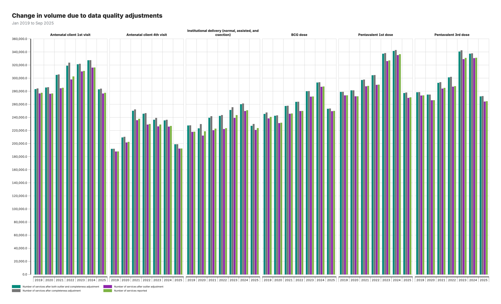
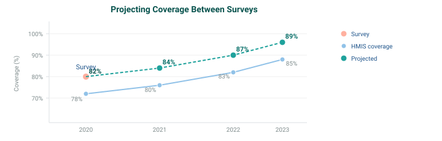

# In-Country Working Session: FASTR Implementation & RMNCAH-N Service Monitoring Analysis

**January 27-30, 2026** | **Lusaka**

*GFF FASTR Team*

---

<!-- _class: agenda -->
# Agenda

**Day 1 -- Laying the Foundation: Introducing FASTR and Configuring the Analytics Platform**

| Time | Agenda | Facilitator/Presenter |
|------|--------|--------|
| **Opening Session** | | |
| 08:30-09:00 | Participant registration | MoH team |
| 09:00-09:10 | Welcome and opening remarks | MoH team |
| 09:10-09:20 | Icebreakers/Introductions | MoH team |
| 09:20-09:35 | Overview of agenda, workshop objectives | GFF FASTR team |
| **Session 1: Overview of the FASTR approach** | | |
| 09:35-10:30 | Overview: FASTR Approaches | GFF FASTR team |
| **Session 2: HMIS data extraction** | | |
| 10:30-11:30 | Data extraction: Rationale and methods | GFF FASTR team |
| **Session 3: Introduction to the FASTR analytics platform** | | |
| 11:30-12:30 | Introduction to the FASTR analytics platform | GFF FASTR team |
| 12:30-14:00 | *Lunch Break* | |
| 14:00-14:30 | Getting participants into the platform | GFF FASTR team |
| **Session 4: Configuring the FASTR analytics platform** | | |
| 14:30-16:30 | Configuring the analysis platform | GFF FASTR team |

---

<!-- _class: agenda -->
# Agenda

**Day 2 -- Building the Analysis: Applying FASTR Methods and Generating Outputs**

| Time | Agenda | Facilitator/Presenter |
|------|--------|--------|
| 09:00-09:15 | Overview of Day 2 agenda | GFF FASTR team |
| **Session 5: Overview of FASTR methods and analytical outputs** | | |
| 09:15-10:15 | Data quality, service utilization, coverage | GFF FASTR team |
| **Session 6: Creating a project** | | |
| 10:15-11:15 | Project creation and settings | GFF FASTR team |
| **Session 7: Creating visualizations** | | |
| 11:15-12:30 | Creating and editing visualizations | GFF FASTR team |
| 12:30-14:00 | *Lunch Break* | |
| **Session 8: Creating reports** | | |
| 14:30-16:30 | Practice creating and editing reports | GFF FASTR team |

---

<!-- _class: agenda -->
# Agenda

**Day 3 -- From Analysis to Action: Interpreting Results and Using FASTR for Decision-Making**

| Time | Agenda | Facilitator/Presenter |
|------|--------|--------|
| 09:00-09:15 | Overview of Day 3 agenda | GFF FASTR team |
| **Session 8: Interpretation of visualizations** | | |
| 09:15-10:15 | Approaches to support interpretation | GFF FASTR team |
| **Session 9: Creating a Q4 2025 report** | | |
| 10:15-12:30 | Creating short and long reports with country context | GFF FASTR team |
| 12:30-14:00 | *Lunch Break* | |
| **Session 9 (cont'd): Creating a Q4 2025 report** | | |
| 14:00-15:00 | Continue report creation with country context | GFF FASTR team |
| **Session 10: Presenting reports** | | |
| 14:30-15:30 | Present reports, group feedback | GFF FASTR team |

---

<!-- _class: agenda -->
# Agenda

**Day 4 -- Designing the Health Facility Assessment**

| Time | Agenda | Facilitator/Presenter |
|------|--------|--------|
| 09:00-09:15 | Overview of Day 4 agenda | GFF FASTR team |
| **Session 12: Overview of FASTR HFA phone survey** | | |
| 09:15-10:15 | HFA overview and questionnaire adaptation guidelines | GFF FASTR team |
| **Session 13: Questionnaire adaptation to the Zambian context** | | |
| 10:15-12:30 | Review questionnaire + hands-on adaptation | GFF FASTR team |
| 12:30-14:00 | *Lunch Break* | |
| **Session 14: Questionnaire adaptation (cont'd)** | | |
| 14:00-15:00 | Continue questionnaire adaptation (in groups) | GFF FASTR team |
| **Session 15: Discussion: HFA adapted questionnaire** | | |
| 14:30-15:30 | Discuss adapted questionnaire in plenary | GFF FASTR team |
| **Session 16: Discussion: HFA priorities and data use** | | |
| 15:30-16:30 | HFA priorities and data use case in Zambia | GFF FASTR team |
| **Session 17: Action planning and wrap-up** | | |
| 16:30-17:00 | Key messages and wrap-up | GFF FASTR team |

---

# Workshop Objectives

- Prepare MoH for participation in the multi-country workshop
- Strengthen capacity for disruption analysis and data extraction
- Configure the FASTR analytics platform for Zambia
- Produce the first quarterly report
- Adapt the phone survey questionnaire to the Zambian context
- Use data downloader tools for DHIS2

---

# Scope of Work

### Disruption Analysis Activities
- Data extraction and configuration of analytics platform
- Produce first quarterly report
- Review results and contextualize findings (with relevant program teams)

### Phone Survey Activities
- Adaptation of questionnaire (with program input)

### Capacity Building
- Training on data downloader for all with DHIS2 access
- Hybrid format: face-to-face and online

---

# Expected Outputs

- Adapted phone survey questionnaire
- First quarterly report draft
- Trained MoH team on data downloader tools
- Roadmap for participation in Abuja workshop

---

# Session 1: Overview of the FASTR approach

---

## Introduction to FASTR

The Global Financing Facility (GFF) supports country-led efforts to strengthen the use of timely data for decision-making, with the goal of improving primary healthcare (PHC) performance and RMNCAH-N outcomes.

**Frequent Assessments and Health System Tools for Resilience (FASTR)** is the GFF's rapid-cycle analytics framework for monitoring health system performance using high-frequency data.

FASTR brings together four complementary technical approaches:

1. Routine HMIS data analysis
2. Health facility phone surveys
3. High-frequency household phone surveys
4. Follow-on, problem-driven analyses

---

## RMNCAH-N service use monitoring

Rapid-cycle approaches using routine health management information system (HMIS) data can be used to:

- **Evaluate the quality of HMIS data** both at the national and sub-national levels to help address gaps in quality and completeness
- **Measure monthly changes** in the utilization of critical health services, enabling a rapid response to challenges and the opportunity to gain insights on the progress of reforms
- **Compare service coverage trends** with country targets, facilitating the continuous monitoring of RMNCAH-N progress

---

### How does it work?

Through collaboration with Ministries of Health, the GFF assists countries in developing and reviewing regular analyses of HMIS data, focusing on specific priority health service indicators linked to national health care reforms, as well as GFF and World Bank investments.

---

## Why rapid-cycle analytics?

Routine health information systems are a critical source of data, but they are often underused due to concerns about data quality and long delays between data collection and analysis. Traditional household and facility surveys, while essential, are resource-intensive and infrequent.

FASTR's rapid-cycle analytics address this gap by providing:

- Timely insights aligned with country decision cycles
- Continuous learning rather than one-off assessments
- Direct feedback loops between data, analysis, and action

During the COVID-19 pandemic, this approach was applied in over 20 countries to monitor disruptions to essential RMNCAH-N services and inform response and recovery planning.

---

## Focus of the analysis

### Core indicators

FASTR prioritizes a core set of RMNCAH-N indicators that:

- Represent key service delivery contacts across the continuum of care
- Have relatively high reporting completeness and volumes
- Serve as proxies for broader service delivery performance

<small>*Outpatient consultations are included as a proxy for overall health service use. The indicator set can be expanded to reflect country-specific priorities.*</small>

### Core data quality metrics

Analysis is anchored in a standardized set of data quality metrics, including:

- Reporting completeness
- Extreme value (outlier) detection
- Consistency across related indicators

<small>*These metrics are summarized into an overall data quality score to support interpretation and comparison across areas.*</small>

---

# Session 2: HMIS data extraction

---

## Why extract data from DHIS2?

### Data quality adjustment

The FASTR approach focuses on data quality adjustments to expand the analyses countries can do with DHIS2 data and to generate more robust estimates.

The FASTR methodology includes specific approaches to:
- Identify and adjust for outliers
- Adjust for incomplete reporting
- Apply consistent data quality metrics

These adjustments require processing that cannot be done within DHIS2's native analytics.

---

## Why extract data from DHIS2?

### Analysis complexity

The FASTR approach uses more advanced statistical methods, such as regression analysis, which are not available in DHIS2. While DHIS2 can plot trends over time using raw data, FASTR can go further by:

- Identifying significant increases or decreases in service volume
- Adjusting for data quality issues
- Accounting for expected seasonal variations
- Comparing key periods, such as before and after a reform

The choice between DHIS2 and the FASTR approach should be guided by the specific purpose of your analysis.

---

## Data format and granularity

Data should be downloaded for each **indicator of interest**, at **facility level**, and **monthly** for the **period of interest**.

- Data should be saved in **long format** meaning each row represents a single observation or measurement
- Data should be saved in **.csv format** and can be saved in either a single .csv file or multiple .csv files

### Why monthly facility level data?

We want to use the most granular data we have access to in order to make more fine tuned assessments for data quality. Using monthly facility level data allows us to conduct the most robust analysis.

---

## Key variables

The data extracted should include the following required elements:

| Element | Description |
|---------|-------------|
| Org units | Organizational unit identifier |
| Period | Time period of the data |
| Indicator name | Name of the indicator |
| Total/count | The aggregated value |

---

## How much data?

### Initial FASTR analysis
- Download approximately **five years** of historical data
- Exact period depends on data availability and consistency in indicator definitions

### Routine update to FASTR analysis
- Download new data covering the most recent months not previously included (usually **three months** for quarterly implementation)
- Include the **three preceding months** as recent data is often subject to changes due to late reporting or data quality adjustments

---

## Data extraction tools

We offer two tools for bulk DHIS2 data extraction:

**API Script** (Google Colab)
- Input login credentials, specify timeframes, indicators, and administrative levels
- Download data as a .csv file

**Data Downloader**
- More intuitive, streamlined interface
- Recommended for most users

Both tools enable efficient data extraction, and we provide training resources to support their use.

---

## DHIS2 Data Downloader

The Data Downloader is a desktop application for extracting data from DHIS2.

**Key features:**
- Connect to any DHIS2 instance
- Browse and select data elements and indicators
- Download facility-level data in CSV format
- Maintain download history

**Download from GitHub:**

https://github.com/worldbank/DHIS2-Downloader/releases/

*Facilitator will demonstrate the Data Downloader*

---

# Session 3: Introduction to the FASTR analytics platform

---

## Introduction to the FASTR Analytics Platform

The FASTR analytics platform is a web-based tool for data quality assessment, adjustment, and analysis of routine health data.

**Key features:**

- Upload and analyze data from DHIS2 and other sources
- Built-in statistical methods for data quality adjustment
- User-friendly interface for running analyses
- Flexible visualization and export options

**In this session, we will provide a conceptual walkthrough of the platform and its capabilities.**

---

## Live Demo: Platform Access & Roles

**In this demo, we will:**

- Navigate to the FASTR platform
- Explore user roles: Administrator, Editor, Viewer
- Review user management and permissions
- Understand the workflow for uploading data and making analytical decisions

*Facilitator will demonstrate in the live platform*

---

#  Lunch Break

**90 minutes**

Back at 14:00

---

# Session 4: Configuring the FASTR analytics platform

---

## Activity: Setting Up Admin Areas

**In this hands-on session, we will configure:**

- Admin areas (regions, districts)
- Facility structure
- Indicator definitions

*Participants will work directly in the platform*

---

## Activity: Importing Data

**In this hands-on session, we will:**

- Review data format requirements
- Walk through the import process
- Handle validation and error checking

*Participants will import their country's data*

---

## Activity: Installing and Running Modules

**In this hands-on session, we will:**

- Review available analysis modules
- Install required modules
- Run initial analyses

*Participants will configure and run modules on their data*

---

# Day 2

---

# Recap

On Day 1, we covered:

- The FASTR approach and rapid-cycle analytics methodology
- Data extraction from DHIS2 using the Data Downloader
- Introduction to the FASTR Analytics Platform
- Platform configuration: admin areas, data import, modules

---

# Day 2 Focus

Today we will:

- Explore FASTR methods for data quality and analysis
- Create and configure projects
- Build visualizations
- Generate reports

---

# Session 5: Overview of FASTR methods and analytical outputs

---

## FASTR analytical pipeline

The FASTR analysis follows a sequential workflow where each step builds on the previous:

1. **Assess data quality** - Identify issues with completeness, outliers, and consistency
2. **Adjust for quality issues** - Apply corrections to improve data reliability
3. **Analyze adjusted data** - Generate service utilization and coverage estimates

Each step must be completed before moving to the next.

---

## Data quality assessment

Evaluating the reliability of routine health information system data

---
## Rationale for data quality assessment

**Challenge:** Routine health facility data may contain quality limitations:
- Reported values may fall outside plausible ranges
- Reporting gaps affect data completeness
- Inconsistencies exist between related indicators

**Implications:** Data quality limitations affect decision-making
- Inaccurate assessments of service delivery trends
- Misidentification of areas requiring intervention
- Suboptimal resource allocation

---

## Objectives of data quality assessment

**Objective 1: Enable analytical adjustment**

Systematic data quality assessment supports the application of targeted adjustments, enhancing the utility of HMIS data for evidence-based decision-making.

**Objective 2: Monitor data quality trends**

Data quality assessment enables ongoing monitoring to:
- Inform indicator selection based on quality profiles across the HMIS
- Guide targeted data quality interventions and supportive supervision in areas with weaker data quality
- Evaluate the effectiveness of data quality improvement initiatives over time

---
## Core dimensions of data quality

**1. Completeness**
Are health facilities submitting reports consistently?

**2. Outlier prevalence**
Are reported values within plausible ranges?

**3. Internal consistency**
Do related indicators demonstrate expected relationships?

These three dimensions provide a comprehensive assessment of data reliability for analytical purposes.

---

## Assessing reporting completeness

**Definition:**
The proportion of expected facility reports that were submitted within a given period.

**Significance:**
- Incomplete reporting limits the representativeness of aggregate data
- Apparent declines in service volumes may reflect reporting gaps rather than actual reductions

---

## Interpreting completeness rates

**Reference benchmarks:**
- 90% and above: High completeness
- 80-89%: Moderate completeness
- Below 80%: Substantial reporting gaps

**Considerations:** Complete reporting does not capture services delivered outside the formal health system or by facilities not included in the HMIS.

**Key analytical questions:** Are completeness rates improving over time? Which geographic areas or facility types demonstrate lower completeness?

---

## Completeness: FASTR output

---

## Identifying implausible values

**Illustration:**
Region A displays an anomalous increase in February that substantially exceeds values reported by other regions.

This pattern is indicative of a data entry error. Following adjustment, all regions demonstrate consistent gradual trends.

---

## Outlier detection methodology

Outliers are identified through analysis of within-facility variation in monthly reporting for each indicator.

A value is classified as an outlier if it meets EITHER criterion:

1. The value exceeds 10 times the Median Absolute Deviation (MAD) from the facility's monthly median for that indicator, OR
2. The value represents more than 80% of the total volume for a given facility, indicator, and time period

AND the reported count exceeds 100.

---

## Outlier illustration

**Health Centre B - Malaria diagnostic tests:**

| Month | Tests reported | Classification |
|-------|----------------|---------|
| January | 245 | Within expected range |
| February | 267 | Within expected range |
| **March** | **2,890** | **Outlier** |
| April | 256 | Within expected range |

**Probable cause:** Data entry error (e.g., "2890" entered instead of "289")

**Analytical impact:** Without adjustment, the data would indicate an erroneous increase in malaria testing during March.

---

## Outlier prevalence: FASTR output

---

## Assessing relationships between indicators

Related health services demonstrate predictable relationships that can be used to assess data quality. FASTR evaluates the following indicator pairs:

| Indicator pair | Expected relationship | Rationale |
|----------------|----------------------|-----------|
| ANC1 / ANC4 | ANC1 ≥ ANC4 | More women initiate antenatal care than complete four visits |
| Penta1 / Penta3 | Penta1 ≥ Penta3 | More children receive the first dose than complete the series |
| BCG / Deliveries | BCG ≈ Deliveries | BCG is administered at birth; counts should be similar |

Violations of these expected relationships indicate potential data quality issues requiring investigation.

---

## Why assess consistency at district level?

Patients often access different services at different facilities within a district:

- A woman may attend **ANC1** at a nearby health post, but travel to a health centre for **ANC4**
- A child may receive **Penta1** at a local clinic, but complete **Penta3** at a district hospital

Checking consistency at the facility level would miss these patterns. Aggregating to district level captures the complete picture of service utilization within a geographic area.

---

## Internal consistency: FASTR output

---

## Calculating the overall quality score

**The composite score integrates all three data quality dimensions:**

1. **Completeness:** Did the facility submit a report?
2. **Outlier status:** Are reported values within plausible ranges?
3. **Consistency:** Do related indicators demonstrate expected relationships?

**Binary DQA score:**
- Score = 1 if all three criteria are satisfied
- Score = 0 if any criterion is not met

**Mean DQA score:** Weighted average of completeness-outlier score and consistency score

**Applications:**
- Inform decisions regarding data inclusion in analyses
- Identify facilities requiring targeted data quality support

---

## Overall DQA score: FASTR output

---

## Mean DQA score: FASTR output

---

## Rationale for data quality adjustment

Routine HMIS data contain two common limitations that can distort analytical results:

| Issue | Impact on analysis |
|-------|-------------------|
| **Outliers** | Extreme values create artificial spikes in service volumes |
| **Incomplete reporting** | Missing data creates artificial declines that do not reflect actual service delivery |

FASTR addresses these limitations by replacing problematic values with estimates derived from each facility's historical reporting patterns.

---

## Adjustment scenarios

To support transparency and sensitivity analysis, FASTR produces four parallel datasets:

| Scenario | Description |
|----------|-------------|
| **Unadjusted** | Original reported values |
| **Outliers adjusted** | Extreme values replaced |
| **Completeness adjusted** | Missing values imputed |
| **Both adjusted** | All corrections applied |

---

## Indicators excluded from adjustment

Certain indicators are excluded from the adjustment process:

- **Mortality indicators** (maternal deaths, neonatal deaths, under-5 deaths): These represent discrete events where smoothing or imputation is not appropriate
- **Low-volume indicators**: Indicators that never exceed 100 reported events in any month are excluded from outlier adjustment

---

## Service utilization analysis

Understanding how health service volumes are changing over time.

---

## Two questions we answer

**1. How is service volume changing?**

Compare volumes year-over-year to identify increases or decreases across regions and indicators.

**2. Are there disruptions from expected patterns?**

Compare actual volumes to what we would expect based on historical trends, to detect and quantify shortfalls or surpluses.

---

## Measuring change over time

We calculate **year-over-year percent change** to identify meaningful shifts in service delivery.

**How it works:**

For each indicator and region, we compare total volume in the current year to the previous year:

$$\text{Percent change} = \frac{\text{Current year} - \text{Previous year}}{\text{Previous year}} \times 100$$

Changes greater than **10%** (increase or decrease) are flagged for review.

---

## Output: Change in service volume

---

## Reading this chart

**Bars** show annual service volumes by region.

**Percentages** above bars show year-over-year change.

**What to look for:**
- Which regions show the largest increases or decreases?
- Are changes consistent across regions or localized?
- Do patterns differ by indicator?

---

## Output: Actual vs expected (national)

This chart shows national-level comparison of actual service volumes against expected values derived from historical trends and seasonality.

---

## Output: Actual vs expected (subnational)

Subnational charts allow comparison across regions to identify where disruptions are concentrated.

---

## Impact of data quality adjustments

The analysis can use different versions of the data:

| Scenario | What it uses |
|----------|--------------|
| **No adjustment** | Raw reported values |
| **Outlier adjustment** | Extreme values corrected |
| **Completeness adjustment** | Adjusted for missing reports |
| **Both adjustments** | Outliers corrected + completeness adjusted |

---

## Output: Volume change by adjustment scenario

---

## Why compare scenarios?

Comparing results across adjustment scenarios helps assess:

- **How much do adjustments change the picture?** If results are similar, findings are robust.
- **Which adjustment has the biggest impact?** Completeness vs outlier corrections.
- **Are conclusions sensitive to data quality assumptions?** Important for interpretation confidence.

---

## Service coverage estimates

The Coverage Estimates module (Module 4 in the FASTR analytics platform) estimates health service coverage by answering: **"What percentage of the target population received this health service?"**

**Three data sources integrated:**
1. Adjusted health service volumes from HMIS
2. Population projections from United Nations
3. Household survey data from MICS/DHS

---

### Two-part process

**Part 1: Denominator calculation**
- Calculate target populations using multiple methods (HMIS-based and population-based)
- Compare against survey benchmarks
- Automatically select best denominator for each indicator

**Part 2: Coverage estimation**
- Override automatic selections based on programmatic knowledge
- Project survey estimates forward using HMIS trends
- Generate final coverage estimates

---

## What is service coverage?

**Coverage** answers: *What percentage of the target population received this health service?*

---

## Types of denominators for FASTR core analysis

| Type of service | Denominator |
|-----------------|-------------|
| ANC | Pregnancies |
| Delivery | Live births |
| BCG | Live births |
| Penta1 | Infants eligible for Penta (infants surviving 1+ months) |
| Penta3 | Infants eligible for Penta (infants surviving 1+ months) |

---

## Expected relationships which help with estimating denominators

Starting from pregnancies, apply demographic factors to estimate other denominators:

---

## Estimating denominators from ANC-1

Using survey coverage + DHIS2 counts to derive denominators:

| Step | Formula | Example |
|------|---------|---------|
| Pregnancies | ANC1 count ÷ ANC1 coverage | 100,000 ÷ 0.95 = 105,263 |
| Deliveries | Pregnancies × (1 - stillbirth rate) | 105,263 × 0.97 = 102,105 |
| Live births | Deliveries × survival rate | 102,105 × 0.98 = 100,063 |

---

## Estimating denominators from ANC-1: Visual example

Starting from ANC1 visits, apply demographic adjustment factors to estimate denominators for other services:

---

## Multiple denominator options

Each HMIS indicator provides an **entry point** into the demographic cascade. From that starting point, the module calculates forward and backward to derive all target populations:

| Entry point | Calculation | Denominators derived |
|-------------|-------------|---------------------|
| **ANC1** | ANC1 ÷ coverage → Pregnancies | → Deliveries → Births → Live births → DPT-eligible → Measles-eligible |
| **Deliveries** | Deliveries ÷ coverage → Live births | ← Pregnancies ← ... and → DPT-eligible → Measles-eligible |
| **BCG** | BCG ÷ coverage → Live births | ← Pregnancies ← ... and → DPT-eligible → Measles-eligible |
| **Penta1** | Penta1 ÷ coverage → DPT-eligible | → Measles-eligible |
| **UN WPP** | Population projections | Pregnancies, Live births, DPT-eligible, Measles-eligible |

The module calculates coverage using **each** denominator option, then selects the best one.

---

## Selecting the best denominator

**How the module selects the best denominator:**

1. **Calculate coverage** using each denominator option
2. **Compare to survey** (DHS/MICS) benchmark for that indicator
3. **Select the denominator** that produces coverage closest to survey

---

### Selection rules

- **HMIS-based denominators preferred** over population projections
- **Independent denominators preferred** (e.g., using ANC1 to estimate Penta3 coverage, not Penta1)
- **Lowest error wins** when multiple options are available

This ensures coverage estimates are grounded in observed service delivery patterns.

---

## Projecting coverage between surveys

Surveys (DHS/MICS) occur every 3-5 years. The module projects the last survey value forward using the trend observed in HMIS-calculated coverage:

**How it works:** Calculate the year-over-year change (delta) in HMIS coverage, then add each delta to the last survey value. This carries forward the survey baseline while incorporating observed HMIS trends.

---

## Interpreting coverage outputs

**Understanding the chart lines:**

- **Black line/points**: Survey data (DHS/MICS) - the reference standard from household surveys
- **Grey line/points**: HMIS-based coverage - calculated from facility data and selected denominator
- **Red line/points**: Projected coverage - survey estimates extended using HMIS trends

---

### Key questions when reviewing

1. **How close is HMIS coverage to survey?** Large gaps may indicate denominator or data quality issues
2. **Are trends consistent?** HMIS and survey should generally move in the same direction
3. **Are projections plausible?** Coverage should stay between 0-100% and align with program knowledge

---

## Coverage estimates: FASTR outputs

The FASTR analysis generates coverage estimate visualizations at multiple geographic levels:

**1. Coverage calculated from HMIS data (national)**

**2. Coverage calculated from HMIS data (admin area 2)**

**3. Coverage calculated from HMIS data (admin area 3)**

---

# Session 6: Creating a project

---

## Activity: Creating a Project

**In this hands-on session, we will:**

- Set up a new project
- Configure project settings
- Select indicators and time periods
- Apply best practices for project organization

*Participants will create their first project*

---

# Session 7: Creating visualizations

---

## Activity: Creating Visualizations

**In this hands-on session, we will:**

- Explore available chart types
- Create and customize visualizations
- Export charts for use in reports

*Participants will build visualizations from their analysis*

---

#  Lunch Break

**90 minutes**

Back at 14:00

---

# Session 8: Creating reports

---

## Activity: Creating Reports

**In this hands-on session, we will:**

- Use report templates
- Generate automated reports
- Customize report content and layout

*Participants will create their first quarterly report draft*

---

# Day 3

---

# Recap

On Day 2, we covered:

- FASTR methods for data quality assessment and adjustment
- Creating and configuring projects in the platform
- Building visualizations from Zambia data
- Generating reports

---

# Day 3 Focus

Today we move from analysis to action:

- Deep dive into interpretation of results
- Create the Q4 2025 quarterly report
- Present findings to the group
- Develop action plans for continued work

---

# Session 8: Interpretation of visualizations

---

## Analytical thinking & interpretation

*Content to be developed*

This section will cover:
- Frameworks for interpreting FASTR outputs
- Connecting data patterns to programmatic meaning
- Common interpretation pitfalls to avoid
- Building analytical thinking skills

---

# Session 9: Creating a Q4 2025 report

---

## Generating quarterly reporting products

*Content to be developed*

This section will cover:
- Quarterly reporting workflow
- Using the FASTR platform for automated reports
- Quality assurance for reports
- Distribution and feedback mechanisms

---

#  Lunch Break

**90 minutes**

Back at 14:00

---

# Session 10: Presenting reports

---

## End user mapping

End user mapping helps ensure that our outputs will meet the real needs of our end users.

### Key questions
1. **Who is my end user?**
2. **What does this end user need to accomplish with the report?**
3. **What information are they most interested in?**
4. **What do they like/not like about current reports?**
5. **How do they like to receive their information?**

---

# Day 4

---

# Recap

On Day 3, we covered:

- Interpretation of FASTR visualizations
- Creation of the Q4 2025 quarterly report
- Presentation of findings and group feedback
- Action planning for continued platform use

---

# Day 4 Focus

Today we design the Health Facility Assessment:

- Overview of the FASTR HFA phone survey
- Review questionnaire structure
- Adapt questionnaire for Zambia context
- Plan HFA priorities and data use

---

# Session 12: Overview of FASTR HFA phone survey

---

## Health Facility Assessment Phone Survey

*Placeholder: Content to be developed*

---

#  Lunch Break

**90 minutes**

Back at 14:00

---

# Next Steps & Action Planning

Key actions to take after this working session:

- Finalize adapted phone survey questionnaire
- Complete first quarterly report draft
- Train remaining MoH team on data downloader tools
- Prepare roadmap for participation in Abuja workshop

---

# Quarterly Reporting Cycle

Establish a sustainable reporting rhythm:

- Define quarterly report timeline and responsibilities
- Set up data extraction schedule
- Establish review and approval process
- Plan dissemination to stakeholders

---

# Continued Platform Usage

Maintain momentum with the FASTR platform:

- Regular data updates and quality checks
- Expanding analysis to additional indicators
- Building capacity across MoH teams
- Documentation of lessons learned

---

# Workshop Closing

Thank you for your participation!

Over the past four days, we have:

- Configured the FASTR platform for Zambia
- Created the first quarterly RMNCAH-N report
- Adapted the HFA questionnaire for local context
- Built capacity for ongoing analysis and reporting

---

# Stay Connected

Continue the journey:

- Platform access and support
- Quarterly report submissions
- Multi-country workshop in Abuja
- Ongoing technical assistance from GFF team

---

# Thank You

FASTR Working Session - Zambia
January 27-30, 2026
Lusaka

---

# Contact Information

**FASTR Team**

 **Email:** 

 **Website:** https://www.globalfinancingfacility.org/

---

