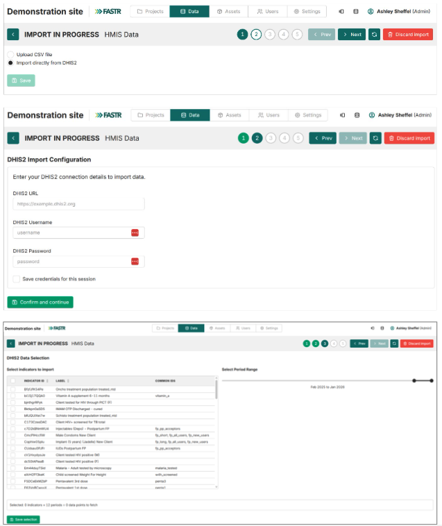
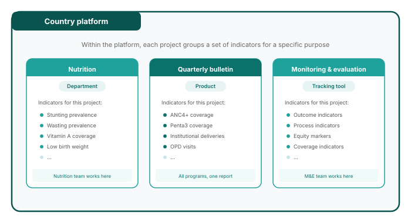

<!-- _class: title-cover -->

# {{TITLE}}

**{{SUBTITLE}}**

Lusaka, Zambia

January 27-30, 2026

---

<!-- _class: centered -->

# Welcome and Opening Remarks

---

<!-- _class: centered -->

# Introductions

---

# Workshop Objectives

The objectives of the workshop are to:

- **Introduce the FASTR HMIS analysis platform** - Familiarize participants with the platform's purpose, core features, and functionalities, including workflows, reporting options, and outputs
- **Strengthen analytical and reporting skills** - Enhance participants' capacity to manage data structures, customize visualizations, and produce tailored reports for diverse audiences
- **Prepare MoH for participation in the multi-country workshop** - Configure the FASTR analytics platform for Zambia; Produce the first quarterly report
- **Adapt the FASTR phone survey questionnaire to the Zambian context**

---

# Expectations for the Workshop

Write on a sticky note and stick it on the flip chart:

What do you want to learn?

What questions about FASTR do you want answered?

*We will review these on day 4 to see if we met our expectations.*

---

# Expected Outputs

**Disruption Analysis Activities**

- Data extraction and configuration of analytics platform
- Produce first quarterly report
- Review results and contextualize findings (with relevant program teams)
- Roadmap for participation in Abuja workshop

**Phone Survey Activities**

- Adaptation of questionnaire (with program input)

---

<!-- _class: agenda -->
# Agenda

**Day 1 -- Laying the Foundation: Introducing FASTR and Configuring the Analytics Platform**

<table>
<tr style="background: #CAE6E9;"><th>Time</th><th>Agenda</th><th>Facilitator/Presenter</th></tr>
<tr style="background: #E8F4F3;"><td colspan="3"><strong>Opening Session</strong></td></tr>
<tr><td>08:30-09:00</td><td>Participant registration</td><td>MoH team</td></tr>
<tr><td>09:00-09:10</td><td>Welcome and opening remarks</td><td>MoH team</td></tr>
<tr><td>09:10-09:20</td><td>Icebreakers/Introductions</td><td>MoH team</td></tr>
<tr><td>09:20-09:35</td><td>Workshop objectives and agenda</td><td>GFF FASTR team</td></tr>
<tr style="background: #E8F4F3;"><td colspan="3"><strong>Session 1: Overview of the FASTR approach</strong></td></tr>
<tr><td>09:35-10:15</td><td>Overview: FASTR Approaches</td><td>GFF FASTR team</td></tr>
<tr style="background: #E8F4F3;"><td colspan="3"><strong>Session 2: Identifying priority questions and indicators</strong></td></tr>
<tr><td>10:15-11:00</td><td>Identifying priority questions and indicators</td><td>GFF FASTR team</td></tr>
<tr style="background: #E8F4F3;"><td colspan="3"><strong>Session 3: HMIS data extraction</strong></td></tr>
<tr><td>11:00-12:00</td><td>Data extraction: Rationale and methods</td><td>GFF FASTR team</td></tr>
<tr style="background: #E8F4F3;"><td colspan="3"><strong>Session 4: Getting into the platform</strong></td></tr>
<tr><td>12:00-12:30</td><td>Getting participants into the platform</td><td>GFF FASTR team</td></tr>
<tr><td>12:30-14:00</td><td><em>Lunch Break</em></td><td></td></tr>
<tr style="background: #E8F4F3;"><td colspan="3"><strong>Session 5: Configuring the FASTR analytics platform</strong></td></tr>
<tr><td>14:00-15:30</td><td>Configuring the analysis platform</td><td>GFF FASTR team</td></tr>
<tr style="background: #E8F4F3;"><td colspan="3"><strong>Closing</strong></td></tr>
<tr><td>15:30-16:00</td><td>Key messages and wrap-up</td><td>GFF FASTR team</td></tr>
<tr><td>16:00-16:30</td><td>Reflections from participants</td><td>Participants</td></tr>
</table>

---

<!-- _class: section-cover -->

# Session 1: Overview of the FASTR approach

---

## What are we trying to achieve?

Rapid cycle analytics accelerates improvements in RMNCAH-N outcomes by increasing the systematic use of data for decision making

---

## How can this be achieved?

Timely, rigorous, and low-cost approaches to monitoring PHC systems, underpinned by capacity building and data use support aligned with country demand and needs

---

## What is FASTR?

An approach to catalyzing continuous 'analyze, learn, strengthen, act' cycles to drive the systematic use of timely data for decision making.

---

## What is the FASTR approach to RMNCAH-N service use monitoring?

Quarterly analyses of DHIS2 data, focusing on prioritized national indicators

Building sustainable tools to ensure that stakeholders who need to use data can generate the right analysis and visualizations, at the right time, on their indicators of interest

Combining analysis and visualization with capacity strengthening and data use support for sustainability and institutionalization

---

# Demo – FASTR analysis platform

---

<!-- _class: section-cover -->

# Session 2: Identifying priority questions and indicators

---

## What is a data use case?

A data use case is a specific scenario where data is utilized to achieve a particular goal or solve a problem.

**Why is defining a data use case important?**

- Guides decision making by providing a clear framework for analysis
- Enhances efficiency by focusing analyses on a set of relevant key indicators to solve a specific data need
- Leads to better results by aligning data efforts with organizational goals

---

## Data use case: Application 1

*Placeholder - content to be added*

---

## Data use case: Application 2

*Placeholder - content to be added*

---

## Data use case: Application 3

*Placeholder - content to be added*

---

## What is our common data use case that will be the focus of this workshop?

Following large shifts in resource availability from external sources, many countries are experiencing abrupt and dramatic reductions in financing

- Resulting in critical gaps in programs and systems
- Leading to potentially severe effects on service delivery and health outcomes for women, children and adolescents

**Key questions arising:**

- What is the magnitude of the cuts, and what effect are they having on service delivery?
- What is the optimal way to prioritize remaining resources?
- What other adaptations can safeguard and strengthen essential service delivery for women, children and adolescents?

---

## How do we select indicators? What makes a good indicator for the FASTR analysis?

Indicator selection is critical to the quality and usefulness of FASTR analysis. Indicators should be chosen based on the following criteria:

- **Relevance** - Does this indicator provide data that aligns with our priority questions and objectives?
- **Volume** - Is this indicator collected at a high volume, which improves the robustness of analysis?
- **Completeness** - Does the indicator have a high completeness rate across reporting facilities?
- **Frequency** - Is the indicator reported frequently enough (e.g., monthly) to support rapid-cycle analysis?
- **Type** - Is this indicator a count of services delivered?

---

## FASTR core indicators

The FASTR approach focuses on a core set of RMNCAH-N indicators that represent key points along the reproductive, maternal, newborn, child, and adolescent health and nutrition continuum in low- and middle-income countries.

These indicators typically have higher reporting volumes and completeness and serve as proxies for broader service delivery patterns.

- Antenatal client 1st visit
- Antenatal client 4th visit
- Institutional delivery
- Postnatal care 1
- BCG doses
- Pentavalent 1st dose
- Pentavalent 3rd dose
- Outpatient visits

---

## Why focus on high-volume indicators?

One of the core strengths of the FASTR approach is its ability to adjust for data quality issues. High-volume indicators are better suited to this process because:

**Reduced sensitivity to outliers**
In low-volume indicators, individual data points can disproportionately affect trends.

**More stable estimates**
High-volume data reduce random variability and improve the reliability of trend detection.

**Clearer identification of true anomalies**
Larger counts make it easier to distinguish genuine outliers from natural variation.

---

## Why focus on high-completeness indicators?

Indicators with high reporting completeness are preferred because they:

**Improve data reliability**
More complete data reduces bias and provide a more representative picture of service delivery.

**Support consistent analysis**
High completeness enables meaningful comparisons across time and geographic areas.

**Reduce misinterpretation**
Incomplete data can falsely suggest changes in service utilization when changes are driven by reporting gaps rather than real trends.

While statistical methods such as imputation can be used to address incomplete data, these methods require assumptions about missing values.

---

## Why focus on count indicators?

**Limitations of proportion indicators**

- Proportions limit the ability to adjust numerators and denominators separately for data quality issues
- Numerators and denominators may each be affected by different sources of error
- Separating counts from denominator estimation allows for more transparent and flexible adjustment

**Mortality as a rare event**

- Mortality indicators are typically low-frequency and not well suited to adjustment
- These indicators are generally better analyzed using annual rather than monthly or quarterly data

---

<!-- _class: columns-image-right -->

## Countries have selected indicators to align with the disruptions context and country priorities

- The FASTR Data Prep Checklist has been shared with countries
- The checklist includes the FASTR core RMNCAH-N indicators
- Countries have added additional indicators relevant to their context (e.g., services impacted by funding shifts, government priorities)
- These are the indicators included in the current analysis
- Countries can continue to add indicators over time as needed

---

## Activity

We are going to review the Zambia data prep checklist together and discuss for each indicator:

**Relevance**
Does this indicator provide data that aligns with our priority questions and objectives?

**Volume**
Is this indicator collected at a high volume, which improves the robustness of analysis?

**Completeness**
Does the indicator have a high completeness rate across reporting facilities?

**Frequency**
Is the indicator reported frequently enough (e.g., monthly) to support rapid-cycle analysis?

**Type**
Is this indicator a count of services delivered?

Based on the discussion we can refine the selection of indicators.

---

<!-- _class: section-cover -->

# Session 3: HMIS data extraction

---

## Show of hands...

Do you regularly extract data from DHIS2?

If so, what are the primary reasons?

---

## Why would you extract data from DHIS2? Why not just do analysis in DHIS2 itself?

**Data quality adjustment**

The FASTR approach focuses on data quality adjustments to expand the analyses countries can do with DHIS2 data and to generate more robust estimates.

**Analysis complexity**

The FASTR approach uses more advanced statistical methods, such as regression analysis, which are not available in DHIS2. While DHIS2 can plot trends over time using raw data, FASTR can go further by identifying significant increases or decreases in service volume, adjusting for data quality issues, accounting for expected seasonal variations, and comparing key periods, such as before and after a reform.

The choice between DHIS2 and the FASTR approach should be guided by the specific purpose of your analysis. Select the tool that best aligns with your analytical needs!

---

<!-- _class: columns-image-right -->

## Data format and granularity

Data should be downloaded for each indicator of interest, at facility level, and monthly for the period of interest.

Data should be saved in long format meaning each row represents a single observation or measurement (see example).

Data should be saved in .csv format and can be saved in either a single .csv file or multiple .csv files which will be combined when uploading to the analysis platform.

---

## How much data?

**Initial FASTR analysis**

- Generally recommended to download approximately five years of historical data
- However, the exact period should be determined based on data availability, consistency in indicator definitions over time, and the specifics of a country's routine data system
- Ideally, using at least five years of historical data allows for a thorough assessment of trends over time

**Routine update to FASTR analysis**

- Start with the existing database and download new data covering the most recent months not previously included – this is usually a three-month period when the FASTR analysis is being implemented on a quarterly basis
- Additionally, include the three proceeding months to the new data time period, as this relatively recent data is often subject to changes due to late reporting or data quality adjustments
- If you have reason to believe there have been substantial changes to the historical data, you can always choose to redownload a longer time period

---

## Data extraction

We offer two tools for bulk DHIS2 data extraction: a user-friendly Data Downloader and a direct import feature within the FASTR analytics platform.

The Data Downloader provides a streamlined interface to download DHIS2 data. This tool is particularly useful to explore DHIS2 metadata and download indicators requiring disaggregated dimensions.

The Data Downloader is available at: https://github.com/worldbank/DHIS2-Downloader/releases/

---

## Data extraction

The FASTR analytics platform contains a direct import feature to automatically import data from DHIS2. This is often the easiest approach once indicators have been identified for inclusion in the platform.

---

## Activity: Data downloader – LIVE Demo and practice

---

<!-- _class: section-cover -->

# Session 4: Getting into the platform

---

## FASTR analytics platform

The FASTR analytics platform is a web-based tool designed to support data quality assessment, adjustment, and analysis for routine health data.

It allows users to upload and analyze data from various sources, including DHIS2, with built-in statistical methods to generate an adjusted dataset and run priority analyses on selected indicators.

The platform provides a user-friendly interface for running analyses and offers flexible options for visualizing and exporting results.

---

## Platform Capabilities

Data flows from import through analysis to shareable outputs.

---

## Country Instance

Each country has its own **instance** of the FASTR analytics platform.

An instance contains:

- All registered users and their accounts
- The shared administrative structure (regions, districts, facilities)
- Indicator definitions and data sources
- All projects created for that country

**Think of an instance as your country's dedicated workspace.**

---

## User Roles and Permissions

There are two levels of permissions in the platform:

&nbsp;

**Instance-level roles:**

- **Instance Administrators** can add users, create projects, assign roles, upload data, import and configure modules, and run analyses

&nbsp;

**Project-level roles:**

- **Project Editors** can create visualizations, create reports, and download/export results
- **Project Viewers** can view visualizations, view reports, and download/export results

&nbsp;

*Administrators are assigned per instance; Editors and Viewers are assigned per project.*

---

## Projects Within an Instance

Each country instance can contain **multiple projects**.

A country may only need one project, or multiple projects can be used for:

- Different versions of analyses
- A demo or playground project
- Separate projects for different teams or programs

**Key questions when setting up:**

- Who is the admin?
- Who can edit?
- Who can view?

---

## Practice: Logging Into the Platform

| | |
|:---|:---|
|  |  |
| **1.** Go to https://zambia.fastr-analytics.org | **2.** Click Sign up and enter your details |
| **3.** Enter your information (verify email) | **4.** After login, you'll be added to a project |

---

#  Lunch Break

**90 minutes**

Back at 14:00

---

<!-- _class: section-cover -->

# Session 5: Configuring the FASTR analytics platform

---

## Configuring the analysis platform

- Configuration of the analysis platform is an admin feature

- We will work together to configure the following items:
  - Admin areas (regions, districts)
  - Facility structure
  - Indicator definitions

- Note since this is an admin feature all participants will NOT be doing this step. Instead, you will select one person to have admin rights, and they will help us walk through these steps.

---

## Activity: Setting Up Admin Areas

 **In this hands-on session, we will configure:**

- Admin areas (regions, districts)
- Facility structure
- Indicator definitions

*Participants will work directly in the platform*

---

## Activity: Importing Data

 **In this hands-on session, we will:**

- Review data format requirements
- Walk through the import process
- Handle validation and error checking

*Participants will import their country's data*

---

## Activity: Installing and Running Modules

 **In this hands-on session, we will:**

- Review available analysis modules
- Install required modules
- Run initial analyses

*Participants will configure and run modules on their data*

---

## Key messages and wrap-up

---

## Reflections from participants

---

# Day 2

---

# Recap of day 1

---

<!-- _class: agenda -->
# Agenda

**Day 2 -- Building the Analysis: Applying FASTR Methods and Generating Outputs**

<table>
<tr style="background: #CAE6E9;"><th>Time</th><th>Agenda</th><th>Facilitator/Presenter</th></tr>
<tr><td>09:00-09:15</td><td>Recap and Day 2 agenda</td><td>GFF FASTR team</td></tr>
<tr style="background: #E8F4F3;"><td colspan="3"><strong>Session 6: Overview of FASTR methods and interpretation</strong></td></tr>
<tr><td>09:15-10:15</td><td>Data quality, service utilization, coverage: Methods and interpretation</td><td>GFF FASTR team</td></tr>
<tr style="background: #E8F4F3;"><td colspan="3"><strong>Session 7: Creating a project</strong></td></tr>
<tr><td>10:15-11:15</td><td>Project creation and settings</td><td>GFF FASTR team</td></tr>
<tr style="background: #E8F4F3;"><td colspan="3"><strong>Session 8: Creating visualizations</strong></td></tr>
<tr><td>11:15-12:30</td><td>Creating and editing visualizations</td><td>GFF FASTR team</td></tr>
<tr><td>12:30-14:00</td><td><em>Lunch Break</em></td><td></td></tr>
<tr style="background: #E8F4F3;"><td colspan="3"><strong>Session 9: Creating reports</strong></td></tr>
<tr><td>14:30-16:30</td><td>Practice creating and editing reports</td><td>GFF FASTR team</td></tr>
</table>

---

<!-- _class: section-cover -->

# Session 6: Overview of FASTR methods and interpretation

---

## FASTR analytical pipeline

The FASTR analysis follows a sequential workflow:

1. **Assess data quality** - Identify issues with completeness, outliers, and consistency
2. **Adjust for quality issues** - Apply corrections to improve data reliability
3. **Analyze adjusted data** - Generate service utilization and coverage estimates

---

## FASTR approach to data quality

FASTR takes a multi-pronged approach, based on the belief that **data quality should not be a barrier to data use**.

- Conduct granular, facility-level data quality assessments
- Focus on high-volume indicators that produce more stable estimates
- Emphasize variation over time and space rather than point estimates
- Interpret results collaboratively with in-country decision-makers

**Using data and providing feedback is viewed as the first step toward improving data quality.**

---

## Rationale for data quality assessment

**Challenge:** Routine health facility data may contain quality limitations:
- Reported values outside plausible ranges
- Reporting gaps affecting completeness
- Inconsistencies between related indicators

**Implications:** These limitations can distort decision-making:
- Inaccurate assessment of service delivery trends
- Misidentification of areas needing intervention
- Suboptimal resource allocation

---

## Objectives of data quality assessment

**Objective 1: Enable analytical adjustment**
Systematic assessment supports targeted adjustments, enhancing the utility of HMIS data for evidence-based decision-making.

**Objective 2: Monitor data quality trends**
- Inform indicator selection based on quality profiles
- Guide targeted interventions and supportive supervision
- Evaluate effectiveness of improvement initiatives over time

---

## Indicator completeness

Indicator completeness measures whether facilities that should be reporting data on specific indicators are actually doing so. This is different from overall reporting completeness - we're looking at specific data elements, not just whether the monthly form was submitted.

**Definition:** Percentage of facilities reporting each month out of facilities expected to report.
- A facility is "reporting" if there is a non-missing, non-zero value for the indicator that month
- A facility is "expected to report" if it has reported any volume for that indicator within the past year

Higher and stable completeness improves data reliability.

---

## Indicator completeness output

**What you see:** Heatmap showing completeness by indicator and region over time.

**Formula:** Completeness % = (facilities reporting / facilities expected) × 100

**Interpretation:** Look for systematic gaps by region or indicator, declining trends, or seasonal patterns. Low completeness suggests reporting barriers needing attention.

---

## Outlier detection

Outliers are values that are suspiciously **high** compared to a facility's usual reporting volume. They may result from data entry errors or genuine programmatic changes (e.g., campaigns).

**Note:** FASTR only flags high values as outliers - unusually low values are not flagged, as these more likely reflect service disruptions than data errors.

**How outliers are identified:** For each facility and indicator, we assess within-facility variation in monthly reporting. A value is flagged if it deviates significantly from the facility's typical pattern (using statistical thresholds based on median absolute deviation).

---

## Outlier detection output

**What you see:** Heatmap showing proportion of values flagged as outliers by indicator and region.

**Formula:** Outlier % = (values flagged / total values) × 100

**Interpretation:** High rates may indicate data entry errors or legitimate events like campaigns. Review facility registers to distinguish between the two.

---

## Internal consistency

Internal consistency checks whether related indicators maintain expected logical relationships. For example, ANC1 should always be ≥ ANC4 (you can't have a 4th visit without a 1st). Similarly, Penta1 ≥ Penta3. When these relationships are violated, it signals data quality issues like double-counting, under-reporting, or data flow errors.

FASTR assesses consistency at the **district level** rather than facility level. This is because patients frequently seek care from different facilities within the same district - a woman may have her ANC1 visit at a health post but travel to the district hospital for ANC4. Assessing at district level accounts for this patient movement.

---

## Internal consistency output

**What you see:** Heatmap showing the % of districts where indicator pairs meet expected relationships (e.g., ANC1 ≥ ANC4).

**Formula:** Consistency % = (districts meeting criteria / total districts) × 100

**Interpretation:** Low consistency may indicate data flow problems, double-counting, or systematic under-reporting at the district level.

---

## DQA mean: combining all quality dimensions

The mean DQA score shows how close a facility's data is to meeting all quality criteria. A score of 100% means the data passes all DQA checks - no missing values, no outliers, and consistent reporting.

**Average DQA score across facilities** = (number of monthly values that are complete, not outliers, and consistent) ÷ (total number of monthly values)

---

## DQA mean output

**What you see:** Heatmap showing DQA mean by indicator and region, color-coded from red (poor) to green (good).

**Formula:** (values that are complete, not outliers, and consistent) ÷ (total values)

**Interpretation:** 100% = passes all checks. Use this to prioritize data quality improvement efforts.

---

## Data quality adjustment

**Why adjust?** Outliers and reporting gaps identified in the DQA will distort service utilization and coverage estimates if left uncorrected. The goal is to replace problematic values with reasonable estimates based on each facility's own historical patterns.

**How?** Outliers and missing values are replaced using 6-month rolling averages from the facility's historical data.

**Four parallel datasets:** FASTR produces unadjusted, outliers-only adjusted, completeness-only adjusted, and both-adjusted versions. This enables sensitivity analysis - comparing results across scenarios to assess how much conclusions depend on adjustment choices.

**Excluded from adjustment:** Mortality indicators (discrete events that shouldn't be smoothed) and low-volume indicators (<100 events/month, where adjustment adds noise).

---

## Outlier adjustment output

**What you see:** Heatmap showing how much service volume changed after replacing outliers with rolling averages.

**Formula:** % change = (adjusted - original) / original × 100

**Interpretation:** Values are typically negative (outliers removed reduce volume). Large adjustments warrant investigation into their source.

---

## Completeness adjustment output

**What you see:** Heatmap showing how much service volume changed after imputing missing data with rolling averages.

**Formula:** % change = (adjusted - original) / original × 100

**Interpretation:** Values are typically positive (imputation adds volume). Large adjustments indicate areas needing completeness improvement.

---

## Service utilization analysis

Service utilization analysis tracks how many health services are being delivered over time, identifying trends, anomalies, and comparisons across areas.

**What you see:** Line chart showing absolute service volumes over time by indicator.

**What it shows:** Count of services delivered each month/quarter.

**Interpretation:** Look for overall trends (increasing/decreasing) and sudden drops or spikes that may need investigation.

---

## Year-over-year change output

**What you see:** Heatmap comparing current period to same period last year, with changes >±10% flagged.

**Formula:** YoY change % = (this year - last year) / last year × 100

**Interpretation:** Flagged changes require follow-up - is this a real program change, data issue, or expected event?

---

## Detecting service disruptions

Beyond year-over-year comparisons, we want to know: **Is service delivery on track, or has something disrupted it?**

**The challenge:** Raw service counts are hard to interpret. A drop in services could be a real disruption, or just normal seasonal variation. Different areas have different baseline volumes, making direct comparison difficult.

**FASTR's solution:** Use statistical modeling to estimate what service volume we would *expect* based on historical trends and seasonality, then compare actual volume to this expectation.

- **Disruption:** Observed volume significantly below expected
- **Surplus:** Observed volume significantly above expected

---

## Service disruption output

**What you see:** Chart comparing actual service volume to model-predicted expected volume, accounting for seasonality.

**What it shows:** Deviations from expected - disruptions (below) or surpluses (above).

**Interpretation:** Consider external factors: COVID, strikes, stockouts, campaigns. Persistent deviations warrant program investigation.

---

## Service coverage estimation

**Coverage** = services delivered ÷ target population

HMIS tells us how many services were delivered (numerator), but not the target population size (denominator). Standard HMIS coverage uses catchment populations, which are often inaccurate. Surveys (DHS/MICS) provide reliable coverage but only every 3-5 years.

---

## How FASTR estimates coverage

**Calculate denominators multiple ways:** From HMIS data, use service volumes combined with survey coverage to back-calculate target populations. For example, if 10,000 ANC1 visits and survey says 80% coverage, this implies ~12,500 pregnancies. Also calculate denominators from UN population projections using birth rates and demographic adjustments.

**Validate against surveys:** Calculate coverage using each denominator option, compare to survey benchmarks, and select the denominator with lowest error.

**Project coverage forward:** Anchor to the last survey value and apply year-over-year HMIS trends to extend estimates into post-survey years.

---

## Coverage output: National trends

**What you see:** Line chart showing coverage over time. Black = survey, Grey = HMIS-derived, Red = projected.

**Formula:** Coverage % = (services / target population) × 100

**Interpretation:** Compare HMIS and survey values - large gaps suggest denominator issues. Projected values extend surveys using HMIS trends.

---

## Coverage output: Subnational comparison

**What you see:** Coverage estimates by subnational area, enabling geographic comparison.

**Formula:** Coverage % = (services / target population) × 100

**Interpretation:** Identify low-coverage areas for prioritization. Coverage >100% suggests denominator underestimate or double-counting.

---

<!-- _class: section-cover -->

# Session 7: Creating a project

---

## Activity: Creating a Project

 **In this hands-on session, we will:**

- Set up a new project
- Configure project settings
- Select indicators and time periods
- Apply best practices for project organization

*Participants will create their first project*

---

<!-- _class: section-cover -->

# Session 8: Creating visualizations

---

## Activity: Creating visualizations

 **I do, we do, you do**

**I do:** Facilitator demonstrates creating a time series chart for ANC1

**We do:** Together, we create a second visualization (bar chart comparing regions)

**You do:** Create one visualization of your choice and export it for your report

---

#  Lunch Break

**90 minutes**

Back at 14:00

---

<!-- _class: section-cover -->

# Session 9: Creating reports

---

## Activity: Creating reports

 **I do, we do, you do**

**I do:** Facilitator demonstrates creating a report using the template

**We do:** Together, we use the AI assistant to generate report text from our visualizations

**You do:** Complete your draft report with your own content and export it

---

## Using the AI assistant

**To interpret a visualization:**
> *"Describe what this chart shows and write 2-3 sentences summarizing the main findings for a Ministry of Health quarterly report."*

**To analyze subnational variation:**
> *"Compare the regions shown in this chart. Which provinces are performing well and which need attention? Suggest possible reasons for the differences."*

The AI will analyze your chart and generate text you can edit for your report.

---

# Day 3

---

# Recap of day 2

---

<!-- _class: agenda -->
# Agenda

**Day 3 -- From Analysis to Action: Interpreting Results and Using FASTR for Decision-Making**

<table>
<tr style="background: #CAE6E9;"><th>Time</th><th>Agenda</th><th>Facilitator/Presenter</th></tr>
<tr><td>09:00-09:15</td><td>Recap and Day 3 agenda</td><td>GFF FASTR team</td></tr>
<tr style="background: #E8F4F3;"><td colspan="3"><strong>Session 10: Creating a Q4 2025 report</strong></td></tr>
<tr><td>09:15-12:30</td><td>Creating short and long reports with country context</td><td>GFF FASTR team</td></tr>
<tr><td>12:30-14:00</td><td><em>Lunch Break</em></td><td></td></tr>
<tr style="background: #E8F4F3;"><td colspan="3"><strong>Session 10 (cont'd): Creating a Q4 2025 report</strong></td></tr>
<tr><td>14:00-15:30</td><td>Continue report creation with country context</td><td>GFF FASTR team</td></tr>
<tr style="background: #E8F4F3;"><td colspan="3"><strong>Session 11: Presenting reports</strong></td></tr>
<tr><td>15:30-16:30</td><td>Present reports, group feedback</td><td>GFF FASTR team</td></tr>
</table>

---

<!-- _class: section-cover -->

# Session 10: Creating a Q4 2025 report

---

## Generating quarterly reporting products

*Content to be developed*

This section will cover:
- Quarterly reporting workflow
- Using the FASTR platform for automated reports
- Quality assurance for reports
- Distribution and feedback mechanisms

---

#  Lunch Break

**90 minutes**

Back at 14:00

---

<!-- _class: section-cover -->

# Session 11: Presenting reports

---

## Presenting reports and group feedback

*Content to be developed*

---

# Day 4

---

# Recap of day 3

---

<!-- _class: agenda -->
# Agenda

**Day 4 -- Designing the Health Facility Assessment**

<table>
<tr style="background: #CAE6E9;"><th>Time</th><th>Agenda</th><th>Facilitator/Presenter</th></tr>
<tr><td>09:00-09:15</td><td>Recap and Day 4 agenda</td><td>GFF FASTR team</td></tr>
<tr style="background: #E8F4F3;"><td colspan="3"><strong>Session 12: Overview of FASTR HFA phone survey</strong></td></tr>
<tr><td>09:15-10:15</td><td>HFA overview and questionnaire adaptation guidelines</td><td>GFF FASTR team</td></tr>
<tr style="background: #E8F4F3;"><td colspan="3"><strong>Session 13: Questionnaire adaptation to the Zambian context</strong></td></tr>
<tr><td>10:15-12:30</td><td>Review questionnaire + hands-on adaptation</td><td>GFF FASTR team</td></tr>
<tr><td>12:30-14:00</td><td><em>Lunch Break</em></td><td></td></tr>
<tr style="background: #E8F4F3;"><td colspan="3"><strong>Session 13 (cont'd): Questionnaire adaptation</strong></td></tr>
<tr><td>14:00-15:00</td><td>Continue questionnaire adaptation (in groups)</td><td>GFF FASTR team</td></tr>
<tr style="background: #E8F4F3;"><td colspan="3"><strong>Session 14: Discussion: HFA adapted questionnaire</strong></td></tr>
<tr><td>14:30-15:30</td><td>Discuss adapted questionnaire in plenary</td><td>GFF FASTR team</td></tr>
<tr style="background: #E8F4F3;"><td colspan="3"><strong>Session 15: Discussion: HFA priorities and data use</strong></td></tr>
<tr><td>15:30-16:30</td><td>HFA priorities and data use case in Zambia</td><td>GFF FASTR team</td></tr>
<tr style="background: #E8F4F3;"><td colspan="3"><strong>Session 16: Action planning and wrap-up</strong></td></tr>
<tr><td>16:30-17:00</td><td>Key messages and wrap-up</td><td>GFF FASTR team</td></tr>
</table>

---

<!-- _class: section-cover -->

# Session 12: Overview of FASTR HFA phone survey

---

## Health Facility Assessment Phone Survey

*Placeholder: Content to be developed*

---

#  Lunch Break

**90 minutes**

Back at 14:00

---

# Next Steps & Action Planning

Key actions to take after this working session:

- Finalize adapted phone survey questionnaire
- Complete first quarterly report draft
- Train remaining MoH team on data downloader tools
- Prepare roadmap for participation in Abuja workshop

---

# Quarterly Reporting Cycle

Establish a sustainable reporting rhythm:

- Define quarterly report timeline and responsibilities
- Set up data extraction schedule
- Establish review and approval process
- Plan dissemination to stakeholders

---

# Continued Platform Usage

Maintain momentum with the FASTR platform:

- Regular data updates and quality checks
- Expanding analysis to additional indicators
- Building capacity across MoH teams
- Documentation of lessons learned

---

# Workshop Closing

Thank you for your participation!

Over the past four days, we have:

- Configured the FASTR platform for Zambia
- Created the first quarterly RMNCAH-N report
- Adapted the HFA questionnaire for local context
- Built capacity for ongoing analysis and reporting

---

# Stay Connected

Continue the journey:

- Platform access and support
- Quarterly report submissions
- Multi-country workshop in Abuja
- Ongoing technical assistance from GFF team

---

# Thank You

FASTR Working Session - Zambia
January 27-30, 2026
Lusaka

---

# Contact Information

**FASTR Team**

**Email:** 

**Website:** https://www.globalfinancingfacility.org/

---

