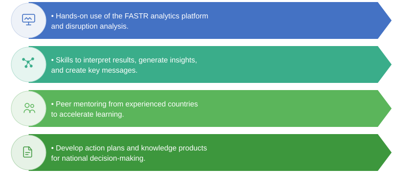

## The multi-country learning exchange

This exchange brings together country teams to strengthen their capacity for data-driven health system monitoring using FASTR.

**Who is participating?**
- Country teams from across the region
- GFF and World Bank technical teams
- R4D FASTR team

**What does it include?**
- **Introductory webinar** — FASTR concepts, platform, and objectives
- **In-person workshop** — Hands-on training with country data
- **Follow-up webinars** — Continued learning and cross-country exchange

---

## What you will learn

<!--
By the end of this exchange, participants will be able to:
- Understand the FASTR approach to RMNCAH-N service monitoring
- Navigate the analytics platform and its key features
- Interpret data quality assessments and service trends
- Use the AI assistant to explore data
- Apply FASTR methods to your country's priority questions
- Connect with peers for cross-country learning
-->

---

## The learning journey

<!-- _class: compact -->

**Webinar 1: Introduction** *(today)*
- What is FASTR and why it matters now
- Overview of the analytics platform
- What to expect from the in-person workshop

**In-person workshop**
- Hands-on work with your country's data on the platform
- Data quality assessment and service utilization analysis
- Working with the AI assistant
- Cross-country sharing and discussion

**Follow-up webinars**
- Deepen skills on specific topics
- Share progress and lessons learned
- Support institutionalization of FASTR in your country

---
