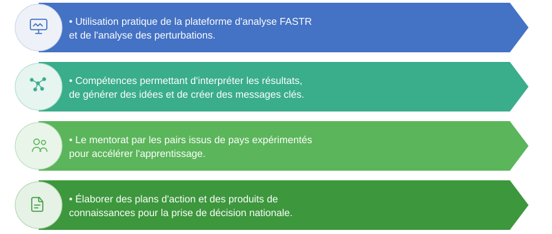

## L'échange d'apprentissage multi-pays

Cet échange rassemble des équipes pays pour renforcer leurs capacités de suivi des systèmes de santé avec FASTR.

**Qui participe ?**
- Équipes pays de toute la région
- Équipes techniques du GFF et de la Banque mondiale
- Équipe FASTR de R4D

**Que comprend-il ?**
- **Webinaire introductif** — Concepts FASTR, plateforme et objectifs
- **Atelier en présentiel** — Formation pratique avec les données pays
- **Webinaires de suivi** — Apprentissage continu et échange entre pays

---

## Ce que vous allez apprendre

<!--
À l'issue de cet échange, les participants seront capables de :
- Comprendre l'approche FASTR pour le suivi des services SRMNIA-N
- Naviguer dans la plateforme analytique et ses fonctionnalités
- Interpréter les évaluations de qualité et les tendances de services
- Utiliser l'assistant IA pour explorer les données
- Appliquer les méthodes FASTR aux questions de votre pays
- Échanger avec des pairs d'autres pays
-->

---

## Le parcours d'apprentissage

<!-- _class: compact -->

**Webinaire 1 : Introduction** *(aujourd'hui)*
- Qu'est-ce que FASTR et pourquoi maintenant
- Aperçu de la plateforme analytique
- Préparation de l'atelier en présentiel

**Atelier en présentiel**
- Travail pratique avec vos données sur la plateforme
- Qualité des données et analyse de l'utilisation des services
- Travail avec l'assistant IA
- Partage entre pays

**Webinaires de suivi**
- Approfondir les compétences sur des sujets spécifiques
- Partager les progrès et leçons apprises
- Institutionnalisation de FASTR dans votre pays

---
